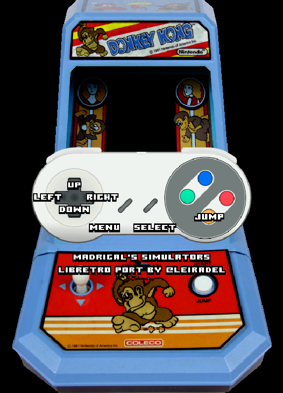

# Handheld Electronic (GW)

<iframe width="560" height="315" src="https://www.youtube-nocookie.com/embed/eBp1ntWZ07Q" frameborder="0" allow="accelerometer; autoplay; clipboard-write; encrypted-media; gyroscope; picture-in-picture" allowfullscreen></iframe>

## Background

A libretro core for Game & Watch simulators.

It runs simulators converted from source code for the games available at [MADrigal](http://www.madrigaldesign.it/sim/).

The converted games are available at [buildbot](https://buildbot.libretro.com/assets/cores/Handheld%20Electronic%20Game/). 

The GW core has been authored by

- Andre Leiradella

The GW core is licensed under

- [zlib](https://github.com/libretro/gw-libretro/blob/master/LICENSE)

A summary of the licenses behind RetroArch and its cores can be found [here](../development/licenses.md).

## Extensions

Content that can be loaded by the GW core have the following file extensions:

- .mgw

## Databases

RetroArch database(s) that are associated with the GW core:

- [Handheld Electronic Game](https://github.com/libretro/libretro-database/blob/master/rdb/Handheld%20Electronic%20Game.rdb)

## Features

Frontend-level settings or features that the GW core respects.

| Feature           | Supported |
|-------------------|:---------:|
| Restart           | ✕         |
| Screenshots       | ✔         |
| Saves             | ✕         |
| States            | ✕         |
| Rewind            | ✕         |
| Netplay           | ✕         |
| Core Options      | ✕         |
| RetroAchievements | ✕         |
| RetroArch Cheats  | ✕         |
| Native Cheats     | ✕         |
| Controls          | ✔         |
| Remapping         | ✔         |
| Multi-Mouse       | ✕         |
| Rumble            | ✕         |
| Sensors           | ✕         |
| Camera            | ✕         |
| Location          | ✕         |
| Subsystem         | ✕         |
| [Softpatching](../guides/softpatching.md) | ✕         |
| Disk Control      | ✕         |
| Username          | ✕         |
| Language          | ✕         |
| Crop Overscan     | ✕         |
| LEDs              | ✕         |

### Directories

The GW core's internal core name is 'Game & Watch'

### Geometry and timing

- The GW core's core provided FPS is 60
- The GW core's core provided sample rate is 44100 Hz
- The GW core's core provided aspect ratio is dependent on the loaded content.

## Controllers

The GW core supports the following device type(s) in the controls menu, bolded device types are the default for the specified user(s):

### User 1 - 2 device types

- None - Doesn't diable input.
- **Controller** - Joypad - Stay on this.

### Controller tables

#### Joypad

!!! attention
	What the inputs do are game specific. Without having anything selected, you can use the Start input to see a Controller overlay to see what the game specific inputs are.

| User 1 Remap descriptors | RetroPad Inputs                             |
|--------------------------|---------------------------------------------|
| B                        |           |
| Y                        |           |
| Select                   |      |
| Start                    |       |
| Up                       |     |
| Down                     |   |
| Left                     |   |
| Right                    |  |
| A                        |           |
| X                        |           |
| L1                       |          |
| R1                       |          |
| L2                       |          |
| R2                       |          |
| L3                       |          |
| R3                       |          |

## External Links

- [MADrigal Website](http://www.madrigaldesign.it/sim/)
- [Libretro GW Core info file](https://github.com/libretro/libretro-super/blob/master/dist/info/gw_libretro.info)
- [Libretro GW Github Repository](https://github.com/libretro/gw-libretro)
- [Report Libretro GW Core Issues Here](https://github.com/libretro/gw-libretro/issues)
