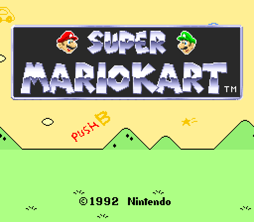
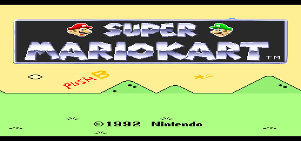
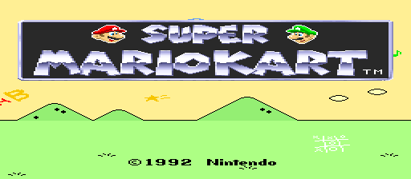
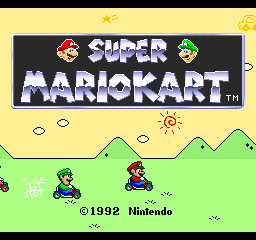
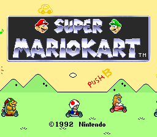
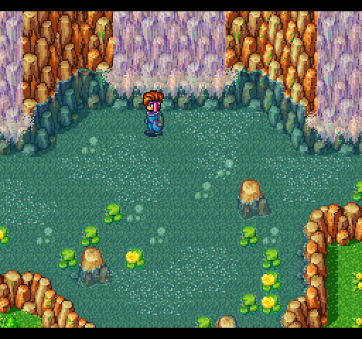
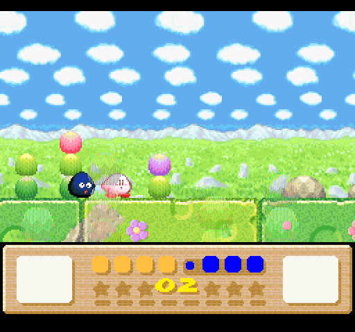

# Nintendo - SNES / Famicom (higan Accuracy)

## Background

A port of higan v106's Super Famicom emulation core to libretro. This core is the most in sync with upstream higan.

- Most accurate SNES emulation available.
- Simplified and easily accessible Super Game Boy functionality compared to the other bsnes cores.

### Author/License

The higan Accuracy core has been authored by

- byuu

The higan Accuracy core is licensed under

- [GPLv3](https://gitlab.com/higan/higan/blob/master/LICENSE.txt)

A summary of the licenses behind RetroArch and its cores can be found [here](../development/licenses.md).

## Extensions

Content that can be loaded by the higan Accuracy core have the following file extensions:

- .sfc
- .smc
- .gb
- .gbc
- .bml
- .rom

## Databases

RetroArch database(s) that are associated with the higan Accuracy core:

- [Nintendo - Super Nintendo Entertainment System](https://github.com/libretro/libretro-database/blob/master/rdb/Nintendo%20-%20Super%20Nintendo%20Entertainment%20System%20Hacks.rdb)
- [Nintendo - Super Nintendo Entertainment System Hacks](https://github.com/libretro/libretro-database/blob/master/rdb/Nintendo%20-%20Super%20Nintendo%20Entertainment%20System%20Hacks.rdb)
- [Nintendo - Game Boy](https://github.com/libretro/libretro-database/blob/master/rdb/Nintendo%20-%20Game%20Boy.rdb)
- [Nintendo - Game Boy Color](https://github.com/libretro/libretro-database/blob/master/rdb/Nintendo%20-%20Game%20Boy%20Color.rdb)

## BIOS

Required or optional firmware files go in the frontend's system directory.

!!! attention
	higan Accuracy uses split ROMS for special chip games.

!!! attention
	Firmware files for SGB emulation need to be in directories called SGB1.sfc and SGB2.sfc in RetroArch's system directory. Look at the [Super GameBoy support section](#super-gameboy-support) for more information.

Notable DSP1.mdDSP1B Games:

- Super Mario Kart
- Pilotwings

Notable DSP2 Games:

- Dungeon Master

Notable DSP3 Games:

- SD Gundam GX

Notable DSP4 Games:

- Top Gear 3000

Notable Cx4 Games:

- Mega Man X2
- Mega Man X3

|   Filename             |    Description                         |              md5sum              |
|:----------------------:|:--------------------------------------:|:--------------------------------:|
| dsp1.data.rom          | DSP1 co-processor firmware - Optional  | 3d81b45fa0c2aa8b852dfb1ece7c0971 |
| dsp1.program.rom       | DSP1 co-processor firmware - Optional  | ae209fbe789fbf11a48aea5ab1197321 |
| dsp1b.data.rom         | DSP1B co-processor firmware - Optional | 1e3f568634a7d8284020dddc0ae905bc |
| dsp1b.program.rom      | DSP1B co-processor firmware - Optional | d10f446888e097cbf500f3f663cf4f6d |
| dsp2.data.rom          | DSP2 co-processor firmware - Optional  | e9417e29223b139c3c4b635a2a3b8744 |
| dsp2.program.rom       | DSP2 co-processor firmware - Optional  | aa6e5922a3ed5ded54f24247c11143c5 |
| dsp3.data.rom          | DSP3 co-processor firmware - Optional  | 0a81210c0a940b997dd9843281008ee6 |
| dsp3.program.rom       | DSP3 co-processor firmware - Optional  | d99ca4562818d49cee1f242705bba6f8 |
| dsp4.data.rom          | DSP4 co-processor firmware - Optional  | ee4990879eb68e3cbca239c5bc20303d |
| dsp4.program.rom       | DSP4 co-processor firmware - Optional  | a151023b948b90ffc23a5b594bb6fef2 |
| cx4.data.rom           | CX4 co-processor firmware - Optional   | 037ac4296b6b6a5c47c440188d3c72e3 |
| st010.data.rom         | ST010 co-processor firmware - Optional | 254d70762b6f59f99c27c395aba7d07d |
| st010.program.rom      | ST010 co-processor firmware - Optional | 1d70019179a59a566a0bb5d3f2845544 |
| st011.data.rom         | ST011 co-processor firmware - Optional | 10bd3f4aa949737ab9836512c35bcc29 |
| st011.program.rom      | ST011 co-processor firmware - Optional | 95222ebf1c0c2990bcf25db43743f032 |
| st018.data.rom         | ST018 co-processor firmware - Optional | 49c898b60d0f15e90d0ba780dd12f366 |
| st018.program.rom      | ST018 co-processor firmware - Optional | dda40ccd57390c96e49d30a041f9a9e7 |
| SGB1.sfc/sgb1.boot.rom | Super Game Boy BIOS - Optional         |                                  |
| SGB1.sfc/program.rom   | Super Game Boy ROM - Optional          |                                  |
| SGB2.sfc/sgb2.boot.rom | Super Game Boy 2 BIOS - Optional       |                                  |
| SGB2.sfc/program.rom   | Super Game Boy 2 ROM - Optional        |                                  |

## Features

Frontend-level settings or features that the higan Accuracy core respects.

| Feature           | Supported |
|-------------------|:---------:|
| Restart           | ✔         |
| Screenshots       | ✔         |
| Saves             | ✔         |
| States            | ✔         |
| Rewind            | ✔         |
| Netplay           | ✔         |
| Core Options      | ✔         |
| RetroAchievements | ✕         |
| RetroArch Cheats  | ✕         |
| Native Cheats     | ✕         |
| Controls          | ✔         |
| Remapping         | ✔         |
| Multi-Mouse       | -         |
| Rumble            | ✕         |
| Sensors           | ✕         |
| Camera            | ✕         |
| Location          | ✕         |
| Subsystem         | ✕         |
| [Softpatching](../guides/softpatching.md) | ✔         |
| Disk Control      | ✕         |
| Username          | ✕         |
| Language          | ✕         |
| Crop Overscan     | -         |
| LEDs              | ✕         |

### Directories

The higan Accuracy core's internal core name is 'higan (Super Famicom Accuracy)'

The higan Accuracy core saves/loads to/from these directories.

**Frontend's Save directory**

- 'content-name'.srm (Cartridge battery save)

**Frontend's State directory**

- 'content-name'.state# (State)

### Geometry and timing

- The higan Accuracy core's core provided FPS is (FPS)
- The higan Accuracy core's core provided sample rate is (Rate)
- The higan Accuracy core's core provided aspect ratio is (Ratio)

## Super Gameboy Support

The higan Accuracy core uses a simplified Super Game Boy routine that makes it much easier to access this feature than with the old v094-based cores.

Instead of using the complex, CLI-based 'subsystem' launch commands, it looks for the necessary files in the system/BIOS directory whenever you feed the core a *.gb/c file.

To get it working, you'll need one or more Super Game Boy ROMs and the sgb.boot.rom BIOS.

**Step 1**

Make 2 subdirectories in RetroArch's system directory, one named SGB1.sfc and the other named SGB2.sfc.

**Step 2**

Copy your original Super Game Boy ROM into the SGB1.sfc directory and then rename it to program.rom. Copy your Super Game Boy 2 ROM into the SGB2.sfc directory and then rename it program.rom, as well.

**Step 3**

Copy your sgb.boot.rom BIOS into each of your SGB1.sfc and SGB2.sfc directories, and rename them to sgb1.boot.rom and sgb2.boot.rom, respectively.

The ['Preferred Super GameBoy BIOS' core option](#core-options) lets you choose which of the two SGB BIOSes to use.

**Step 4**

Load a SGB-supported GB.mdGBC rom.

**Done**

!!! warning
	There may be graphical glitches when Rewind is set to On in RetroArch's settings.

## MSU-1

!!! attention
	MSU-1 support in this core is complex. **Use the [Snes9x core](../library/snes9x#msu-1-support) for simplified and easily accessible MSU-1 support.**

MSU-1 support can be used by loading a correct .bml file.

There's documentation for loading MSU-1 games in standalone higan [here](https://higan.readthedocs.io/en/stable/guides/import/#msu-1-games).

## Core options

The higan Accuracy core has the following option(s) that can be tweaked from the core options menu. The default setting is bolded.

Settings with (Restart) means that core has to be closed for the new setting to be applied on next launch.

- **Internal resolution** [higan_sfc_internal_resolution] (**512x480**|512x448|512x240|512x224|256x240|256x224)

	Self-explanatory.

??? note "512x480"
    

??? note "512x448"
    

??? note "512x240"
    

??? note "512x224"
    

??? note "256x240"
    

??? note "256x224"
    

- **Color emulation** [higan_sfc_color_emulation] (**OFF**|ON)

	Simulates the way a console’s display device differs from modern computer monitor’s colour reproduction. In particular, it simulates the slightly-different gamma correction used by the Super Famicom.

??? note "Color emulation - Disabled"
    

??? note "Color emulation - Enabled"
    

- **Blur emulation** [higan_sfc_blur_emulation] (**OFF**|ON)

	Simulates the limited horizontal resolution of standard-definition TVs by blurring together horizontally-adjacent pixels. Games like Jurassic Park for the Super Famicom depend on this to emulate a transparency effect.

??? note "Blur emulation - Disabled"
    

??? note "Blur emulation - Enabled"
    

- **Scanline emulation** [higan_sfc_scanline_emulation] (**OFF**|ON)

	Currently does not function properly.

- **Preferred Super GameBoy BIOS (restart)** [higan_sfc_sgb_bios] (**SGB1.sfc/**|SGB2.sfc/)

	Choose what Super GameBoy BIOS you want to use. Look at the [Super GameBoy Support section](#super-gameboy-support) for more information.

## Controllers

The higan Accuracy core supports the following device type(s) in the controls menu, bolded device types are the default for the specified user(s):

### User 1 device types

- None - Input disabled.
- [**SNES Joypad**](http://nintendo.wikia.com/wiki/Super_Nintendo_Entertainment_System_controller) - Joypad
- [SNES Mouse](https://en.wikipedia.org/wiki/Super_NES_Mouse) - Mouse

### User 2 device types

- None - Input disabled.
- [**SNES Joypad**](http://nintendo.wikia.com/wiki/Super_Nintendo_Entertainment_System_controller) - Joypad
- [SNES Mouse](https://en.wikipedia.org/wiki/Super_NES_Mouse) - Mouse
- [Multitap](http://nintendo.wikia.com/wiki/Super_Multitap) - Joypad - Allows for up to five players to play together in multitap games.
- [SuperScope](https://en.wikipedia.org/wiki/Super_Scope) - Lightgun - Inputs are not hooked up in this core.
- [Justifier](https://en.wikipedia.org/wiki/Konami_Justifier) - Lightgun - Inputs are not hooked up in this core.
- [Justifiers](https://en.wikipedia.org/wiki/Konami_Justifier) - Lightgun - Two Justifiers are plugged in, for two-player Justifier games. Inputs are not hooked up in this core.

### Multitap support

Activating multitap support in compatible games can be configured by switching to the [Multitap device type](#controllers) for User 2.

### Controller tables

#### Joypad

| User 1 - 5 Remap descriptors | RetroPad Inputs                           |
|------------------------------|-------------------------------------------|
| B                            |     |
| Y                            |     |
| Select                       |      |
| Start                        |       |
| D-Pad Up                     |     |
| D-Pad Down                   |   |
| D-Pad Left                   |   |
| D-Pad Right                  |  |
| A                            |     |
| X                            |     |
| L                            |          |
| R                            |          |

#### Mouse

| RetroMouse Inputs                                   | SNES Mouse                |
|-----------------------------------------------------|---------------------------|
|  Mouse Cursor | SNES Mouse Cursor         |
|  Mouse 1       | SNES Mouse Left Button    |
|  Mouse 2      | SNES Mouse Right Button   |

## Compatibility

The higan Accuracy core fully emulates all SNES games that have ever been officially released.

Incompatible with ROM hacks made to take advantage of emulator quirks, much like real hardware.

## External Links

- [Official higan Website](https://byuu.org/)
- [Official higan Upstream Downloads](https://byuu.org/emulation/higan/)
- [Libretro higan Accuracy Core info file](https://github.com/libretro/libretro-super/blob/master/dist/info/higan_sfc_libretro.info)
- [Libretro higan Accuracy Gitlab Repository](https://gitlab.com/higan/higan)
- [Report Libretro higan Accuracy Core Issues Here](https://github.com/libretro/libretro-meta/issues)

### See also

#### Nintendo - Game Boy (+ Color)

- [Nintendo - Game Boy / Color (Emux GB)](emux_gb.md)
- [Nintendo - Game Boy / Color (Gambatte)](gambatte.md)
- [Nintendo - Game Boy / Color (Gearboy)](gearboy.md)
- [Nintendo - Game Boy / Color (SameBoy)](sameboy.md)
- [Nintendo - Game Boy / Color (TGB Dual)](tgb_dual.md)
- [Nintendo - Game Boy Advance (mGBA)](mgba.md)
- [Nintendo - Game Boy Advance (VBA-M)](vba_m.md)
- [Nintendo - SNES / Famicom (nSide Balanced)](nside_balanced.md)
- [Nintendo - SNES / Famicom (Mesen-S)](mesen-s.md)

#### Nintendo - Super Nintendo Entertainment System (+ Hacks)

- [Nintendo - SNES / Famicom (Beetle bsnes)](beetle_bsnes.md)
- [Nintendo - SNES / Famicom (bsnes-mercury Accuracy)](bsnes_mercury_accuracy.md)
- [Nintendo - SNES / Famicom (bsnes-mercury Balanced)](bsnes_mercury_balanced.md)
- [Nintendo - SNES / Famicom (bsnes-mercury Performance)](bsnes_mercury_performance.md)
- [Nintendo - SNES / Famicom (bsnes Accuracy)](bsnes_accuracy.md)
- [Nintendo - SNES / Famicom (bsnes Balanced)](bsnes_balanced.md)
- [Nintendo - SNES / Famicom (bsnes C++98 (v085))](bsnes_cplusplus98.md)
- [Nintendo - SNES / Famicom (bsnes Performance)](bsnes_performance.md)
- [Nintendo - SNES / Famicom (nSide Balanced)](nside_balanced.md)
- [Nintendo - SNES / Famicom (Mesen-S)](mesen-s.md)
- [Nintendo - SNES / Famicom (Snes9x)](snes9x.md)
- [Nintendo - SNES / Famicom (Snes9x 2002)](snes9x_2002.md)
- [Nintendo - SNES / Famicom (Snes9x 2005 Plus)](snes9x_2005_plus.md)
- [Nintendo - SNES / Famicom (Snes9x 2005)](snes9x_2005.md)
- [Nintendo - SNES / Famicom (Snes9x 2010)](snes9x_2010.md)
