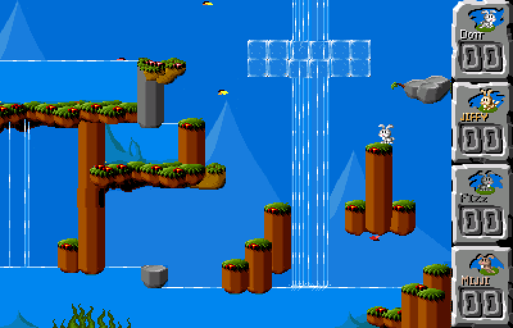
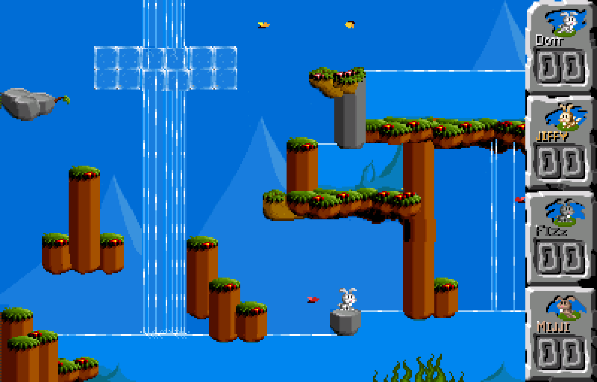
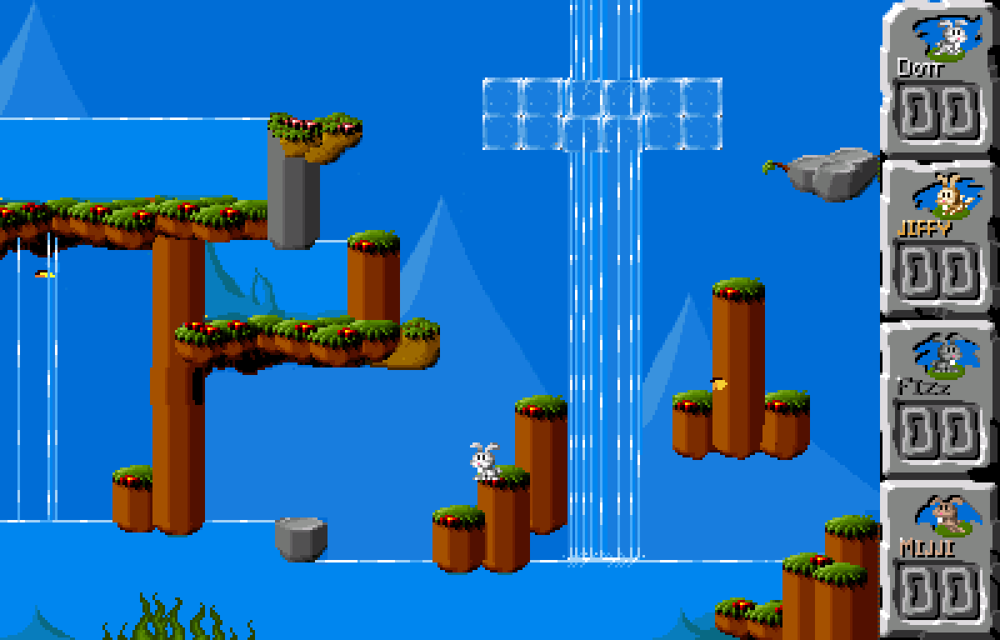

# Jump 'n Bump

<iframe width="560" height="315" src="https://www.youtube-nocookie.com/embed/YHrocZPWiH0" title="YouTube video player" frameborder="0" allow="accelerometer; autoplay; clipboard-write; encrypted-media; gyroscope; picture-in-picture" allowfullscreen></iframe>

## Background

This is a game for the whole family. You play cute fluffy little bunnies and hop on each other's heads.

At the beginning you are in the menu, where you have to let each active player jump over the tree trunk to enter the play area, and then walk to the right. You will then enter the arena. The aim is to jump on the other bunnies' heads…

Jump 'n Bump was originally a DOS game by Brainchild Design, which was open sourced under the GPL license and ported to SDL, and then SDL2.

### Extra levels

Additional levels are available on the website of [Brainchild Design](http://www.brainchilddesign.com/games/jumpnbump/levels/levels1.html).

### Author/License

The Jump 'n Bump core has been authored by

- loki666

The Jump 'n Bump core is licensed under

- [GPLv2](https://github.com/fabiangreffrath/jumpnbump/blob/master/COPYING)

A summary of the licenses behind RetroArch and its cores can be found [here](../development/licenses.md).

## Extensions

Content that can be loaded by the Jump 'n Bump core have the following file extensions:

- .dat

## Databases

RetroArch database(s) that are associated with the Jump 'n Bump core:

- [Jump 'n Bump](https://github.com/libretro/libretro-database/blob/master/rdb/Jump%20'n%20Bump.rdb)

## BIOS

There are no required BIOS.

## Features

Frontend-level settings or features that the Jump 'n Bump core respects.

| Feature           | Supported |
|-------------------|:---------:|
| Restart           | ✔         |
| Screenshots       | ✔         |
| Saves             | ✕         |
| States            | ✕         |
| Rewind            | ✕         |
| Netplay           | ✔         |
| Core Options      | ✔         |
| RetroAchievements | ✕         |
| RetroArch Cheats  | ✕         |
| Native Cheats     | ✕         |
| Controls          | ✔         |
| Remapping         | ✔         |
| Multi-Mouse       | ✕         |
| Rumble            | ✕         |
| Sensors           | ✕         |
| Camera            | ✕         |
| Location          | ✕         |
| Subsystem         | ✕         |
| [Softpatching](../guides/softpatching.md) | ✕         |
| Disk Control      | ✕         |
| Username          | ✕         |
| Language          | ✕         |
| Crop Overscan     | ✕         |
| LEDs              | ✕         |

### Directories

The Jump 'n Bump core's internal core name is 'Jump 'n Bump'

### Geometry and timing

- The Jump 'n Bump core's core provided FPS is (60)
- The Jump 'n Bump core's core provided sample rate is 44100 Hz
- The minivmac core's base width is 1200.
- The minivmac core's base height is 768.
- The minivmac core's core provided aspect ratio is 25/16.

## Core options

The Jump 'n Bump core has the following option(s) that can be tweaked from the core options menu. The default setting is bolded.

Settings with (Restart) means that core has to be closed for the new setting to be applied on next launch.

- **Flip Level** [jnb-flip] (**OFF**|ON)

	??? note "*Flip Level - Off*"
	    

	??? note "*Flip Level - On*"
	    

- **Flies** [jnb-flies] (**OFF**|ON)

	??? note "*Flies - Off*"
	    

	??? note "*Flies - On*"
	    	    

## Controllers

The Jump 'n Bump core supports the following device type(s) in the controls menu, bolded device types are the default for the specified user(s):

### User 1 - 4 device types

- None - Disables input.
- **RetroPad** - Joypad
- RetroPad with Analog

### Controller tables

#### Joypad

| User 1 - 4 Remap descriptors | RetroPad Inputs                             |
|--------------------------|---------------------------------------------|
| B                        |           |
| Select                   |      |
| Start                    |       |
| D-Pad Up                 |     |
| D-Pad Down               |   |
| D-Pad Left               |   |
| D-Pad Right              |  |

## External Links

- [Jump 'n Bump Github Repository](https://github.com/fabiangreffrath/jumpnbump)
- [Libretro Jump 'n Bump Core info file](https://github.com/libretro/libretro-super/blob/master/dist/info/jumpnbump_libretro.info)
- [Libretro Jump 'n Bump Github Repository](https://github.com/libretro/jumpnbump-libretro)
- [Report Libretro Jump 'n Bump Core Issues Here](https://github.com/libretro/jumpnbump-libretro/issues)