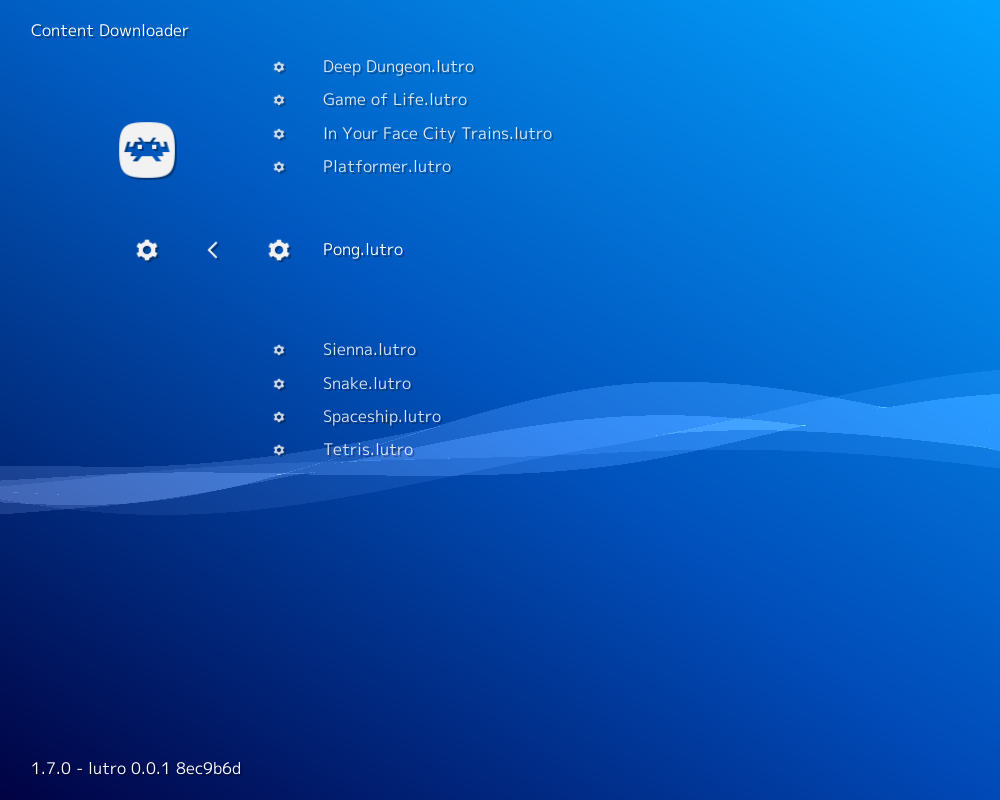

# Lua Engine (Lutro)

## Background

Lutro is an experimental lua game framework that follows the [LÖVE API](https://love2d.org/wiki/Main_Page). Lutro games can be played with LibRetro/RetroArch through the Lutro core.

#### How to start the Lutro core:

- As an example showcasing loading content with the Lutro core, we will load the Pong game hosted on RetroArch's Content Downloader.

You can do this by going to RetroArch's main menu screen and selecting 'Online Updater'. From there, select 'Content Downloader'.

  

- Select 'Lutro', then select 'Pong.lutro'. This should download and extract this file to RetroArch's Downloads directory.

  

- Go back to RetroArch's main menu screen. Select 'Load Content', then 'Downloads'.

  

  

- Select 'Pong.lutro'.

- If you are asked which core to select, choose 'Lua Engine (Lutro)'.

The content should now start running!

### Author/License

The Lutro core has been authored by

- Higor Euripedes
- Jean-Andre Santoni

The Lutro core is licensed under

- [MIT](https://github.com/libretro/libretro-lutro/blob/master/LICENSE)

A summary of the licenses behind RetroArch and its cores can be found [here](../development/licenses.md).

## Extensions

Content that can be loaded by the Lutro core have the following file extensions:

- .lutro
- .lua

## Databases

RetroArch database(s) that are associated with the Lutro core:

- [Lutro](https://github.com/libretro/libretro-database/blob/master/rdb/Lutro.rdb)

## Features

Frontend-level settings or features that the Lutro core respects.

| Feature           | Supported |
|-------------------|:---------:|
| Restart           | ✕         |
| Screenshots       | ✕         |
| Saves             | ✕         |
| States            | ✕         |
| Rewind            | ✕         |
| Netplay           | ✕         |
| Core Options      | ✕         |
| RetroAchievements | ✕         |
| RetroArch Cheats  | ✕         |
| Native Cheats     | ✕         |
| Controls          | ✔         |
| Remapping         | ✔         |
| Multi-Mouse       | ✕         |
| Rumble            | ✕         |
| Sensors           | ✕         |
| Camera            | ✕         |
| Location          | ✕         |
| Subsystem         | ✕         |
| [Softpatching](../guides/softpatching.md) | ✕         |
| Disk Control      | ✕         |
| Username          | ✕         |
| Language          | ✕         |
| Crop Overscan     | ✕         |
| LEDs              | ✕         |

### Directories

The Lutro core's internal core name is 'lutro'

### Geometry and timing

- The Lutro core's core provided FPS is 60
- The Lutro core's core provided sample rate is 44100 Hz
- The LUtro core's core provided aspect ratio is (Ratio)

## Controllers

The Lutro core supports the following device type(s) in the controls menu, bolded device types are the default for the specified user(s):

### User 1 device types

- None - Doesn't disable input. There's no reason to switch to this.
- **RetroPad** - Joypad - Stay on this.
- RetroPad w/Analog - Joypad - Same as RetroPad. There's no reason to switch to this.

### Controller tables

#### Joypad

!!! attention
	What the inputs do are game specific.

| User 1 Remap descriptors | RetroPad Inputs                                | Lutro core inputs |
|--------------------------|------------------------------------------------|-------------------|
|                          |              | B                 |
|                          |              | Y                 |
|                          |         | Select            |
|                          |          | Start             |
| Up                       |        | Up                |
| Down                     |      | Down              |
| Left                     |      | Left              |
| Right                    |     | Right             |
|                          |              | A                 |
|                          |              | X                 |
|                          |             | L1                |
|                          |             | R1                |
|                          |             | L2                |
|                          |             | R2                |
|                          |             | L3                |
|                          |             | R3                |

## External Links

- [Lua Website](https://www.lua.org/)
- [LÖVE API Website](https://love2d.org/)
- [Libretro Lutro Core info file](https://github.com/libretro/libretro-super/blob/master/dist/info/lutro_libretro.info)
- [Libretro Lutro Github Repository](https://github.com/libretro/libretro-lutro)
- [LUTRO LÖVE API Comparison](https://github.com/libretro/lutro-status)
- [Lutro Github Wiki](https://github.com/libretro/libretro-lutro/wiki)
- [Report Libretro Lutro Core Issues Here](https://github.com/libretro/libretro-lutro/issues)

### See also

#### Custom Engine

- [ChaiLove](chailove.md)
