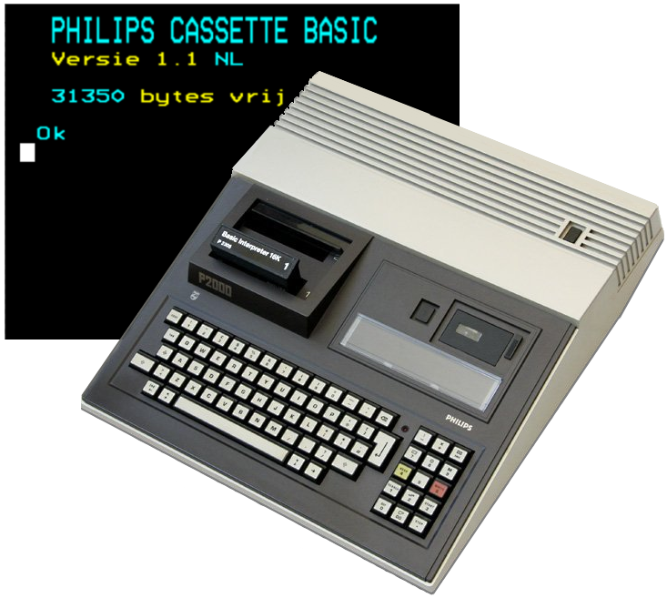
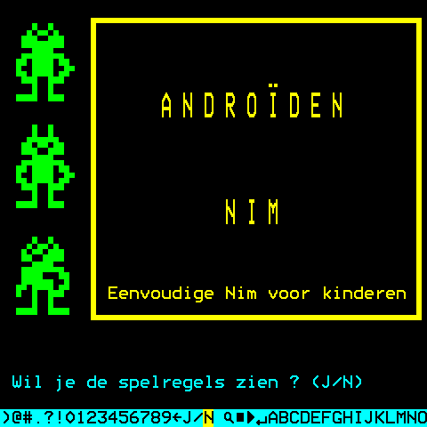

# Philips - P2000T (M2000)



## Background

The P2000T was Philips' first computer for the home market in the early '80s, before they later switched to manufacturing MSX computers. The P2000T was a Z80-powered home computer, running at a clock speed of 2.5 MHz and it used a Mullard SAA5050 teletext display chip to produce the video picture. The machine was built like a tank and featured an integrated keyboard, power supply, two cartridge slots and a very innovative and fast Mini-Cassette system (MDCR), which was fully automated and used mini tapes that could hold up to 42 kilobytes of data.

The P2000T was reasonably popular among hobbyists and kids in elementary schools in The Netherlands, as Philips promoted the machine strongly in the science and education sectors. Because of the relatively high introductory price and the fact that its SAA5050 video chip only supported a 40 x 24 character teletext display mode, the P2000T never became the success that Philips hoped for.

While the system's video and sound capabilities were rather limited, some developers still were able to create remarkably good games, like a Pac-Man clone named "Ghosthunt", a Phoenix clone named "Fraxxon", a Lady Bug clone named "Lazy Bug" and a Breakout clone named "Brick-Wall".

The P2000T (M2000) emulator core has been authored by:

- Dion Olsthoorn
- Marcel the Kogel (who wrote the original emulator back in 1997)

and is licensed under:

- [GPL3](https://github.com/p2000t/M2000/blob/main/LICENSE)

A summary of the licenses behind RetroArch and its cores can be found [here](../development/licenses.md).

## Extensions

Content that can be loaded by the M2000 core have the following file extensions:

- .cas

## Features

Frontend-level settings or features that the M2000 core respects:

| Feature           | Supported |
|-------------------|:---------:|
| Restart           | ✔         |
| Screenshots       | ✔         |
| Saves             | ✔         |
| States            | ✔         |
| Rewind            | ✔         |
| Netplay           | ✕         |
| Core Options      | ✔         |
| RetroAchievements | ✕         |
| RetroArch Cheats  | ✕         |
| Native Cheats     | ✕         |
| Controls          | ✔         |
| Remapping         | ✔         |
| Multi-Mouse       | ✕         |
| Rumble            | ✕         |
| Sensors           | ✕         |
| Camera            | ✕         |
| Location          | ✕         |
| Subsystem         | ✕         |
| [Softpatching](../guides/softpatching.md) | ✕         |
| Disk Control      | ✕         |
| Username          | ✕         |
| Language          | ✕         |
| Crop Overscan     | ✕         |
| LEDs              | ✕         |

## Directories

The M2000 core's library name is 'M2000'.

**Frontend's Save directory**

| File        | Description            |
|-------------|------------------------|
| Default.cas | Writable cassette file, which is only created/attached when starting the M2000 core **without content** |

## Geometry and timing

- The M2000 core's provided FPS is `50`
- The M2000 core's provided sample rate is `30000`
- The M2000 core's base width is `480`
- The M2000 core's base height is `480`
- The M2000 core's max width is `480`
- The M2000 core's max height is `480`
- The M2000 core's provided aspect ratio is `4/3`

## Usage

You can use the M2000 core for playing P2000T cassette games, but you can also use it for programming your own P2000T Basic programs.

### Programming in Basic

When you start the M2000 core **without content**, you will see the "Philips Cassette Basic" screen with the white cursor waiting for your input. Here you can type in your Basic program and load or save your programs. An - initially empty - cassette named `Default.cas` will be attached and stored in the M2000 Save directory. 
You can save a program using:
```
csave "program name"
```
... and load it again using:
```
cload "program name"
```
Note that only the first(!) character of each program is used for identification, so e.g. a program named "hello world" can be loaded using `cload "h"`.
To show the index of the cassette, press F3 or Shift + Numeric keypad 1.

#### Game Focus mode
Programming P2000T Basic using the M2000 core requires full keyboard access. This works best when the core is in **'Game Focus'** mode, which allows the M2000 core to take precedence in inputs. The easiest way to automatically enable 'Game Focus' mode for the M2000 core is in **Settings > Input** where you set the option called **Auto Enable 'Game Focus' Mode** to `Detect`. Or correspondingly in retroarch.cfg set `input_auto_game_focus = "2"`. Be aware that the default hotkey for toggling the **Game Focus** mode is the **Scroll Lock** key, which might not be present on your keyboard. If that's the case, you'll need to remap this hotkey to a more suitable key.

### Playing games

The P2000T didn't came with any joystick ports, so every P2000T game relies on keyboard input. Usually the Space key is used to fire and the Arrow-keys to navigate, but other keys are also used to answer simple Yes/No questions or for entering the number of players.

While the P2000T didn't have any joystick ports, there was a third-party company back in the '80s who was selling I/O cartridges to which you could connect up to 2 joysticks. These cartridges basically simulated actual key presses and that is exactly what the Joypad is doing in the M2000 core.

Playing P2000T games using the M2000 core usually works best in one of these three ways:

1. Using **Keyboard only**
This basically means that you play the P2000T games like most people did back in the day. 
This way of playing works best when the core is in **'Game Focus'** mode, like explained above.

2. Using both **Keyboard** and **Joypad**
Use the **Keyboard** to answer the game's Yes/No questions and for things like entering the number of players or typing your name for the highscore list. Then switch to the **Joypad** during actual game play.
This way of playing also works best when the core is in **'Game Focus'** mode.

3. Using **Joypad only.**
This requires the use of the On-Screen Key Selector to enter the number of players or to answer Y/N questions. See the description below on how to use the On-Screen Key Selector.
For this way of playing the core doesn't have to be in **'Game Focus'** mode.

#### On-Screen Key Selector

The On-Screen Key Selector lets you simulate key presses using your Joypad controller. This allows you to play almost all P2000T games without the need of an actual keyboard. Next to the regular Joypad mappings (for the Navigation keys +  Space to fire), most games will ask simple Yes/No questions or allow you to enter your name in a high score list.

The On-Screen Key Selector is activated by holding your Joypad's Left Bumper/Trigger/Shoulder button. Then with the D-pad you can loop through the keys and with the A/B button you then enter the highligted key.

In the screenshot below you can see the On-Screen Key Selector in the bottom of the screen, where the player is about the enter the 'N' key to skip showing the "spelregels" (game rules):



## User 1 device types

The M2000 core supports the following device type(s) in the controls menu, bolded device types are the default for the specified user(s):

- **RetroKeyboard** - Keyboard. The keyboard inputs are always active.
- **RetroPad** - Joypad. The buttons are internally mapped to actual keyboard key presses (see information below).

## Joypad

| RetroPad Inputs                             | P2000T Keys            |
|---------------------------------------------|------------------------|
|           | Space / Fire           |
|           | Space / Fire           |
|       | < START >              |
|      | < STOP >               |
|     | Up                     |
|   | Down                   |
|   | Left                   |
|  | Right                  |
|          | On-Screen Key Selector |
|          | On-Screen Key Selector |

### Joypad remapping for games that use alternative keys

Some P2000T games use alternative keys for navigation. An example is Fraxxon, which uses the **Left** and **Up** keys to move the spaceship horizontally, which was probably done for better playability on the original P2000T keyboard. 
To be able to use the D-pad for horizontal movement in the emulator, you should start Fraxxon, then open the menu and go to **Quick Menu > Controls > Port 1 Controls** and remap **D-Pad Right** to RetroPad **Up**. Now return to **Quick Menu > Controls**, click **Manage Remap Files** and select **Save Game Remap File** to save the joypad remapping for Fraxxon only.

## Keyboard

### Symbolic key mapping
The M2000 core is using **symbolic** key mapping by default, which means that - where possible - keys on the PC keyboard are mapped to corresponding P2000T keys that show the same symbol, so you basically get the key which you pressed.

The special keys < START >, < STOP > and < ZOEK > are mapped as follows:

| RetroKeyboard Inputs      | P2000T Keys          |
|---------------------------|----------------------|
| F1                        | < START >            |
| F2                        | < STOP >             |
| F3                        | < ZOEK >             |
| Shift + Numpad 1          | < ZOEK >             |
| Shift + Numpad 3          | < START >            |
| Shift + Numpad Enter      | < STOP >             |

### Positional key mapping
Optionally, the M2000 core supports **positional** key mapping, which maps every key from a "real" keyboard to the key which has the same position/location on a P2000T keyboard. 

As the layout of a P2000T keyboard differs from modern keyboards, this might cause some unexpected mappings. So below you can see how the keys on the RetroKeyboard map to positional keys on the P2000T keyboard:

| RetroKeyboard Inputs      | P2000T Keys          |
|---------------------------|----------------------|
| a .. z                    | a .. z               |
| A .. Z                    | A .. Z               |
| 0 .. 9                    | 0 .. 9               |
| Shift + 1                 | Exclaim !            |
| Shift + 2                 | Double Quote "       |
| Shift + 3                 | Pound &              |
| Shift + 4                 | Dollar $             |
| Shift + 5                 | Percent %            |
| Shift + 6                 | Ampersand &          |
| Shift + 7                 | Quote '              |
| Shift + 8                 | Left Parenthesis (   |
| Shift + 9                 | Right Parenthesis )  |
| Shift + 0                 | Equals =             |
| Minus -                   | Minus -              |
| Underscore _              | Dash —               |
| Equals =                  | One Quarter ¼        |
| Plus +                    | Three Quarters ¾     |
| Left Bracket [            | At @                 |
| Left Curly Brace {        | Arrow Up ↑           |
| Right Bracket ]           | Arrow Right →        |
| Right Curly Brace }       | Arrow Left ←         |
| Backslash \               | Hash #               |
| Pipe \|                   | Block █              |
| Semicolon ;               | Semicolon ;          |
| Colon :                   | Plus +               |
| Quote '                   | Colon :              |
| Double Quote "            | Asterisk *           |
| Comma ,                   | Comma ,              |
| Period .                  | Period .             |
| Slash /                   | Slash /              |
| Question ?                | Question ?           |
| Delete                    | Less <               |
| Shift + Delete            | Greater >            |
| Backspace                 | Backspace            |
| Return                    | Enter                |
| Space                     | Space                |
| Backquote `               | < CODE >             |
| Tab                       | Tab                  |
| Caps Lock                 | Shift Lock           |
| Left Shift                | Left Shift           |
| Right Shift               | Right Shift          |
| Up                        | Up                   |
| Down                      | Down                 |
| Right                     | Right                |
| Left                      | Left                 |
| Numpad 0 .. 9             | 0 .. 9               |
| Numpad Period .           | Double Zero 00       |
| Numpad Enter              | Period .             |
| Numpad Multiply *         | Clear Line           |
| Shift + Numpad Multiply * | Clear Page           |
| Shift + Numpad 1          | < ZOEK >             |
| Shift + Numpad 3          | < START >            |
| Shift + Numpad Enter      | < STOP >             |
| F1                        | < START >            |
| F2                        | < STOP >             |
| F3                        | < ZOEK >             |

## External Links

- [Libretro M2000 Core info file](https://github.com/libretro/libretro-super/blob/master/dist/info/m2000_libretro.info)
- [Official M2000 Github Repository](https://github.com/p2000t/M2000)
- [Report M2000 Issues Here](https://github.com/p2000t/M2000/issues)
- [Wikipedia page on the Philips P2000T](https://en.wikipedia.org/wiki/Philips_P2000#P2000T)
- [P20000T documentation](https://github.com/p2000t/documentation)
- [P20000T game collection](https://github.com/p2000t/software/tree/master/cassettes/games)
