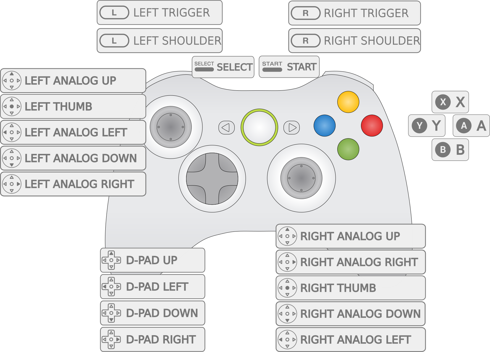
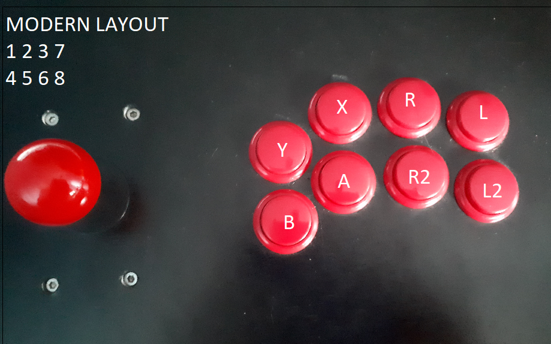
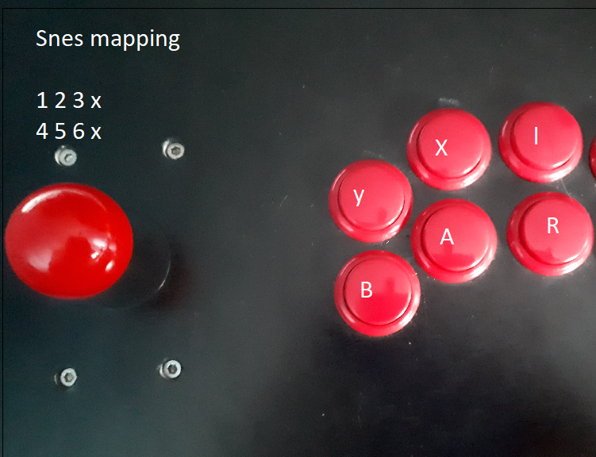
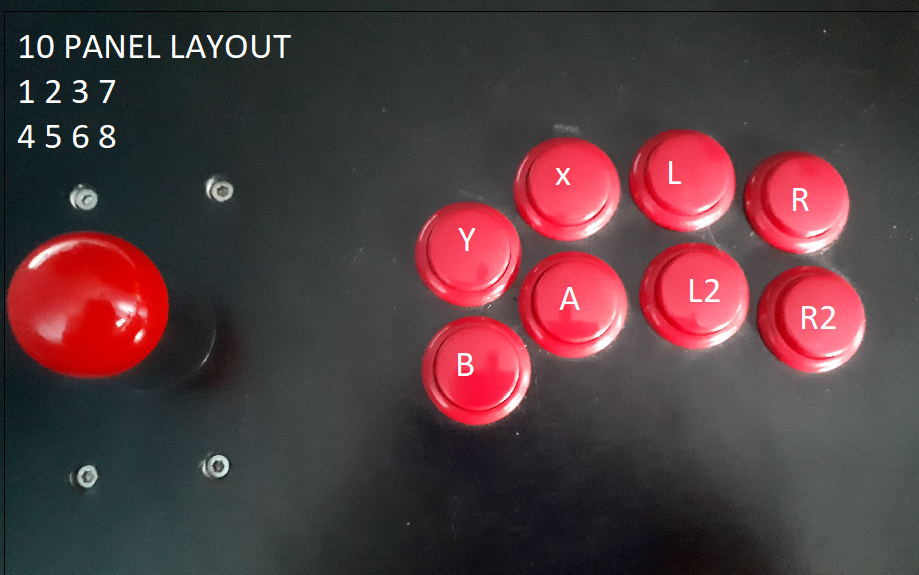
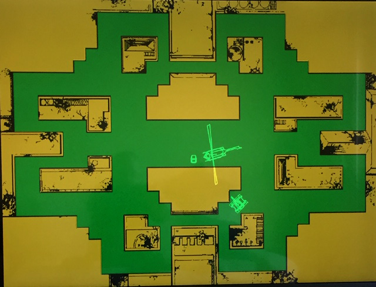

# MAME 2003-Plus

## Background

MAME 2003-Plus (also referred to as MAME 2003+ and mame2003-plus) is a libretro multi-arcade system emulator core which prioritizes 1) usability and frontend integration, 2) performance, and 3) compatibility across the range of libretro-supported platforms including mobile devices, single board computers, and consoles. MAME 2003-Plus is part of a long tradition in arcade emulation of producing platform-specific and performance-optimized MAME builds.

!!! Question "Why is it called **Plus**?"
    Unlike the other 'historic' libretro MAME cores which remain fixed at one MAME version, MAME 2003-Plus is actively maintained and has to date added support for hundreds of new games along with dozens of new features.

MAME 2003-Plus is part of a lineage of codebase forks and ports: this core was forked from MAME 2003, which is itself derived from Xmame 0.78, the X11/Unix port of MAME 0.78.

**Authors**: MAMEdev, MAME 2003-Plus team, et al (see [LICENSE.md](https://raw.githubusercontent.com/libretro/mame2003-plus-libretro/master/LICENSE.md) and [CHANGELOG.md](https://raw.githubusercontent.com/libretro/mame2003-plus-libretro/master/CHANGELOG.md))


## Contribute to this documentation

In order to propose improvements to this document, [visit it's corresponding source page on github](https://github.com/libretro/docs/blob/master/docs/library/mame2003-plus.md). Changes are proposed using "Pull Requests."


## See also

[MAME 2003](mame_2003.md)


## License

[MAME Non-Commercial](https://raw.githubusercontent.com/libretro/mame2003-libretro/master/LICENSE.md)


## Extensions

zip, chd

!!! Note "CHD paths"
    Some games require data from an internal hard drive, CD-ROM, laserdisk, or other media in order to be emulated -- those forms of media are packaged as CHD files. CHD files should be copied to subfolders within the folder where the romset zips have been installed: `/libretro content dir/blitz/blitz.chd`


## Building romsets for MAME 2003-Plus

MAME 2003-Plus began with the game drivers from MAME 0.78, meaning that 95% or more of MAME 0.78 romsets will work as-is in MAME 2003-Plus, where they immediately benefit from its bugfixes and other improvements. **In order to play the new games and games which received ROM updates in MAME 2003-Plus, you will need to find or build MAME 2003-Plus romsets.**

!!! question "What is a romset?"
    Arcade games are packaged as zip files, most of which are composed of more than one individual 'ROM' files. That is why some resources inaccurately refer to an individual arcade game as a ROM (like people use to describe a zipped game cartridge ROM) while other resources refer to an individual game as a **ROM set**, **ROMset**, or **romset**.

MAME 2003-Plus has the ability to generate an XML "DAT" file directly from the [MAME menu](#MAME-menu).


### Step 1: Obtaining an XML DAT

DAT files describe the exact ROM contents that the emulator needs including filenames, file sizes, and checksums to verify contents are not incorrect or corrupt. mame2003-plus has the ability to generate an XML "DAT" file from the MAME Menu. You can also access the MAME menu by turning it on as a core option, selecting **Generate XML DAT** and then disabing the menu as a core option.


### Step 2: Finding a source for ROMs

In order to build a complete MAME 2003-Plus collection, the ingredients are:

* A complete MAME 0.223 or later romset collection
* A complete MAME 0.223 or later "rollback" romset collection
* MAME 0.78 CHD collection
* The NeoGeo UniBIOS 3.3, freely available at http://unibios.free.fr/


### Step 3: Building MAME 2003-Plus romsets

Refer to [Validating, Rebuilding, and Filtering ROM Collections](https://github.com/RetroPie/RetroPie-Setup/wiki/Validating,-Rebuilding,-and-Filtering-ROM-Collections) for details on how to configure ClrMamePro to use your sources as "rebuild" folders.

We recommend the **Full Non-Merged** format, where each romset zip files includes all the files needed to run each game, including any ROMs from 'parent' ROM sets and BIOS sets. To configure ClrMamePro to validate or rebuild a Full Non-Merged collection, use "Non-Merged" mode and disable "Separate BIOS Sets" from the "Advanced" menu in both ClrMamePro's Rebuild and Scanner menus.

!!! tip
    A complete **Full Non-Merged** romset collection with CHDs and Samples only requires approximately 6% more storage space than the **Split** format romsets that are also sometimes used to structure arcade romsets. MAME 2003-Plus can read **Split, TorrentZipped** romsets, but the RetroArch playlist scanner only supports **Full Non-Merged, TorrentZipped** romsets for MAME 2003-Plus.


#### Recommended ClrMamePro settings
ClrMamePro remains the most popular tool for rebuilding MAME romsets, at least for now. That said, ClrMamePro is focused on supporting more recent MAME versions so there are at least two things to know if you are using ClrMamePro to generate a MAME 2003-Plus set:

1. If you are scanning CHDs, go to `Settings` -> `Compressor` -> `CHDMan` tab and change `Req. CHD Version` to `3`.
2. If you are using the suggested setting of `Disable Separate BIOS Sets` then ClrMamePro will report the BIOS romset files as missing even though you told the program you don't want them. mame2003-plus incorporates 15 different kinds of BIOS romsets, so it is normal to see a ClrMamePro message like this after a clean and complete scan: `You are missing 15 of 4831 known mame2003-plus.xml sets (+ BIOS sets)`


### Sourcing CHDs

MAME 2003-Plus uses exactly the same MAME 0.78 CHDs (CHD v3) as MAME 2003.


## BIOS

BIOS romsets are not needed when using "Full Non-Merged" arcade romsets. For "Split" and "Non-Merged" romsets, place the BIOS in the same directory as the game romset.


## Features

| Feature           | Supported |
|-------------------|-----------|
| Saves             | ✔         |
| States            | game-dependent |
| Rewind            | ✔         |
| Netplay           | ✔         |
| RetroAchievements | ✕         |
| RetroArch Cheats  | ✕         |
| Native Cheats     | ✔         |
| Controllers       | ✔         |
| Multi-Mouse       | ✔         |
| Rumble            | ✕         |
| Sensors           | ✕         |
| Camera            | ✕         |
| Location          | ✕         |
| Subsystem         | ✕         |


## Input system, controls, and options

mame2003-plus emulates thousands of games, many of which have unique control layouts. These games are emulated on more than a thousand variations of arcade hardware. The purpose of the input system is to communicate input from the user's physical controls through the libretro frontend, the mame2003-plus emulator core, and into the emulated game itself.

No system of default input mappings can address the full range of emulated games and supported controls. Some degree of per-game customization should ways be expected. However, to the extent possible it is also within the purpose of the MAME 2003-Plus input system to attempt to provide predictable and meaningful defaults for input across this wide range.


## Default RetroPad Layouts

| **Classic Gamepad** |
|---------------------|
| The **Classic Gamepad** is based on mainline MAME's default Xbox 360 controller layout and is also likely to suit DualShock or SNES-style gamepads. The corresponding option in configuration file is ```input_libretro_device_pX = "1"``` (where X is the player number, ```input_libretro_device_p1 = "1"``` for player 1, etc.).<br><br> |

| **Modern Fightstick** |
|-----------------------|
| The **Modern Fightstick** layout is the fight stick and pad layout popularized by Street Fighter IV and assumes an 8+ button controller. The corresponding option in configuration file is ```input_libretro_device_pX = "257"``` (where X is the player number, ```input_libretro_device_p1 = "257"``` for player 1, etc.). Gamepad can also serve as an alternative Xbox/PSX-style layout for Street Fighter 2.<br>For arcade control panels, **Modern Fightstick** can be mapped in this way:<br>
|

| **6-Button** |
|--------------|
| **6-button** is a layout intended for SNES-type RetroPad controls as well as 6-button arcade panels arcade panels. The corresponding option in configuration file is ```input_libretro_device_pX = "769"``` (where X is the player number, ```input_libretro_device_p1 = "769"``` for player 1, etc.). **6-button** can be mapped in this way:<br>|

| **8-Button** |
|--------------|
|**8-button** is a layout intended for an arcade panel. The corresponding option in configuration file is ```input_libretro_device_pX = "513"``` (where X is the player number, ```input_libretro_device_p1 = "513"``` for player 1, etc.). **8-button** is configured like this<br>|


### Keyboard Input
`mame_keyboard` sets the core to process keyboard input directly through the legacy "MAME" keyboard interface. Use this input mode only if your input device is seen as a keyboard, including some arcade control panel hardware.


### Mouse and trackball support

MAME 2003-Plus has support for multiple mice or touch devices in games that support trackballs, etc. MAME 2003-Plus also supports one or two spinners/dials via the "Share 2 player dial controls across one X/Y device" core option. By default, mice/trackballs and analog sticks (the left one, for controllers with 2) are supported in games that would have them, or equivalents. For example, Centipede supports the mouse/trackball, and Afterburner supports the stick.


### Pointer, trackpad, touchscreen support

Absolute pointer devices are supported, but need to be turned on via the corresponding core option.


### Lightgun support

Because MAME 2003-Plus does not yet implement the libretro lightgun API, the core currently supports lightguns only if they are configured to emulate a mouse.


### 2-player dial and spinner devices

2-player spinner and dial devices can be represented as 1 device with 2 axes. MAME 2003-Plus can be configured to share this device across both players: Player 1 = X axis, Player 2 = Y axis. This can be enabled via a setting in the `retroarch-core-options.cfg` file:
```mame2003-plus-dialsharexy = "enabled"```

!!! Warning
    Enabling this option will disable standard mouse support.


### Analog and digital controller support

MAME 2003-Plus natively supports analog and digital controls.

### 4-way joystick simulation

4-way joysticks are an essential aspect of the gameplay for many iconic arcade titles including games like Donkey Kong, Pac-Man, and Q-Bert. Because modern joysticks generally use 8-way designs, it is usually impossible to play these games well without special hardware. MAME 2003-Plus includes a core option to simulate 4-way joysticks. When enabled, this logic analyzes input from 8-way digital joysticks in order to render its position as if the joystick had a 4-way design. This simulation is not the same as using a real 4-way joystick, but it can make a significant improvement to playability.


### Content-aware control names

In the same way that content-aware core options only appear when they are relevant to the current game, MAME 2003-Plus has added support for content-aware control names. In other words, when remapping Street Fighter 2 controls, the libretro frontend can display the control names that were printed on the real arcade control panel like `Jump`, `Strong Punch` and `Forward Kick` instead of a generic labels like `Up`, `Button 1`, `Button 2`, etc.

Because support for control names is relatively new and is derived from the third-party **controls.dat** project, control names need to be verified by a human being before they are activated. As of end end of 2018, dozens of games have these active control names, but hundreds more need to be double-checked before being enabled. [Coders, and users who are willing to learn basic github commands, are invited to join in this effort](https://github.com/libretro/mame2003-plus-libretro/wiki/Submitting-Button-Names).

-----------

## Other key features

## Audio samples

Some games require an additional zip file with recorded sounds or music in order for audio to work correctly. Audio 'sample' files should be placed in a `samples` subdirectory within `/libretro system dir/mame2003-plus/`.

!!! tip "Alternate CD soundtrack support"
    MAME 2003-Plus also supports alternate soundtracks for several popular arcade titles that were also released in other formats with high quality audio soundtracks. Alternate soundtracks are supported for **Double Dragon**, **Final Fight**, **Mortal Kombat**, **Michael Jackson’s Moonwalker**, **NBA Jam**, and **Out Run**.


### Backdrop artwork

Some games require backdrop artwork files in order to be fully emulated. Because RetroArch, the reference libretro frontend, does not yet incorporate support for so-called "backdrop" artwork, the MAME 2003-Plus github repository includes [a folder of high-resolution backdrop artwork](https://github.com/libretro/mame2003-plus-libretro/tree/master/metadata/artwork) that is compatible with the core's built-in artwork display system. These artwork `zip` files should be placed within `/libretro system dir/mame2003-plus/artwork`.



_"Armor Attack" backdrop artwork pack prepared by UDB23_


### Run Ahead input lag reduction

This core supports the RetroArch "Run Ahead" input latency reduction feature when Run Ahead is set to `Second Instance`, but as of the end of 2018 there are [known issues preventing Run Ahead from functioning properly and a bounty fundraiser to fix them](https://github.com/libretro/mame2003-plus-libretro/issues/434).


### MAME Menu

The simplest way to access the "MAME menu" is by enabling it in the core options. If your input mode is set to allow input to the `mame_keyboard` interface, you can also enter the menu by pressing the `Tab` key.


### Dip-switches

Many arcade games have hardware switches for arcade owners to modify certain parameters which can be adjusted by accessing the MAME menu and selecting the '**Dip Switches**' option. Dip switches often controlled features like free play (no coins needed), difficulty level, and cocktail table cabinet rotation mode.


### Service menu

For games where dip switches are not available directly within the MAME menu, MAME 2003-Plus the core can often access a game's internal servic menus to set options by pressing `F2` with a keyboard while `mame_keyboard` or `simultaneous` input mode is enabled.


### High scores

The **hiscore.dat** is compiled into MAME 2003-Plus and then spawned into `/libretro system dir/mame2003-plus/` the first time the core is run. Users do not need to install the **hiscore.dat** themselves. From then on, users can modify or replace this file with their own custom DAT if they choose. When high scores are saved, they are either stored as NVRAM data in `libretro system dir/mame2003-plus/nvram/` or as hiscore data in: `libretro system dir/mame2003-plus/hi/`


### Cheats

MAME 2003-Plus supports the MAME cheat engine, allowing you to use the MAME menu to enable various in-game cheats. To activate these, there is a necessary supplementary file called `cheat.dat`. This file can be [downloaded from the MAME 2003-Plus 'metadata' repository](https://github.com/libretro/mame2003-plus-libretro/tree/master/metadata). Place `cheat.dat` in: `libretro system dir/mame2003-plus/`.


### History DAT

MAME 2003-Plus supports the use of the **history.dat** file, which displays background information about many games from within the **MAME Menu**. This file can be [downloaded from the MAME 2003-Plus 'metadata' repository](https://github.com/libretro/mame2003-plus-libretro/tree/master/metadata). Place `history.dat` in: `libretro system dir/mame2003-plus/ `.


### LED output system

As of late 2018, MAME 2003-Plus incorporates preliminary support for the libretro LED lighting output system. Documentation is yet to be written on this topic.

-----------

## Core-generated content

Core-generated content is placed in sub-directories within `/libretro savefile dir/mame2003-plus/`:
```
/libretro savefile dir/mame2003-plus/diff/
/libretro savefile dir/mame2003-plus/nvram/
/libretro savefile dir/mame2003-plus/hi/
/libretro savefile dir/mame2003-plus/cfg/
/libretro savefile dir/mame2003-plus/memcard/
```

-----------

## Core options

!!! Tip
    **Restart core** indicates that the core must be restarted in order for changes to that option to take effect.

!!! Tip "Content-aware core options"
    Because MAME 2003-Plus supports more than 4,000 games, there are a number of core options which only apply to a subset of its library. For example, there are several options to configure vector displays which have no effect for games with any other kind of display. **MAME 2003-Plus only presents core options to the frontend that are relevant to the game that is currently loaded** In other words, the vector options only appear when a vector game is currently loaded.

| Core option | Description|
| --- | --- |
| 4-way joystick emulation on 8-way joysticks | See **4-way joystick simulation** section of this doc. ```mame2003-plus_four_way_emulation = "enabled|disabled"``` |
| Mouse Device | Set mouse device input to be read either from a mouse, a pointer (pointer, trackpad, touchscreen), or to be disabled. ``` mame2003-plus_mouse_device = "mouse|pointer|disabled"``` |
| Show Lightgun crosshair | Toggle crosshair visibilty for lightgun games. ```mame2003-plus_crosshair_enabled = "enabled|disabled"``` |
|Skip Disclaimer| Skip the copyright disclaimer message. ```mame2003-plus_skip_disclaimer = "disabled|enabled"``` |
|Skip Warnings| _Advanced feature: changing from the default is not recommended in most cases._ Skip any driver warnings about emulation quality. ```mame2003-plus_skip_warnings = "disabled|enabled"``` |
|Display MAME menu | Enable this core option to display the core's **MAME Menu** and then disable it when you have finished using the **MAME Menu**. ```mame2003-plus_display_setup = "disabled|enabled"``` |
|Specify Neo Geo BIOS (Restart core) | Manually specify your choice of Neo Geo BIOS from among those supported. ```mame2003-plus_neogeo_bios = "default|euro|euro-s1|us|us-e|asia|japan|japan-s2|unibios33|unibios20|unibios13|unibios11|unibios10|debug|asia-aes"``` |
|Specify Sega ST-V BIOS (Restart core) | Manually specify your choice of ST-V BIOS from among those supported. ```mame2003-plus_stv_bios = "default|japan|japana|us|japan_b|taiwan|europe"``` |
|Use CD soundtrack (Restart core) | See **Alternate CD soundtrack support** in the **Audio samples** section of this doc. ```mame2003-plus_use_alt_sound = "enabled|disabled"``` |
|Share 2 player dial controls across one X/Y device | See the **2-player dial and spinner devices** section of this doc. ```mame2003-plus_dialsharexy = "disabled|enabled"``` |
|Vector resolution multiplier (Restart core)| Attempts to create a higher quality emulation of vector display hardware by upscaling the emulated display to a higher resolution. ```mame2003-plus_vector_resolution = "1024x768|640x480|1280x960|1440x1080|1600x1200|original"``` |
|Vector antialiasing| Enables or disables the **anti-aliasing** for vector games. ```mame2003-plus_vector_antialias = "enabled|disabled"``` |
|Vector beam width | Sets the emulated width of the vector beam in pixels. This setting is only effective when **anti-aliasing** is enabled. ```mame2003-plus_vector_beam_width = "2|1|1.2|1.4|1.6|1.8|2.5|3|4|5|6|7|8|9|10|11|12"``` |
|Vector translucency| Emulates the partial transparency of vector display hardware. |
|Vector flicker| Emulates the flicker of vector display hardware. ```mame2003-plus_vector_flicker = "20|0|10|30|40|50|60|70|80|90|1001.5|0.5|1|2|2.5|3"``` |
|Vector intensity| Emulates the variable intensity of vector display hardware. ```mame2003-plus_vector_intensity  = "1.5|0.5|1|2|2.5|3"``` |
|DCS Speedhack| _Advanced feature: changing from the default is not recommended in most cases._ Use so-called "speed hacks" to improve the performance of DCS sound hardware. ```mame2003-plus_dcs_speedhack = "enabled|disabled"``` |
|Locate system files within a subfolder | For historical reasons, MAME 2003-Plus reads system files within a subfolder named `mame2003-plus` even though this is not part of the libretro API. ```mame2003-plus_core_sys_subfolder = "enabled|disabled"```|
|Locate save files within a subfolder | For historical reasons, MAME 2003-Plus saves files within a subfolder named `mame2003-plus` even though this is not part of the libretro API. ```mame2003-plus_core_save_subfolder = "enabled|disabled"``` |
|TATE Mode| From the Japanese 縦 (ta-te) meaning "vertical", **TATE Mode** renders vertical games lengthwise along the display. This mode is intended for use with rotating monitors and portable devices that can make the full use of their viewable area for games which used vertical monitors. ```mame2003-plus_tate_mode = "disabled|enabled"```|
|Brightness| Simple brightness adjustment. ```mame2003-plus_brightness = "1.0|0.2|0.3|0.4|0.5|0.6|0.7|0.8|0.9|1.1|1.2|1.3|1.4|1.5|1.6|1.7|1.8|1.9|2.0"``` |
| Gamma correction | Simple gamma adjustment. ```mame2003-plus_gamma = "1.0|0.5|0.6|0.7|0.8|0.9|1.1|1.2|1.3|1.4|1.5|1.6|1.7|1.8|1.9|2.0"``` |
|Frameskip| _Advanced feature: changing from the default is not recommended in most cases._ ```mame2003-plus_frameskip = "0|1|2|3|4|5"``` |
|Sample Rate (KHz)| _Advanced feature: changing from the default is not recommended in most cases._ ```mame2003-plus_sample_rate = "48000|8000|11025|22050|30000|44100"```|
|Input interface | _Advanced feature: changing from the default is not recommended in most cases._ **retropad**, the default option, processes input via the libretro retropad abstraction, including from any keyboard which are bound to the retropad. The **keyboard** setting only sends keyboard input directly to the core, ignoring the retropad. The **simultaneous** setting sends inputs both ways at the same time and is not recommended. This setting exists for historical reasons. ```mame2003-plus_input_interface = "retropad|keyboard|simultaneous"``` |
|Legacy Remapping | _Note: Using the legacy MAME control remapper may affect stateless netplay between two users with their MAME remappings set differently._ ```mame2003-plus_mame_remapping = "enabled|disabled"``` |
|Display artwork (Restart core) | Display artwork packs from within the core, particularly "backdrop" artwork. ```mame2003-plus_display_artwork = "enabled|disabled"``` |
|Artwork resolution multiplier (Restart core)| Upscales games with artwork backs so that the artwork can be displayed at a higher resolution. ```mame2003-plus_art_resolution = "1|2"``` |
|NVRAM Bootstraps | _Advanced feature: changing from the default is not recommended in most cases._ ```mame2003-plus_nvram_bootstraps = "enabled|disabled"```|
|Dip switch/Cheat input ports| _Advanced feature: changing from the default is not recommended in most cases._ Activates a few specific cheats that manipulate the dipswitch input system. ```mame2003-plus_cheat_input_ports = "disabled|enabled"``` |
|Bypass audio skew (Restart core) | _Advanced feature: changing from the default is not recommended in most cases._ Bypass the frontend's "audio skew" feature which attempts to adjust the audio for games which displayed at framerates not native to modern displays. ```mame2003-plus_machine_timing = "enabled|disabled"``` |
|Center joystick axis for digital controls | Emulates the center position of an analog joystick to allow digital joysticks to play analog based games. This is only applied when the AD Stick type is used. ```mame2003-plus_digital_joy_centering = "enabled|disabled"``` |

-----------

## External Links

* [MAME 2003-Plus Github Repository](https://github.com/libretro/mame2003-plus-libretro)


### See also

- [MAME 2003](mame_2003.md)
- [MAME 2010](mame_2010.md)
- [SAME_CDI](same_cdi.md)