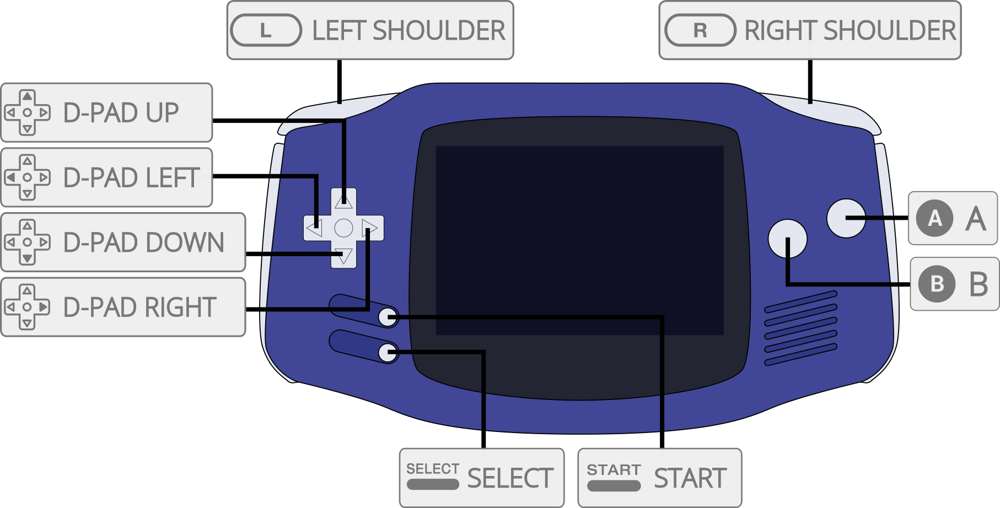

# Nintendo - Game Boy Advance (mGBA)

## Background

mGBA is an emulator for running Game Boy Advance games. It aims to be faster and more accurate than many existing Game Boy Advance emulators, as well as adding features that other emulators lack. It also supports Game Boy and Game Boy Color games.

The mGBA core has been authored by

- endrift

The mGBA core is licensed under

- [MPLv2.0](https://github.com/libretro/mgba/blob/master/LICENSE)

A summary of the licenses behind RetroArch and its cores can be found [here](../development/licenses.md).

## BIOS

Required or optional firmware files go in the frontend's system directory.

!!! warning
	In order for the BIOS to be used, the 'Use BIOS file if found' core option must be set to On.

|   Filename   |    Description                   |              md5sum              |
|:------------:|:--------------------------------:|:--------------------------------:|
| gba_bios.bin | Game Boy Advance BIOS - Optional | a860e8c0b6d573d191e4ec7db1b1e4f6 |
| gb_bios.bin  | Game Boy BIOS - Optional         | 32fbbd84168d3482956eb3c5051637f5 |
| gbc_bios.bin | Game Boy Color BIOS - Optional   | dbfce9db9deaa2567f6a84fde55f9680 |
| sgb_bios.bin | Super Game Boy BIOS - Optional   | d574d4f9c12f305074798f54c091a8b4 |

## Extensions

Content that can be loaded by the mGBA core have the following file extensions:

- .gb
- .gbc
- .gba

RetroArch database(s) that are associated with the [Core name] core:

- [Nintendo - Game Boy](https://github.com/libretro/libretro-database/blob/master/rdb/Nintendo%20-%20Game%20Boy.rdb)
- [Nintendo - Game Boy Color](https://github.com/libretro/libretro-database/blob/master/rdb/Nintendo%20-%20Game%20Boy%20Color.rdb)
- [Nintendo - Game Boy Advance](https://github.com/libretro/libretro-database/blob/master/rdb/Nintendo%20-%20Game%20Boy%20Advance.rdb)

## Features

Frontend-level settings or features that the mGBA core respects.

| Feature           | Supported |
|-------------------|:---------:|
| Restart           | ✔         |
| Saves             | ✔         |
| States            | ✔         |
| Rewind            | ✔         |
| Netplay           | ✕         |
| Core Options      | ✔         |
| RetroAchievements | ✔         |
| RetroArch Cheats  | ✔         |
| [RetroArch SaveRAM Autosave Interval support](https://github.com/libretro/RetroArch/issues/16323#issuecomment-1977792161) | ✔ |
| Native Cheats     | ✕         |
| Controls          | ✔         |
| Remapping         | ✔         |
| Multi-Mouse       | ✕         |
| Rumble            | ✔         |
| Sensors           | ✕         |
| Camera            | ✕         |
| Location          | ✕         |
| Subsystem         | ✕         |
| [Softpatching](../guides/softpatching.md) | ✔         |
| Disk Control      | ✕         |
| Username          | ✕         |
| Language          | ✕         |
| Crop Overscan     | ✕         |
| LEDs              | ✕         |

## Directories

The mGBA core's library name is 'mGBA'

The mGBA core saves/loads to/from these directories.

**Frontend's Save directory**

| File  | Description            |
|:-----:|:----------------------:|
| *.srm | Cartridge battery save |

**Frontend's State directory**

| File     | Description |
|:--------:|:-----------:|
| *.state# | State       |

## Geometry and timing

- The mGBA core's core provided FPS is [FPS]
- The mGBA core's core provided sample rate is 32768 Hz
- The mGBA core's base width is [Base width]
- The mGBA core's base height is [Base height]
- The mGBA core's max width is [Max width]
- The mGBA core's max height is [Max height]
- The mGBA core's core provided aspect ratio is [Aspect ratio]

## Core options

The mGBA core has the following option(s) that can be tweaked from the core options menu. The default setting is bolded.

Settings with (Restart) means that core has to be closed for the new setting to be applied on next launch.

- **Solar sensor level** [mgba_solar_sensor_level] (**0**|1|2|3|4|5|6|7|8|9|10)

	Can be used by games that employed the use of a solar sensor on their cartridges. E.g.: Boktai games.

- **Allow opposing directional input** [mgba_allow_opposing_directions] (**OFF**|ON)

	Allows opposing directional inputs. Up with Down. Right with Left.

- **Game Boy model (requires restart)** [mgba_gb_model] (**Autodetect**|Game Boy|Super Game Boy|Game Boy Color|Game Boy Advance)

	Runs loaded content with a specific Game Boy model.

	Autodetect will select the most appropriate model for the current game.

- **Use BIOS file if found** [mgba_use_bios] (**ON**|OFF)

	Uses BIOS present in RetroArch's system directory. Look at the [BIOS section](#bios) for more information.

- **Skip BIOS intro** [mgba_skip_bios] (**OFF**|ON)

	**The 'Use BIOS file if found' core option must be set to On for proper operation.**

	Skips the BIOS intro when a BIOS is present in RetroArch's system directory is used.

??? note "Skip BIOS intro - Off"
    

- **Use Super Game Boy borders (requires restart)** [mgba_sgb_borders] (**ON**|OFF)

	Display Super Game Boy borders for Super Game Boy enhanced games.

- **Idle loop removal** [mgba_idle_optimization] (**Remove Known**|Detect and Remove|Don't Remove)

	Optimizes game performance by driving the GBA's CPU less hard.

	Use this on low-powered hardware if its struggling with game performance.

- **Frameskip** [mgba_frameskip] (**0**|1|2|3|4|5|6|7|8|9|10)

	Choose how much frames should be skipped to improve performance at the expense of visual smoothness.

## Rumble

Rumble only works in the mGBA core when

- The content being ran has rumble support. (e.g. Cartridges with a Rumble Pak)
- The frontend being used has rumble support.
- The joypad device being used has rumble support.

## Joypad

| User 1 input descriptors | RetroPad Inputs                             |
|--------------------------|---------------------------------------------|
| B                        |           |
| Turbo B                  |           |
| Select                   |      |
| Start                    |       |
| Up                       |     |
| Down                     |   |
| Left                     |   |
| Right                    |  |
| A                        |           |
| Turbo A                  |           |
| L                        |          |
| R                        |          |
| Turbo L                  |          |
| Turbo R                  |          |
| Darken Solar Sensor      |          |
| Brighten Solar Sensor    |          |

## Compatibility

Please file game bugs on the issue tracker [here](https://github.com/mgba-emu/mgba/issues)

## External Links

- [Official mGBA Website](https://mgba.io/)
- [Official mGBA Github Repository](https://github.com/mgba-emu/mgba)
- [Libretro mGBA Core info file](https://github.com/libretro/libretro-super/blob/master/dist/info/mgba_libretro.info)
- [Libretro mGBA Github Repository](https://github.com/libretro/mgba)
- [Report Libretro mGBA Core Issues Here](https://github.com/mgba-emu/mgba/issues)
- [Gameplay Videos](https://www.youtube.com/playlist?list=PLRbgg4gk_0Id2gXuMPiXpnjQmDuvg7Wli)

### See also

#### Nintendo - Game Boy Advance

- [Nintendo - Game Boy Advance (Beetle GBA)](beetle_gba.md)
- [Nintendo - Game Boy Advance (gpSP)](gpsp.md)
- [Nintendo - Game Boy Advance (Meteor)](meteor.md)
- [Nintendo - Game Boy Advance (VBA Next)](vba_next.md)
- [Nintendo - Game Boy Advance (VBA-M)](vba_m.md)

#### Nintendo - Game Boy (+ Color)

- [Nintendo - Game Boy / Color (Emux GB)](emux_gb.md)
- [Nintendo - Game Boy / Color (Gambatte)](gambatte.md)
- [Nintendo - Game Boy / Color (Gearboy)](gearboy.md)
- [Nintendo - Game Boy / Color (SameBoy)](sameboy.md)
- [Nintendo - Game Boy / Color (TGB Dual)](tgb_dual.md)
- [Nintendo - SNES / Famicom (higan Accuracy)](higan_accuracy.md)
- [Nintendo - SNES / Famicom (nSide Balanced)](nside_balanced.md)
- [Nintendo - SNES / Famicom (Mesen-S)](mesen-s.md)
