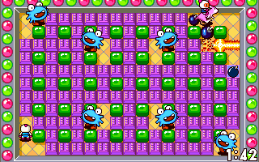

# Mr.Boom (Bomberman)

## Background

Mr.Boom is an up to 8 player Bomberman clone for LibRetro/RetroArch.

The goal of the game is to bomb away your enemies and other players.

### Author(s):

Remdy Software 

## Contribute to this documentation

In order to propose improvements to this document, [visit it's corresponding source page on github](https://github.com/libretro/docs/tree/master/docs/library/mr_boom.md). Changes are proposed using "Pull Requests."

## License

MIT

## Extensions

The Mr.Boom core does not feature extension use. Just load and start the core.

## Features

| Feature           | Supported |
|-------------------|:---------:|
| Saves             | ✕         |
| States            | ✔         |
| Rewind            | ✔         |
| Netplay           | ✔         |
| RetroAchievements | ✕         |
| RetroArch Cheats  | ✕         |
| Native Cheats     | ✕         |
| Controllers       | ✔         |
| Remapping         | ✕         |
| Multi-Mouse       | ✕         |
| Rumble            | ✕         |
| Sensors           | ✕         |
| Camera            | ✕         |
| Location          | ✕         |
| Subsystem         | ✕         |

The Mr.Boom core's directory name is 'Mr.Boom'

Save states are saved/loaded to and from where state files are stored. 

## Core options

*The Mr.Boom core has the following option(s) that can be tweaked from the core options menu. The default setting is bolded.*

- **Team mode** (**Selfie**/Color/Sex): Team mode color.

- **Monsters** (Off/**On**): Awaiting description. Enable or disable monsters.

??? note "Monsters - On"
	
	
??? note "Monsters - Off"
		

- **Drop bomb autofire** (**Off**/On): Enables Drop bomb autofire mode. Holding down the Drop bomb button will repeatedly use the Drop bomb action. (Potentially useful when used in conjunction with certain powerups)

## Controllers

*The Mr.Boom core supports the following controller setting(s), bolded controller settings are the default for the specified user(s):*

### User 1 - 16 Device Type(s)

* **RetroPad** - Joypad with analog

* RetroPad w/Analog - **There is no reason to switch to this.**

### Controllers graph

| RetroPad Inputs                                | Mr.Boom core inputs |
|------------------------------------------------|---------------------|
|              | Drop Bomb/Join game                         |
|         | Add a bomberman bot (while in the join game screen)                         |
|          | Start game                         |
|        | Up/Push bomb                         |
|      | Down/Push bomb                         |
|      | Left/Push bomb                         |
|     | Right/Push bomb                         |
|              | Detonate bomb (when you have the Remote control power)/Join game                         |
|              | Jump (while riding a Kangaroo)/Join game)                         |

## External Links

* [Libretro Repository](https://github.com/libretro/mrboom-libretro)
* [Report Core Issues Here](https://github.com/libretro/libretro-meta)
* [Official Website](http://mrboom.mumblecore.org/)
* [Upstream Repository](https://github.com/Javanaise/mrboom-libretro)