# Nintendo - NES / Famicom (Nestopia)

## Background

Nestopia is a cycle accurate emulator for the NES/Famicom.
This is the libretro port of the Nestopia emulator, based on the de facto
upstream Nestopia JG fork.

The core also plays NSF music files, with an on-screen display and transport controls.

### Author/License

The Nestopia core has been authored by

- Martin Freij
- Nestopia UE Contributors
- [Rupert Carmichael (carmiker)](https://github.com/carmiker)

The Nestopia core is licensed under

- [GPLv2](https://github.com/libretro/nestopia/blob/master/COPYING)

A summary of the licenses behind RetroArch and its cores can be found [here](../development/licenses.md).

## Extensions

Content that can be loaded by the Nestopia core have the following file extensions:

- .nes
- .fds
- .unf
- .unif
- .nsf

## Databases

RetroArch database(s) that are associated with the Nestopia core:

- [Nintendo - Nintendo Entertainment System](https://github.com/libretro/libretro-database/blob/master/rdb/Nintendo%20-%20Nintendo%20Entertainment%20System.rdb)
- [Nintendo - Family Computer Disk System](https://github.com/libretro/libretro-database/blob/master/rdb/Nintendo%20-%20Family%20Computer%20Disk%20System.rdb)

## BIOS

Required or optional firmware files go in the frontend's system directory.

!!! warning
	Prior to version 1.50, it required the [NstDatabase.xml](#nstdatabasexml) file for general proper emulation. In version 1.50 or higher, it's baked into the core.

|   Filename      |    Description                                                                |              md5sum              |
|:---------------:|:-----------------------------------------------------------------------------:|:--------------------------------:|
| disksys.rom     | Family Computer Disk System BIOS - Required for Famicom Disk System emulation | ca30b50f880eb660a320674ed365ef7a |

### ADPCM samples

A handful of games have ADPCM audio samples on the cartridge which are not part of the ROM data. To use them, extract the samples into subdirectories of `nestopia/samples` in the frontend's system directory, named after the MAME-format .zip file:

| Sample set   | Location                              |
|:------------:|:-------------------------------------:|
| moepro.zip   | system/nestopia/samples/moepro/       |
| moepro88.zip | system/nestopia/samples/moepro88/     |
| mptennis.zip | system/nestopia/samples/mptennis/     |
| terao.zip    | system/nestopia/samples/terao/        |
| ftaerobi.zip | system/nestopia/samples/ftaerobi/     |

## Features

Frontend-level settings or features that the Nestopia core respects.

| Feature           | Supported |
|-------------------|:---------:|
| Restart           | ✔         |
| Screenshots       | ✔         |
| Saves             | ✔         |
| States            | ✔         |
| Rewind            | ✔         |
| Netplay           | ✔         |
| Core Options      | ✔         |
| [Memory Monitoring (achievements)](../guides/memorymonitoring.md) | ✔         |
| RetroArch Cheats  | ✔         |
| Native Cheats     | ✕         |
| Controls          | ✔         |
| Remapping         | ✔         |
| Multi-Mouse       | ✕         |
| Rumble            | ✕         |
| Sensors           | ✕         |
| Camera            | ✕         |
| Location          | ✕         |
| Subsystem         | ✕         |
| [Softpatching](../guides/softpatching.md) | ✔         |
| Disk Control      | ✕         |
| Username          | ✕         |
| Language          | ✕         |
| Crop Overscan     | ✕         |
| LEDs              | ✕         |

!!! note
	FDS disks are swapped with the '(FDS) Disk Side Change' and '(FDS) Eject Disk' buttons rather than through the frontend's Disk Control interface.

### Directories

The Nestopia core's internal core name is 'Nestopia'

The Nestopia core saves/loads to/from these directories.

**Frontend's Save directory**

- 'content-name'.srm (Cartridge battery save)
- 'content-name'.sav / .ups / .ips (Famicom Disk System save, extension depends on the ['FDS Savefile Format' core option](#core-options))

**Frontend's State directory**

- 'content-name'.state# (State)

**Frontend's System directory**

- custom.pal (Custom palette file)
- NstDatabase.xml (Optional external database, overrides the baked-in one)
- nestopia/samples/ (ADPCM sample sets)

### Geometry and timing

- The Nestopia core's core provided FPS is 60.098814 for NTSC and 50.006979 for PAL and Dendy
- The Nestopia core's core provided sample rate is 48000 Hz
- The Nestopia core's core provided aspect ratio is dependent on the ['Preferred Aspect Ratio' core option](#core-options).

### NstDatabase.xml

The Nestopia core relies on the internal database (built from the NstDatabase.xml file) for

- Games that support a custom mapper
- Games that support multitap accessories
- Games that support the Zapper
- ROM Hacks
- Famicom Disk System games
- General proper emulation of games

The database is baked into the core. If an NstDatabase.xml file is present in the frontend's system directory, it is loaded instead of the baked-in copy.

### Custom color palettes

To use custom color palettes in the Nestopia core, the custom color palette file you want to use must be in RetroArch's system directory.

Make sure the custom palette file is named 'custom.pal'

Also, the 'Palette' core option must be set to Custom. If no custom.pal is found, the core falls back to the Royaltea palette.

Custom color palettes for the NES can be generated with either of these tools.

- [Bisqwit's NTSC NES palette generator](http://bisqwit.iki.fi/utils/nespalette.php)
- [Drag's NTSC NES palette generator](http://drag.wootest.net/misc/palgen.html)

### NSF playback

When an .nsf file is loaded, the core displays the track title, copyright, artist, track number and an oscilloscope, and User 1 controls playback:

| NSF transport | RetroPad Input                              |
|---------------|---------------------------------------------|
| Play          |           |
| Stop          |           |
| Previous song |   |
| Next song     |  |

## Core options

The Nestopia core has the following option(s) that can be tweaked from the core options menu. The default setting is bolded.

Settings with (Restart) means that core has to be closed for the new setting to be applied on next launch.

Options are grouped into **System**, **Video**, **Audio**, **Input** and **Emulation Hacks** categories.

### System

- **Favored System (Restart)** [nestopia_favored_system] (**NTSC**|PAL|Famicom|Dendy)

	System to prefer for images that do not say which one they want. Images that do say, and images found in the NstDatabase.xml database file, are unaffected. Only applies while 'Force System' is set to 'Auto'.

- **Force System** [nestopia_force_system] (**Auto**|NTSC|PAL|Famicom|Dendy)

	Ignore the system the image asks for and use this one instead. Changing this setting will restart the game.

- **FDS Auto Insert** [nestopia_fds_auto_insert] (**enabled**|disabled)

	Automatically insert first FDS disk on reset.

- **FDS Savefile Format** [nestopia_fds_savefile_format] (**SAV + UPS (Default)**|UPS (Standalone Nestopia)|IPS (Mesen))

	Define which format will be used by savefiles generated for FDS games. Based on the format chosen, FDS savefiles might be used interchangeably with other cores and standalone emulators. It is recommended to use with caution, as improper handling may cause undesired overwrites, or deletion of the existing saves.

### Video

- **Blargg NTSC Filter** [nestopia_blargg_ntsc_filter] (disabled|**Composite Video**|S-Video|RGB SCART|Monochrome)

	Enable Blargg NTSC filters.

!!! attention "Disclaimer"
	These 'Blargg NTSC Filter' core option screenshots have been taken with the 'Palette' core option set to CXA2025AS (US).

??? note "Blargg NTSC Filter - Off"
	

??? note "Blargg NTSC Filter - Composite Video"
	

??? note "Blargg NTSC Filter - S-Video"
	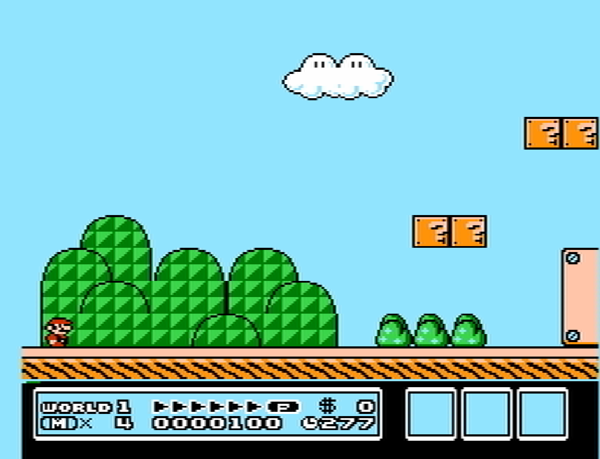

??? note "Blargg NTSC Filter - RGB SCART"
	

??? note "Blargg NTSC Filter - Monochrome"
	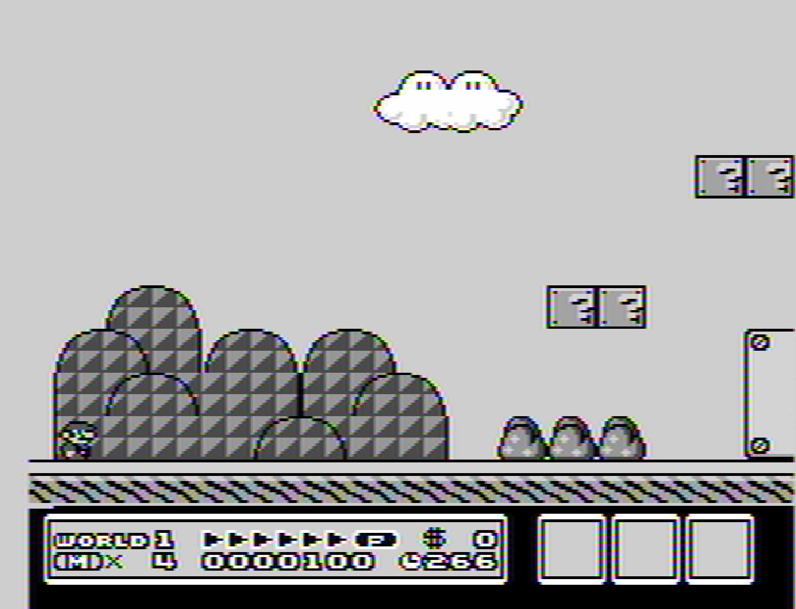

- **Palette** [nestopia_palette] (**Royaltea**|CXA2025AS (US)|CXA2025AS (JP)|Consumer|Canonical|Alternative|RGB|PAL|Digital Prime FBX|Magnum FBX|Smooth V2 FBX|Composite Direct FBX|PVM-style D93 FBX|NTSC hardware FBX|NES Classic FBx (fixed)|Restored Wii VC|Wii Virtual Console|Raw|Custom)

	Color palette to be used. If 'Custom' is selected, the palette used will be taken from the 'custom.pal' file placed in the RetroArch System/BIOS directory.

!!! attention "Disclaimer"
	These 'Palette' core option screenshots have been taken with the 'Blargg NTSC Filter' core option set to Off. Palettes added after these screenshots were taken are not pictured.

??? note "Palette - CXA2025AS (US)"
	

??? note "Palette - Consumer"
	

??? note "Palette - Canonical"
	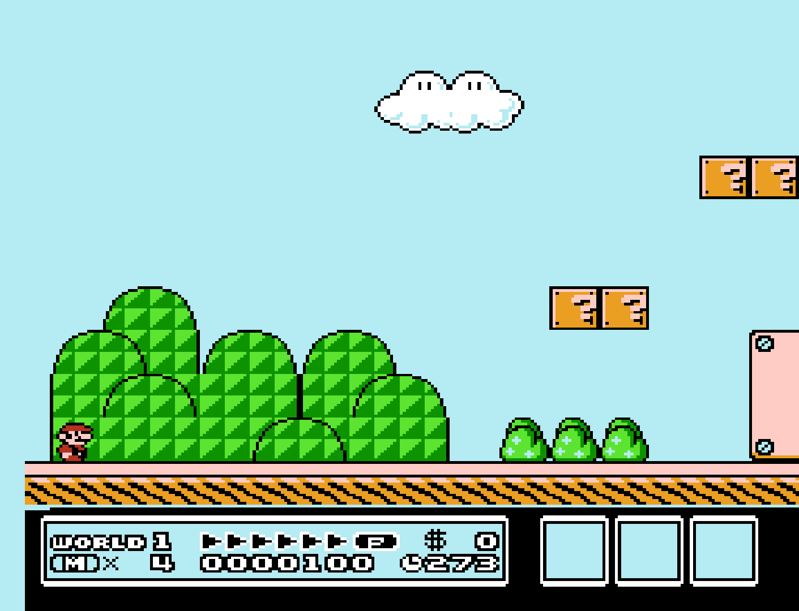

??? note "Palette - Alternative"
	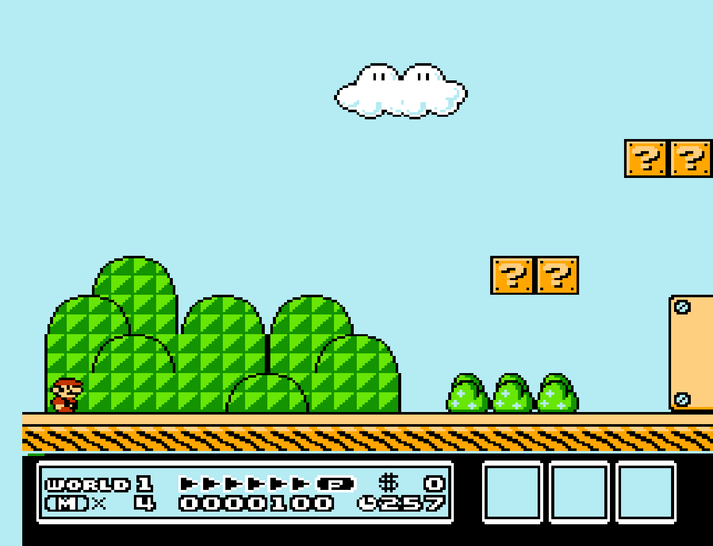

??? note "Palette - RGB"
	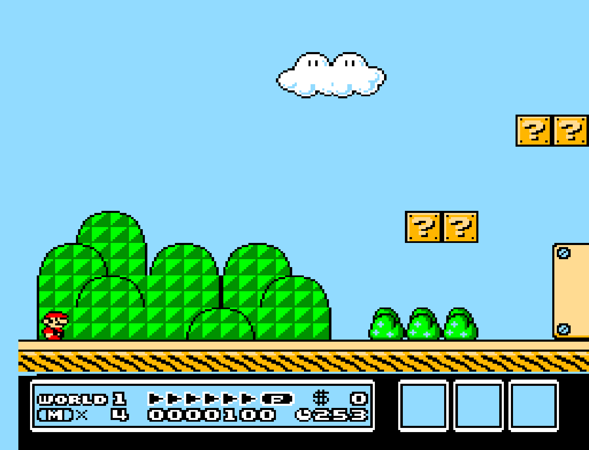

??? note "Palette - PAL"
	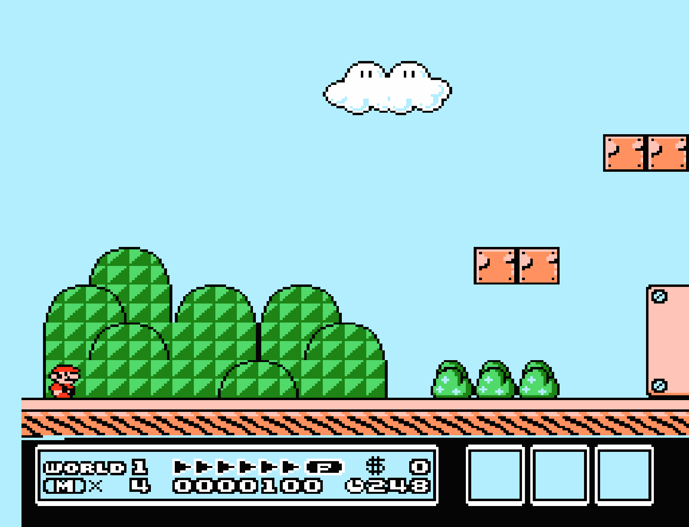

??? note "Palette - Composite Direct FBX"
	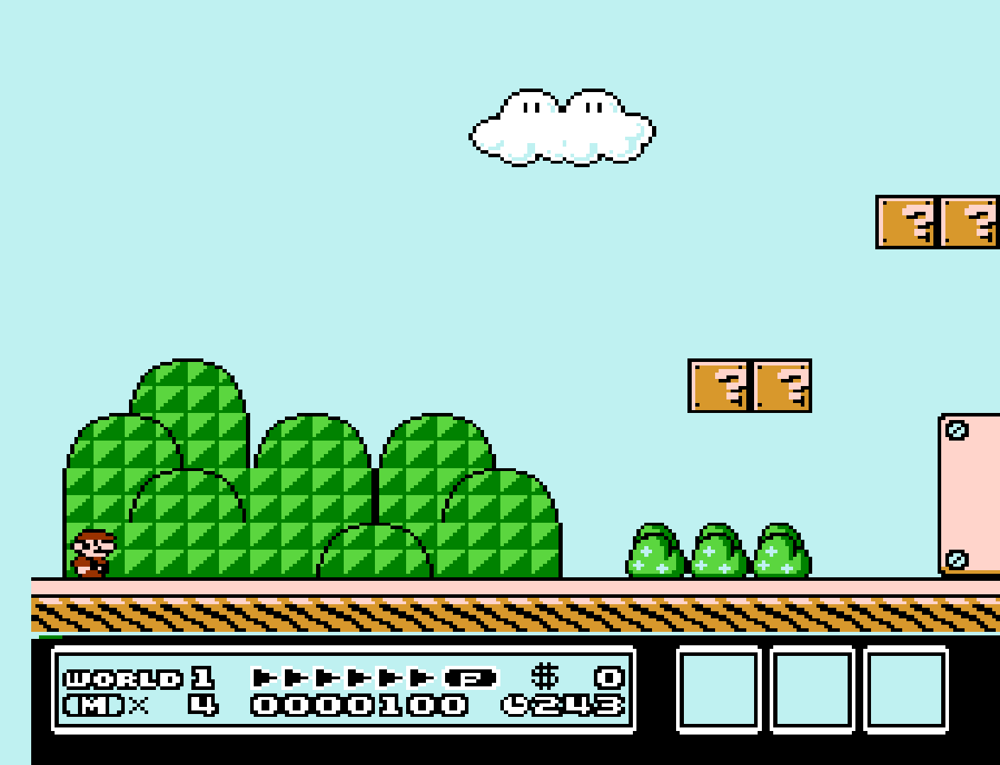

??? note "Palette - PVM-style D93 FBX"
	

??? note "Palette - NTSC hardware FBX"
	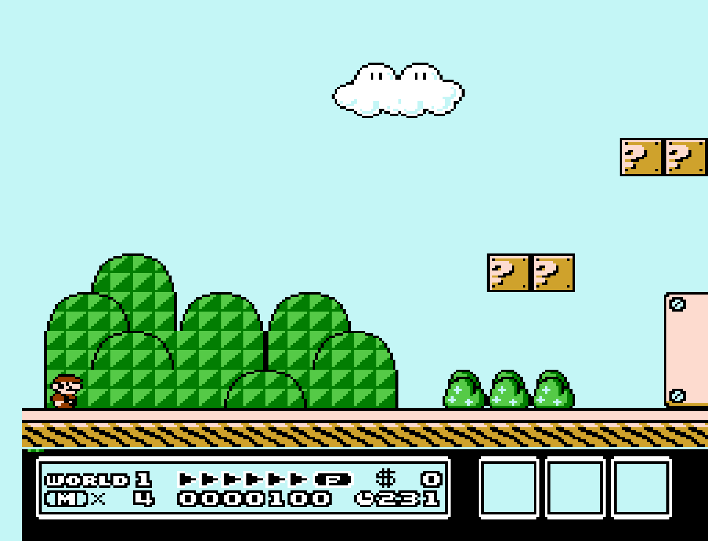

??? note "Palette - NES Classic FBx (fixed)"
	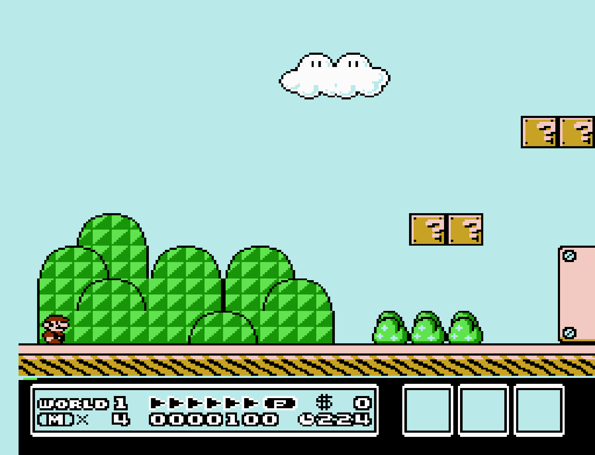

??? note "Palette - Raw"
	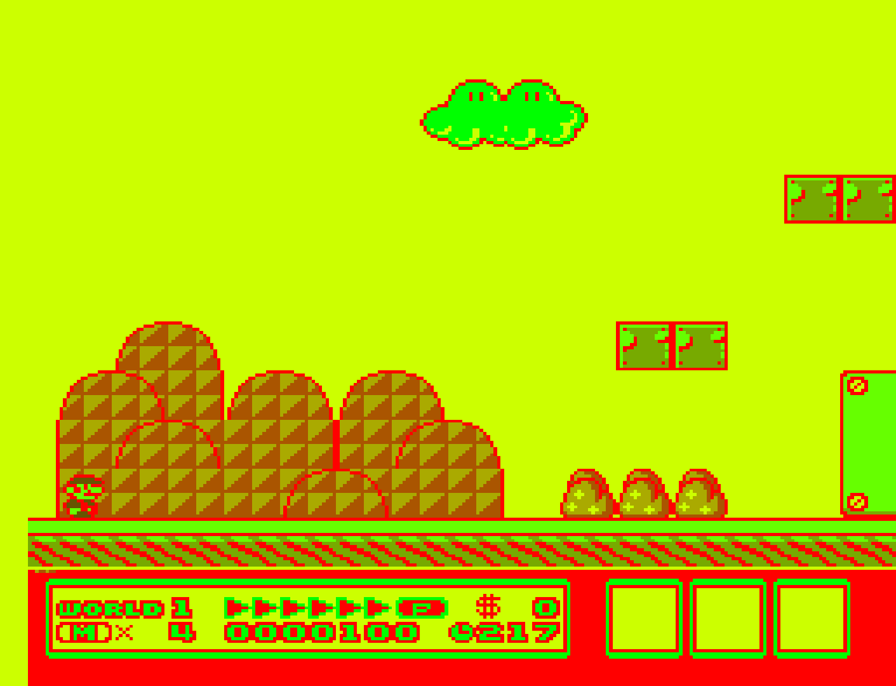

- **Mask Overscan (Top Vertical)** [nestopia_overscan_v_top] (0|1|2|...|**8**|...|24)

	Mask out (vertically) the potentially random glitchy video output that would have been hidden by the bezel around the edge of a standard-definition television screen.

- **Mask Overscan (Bottom Vertical)** [nestopia_overscan_v_bottom] (0|1|2|...|**8**|...|24)

	Mask out (vertically) the potentially random glitchy video output that would have been hidden by the bezel around the edge of a standard-definition television screen.

- **Mask Overscan (Left Horizontal)** [nestopia_overscan_h_left] (**0**|1|2|...|16)

	Mask out (horizontally) the potentially random glitchy video output that would have been hidden by the bezel around the edge of a standard-definition television screen.

- **Mask Overscan (Right Horizontal)** [nestopia_overscan_h_right] (**0**|1|2|...|16)

	Mask out (horizontally) the potentially random glitchy video output that would have been hidden by the bezel around the edge of a standard-definition television screen.

- **Preferred Aspect Ratio** [nestopia_aspect] (**Auto**|NTSC|PAL|4:3|Uncorrected)

	RetroArch's aspect ratio must be set to 'Core Provided' in the Video settings. 'Auto' will use the [NstDatabase.xml database file](#nstdatabasexml) for aspect ratio autodetection. If there is no database present, it will default to NTSC.

??? note "Preferred Aspect Ratio - NTSC"
	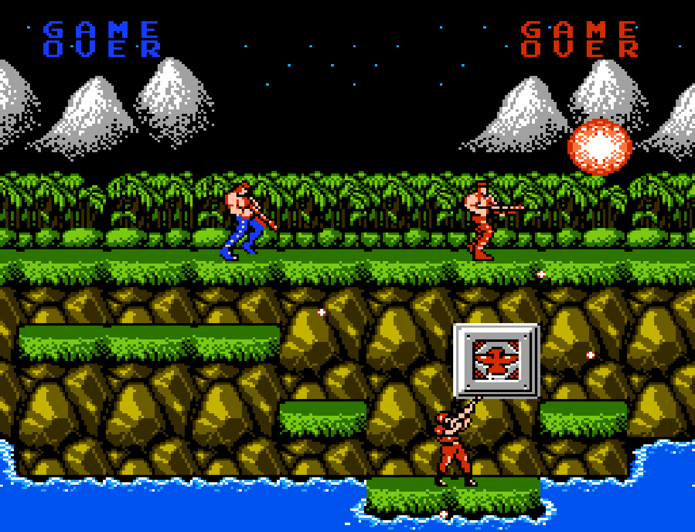

??? note "Preferred Aspect Ratio - PAL"
	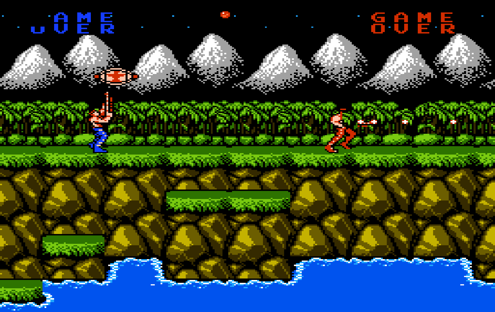

??? note "Preferred Aspect Ratio - 4:3"
	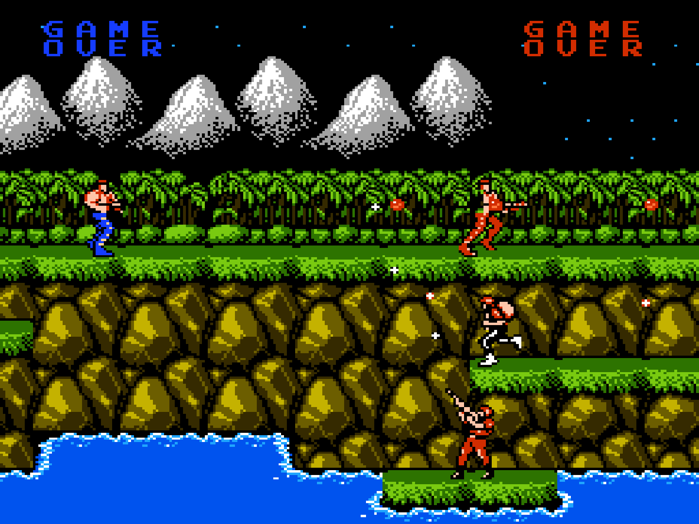

### Audio

- **Audio Output Filter** [nestopia_audio_filter] (**disabled**|enabled)

	Approximate the analog stage that follows the DAC on real hardware, by applying a first order 220Hz high pass and a first order 14kHz low pass to the mixed output. This removes the DC offset the mixer sits on and rolls off the extreme treble.

- **Show Advanced Audio Settings (Reopen menu)** [nestopia_show_advanced_av_settings] (**disabled**|enabled)

	Enable configuration of low-level audio channel parameters. The per-channel volume options below are hidden until this is enabled.

- **Square 1 Channel Volume %** [nestopia_audio_vol_sq1] (0|10|20|30|40|50|60|70|80|85|90|95|**100**)
- **Square 2 Channel Volume %** [nestopia_audio_vol_sq2] (0|10|20|30|40|50|60|70|80|85|90|95|**100**)
- **Triangle Channel Volume %** [nestopia_audio_vol_tri] (0|10|20|30|40|50|60|70|80|85|90|95|**100**)
- **Noise Channel Volume %** [nestopia_audio_vol_noise] (0|10|20|30|40|50|60|70|80|85|90|95|**100**)
- **DPCM Channel Volume %** [nestopia_audio_vol_dpcm] (0|10|20|30|40|50|60|70|80|85|90|95|**100**)
- **FDS Channel Volume %** [nestopia_audio_vol_fds] (0|10|20|30|40|50|60|70|80|85|90|95|**100**)
- **MMC5 Channel Volume %** [nestopia_audio_vol_mmc5] (0|10|20|30|40|50|60|70|80|85|90|95|**100**)
- **VRC6 Channel Volume %** [nestopia_audio_vol_vrc6] (0|10|20|30|40|50|60|70|80|85|90|95|**100**)
- **VRC7 Channel Volume %** [nestopia_audio_vol_vrc7] (0|10|20|30|40|50|60|70|80|85|90|95|**100**)
- **N163 Channel Volume %** [nestopia_audio_vol_n163] (0|10|20|30|40|50|60|70|80|85|90|95|**100**)
- **S5B Channel Volume %** [nestopia_audio_vol_s5b] (0|10|20|30|40|50|60|70|80|85|90|95|**100**)

	Modify the volume of the individual APU and expansion audio channels.

### Input

- **4 Player Adapter** [nestopia_select_adapter] (**Auto**|NTSC|Famicom)

	Manually select a 4 Player Adapter if needed. Some games will not recognize the adapter correctly through the NstDatabase.xml database, this option should help fix that.

- **Shift Buttons Clockwise** [nestopia_button_shift] (**disabled**|enabled)

	Rotate the A/B/X/Y buttons clockwise. When enabled, NES A moves to RetroPad B, NES B moves to RetroPad Y, and Turbo A/Turbo B move to RetroPad A/RetroPad X.

- **Arkanoid device** [nestopia_arkanoid_device] (**Mouse**|Pointer)

	Select the device you wish to use for the Arkanoid paddle.

- **Arkanoid Paddle Range** [nestopia_arkanoid_paddle_range] (**Combined range of both controllers (32-166)**|Arkanoid I controller range (46-166)|Arkanoid II controller range (32-153))

	Set the range for the Arkanoid paddle.

- **Zapper device** [nestopia_zapper_device] (**Light gun**|Mouse|Pointer)

	Select the device you wish to use for the Zapper.

- **Show Crosshair** [nestopia_show_crosshair] (disabled|**enabled**)

	Set whether to show the crosshair when the Zapper is used.

- **Turbo Pulse Speed** [nestopia_turbo_pulse] (1|**2**|3|4|5|6|7|8|9)

	Set the turbo pulse speed for the Turbo B and Turbo A buttons.

### Emulation Hacks

- **Remove Sprite Limit** [nestopia_nospritelimit] (**disabled**|enabled)

	Remove 8-sprites-per-scanline hardware limit.

- **DMC Pop Reducer** [nestopia_dmc_pop_reducer] (**disabled**|enabled)

	Halve large direct writes to the DMC level, which are otherwise heard as clicks. Inaccurate, and quietens samples streamed through $4011 as large swings.

- **Game Genie Sound Distortion** [nestopia_genie_distortion] (**disabled**|enabled)

	The Game Genie cheat device could inadvertently introduce sound distortion in games. By enabling this, you can simulate the distortion it would add to a game's sound.

- **RAM Power-on State** [nestopia_ram_power_state] (**0x00**|0xFF|Random)

	RAM values on power up. Some games rely on initial RAM values for random number generation as an example.

## Controllers

The Nestopia core supports the following device type(s) in the controls menu, bolded device types are the default for the specified user(s):

### User 1 - 4 device types

- **Auto** - Automatically detects the device to use based on the internal database.
- Gamepad - Joypad

### User 2 additional device types

- Arkanoid - Arkanoid paddle - This should be automatic from the internal database, but this can be changed to Gamepad if you'd prefer using a joypad rather than a paddle. Whether the paddle reads a mouse or a pointer is set by the ['Arkanoid device' core option](#core-options). (Port 2 only)
- Zapper - Lightgun - The Nestopia core can emulate Zapper inputs. This is generally done automatically based off of the internal database, but can be manually selected as a device type. Whether the Zapper reads a light gun, a mouse or a pointer is set by the ['Zapper device' core option](#core-options). (Port 2 only)

### Multitap support

The Nestopia core uses the internal database to detect which games have multitap support.

### Controller tables

#### Joypad

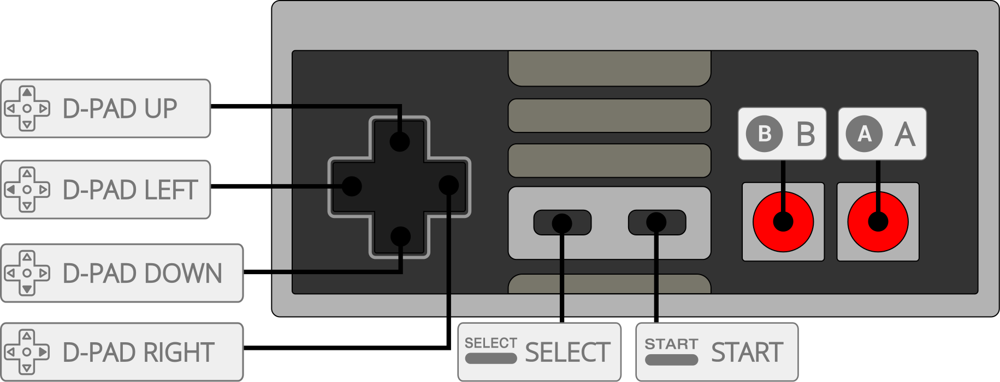

| User 1 Remap descriptors | RetroPad Inputs                             |
|--------------------------|---------------------------------------------|
| B                        |           |
| Turbo B                  |           |
| Select                   |      |
| Start                    |       |
| D-Pad Up                 |     |
| D-Pad Down               |   |
| D-Pad Left               |   |
| D-Pad Right              |  |
| A                        |           |
| Turbo A                  |           |
| (FDS) Disk Side Change   |          |
| (FDS) Eject Disk         |          |
| (VSSystem) Coin 1        |          |
| (VSSystem) Coin 2        |          |
| (Famicom) Microphone     |          |

| User 2 - 4 Remap descriptors | RetroPad Inputs                             |
|------------------------------|---------------------------------------------|
| B                            |           |
| Turbo B                      |           |
| Select                       |      |
| Start                        |       |
| D-Pad Up                     |     |
| D-Pad Down                   |   |
| D-Pad Left                   |   |
| D-Pad Right                  |  |
| A                            |           |
| Turbo A                      |           |
| (FDS) Disk Side Change       |          |
| (FDS) Eject Disk             |          |

#### Lightgun

| RetroLightgun Inputs                                   | Zapper           |
|--------------------------------------------------------|------------------|
|  Gun Crosshair | Zapper Crosshair |
| Gun Trigger                                            | Zapper Trigger   |
| Gun Reload                                             | Zapper Off-screen Shot |

## Compatibility

The Nestopia core is compatible with 100% of officially released titles, and the vast majority of homebrew and hacks.

## External Links

- [Upstream Nestopia JG Repository](https://gitlab.com/jgemu/nestopia)
- [Libretro Nestopia Core info file](https://github.com/libretro/libretro-super/blob/master/dist/info/nestopia_libretro.info)
- [Libretro Nestopia Github Repository](https://github.com/libretro/nestopia)
- [Report Libretro Nestopia Core Issues Here](https://github.com/libretro/nestopia/issues)

### See also

#### Nintendo - Family Computer Disk System

- [Nintendo - NES / Famicom (FCEUmm)](fceumm.md)
- [Nintendo - NES / Famicom (Mesen)](mesen.md)

#### Nintendo - Nintendo Entertainment System

- [Nintendo - NES / Famicom (bnes)](bnes.md)
- [Nintendo - NES / Famicom (Emux NES)](emux_nes.md)
- [Nintendo - NES / Famicom (FCEUmm)](fceumm.md)
- [Nintendo - NES / Famicom (Mesen)](mesen.md)
- [Nintendo - NES / Famicom (QuickNES)](quicknes.md)
