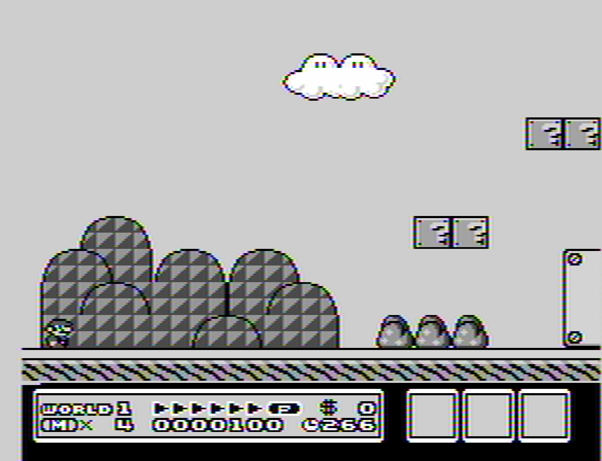
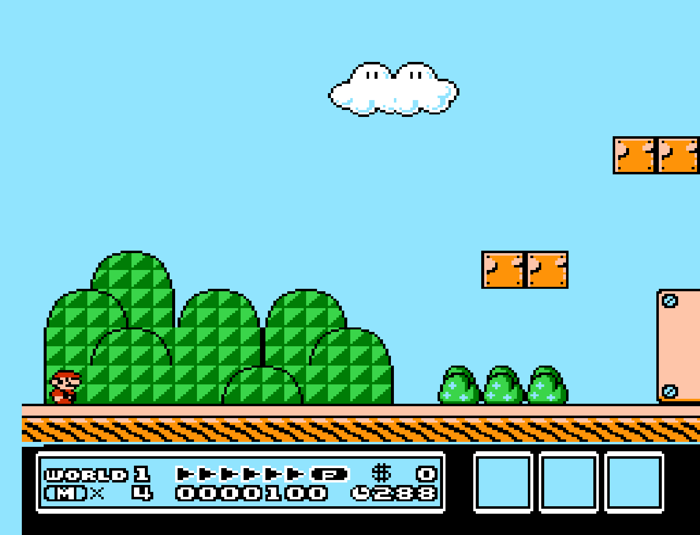
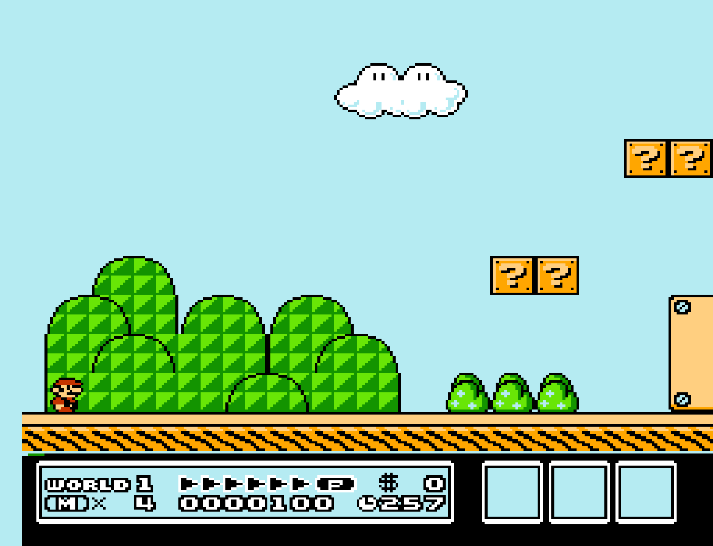
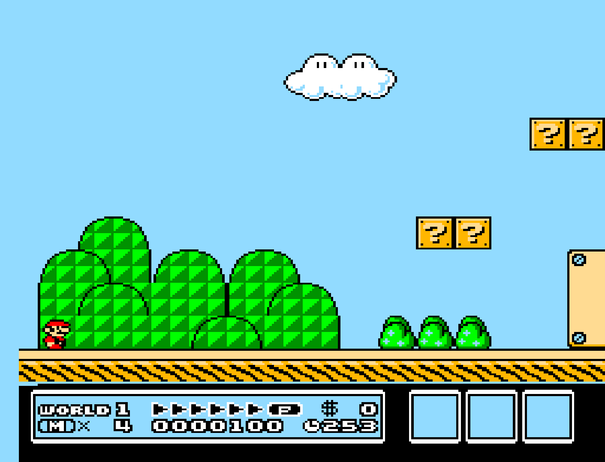
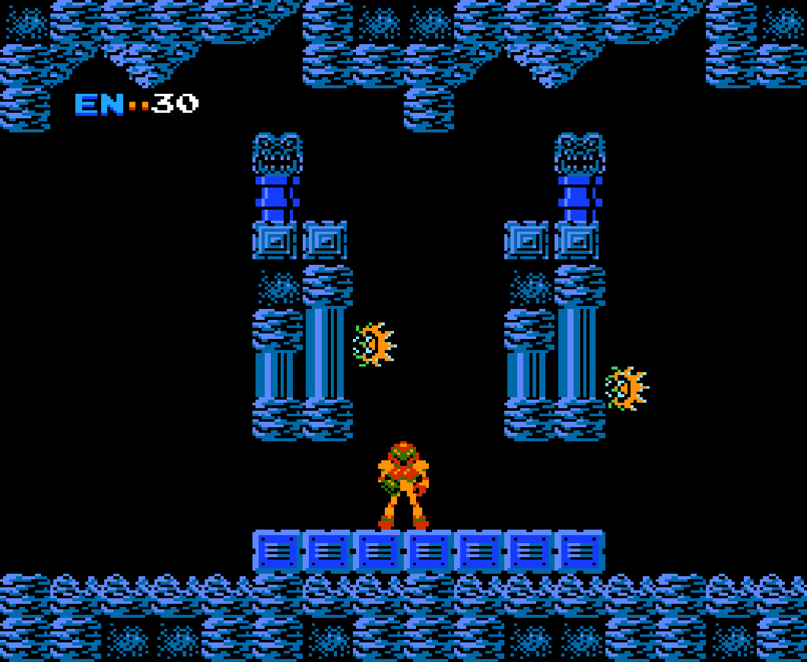
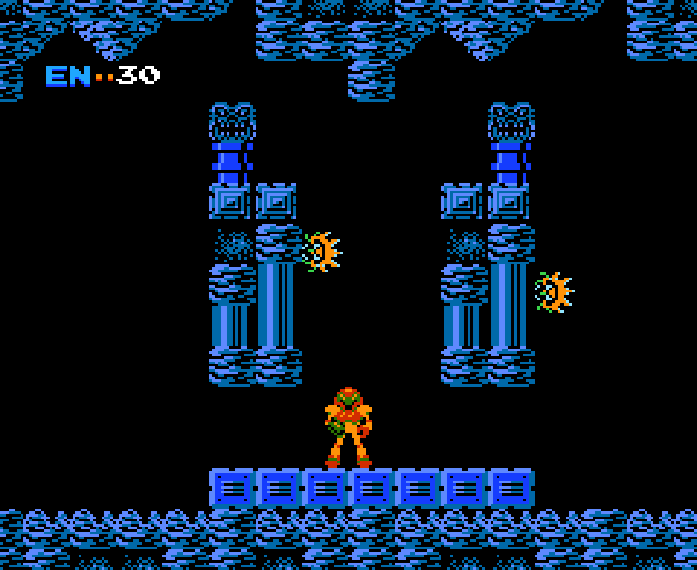
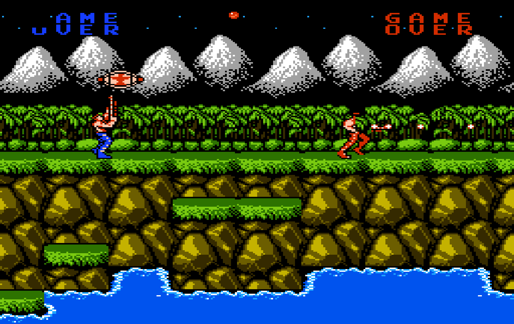

# Nintendo - NES / Famicom (Nestopia UE)

## Background

Nestopia is a portable and cycle-accurate NES/Famicom emulator written in C++. Nestopia UE (Undead Edition) is a fork of the original source code, with enhancements from members of the emulation community. This includes support for new platforms, and bug fixes in the emulator core. 

### Author/License

The Nestopia UE core has been authored by

- Martin Freij
- R. Belmont
- R. Danbrook

The Nestopia UE core is licensed under

- [GPLv2](https://github.com/libretro/nestopia/blob/master/COPYING)

A summary of the licenses behind RetroArch and its cores have found [here](https://docs.libretro.com/tech/licenses/).

## Extensions

Content that can be loaded by the Nestopia UE core have the following file extensions:

- .nes
- .fds
- .unf
- .unif

## Databases

RetroArch database(s) that are associated with the Nestopia UE core:

- [Nintendo - Nintendo Entertainment System](https://github.com/libretro/libretro-database/blob/master/rdb/Nintendo%20-%20Nintendo%20Entertainment%20System.rdb)
- [Nintendo - Family Computer Disk System](https://github.com/libretro/libretro-database/blob/master/rdb/Nintendo%20-%20Family%20Computer%20Disk%20System.rdb)

## BIOS

Required or optional firmware files go in the frontend's system directory.

!!! warning
	Nestopia UE requires the NstDatabase.xml for general proper emulation. Make sure it's in RetroArch's system directory.
	
|   Filename      |    Description                                                                |              md5sum              |
|:---------------:|:-----------------------------------------------------------------------------:|:--------------------------------:|
| [NstDatabase.xml](https://docs.libretro.com/library/nestopia_ue/index.html#nstdatabasexml) | Nestopia UE Database file - Required  |
| disksys.rom     | Family Computer Disk System BIOS - Required for Famicom Disk System emulation | ca30b50f880eb660a320674ed365ef7a |

## Features

Frontend-level settings or features that the Nestopia UE core respects.

| Feature           | Supported |
|-------------------|:---------:|
| Restart           | ✔         |
| Screenshots       | ✔         |
| Saves             | ✔         |
| States            | ✔         |
| Rewind            | ✔         |
| Netplay           | ✔         |
| Core Options      | ✔         |
| RetroAchievements | ✕         |
| RetroArch Cheats  | ✔         |
| Native Cheats     | ✕         |
| Controls          | ✔         |
| Remapping         | ✔         |
| Multi-Mouse       | ✕         |
| Rumble            | ✕         |
| Sensors           | ✕         |
| Camera            | ✕         |
| Location          | ✕         |
| Subsystem         | ✕         |
| [Softpatching](https://docs.libretro.com/guides/softpatching/) | ✔         |
| Disk Control      | ✕         |
| Username          | ✕         |
| Language          | ✕         |
| Crop Overscan     | ✕         |
| LEDs              | ✕         |

### Directories

The Nestopia UE core's internal core name is 'Nestopia'

The Nestopia UE core saves/loads to/from these directories.

**Frontend's Save directory**

- 'content-name'.srm (Cartridge battery save)

**Frontend's State directory**

- 'content-name'.state# (State)

**Frontend's System directory**

- custom.pal (Custom palette file)

### Geometry and timing

- The Nestopia UE core's core provided FPS is (FPS)
- The Nestopia UE core's core provided sample rate is 44100 Hz
- The Nestopia UE core's core provided aspect ratio is dependent on the ['Preferred aspect ratio' core option](https://docs.libretro.com/library/nestopia_ue/#core-options).

### NstDatabase.xml

**It is HIGHLY RECOMMENDED you have NstDatabase.xml in RetroArch's system directory, you can get it from [https://github.com/0ldsk00l/nestopia](https://github.com/0ldsk00l/nestopia)**

The Nestopia UE core relies on the NstDatabase.xml database file for 

- Games that support a custom mapper
- Games that support multitap accessories
- Games that support the Zapper
- ROM Hacks
- Famicom Disk System games
- General proper emulation of games

**Many games will have issues if NstDatabase.xml is not present in RetroArch's system directory.**

### Custom color palettes

To use custom color palettes in the Nestopia UE core, the custom color palette file you want to use must be in RetroArch's system directory. 

Make sure the custom palette file is named 'custom.pal'

Also, the 'Palette' core option must be set to custom.

Custom color palettes for the NES can be generated with either of these tools.

- [Bisqwit's NTSC NES palette generator](http://bisqwit.iki.fi/utils/nespalette.php)
- [Drag's NTSC NES palette generator](http://drag.wootest.net/misc/palgen.html)

## Core options

The Nestopia UE core has the following option(s) that can be tweaked from the core options menu. The default setting is bolded. 

Settings with (Restart) means that core has to be closed for the new setting to be applied on next launch.

- **Blargg NTSC filter** [nestopia_blargg_ntsc_filter] (**disabled**|composite|svideo|rgb|monochrome)

	Enable Blargg NTSC filters.
	
!!! attention "Disclaimer"
	These 'Blargg NTSC filter' core option screenshots have been taken with the 'Palette' core option set to cxa2025as.
	
??? note "Blargg NTSC filter - Off"
	
	
??? note "Blargg NTSC filter - composite"
	

??? note "Blargg NTSC filter - svideo"
	

??? note "Blargg NTSC filter - rgb"
	

??? note "Blargg NTSC filter - monochrome"
		
	
- **Palette** [nestopia_palette] (**cxa2025as**|consumer|canonical|alternative|rgb|pal|composite-direct-fbx|pvm-style-d93-fbx|ntsc-hardware-fbx|nes-classic-fbx-fs|raw|custom)

	Choose which color palette is going to be used.
	
!!! attention "Disclaimer"
	These 'Palette' core option screenshots have been taken with the 'Blargg NTSC filter' core option set to Off.
	
??? note "Palette - cxa2025as"
	

??? note "Palette - consumer"
	

??? note "Palette - canonical"
	
	
??? note "Palette - alternative"
	

??? note "Palette - rgb"
	

??? note "Palette - pal"
	

??? note "Palette - composite-direct-fbx"
	

??? note "Palette - pvm-style-d93-fbx"
	

??? note "Palette - ntsc-hardware-fbx"
	

??? note "Palette - nes-classic-fbx-fs"
	

??? note "Palette - raw"
	
	
- **Remove 8-sprites-per-scanline hardware limit** [nestopia_nospritelimit] (**disabled**|enabled)

	Self-explanatory.
	
- **CPU Speed (Overclock)** [nestopia_overclock] (**1x**|2x)

	Overclock the emulated CPU.
	
- **4 Player Adapter** [nestopia_select_adapter] (**auto**|ntsc|famicom)

	Manually select a 4 Player Adapter if needed. Some games will not recognize the adapter correctly through the NstDatabase.xml database, this option should help fix that.
	
- **Automatically insert first FDS disk on reset** [nestopia_fds_auto_insert] (**enabled**|disabled)

	Self-explanatory.
	
- **Mask Overscan (Vertical)** [nestopia_overscan_v] (**enabled**|disabled)

	Mask out (vertically) the potentially random glitchy video output that would have been hidden by the bezel around the edge of a standard-definition television screen.
	
??? note "Mask Overscan (Vertical) - On"
	
	
??? note "Mask Overscan (Vertical) - Off"
		

- **Mask Overscan (Horizontal)** [nestopia_overscan_h] (**disabled**|enabled)

	Mask out (horizontally) the potentially random glitchy video output that would have been hidden by the bezel around the edge of a standard-definition television screen.
	
??? note "Mask Overscan (Horizontal) - Off"
	
	
??? note "Mask Overscan (Horizontal) - On"
		

- **Preferred aspect ratio** [nestopia_aspect] (**auto**|ntsc|pal|4:3)

	Choose the preferred aspect ratio. RetroArch's aspect ratio must be set to Core provided in the Video seetings. 'auto' will use the [NstDatabase.xml](https://docs.libretro.com/library/nestopia_ue/index.html#nstdatabasexml) database file for aspect ratio autodetection. If there is no database present it will default to NTSC for 'auto'.
	
??? note "Preferred aspect ratio - ntsc"
	
	
??? note "Preferred aspect ratio - pal"
	
	
??? note "Preferred aspect ratio - 4:3"
		

- **Game Genie Sound Distortion** [nestopia_genie_distortion] (**disabled**|enabled)

	Awaiting description.
	
- **Favored System** [nestopia_favored_system] (**auto**|ntsc|pal|famicom|dendy)

	Choose which region the system is from. 'auto' will use the [NstDatabase.xml](https://docs.libretro.com/library/nestopia_ue/index.html#nstdatabasexml) database file for region autodetection. If there is no database present it will default to NTSC for 'auto'.
	
- **RAM Power-on State** [nestopia_ram_power_state] (**0x00**|0xFF|random)

	Awaiting description.
	
- **Turbo Pulse Speed** [nestopia_turbo_pulse] (**2**|3|4|5|6|7|8|9)

	Set the turbo pulse speed for the Turbo B and Turbo A buttons.

## Controllers

The Nestopia UE core supports the following device type(s) in the controls menu, bolded device types are the default for the specified user(s):

### User 1 - 4 device types

- None - Doesn't disable input. There's no reason to switch to this.
- **RetroPad** - Joypad - Stay on this.
- RetroPad w/Analog - Joypad - Same as RetroPad. There's no reason to switch to this.

### Other controllers

- Zapper - Lightgun - The Nestopia UE core can emulate Zapper inputs but this is done automatically based off of the NstDatabase.xml Database file and cannot be manually selected a device type.

### Multitap support

The Nestopia UE core uses the NstDatabase.xml database file to detect which games have multitap support.

### Controller tables

#### Joypad

| User 1 Remap descriptors | RetroPad Inputs                           |
|--------------------------|-------------------------------------------|
| B                        |     |
| Turbo B                  |     |
| Select                   |      |
| Start                    |       |
| D-Pad Up                 |     |
| D-Pad Down               |   |
| D-Pad Left               |   |
| D-Pad Right              |  |
| A                        |     |
| Turbo A                  |     |
| (FDS) Disk Side Change   |          |
| (FDS) Eject Disk         |          |
| (VSSystem) Coin 1        |          |
| (VSSystem) Coin 2        |          |
| (Famicom) Microphone     |          |

| User 2 - 4 Remap descriptors | RetroPad Inputs                           |
|------------------------------|-------------------------------------------|
| B                            |     |
| Turbo B                      |     |
| Select                       |      |
| Start                        |       |
| D-Pad Up                     |     |
| D-Pad Down                   |   |
| D-Pad Left                   |   |
| D-Pad Right                  |  |
| A                            |     |
| Turbo A                      |     |
| (FDS) Disk Side Change       |          |
| (FDS) Eject Disk             |          |

#### Lightgun

| RetroLightgun Inputs                                 | Zapper           |
|------------------------------------------------------|------------------|
|  Gun Crosshair | Zapper Crosshair |
| Gun Trigger                                          | Zapper Trigger   |
| Gun Aux B                                            | Zapper Light On  |

## Compatibility

| Game                   | Issue                                                            |
|------------------------|----------------------------------------------------------------- |
| Skull & Crossbones     | Graphical glitches and screen shaking when in 2-player mode. (1) |

??? note "(1)"
	

## External Links

- [Official Nestopia UE Website](http://0ldsk00l.ca/nestopia/)
- [Official Nestopia UE Github Repository](https://github.com/0ldsk00l/nestopia)
- [Libretro Nestopia UE Core info file](https://github.com/libretro/libretro-super/blob/master/dist/info/nestopia_libretro.info)
- [Libretro Nestopia UE Github Repository](https://github.com/libretro/nestopia)
- [Report Libretro Nestopia UE Core Issues Here](https://github.com/libretro/nestopia/issues)

### See also

#### Nintendo - Family Computer Disk System

- [Nintendo - NES / Famicom (FCEUmm)](https://docs.libretro.com/library/fceumm/)
- [Nintendo - NES / Famicom (Mesen)](https://docs.libretro.com/library/mesen/)

#### Nintendo - Nintendo Entertainment System

- [Nintendo - NES / Famicom (bnes)](https://docs.libretro.com/library/bnes/)
- [Nintendo - NES / Famicom (Emux NES)](https://docs.libretro.com/library/emux_nes/)
- [Nintendo - NES / Famicom (FCEUmm)](https://docs.libretro.com/library/fceumm/)
- [Nintendo - NES / Famicom (Mesen)](https://docs.libretro.com/library/mesen/)
- [Nintendo - NES / Famicom (QuickNES)](https://docs.libretro.com/library/quicknes/)