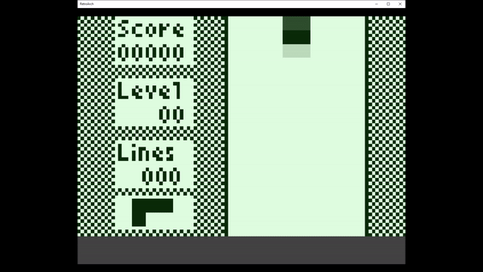

# Texas Instruments TI-83 (Numero)

## Background

Numero is a libretro core for emulating the TI-83 family of graphing calculators. It is based on the awesome Wabbitemu emulator. It allows you to play your TI-83 games like never before in fullscreen and using a gamepad! You can also control it with a mouse or keyboard, or you can just use the virtual mouse for pressing the calculator buttons.

The Numero core has been authored by

- Neil Barkhina

The Numero core is licensed under

- [GPLv2](https://github.com/nbarkhina/numero/blob/master/LICENSE)

A summary of the licenses behind RetroArch and its cores can be found [here](../development/licenses.md).

## BIOS

It is required to have one of the bios files below in the frontend's system directory. ti83se.rom is the recommended BIOS as that will give you the largest memory capacity.

| Filename          | Description                     | md5sum                           |
|:-----------------:|:-------------------------------:|:--------------------------------:|
| ti83se.rom | TI-83 Silver Edition | c6ff8204c5c81b7be34614dbbd690c8b                                 |
| ti83plus.rom | TI-83 Plus | 8011181f810b5ec4e9d6a03f0e14257a                                 |
| ti83.rom | TI-83 | d4448d09bbfde687c04f9e3310e023ab                                 |

## Extensions

Content that can be loaded by the Numero core have the following file extensions:

- .8xp
- .8xk
- .8xg

## Features

Frontend-level settings or features that the Numero core respects.

| Feature           | Supported |
|-------------------|:---------:|
| Restart           | ✔         |
| Saves             | ✔        |
| States            | ✔         |
| Rewind            | ✕         |
| Netplay           | ✕        |
| Core Options      | ✔        |
| RetroAchievements | ✕         |
| RetroArch Cheats  | ✕         |
| Native Cheats     | ✕         |
| Controls          | ✔         |
| Remapping         | ✔         |
| Multi-Mouse       | ✕         |
| Rumble            | ✕         |
| Sensors           | ✕         |
| Camera            | ✕         |
| Location          | ✕         |
| Subsystem         | ✕         |
| [Softpatching](../guides/softpatching.md) | ✕         |
| Disk Control      | ✕         |
| Username          | ✕         |
| Language          | ✕         |
| Crop Overscan     | ✕         |
| LEDs              | ✕         |

## Directories

The Numero core saves/loads to/from the default frontend's save directory.

**Frontend's Save directory**

| File         | Description |
|:------------:|:-----------:|
| tisavestateprogressti83se.sav | SE Progress Save |
| tisavestateprogressti83plus.sav | Plus Progress Save |
| tisavestateprogressti83.sav | TI-83 Progress Save |
| tisavestatetemp.sav | Temp file used during manual save states |

## Geometry and timing

- The Numero core's core provided FPS is 60
- The Numero core's core provided sample rate is 0 (currently no sound)
- The Numero core's base width is 640
- The Numero core's base height is 480
- The Numero core's max width is 640
- The Numero core's max height is 480
- The Numero core's core provided aspect ratio is 3/4

## Usage

- The Emulator will save your progress every 10 seconds
  - this is done in the background since the calculator doesn't really have any "long term storage"
  - everything was always just saved in RAM
  - or if you just select "Close Content" in RetroArch that will also immediately save your progress
- You can run the core without any content by just selecting "Start Core"
- There are two control schemes
  - Joypad which is the default
  - And "Gaming Buttons" which is more suited towards gaming
  - You can move the virtual mouse with the left stick
    - and by Pressing R2 to click
  - You can also use the D-Pad and A Button if using the Joypad scheme
  - Change the virtual mouse speed in the core Options
- You can toggle between the calculator view and "Big Mode" with L2
- Hitting "Restart" in the RetroArch menu will clear the entire memory
  - So be careful when doing this because you will lose all your data
  - This is useful however sometimes when the emulator hangs for one reason or another 
- Installing Apps
  - You will probably need to install some "loaders" for most of the demanding apps
  - Such as "Ion" or "Mirage"
  - You can install "Ion.8xg" by going to Retroarch => Load Content
  - After starting you will see a message in the bottom left corner if it imported successfully
  - Then go to "Close Content"
  - Then go again to "Load Content" and install the game you want to run inside of Ion such as "Ztetris.8xp"
  - Then keep repeating the process to load all the apps you want (careful not to fill up the entire space)
  - Essentially you have to load each piece one on top of another since there is a single common "hard drive" for the calculator
- Every time you load the emulator you will start from the last place you left off
  - For the same reason mentioned above where it saves in the background
  - Also keep this in mind for save states
- Save States
  - You can create as many save states as you want using the different slots
  - However they will be named internally based on how you started the emulator
    - From a rom or just the core itself
  - There will will be a common "In Progress" storage mechanism when loading different states
    - Save States will restore whatever the state was of the entire calculator
    - Including all installed apps at the time of saving
  - Take lots of save states since you may run into problems where you will need to wipe the memory and try again
- If you have trouble installing one game or another
  - Try moving things around between Memory and Archive
  - Sometimes different launchers require things not be in Archive
  - You can watch this awesome video by LGR where he talks about the phenomenon
    - https://www.youtube.com/watch?v=nduMTX86Zl0

## Core options

The Numero core has the following option(s) that can be tweaked from the core options menu. The default setting is bolded.

- **Speed of virtual mouse** [mouse_speed] (**1x**|2x|3x|4x|5x)

## device types

The Numero core supports the following device type(s) in the controls menu, bolded device types are the default for the specified user(s):

- None - Doesn't disable input.
- **RetroPad** - Joypad
- **Gaming Buttons** - Same as joypad but optimized mappings for playing games.

Regardless of what you pick the core also supports using the Mouse/Touch to click the calculator buttons.

## Joypad

| RetroPad Inputs                                | User 1 input descriptors |
|------------------------------------------------|--------------------------|
|              | Button 2ND                 |
|              | Button DOWN                 |
|         | Button ALPHA                 |
|          | Button ENTER                 |
|        | Mouse Up                 |
|      | Mouse Down                 |
|      | Mouse Left                 |
|     | Mouse Right                 |
|              | Mouse Press                 |
|              | Button UP                |
|             | Button LEFT                |
|             | Button RIGHT                |
|             | Toggle Big Mode                |
|             | Mouse Press                |

## External Links

- [Official Numero Github Repository](https://github.com/nbarkhina/numero)
- [Libretro Numero Core info file](https://github.com/libretro/libretro-super/blob/master/dist/info/numero_libretro.info)
- [Report Numero Core Issues Here](https://github.com/nbarkhina/numero/issues)
