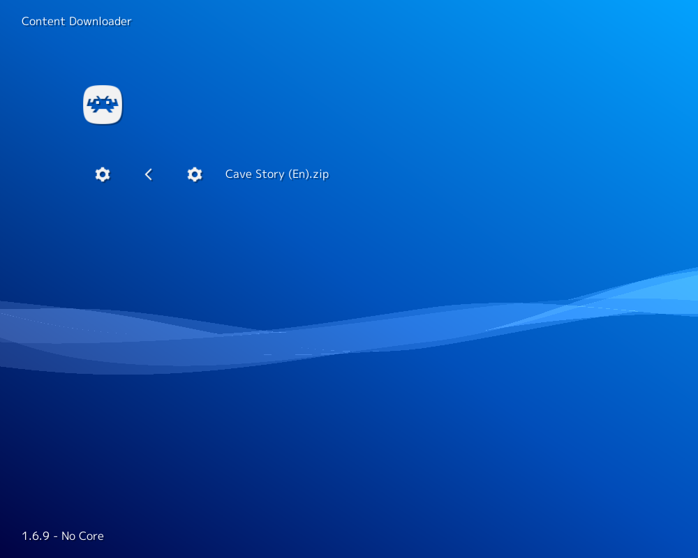

# Cave Story (NXEngine)

<iframe width="560" height="315" src="https://www.youtube-nocookie.com/embed/whm7SmNhziI" frameborder="0" allow="accelerometer; autoplay; clipboard-write; encrypted-media; gyroscope; picture-in-picture" allowfullscreen></iframe>

## Background

NXEngine is a open source reproduction of the [Cave Story game engine](https://en.wikipedia.org/wiki/Cave_Story). The NXEngine core has been authored by

- Caitlin Shaw

The NXEngine core is licensed under

- [GPLv3](https://github.com/gameblabla/nxengine-nspire/blob/master/LICENSE)

A summary of the licenses behind RetroArch and its cores can be found [here](../development/licenses.md).

## How to start the NXEngine core:

- To start the NXEngine core, you need to obtain NXEngine's data files. You can do this by going to RetroArch's main menu screen and selecting 'Online Updater'. From there, select 'Content Downloader'.

  

- Select 'NXEngine'', then select 'Cave Story (En).zip'. This should download and extract this file to RetroArch's Downloads directory.

  

- Go back to RetroArch's main menu screen. Select 'Load Content', then 'Downloads'.

  

  

- Select the 'Cave Story (en)' directory, then select 'Doukutsu.exe'.

- If you are asked which core to select, choose 'Cave Story (NXEngine)'.

The content should now start running!

## Extensions

Content that can be loaded by the NXEngine core have the following file extensions:

- .exe

## Databases

RetroArch database(s) that are associated with the NXEngine core:

- [Cave Story](https://github.com/libretro/libretro-database/blob/master/rdb/Cave%20Story.rdb)

## Features

Frontend-level settings or features that the NXEngine core respects.

| Feature           | Supported |
|-------------------|:---------:|
| Restart           | ✔         |
| Screenshots       | ✔         |
| Saves             | ✔         |
| States            | ✕         |
| Rewind            | ✕         |
| Netplay           | ✕         |
| Core Options      | ✕         |
| RetroAchievements | ✕         |
| RetroArch Cheats  | ✕         |
| Native Cheats     | ✕         |
| Controls          | ✔         |
| Remapping         | ✔         |
| Multi-Mouse       | ✕         |
| Rumble            | ✕         |
| Sensors           | ✕         |
| Camera            | ✕         |
| Location          | ✕         |
| Subsystem         | ✕         |
| [Softpatching](../guides/softpatching.md) | ✕         |
| Disk Control      | ✕         |
| Username          | ✕         |
| Language          | ✕         |
| Crop Overscan     | ✕         |
| LEDs              | ✕         |

### Directories

The NXEngine core's directory name is 'NXEngine'

The NXEngine core saves/loads to/from these directories.

**Frontend's Save directory**

- profile#.dat (Save data profile)

### Geometry and timing

- The NXEngine core's core provided FPS is 60
- The NXEngine core's core provided FPS is 22050 Hz
- The NXEngine core's core provided aspect ratio is 4/3

## Controllers

The NXEngine core supports the following device type(s) in the controls menu, bolded device types are the default for the specified user(s):

### User 1 device types

- None - Doesn't disable input
- **RetroPad** - Joypad
- RetroPad w/Analog - Joypad - There is no reason to switch to this.

### Controller tables

#### Joypad

| User 1 Remap descriptors | RetroPad Inputs                             |
|--------------------------|---------------------------------------------|
| Jump                     |           |
| Settings                 |      |
| Inventory                |       |
| D-Pad Up                 |     |
| D-Pad Down               |   |
| D-Pad Left               |   |
| D-Pad Right              |  |
| Fire                     |           |
| Show/Hide Map            |           |
| Previous Weapon          |          |
| Next Weapon              |          |

## External Links

- [Official NXEngine Website](http://nxengine.sourceforge.net/)
- [Official NXEngine Github Repository](https://github.com/EXL/NXEngine)
- [Libretro NXEngine Core info file](https://github.com/libretro/libretro-super/blob/master/dist/info/nxengine_libretro.info)
- [Libretro NXEngine Github Repository](https://github.com/libretro/nxengine-libretro)
- [Report Libretro NXEngine Core Issues Here](https://github.com/libretro/nxengine-libretro/issues)

## (Related cores)

- [doukutsu-rs](doukutsu-rs.md)