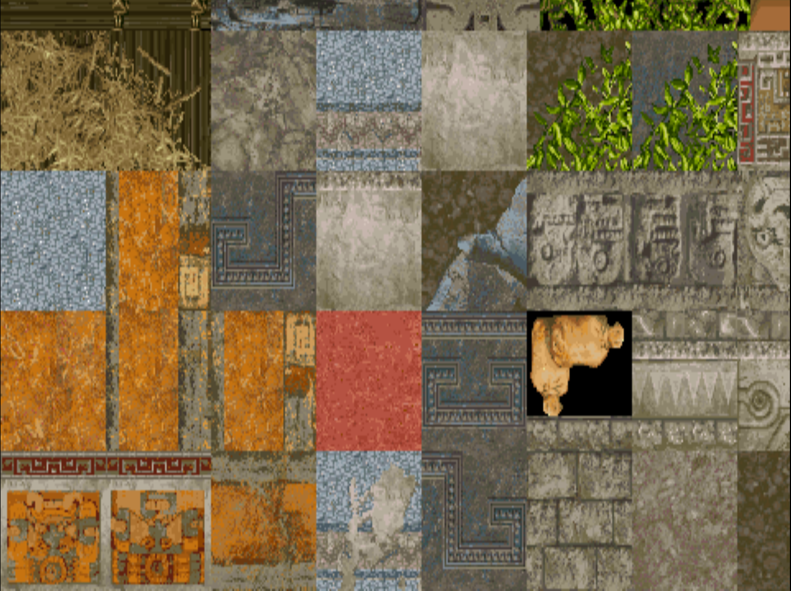
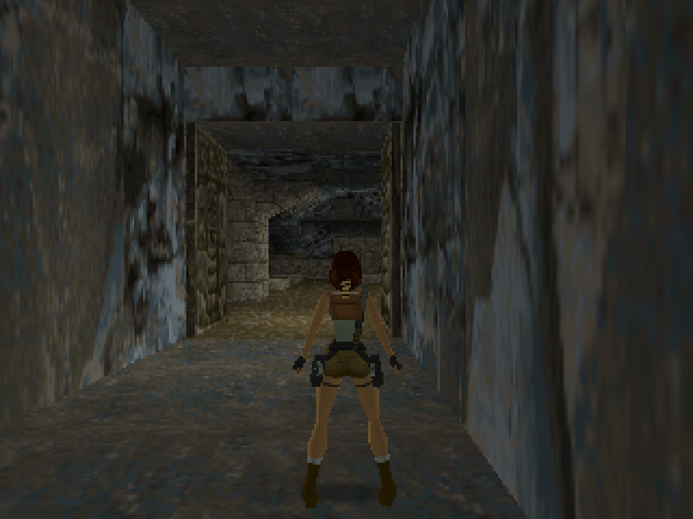
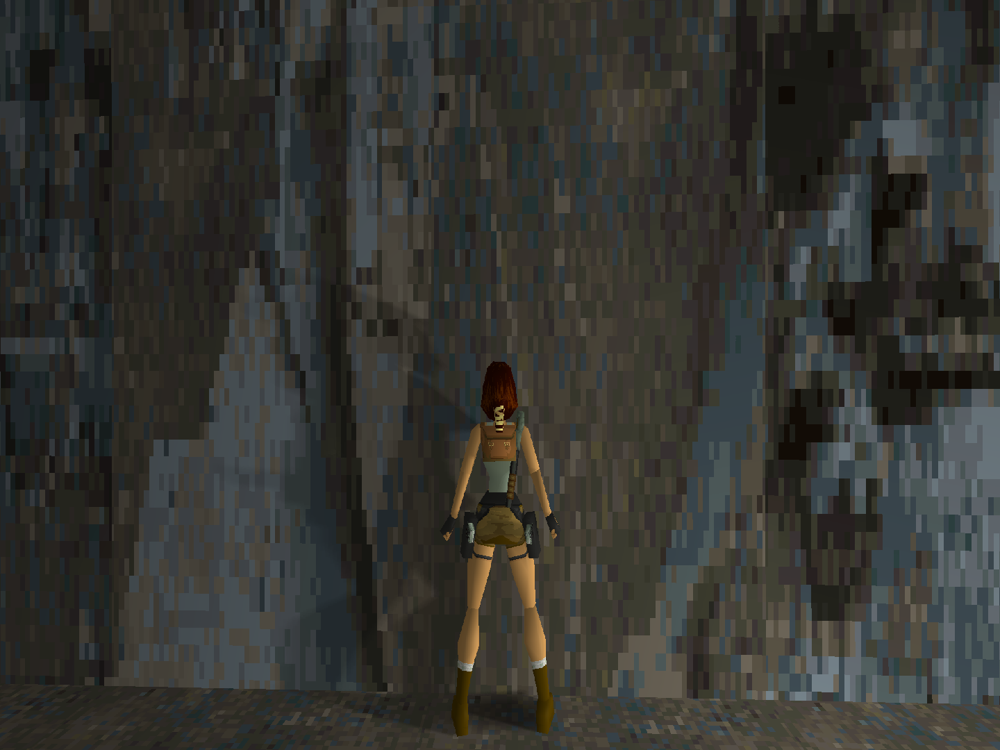

# Tomb Raider (OpenLara)

## Background

A new work-in-progress Tomb Raider game engine ported to libretro.

The nice thing about OpenLara is that, while staying true to the original look and feel of the original, it also adds some graphical enhancements to it that manages to make the boxy old-school Tomb Raider games look a bit less archaic. Some examples include :

- Self-shadowing on Lara, enemies, etc.
- New water effects which replaces the simple vertex manipulation of the water surface on the PSX. The Saturn version actually was the only version that tried to do something a bit more sophisticated with the water. If you dislike these very nice graphical enhancements, I inserted a core option so you can turn these off (‘Enable water effects’ in Quick Menu -> options).
- Shading effects – after Lara gets out of the water, her skin has a slightly wet shading effect.
- A first-person mode that is more convincing and fun than what you’d expect. It behaves a bit like Mirror’s Edge in that the camera bobs up and down, and you can see Lara’s hands move in front of you. If you try to do a somersault – the camera will rotate along with it as well. What makes the firstperson mode a bit more convincing is the new self-shadowing effects that have been added.

### Requirements

This core requires that you use OpenGL as the video driver. Go to Settings -> Driver. If ‘video driver’ is set to ‘vulkan’, switch it back to ‘gl’, and then restart.

!!! attention 
	There is currently no ‘working’ macOS version available due to the OpenGL requirement.
	
Also, the OpenLara core requires that you turn on ‘Enable Shared Hardware Context’, otherwise you will only see a single texture being displayed onscreen instead of the game screen.

1. First, you need to ensure that ‘Show Advanced Settings’ is turned on. Go to Settings -> User Interface and turn ‘Show Advanced Settings’ on.

2. Now, go back, and go to Settings -> Core.

3. Once inside the ‘Core’ settings, set ‘Enable Shared Hardware Context’ to ON.

#### How to start the OpenLara core:

Right now, OpenLara is more of a tech demo. You have to load separate levels into the program in order to play them. 

Be aware that certain gameplay elements are simply not implemented as of yet, such as health bars, taking damage, etc. You can ‘complete’ the stage technically but you also cannot die or continue to the next level. 

We hope that it will book major progress so that one day we can replay the old Tomb Raider games entirely with these enhanced graphics and enhanced framerates. To this end, we intend to support the project.

**For demonstration purposes, we provide you with the Tomb Raider 1 demo levels so that you can test it out. It is also possible to use levels from the PC/PSX version and load this into the game engine core, so try that out at your own discretion.**

- To try the demo level, you need to obtain its data files. You can do this by going to RetroArch's main menu screen and selecting 'Online Updater'. From there, select 'Content Downloader'.

  

- Select 'Tomb Raider', then select 'tombraider1-demo.zip'. This should download and extract this file to RetroArch's Downloads directory.

  

- Go back to RetroArch's main menu screen. Select 'Load Content', then 'Downloads'.

  

  

- Select the 'Tomb Raider' directory, then select 'LEVEL2.PSX'.

- If you are asked which core to select, choose 'Tomb Raider (OpenLara)'.

The content should now start running!

### Author/License

The OpenLara core has been authored by

- XProger

The OpenLara core is licensed under

- [2-clause BSD](https://github.com/XProger/OpenLara/blob/master/LICENSE)

A summary of the licenses behind RetroArch and its cores have found [here](https://docs.libretro.com/tech/licenses/).

## Extensions

Content that can be loaded by the OpenLara core have the following file extensions:

- .psx

## Databases

RetroArch database(s) that are associated with the OpenLara core:

- [Tomb Raider](https://github.com/libretro/libretro-database/blob/master/rdb/Tomb%20Raider.rdb)

## Features

Frontend-level settings or features that the OpenLara core respects.

| Feature           | Supported |
|-------------------|:---------:|
| Restart           | ✕         |
| Screenshots       | ✔         |
| Saves             | ✕         |
| States            | ✕         |
| Rewind            | ✕         |
| Netplay           | ✕         |
| Core Options      | ✔         |
| RetroAchievements | ✕         |
| RetroArch Cheats  | ✕         |
| Native Cheats     | ✕         |
| Controls          | ✔         |
| Remapping         | ✔         |
| Multi-Mouse       | ✕         |
| Rumble            | ✕         |
| Sensors           | ✕         |
| Camera            | ✕         |
| Location          | ✕         |
| Subsystem         | ✕         |
| [Softpatching](https://docs.libretro.com/guides/softpatching/) | ✕         |
| Disk Control      | ✕         |
| Username          | ✕         |
| Language          | ✕         |
| Crop Overscan     | ✕         |
| LEDs              | ✕         |

### Directories

The OpenLara core's internal core name is 'OpenLara'

The OpenLara core saves/loads to/from these directories.

**Frontend's System directory**

- openlara-'character-string'.xsh (???)

### Geometry and timing

- The OpenLara core's core provided FPS is dependent on the ['Framerate' core option](https://docs.libretro.com/library/openlara/#core-options).
- The OpenLara core's core provided sample rate is 44100 Hz
- The OpenLara core's core provided aspect ratio is 4/3

## Core options

The OpenLara core has the following option(s) that can be tweaked from the core options menu. The default setting is bolded. 

Settings with (Restart) means that core has to be closed for the new setting to be applied on next launch.

- **Framerate (restart)** [openlara_framerate] (**60fps**|90fps|120fps|144fps|30fps)

	Self-explanatory.
	
- **Internal resolution (restart)** [openlara_resolution] (**320x240**|360x480|480x272|512x384|512x512|640x240|640x448|640x480|720x576|800x600|960x720|1024x768|1024x1024|1280x720|1280x960|1600x1200|1920x1080|1920x1440|1920x1600|2048x2048|2560x1440|3840x2160|7680x4320|15360x8640|16000x9000)

	Self-explanatory.
	
??? note "Internal resolution - 320x240"
	

??? note "Internal resolution - 1920x1080"
		

- **Texture filtering (restart)** [openlara_texture_filtering] (**Bilinear filtering**|Nearest)

	Self-explanatory.

??? note "Texture filtering - Bilinear"
	
	
??? note "Texture filtering - Nearest"
	
	
- **Water effects (restart)** [openlara_water_effects] (**enabled**|disabled)

	Self-explanatory.
	
??? note "Water effects - On"
	
	
??? note "Water effects - Off"
	
	
## Controllers

The OpenLara core supports the following device type(s) in the controls menu, bolded device types are the default for the specified user(s):

### User 1 device types

- None - Doesn't disable input. There's no reason to switch to this.
- **RetroPad** - Joypad - Stay on this.
- RetroPad w/Analog - Joypad - Same as RetroPad. There's no reason to switch to this.

### Controller tables

#### Joypad

| User 1 Remap descriptors | RetroPad Inputs                              |
|--------------------------|----------------------------------------------|
| Action (Shoot/grab)      |        |
| Jump                     |        |
| View toggle              |         |
| Inventory                |          |
| Up                       |        |
| Down                     |      |
| Left                     |      | 
| Right                    |     |
| Roll                     |        |
| Draw weapon              |        |
| Walk (when holding)      |             |
| Sidestep left            |             |
| Sidestep right           |             |

## External Links

- [Official OpenLara Github Repository](https://github.com/XProger/OpenLara)
- [OpenLara WebGL build with demo level](http://xproger.info/projects/OpenLara/)
- [Libretro OpenLara Core info file](https://github.com/libretro/libretro-super/blob/master/dist/info/openlara_libretro.info)
- [Libretro OpenLara Github Repository](https://github.com/libretro/OpenLara)
- [Report Libretro OpenLara Core Issues Here](https://github.com/libretro/libretro-meta/issues)