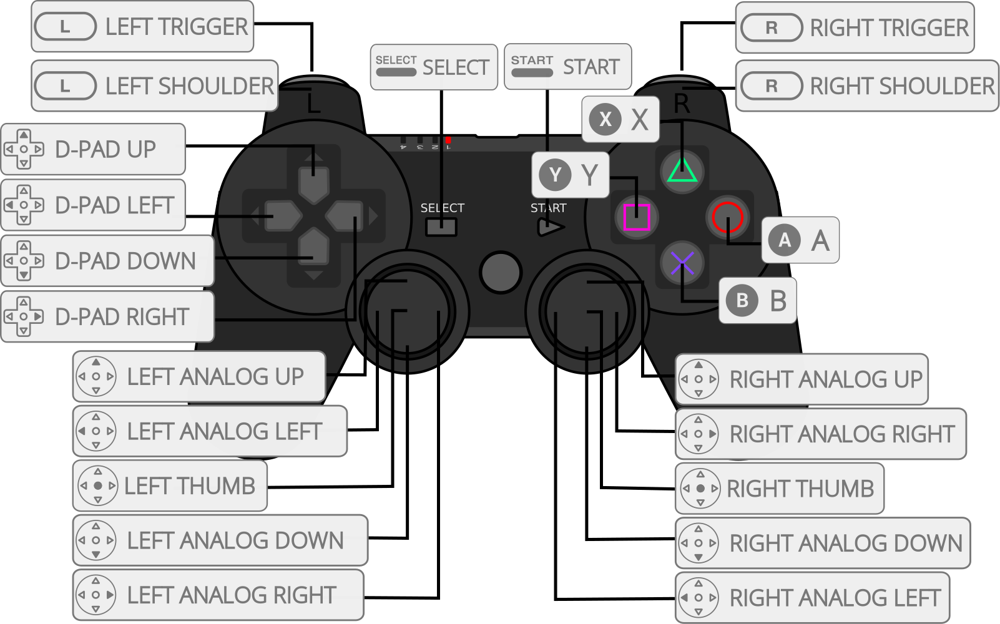
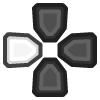
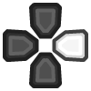

# Sony - PlayStation 2 (PCEE2)

## Background

PCEE2 is a libretro port of current upstream [PCSX2](https://github.com/PCSX2/pcsx2), the mature and highly compatible PlayStation 2 emulator. Unlike [LRPS2](lrps2.md), which is a hard fork of an older PCSX2, PCEE2 keeps the libretro layer separate from the emulation code and follows upstream PCSX2 releases closely. The version RetroArch shows for the core is the upstream PCSX2 version its emulation code corresponds to.

It renders with Vulkan (the default), OpenGL or the software renderer. With Vulkan the core shares RetroArch's Vulkan device and hands the rendered image over directly; the other renderers hand over finished frames.

The core is built for Windows x64, Linux x86_64 and aarch64, macOS x86_64 and arm64, Android arm64-v8a and x86_64, and webOS aarch64. It is experimental.

The PCEE2 core has been authored by

- PCSX2 Team
- WizzardSK

The PCEE2 core is licensed under

- [GPLv3](https://github.com/WizzardSK/pcee2-libretro/blob/libretro/COPYING.GPLv3)

A summary of the licenses behind RetroArch and its cores can be found [here](../development/licenses.md).

## Requirements

A 64-bit CPU and a GPU with Vulkan support are recommended; the OpenGL and software renderers are less tested. PS2 emulation is demanding, and the requirements of [standalone PCSX2](https://pcsx2.net/docs/setup/requirements/) apply.

## BIOS

PCEE2 requires a BIOS dumped from your own PlayStation 2 console in accordance with your local laws.

!!! Notes
	- No specific filename is required; the core finds any valid BIOS dump in the folder.
	- The BIOS files must be extracted - the core does not look inside archives.
	- The **BIOS** core option picks one when there are several; by default the first valid one is used.

1. Open your RetroArch system directory (see `Settings > Directory > System/BIOS` if you are not sure where it is).
2. Create a `pcsx2` folder, and a `bios` folder inside it (both lower-case).
3. Put your BIOS file(s) in `system/pcsx2/bios/`.

## Other files and directories

```
retroarch/
└── system/
	└── pcsx2/
		├── bios/
		├── inis/        (optional)
		├── memcards/
		└── resources/   (optional)
```

* `bios/` holds the BIOS dump(s), see above.
* `memcards/` holds the memory cards (`.ps2`). The core creates `Mcd001.ps2` and `Mcd002.ps2` there if they do not exist; the **Memory Cards** core options pick other cards from this folder.
* `resources/` is optional. The shaders, fonts and the `GameIndex.yaml` game database with its per-game fixes are built into the core. Files placed here add to them - most usefully `patches.zip` from [PCSX2's patches](https://github.com/PCSX2/pcsx2_patches/releases/latest/download/patches.zip), which the **Widescreen Patches** and **No-Interlacing Patches** options draw from.
* `inis/PCSX2.ini` is optional: copy your standalone PCSX2 settings file here and the core uses its emulation settings as the baseline. Core options still override the settings they cover.

## Extensions

Content that can be loaded by the PCEE2 core have the following file extensions:

- .iso
- .chd
- .cso
- .zso
- .gz
- .bin
- .cue
- .mdf
- .nrg
- .m3u
- .elf
- .irx

The core can also be started without content, which opens the PS2 BIOS menu and its memory card browser.

RetroArch database(s) that are associated with the PCEE2 core:

- [Sony - PlayStation 2](https://github.com/libretro/libretro-database/blob/master/rdb/Sony%20-%20PlayStation%202.rdb)

## Features

Frontend-level settings or features that the PCEE2 core respects.

| Feature           | Supported |
|-------------------|:---------:|
| Restart           | ✔         |
| Screenshots       | ✕         |
| Saves             | ✔         |
| States            | ✔         |
| Rewind            | ✕         |
| Netplay           | ✕         |
| Core Options      | ✔         |
| [Memory Monitoring (achievements)](../guides/memorymonitoring.md) | ✔         |
| RetroArch Cheats  | ✕         |
| Native Cheats     | ✕         |
| Controls          | ✔         |
| Remapping         | ✔         |
| Multi-Mouse       | ✕         |
| Rumble            | ✔         |
| Sensors           | ✕         |
| Camera            | ✕         |
| Location          | ✕         |
| Subsystem         | ✕         |
| [Softpatching](../guides/softpatching.md) | ✕         |
| Disk Control      | ✔         |
| Username          | ✕         |
| Language          | ✕         |
| Crop Overscan     | ✕         |
| LEDs              | ✕         |

## Directories

The PCEE2 core's library name is 'PCEE2'.

The PCEE2 core saves/loads to/from these directories.

**Frontend's System directory**

- `pcsx2/bios/` (BIOS)
- `pcsx2/memcards/` (memory cards)
- `pcsx2/resources/` (optional resources)
- `pcsx2/inis/` (optional settings)

## Core options

The PCEE2 core has the following option(s) that can be tweaked from the core options menu. The default setting is bolded. The options are grouped into the categories below.

#### System

- **BIOS** [pcsx2_bios] (*filled in at run time*)
- **Fast Boot** [pcsx2_fast_boot] (**ON**|OFF)
- **Frame Limiter** [pcsx2_frame_limiter] (**Frontend (RetroArch)**|Internal (PCSX2))
- **Multitap** [pcsx2_multitap] (**Disabled (2 players)**|Port 1 (5 players)|Port 2 (5 players)|Both Ports (8 players))
- **Lightgun (GunCon 2)** [pcsx2_lightgun] (**OFF**|USB Port 1|USB Port 2|Both Ports)
- **Rumble** [pcsx2_rumble] (**ON**|OFF)
- **Analog Axis Scale** [pcsx2_axis_scale] (100%|115%|**133% (Default)**|150%)
- **Analog Deadzone** [pcsx2_axis_deadzone] (**0% (Default)**|5%|10%|15%|20%|30%)

#### Memory Cards

- **Slot 1 Enabled** [pcsx2_memcard_slot1_enable] (**ON**|OFF)
- **Slot 2 Enabled** [pcsx2_memcard_slot2_enable] (**ON**|OFF)
- **Slot 1 Card** [pcsx2_memcard_slot1_file] (*filled in at run time*)
- **Slot 2 Card** [pcsx2_memcard_slot2_file] (*filled in at run time*)

#### Graphics

- **Renderer** [pcsx2_renderer] (**Vulkan (Hardware)**|OpenGL (Hardware)|Software)
- **Internal Resolution** [pcsx2_upscale_multiplier] (**1x Native (640x480)**|2x Native (1280x960)|3x Native (1920x1440)|4x Native (2560x1920))
- **Hardware Download Mode** [pcsx2_hw_download_mode] (**Accurate (Default)**|Unsynchronized (Fast)|Disabled (Fastest))
- **Blending Accuracy** [pcsx2_blending_accuracy] (Minimum|**Basic (Recommended)**|Medium|High|Full (Slow)|Maximum (Very Slow))
- **Texture Filtering** [pcsx2_texture_filtering] (Nearest|**Bilinear (PS2)**|Bilinear (Forced)|Bilinear (Forced excluding sprites))
- **Trilinear Filtering** [pcsx2_trilinear_filtering] (**Automatic (Default)**|Off|Trilinear (PS2)|Trilinear (Forced))
- **Anisotropic Filtering** [pcsx2_anisotropic_filtering] (**Off**|2x|4x|8x|16x)
- **Dithering** [pcsx2_dithering] (Off|Scaled|**Unscaled (Default)**)
- **Hardware Mipmapping** [pcsx2_mipmapping] (**ON**|OFF)
- **Deinterlacing** [pcsx2_deinterlace_mode] (**Automatic (Default)**|Off|Weave (TFF)|Weave (BFF)|Bob (TFF)|Bob (BFF)|Blend (TFF)|Blend (BFF)|Adaptive (TFF)|Adaptive (BFF))
- **FXAA** [pcsx2_fxaa] (**OFF**|ON)
- **Contrast Adaptive Sharpening** [pcsx2_cas_mode] (**OFF**|Sharpen Only)
- **Skip Presenting Duplicate Frames** [pcsx2_skip_duplicate_frames] (**ON**|OFF)
- **CAS Sharpness** [pcsx2_cas_sharpness] (10|20|30|40|**50**|60|70|80|90|100)
- **Aspect Ratio** [pcsx2_aspect_ratio] (**Automatic**|4:3|16:9)

#### Patches

- **Widescreen Patches** [pcsx2_widescreen_patches] (**OFF**|ON)
- **No-Interlacing Patches** [pcsx2_no_interlacing_patches] (**OFF**|ON)

#### Performance

- **MTVU (Multi-Threaded VU1)** [pcsx2_mtvu] (**ON**|OFF)
- **Instant VU1** [pcsx2_instant_vu1] (**ON**|OFF)
- **EE Cycle Rate** [pcsx2_ee_cycle_rate] (50% (Underclock)|60% (Underclock)|75% (Underclock)|**100% (Default)**|130% (Overclock)|180% (Overclock)|300% (Overclock))
- **EE Cycle Skip** [pcsx2_ee_cycle_skip] (**Disabled (Default)**|Mild|Moderate|Maximum)
- **CPU Recompiler (JIT)** [pcsx2_cpu_recompiler] (**Enabled (JIT, Default)**|Disabled (Interpreter))
- **EE Recompiler** [pcsx2_rec_ee] (**Enabled (Default)**|Disabled (Interpreter))
- **IOP Recompiler** [pcsx2_rec_iop] (**Enabled (Default)**|Disabled (Interpreter))
- **VU0 Recompiler** [pcsx2_rec_vu0] (**Enabled (Default)**|Disabled (Interpreter))
- **VU1 Recompiler** [pcsx2_rec_vu1] (**Enabled (Default)**|Disabled (Interpreter))

#### Audio

- **Audio Buffer** [pcsx2_audio_buffer_ms] (50 ms|75 ms|**100 ms**|150 ms|200 ms)

The renderer can be switched to or from Software while a game runs; switching between Vulkan and OpenGL takes effect when the content is restarted. The Vulkan and OpenGL entries only appear on builds that have those renderers.

## Controllers

Ports 1 and 2 are DualShock 2 controllers. With the **Multitap** option, up to 8 controllers are supported (port 1: 1A-1D, then port 2: 2A-2D). The **Lightgun (GunCon 2)** option emulates a Namco GunCon 2 on a USB port, aimed with RetroArch's lightgun input (or a mouse mapped as a lightgun) on the matching port.

## Joypad



| RetroPad Inputs                                | DualShock 2 Inputs                                |
|------------------------------------------------|---------------------------------------------------|
|              |        |
|              |       |
|         |       |
|          |        |
|        |      |
|      |    |
|      |    |
|     |   |
|              |       |
|              |     |
|             |           |
|             |           |
|             |           |
|             |           |
|             |           |
|             |           |
|     |   |
|    |  |

## Compatibility

PCEE2 runs the same emulation code as the upstream PCSX2 version it reports, so the [PCSX2 compatibility list](https://pcsx2.net/compat/) applies. Differences come from the libretro side - report them to the core, not to PCSX2.

## External Links

- [PCEE2 Core info file](https://github.com/libretro/libretro-super/blob/master/dist/info/pcee2_libretro.info)
- [PCEE2 GitHub Repository](https://github.com/WizzardSK/pcee2-libretro)
- [Report PCEE2 Core Issues Here](https://github.com/WizzardSK/pcee2-libretro/issues)
- [Upstream PCSX2](https://github.com/PCSX2/pcsx2)

## Libretro PS2 cores

- [PlayStation 2 (LRPS2)](lrps2.md)
- [PlayStation 2 (Play!)](play.md)
