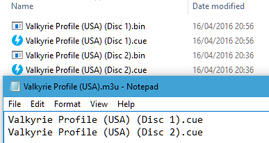

# Sony - PlayStation (PCSX ReARMed)

<iframe width="560" height="315" src="https://www.youtube-nocookie.com/embed/Up5ylMKFxZg" title="YouTube video player" frameborder="0" allow="accelerometer; autoplay; clipboard-write; encrypted-media; gyroscope; picture-in-picture" allowfullscreen></iframe>

## Background

PCSX ReARMed is a fork of PCSX Reloaded. It differs from the latter in that it has special optimizations for systems that have an ARM architecture-based CPU.

The PCSX ReARMed core has been authored by

- PCSX Team
- notaz
- Exophase

The PCSX ReARMed core is licensed under

- [GPLv2](https://github.com/libretro/pcsx_rearmed/blob/master/COPYING)

A summary of the licenses behind RetroArch and its cores can be found [here](../development/licenses.md).

## BIOS

Required or optional firmware files go in the frontend's `system` directory.

If more than one BIOS file exists, the PCSX ReARMed core uses the BIOS above the table below.

!!! attention
	In case the PCSX ReARMed core can find no BIOS files named like this in RetroArch's system directory, it will default to a High-Level Emulation BIOS. This decreases the level of compatibility of the emulator, so it is recommended that you always supply valid BIOS images inside the system directory.

|   Filename      |      Description       |              md5sum              |
|:---------------:|:----------------------:|:--------------------------------:|
| PSXONPSP660.bin | Extracted from a PSP   | c53ca5908936d412331790f4426c6c33 |
| scph101.bin     | Version 4.4 03/24/00 A | 6E3735FF4C7DC899EE98981385F6F3D0 |
| scph7001.bin    | Version 4.1 12/16/97 A | 1e68c231d0896b7eadcad1d7d8e76129 |
| scph5501.bin    | Version 3.0 11/18/96 A | 490f666e1afb15b7362b406ed1cea246 |
| scph1001.bin    | Version 2.0 05/07/95 A | 924e392ed05558ffdb115408c263dccf |

<!--
As a replacement for any of the first 3 BIOS files mentioned above, it is also possible
to use the `PSXONPSP660.bin` BIOS. This BIOS comes from the PSP, is region-free
and can sometimes offer better performance.
-->

If none of the above is found, PCSX_ReARMed will search for filenames starting with "scph" and use that instead.
It doesn't seem to matter whatever BIOS version is used and from what region, as long as it's from a retail PSX/PS one.
If no compatible BIOS is found, PCSX_ReARMed will revert to use the HLE BIOS, which can have compatibility issues (e.g. memory card issues in Suikoden games, some games just going into black screens, ...).

## Extensions

Content that can be loaded by the PCSX ReARMed core have the following file extensions:

- .bin
- .cue
- .img
- .mdf
- .pbp
- .toc
- .cbn
- .m3u
- .ccd
- .chd
- .iso
- .exe

RetroArch database(s) that are associated with the PCSX ReARMed core:

- [Sony - PlayStation](https://github.com/libretro/libretro-database/blob/master/rdb/Sony%20-%20PlayStation.rdb)

## Features

Frontend-level settings or features that the PCSX ReARMed core respects.

| Feature           | Supported |
|-------------------|:---------:|
| Restart           | ✔         |
| Saves             | ✔         |
| States            | ✔         |
| Rewind            | ✔         |
| Netplay           | ✔         |
| Core Options      | ✔         |
| [Memory Monitoring (achievements)](../guides/memorymonitoring.md) | ✔         |
| RetroArch Cheats  | ✔         |
| Native Cheats     | ✕         |
| Controls          | ✔         |
| Remapping         | ✔         |
| Multi-Mouse       | ✔         |
| Rumble            | ✔         |
| Sensors           | ✕         |
| Camera            | ✕         |
| Location          | ✕         |
| Subsystem         | ✕         |
| [Softpatching](../guides/softpatching.md) | ✕         |
| Disk Control      | ✔         |
| Username          | ✕         |
| Language          | ✕         |
| Crop Overscan     | ✕         |
| LEDs              | ✕         |

### Directories

The PCSX ReARMed core's library name is 'PCSX-ReARMed'

The PCSX ReARMed core saves/loads to/from these directories.

**Frontend's Save directory**

| File           | Description                                          |
|:--------------:|:----------------------------------------------------:|
| *.srm          | Memory card slot 0                                   |
| pcsx-card2.mcd | Memory card slot 1 (if enabled, default to disabled) |

**Frontend's State directory**

| File     | Description |
|:--------:|:-----------:|
| *.state# | State       |

### Geometry and timing

- The PCSX ReARMed core's core provided FPS is 60 for NTSC games. 50 for PAL games.
- The PCSX ReARMed core's core provided sample rate is 44100 Hz
- The PCSX ReARMed core's base width is 320
- The PCSX ReARMed core's base height is 240
- The PCSX ReARMed core's max width is 1024
- The PCSX ReARMed core's max height is 512
- The PCSX ReARMed core's core provided aspect ratio is 4/3

### Loading content

PCSX ReARMed needs a cue-sheet that points to an image file. A cue sheet, or cue file, is a metadata file which describes how the tracks of a CD or DVD are laid out.

If you have e.g. `foo.bin`, you should create a text file and save it as `foo.cue`. Most PS1 games are single-track, so the cue file contents should look like this:

`foobin.cue`
```
 FILE "foo.bin" BINARY
  TRACK 01 MODE1/2352
   INDEX 01 00:00:00
```

After that, you can load the `foo.cue` file in RetroArch with the PCSX ReARMed core.

!!! attention
    Certain PS1 games are multi-track, so their .cue files might be more complicated.

#### Playing PAL copy protected games

PAL copy protected games need a SBI Subchannel file next to the bin/cue files in order to get past the copy protection.

- Ape Escape (Europe).bin
- Ape Escape (Europe).cue
- **Ape Escape (Europe).sbi**

#### Multiple-disk games

If foo is a multiple-disk game, you should have .cue files for each one, e.g. `foo (Disc 1).cue`, `foo (Disc 2).cue`, `foo (Disc 3).cue`.

To take advantage of PCSX ReARMed's Disk Control feature for disk swapping, an index file (a m3u file) should be made.

Create a text file and save it as `foo.m3u`. Then enter your game's .cue files on it. The m3u file contents should look something like this:

`foo.m3u`
```
foo (Disc 1).cue
foo (Disc 2).cue
foo (Disc 3).cue
```

After that, you can load the `foo.m3u` file in RetroArch with the PCSX ReARMed core.

Here's a m3u example done with Valkyrie Profile

`Valkyrie Profile (USA).m3u`
```
Valkyrie Profile (USA) (Disc 1).cue
Valkyrie Profile (USA) (Disc 2).cue
```



!!! attention
	Adding multi-track games to a RetroArch playlist is recommended. (Manually add an entry a playlist that points to `foo.m3u`)

### Swapping disks

Swapping disks follows this procedure

1. Open tray (Disk Cycle Tray Status)

2. Change the Disk Index to the disk you want to swap to.

3. Close tray (Disk Cycle Tray Status)

4. Return to the game and wait a few seconds to let it take effect

### PBP

Alternatively to using cue sheets with .bin/.iso files, you can convert your games to .pbp (Playstation Portable update file).

A recommended .pbp convert tool is PSX2PSP.

If converting a multiple-disk game, all disks should be added to the same .pbp file, rather than making a .m3u file for them.

Most conversion tools will want a single .bin file for each disk. If your game uses multiple .bin files (tracks) per disk, you will have to mount the cue sheet to a virtual drive and re-burn the images onto a single track before conversion.

!!! attention
    RetroArch does not currently have .pbp database due to variability in users' conversion methods. All .pbp games will have to be added to playlists manually.

## Saves

For game savedata storage, the PSX console used memory cards. The PSX console had two slots for memory cards.

The PCSX ReARMed core defaults to only support the first memory card slot.
Second memory card slot can be enabled via the `pcsx_rearmed_memcard2` option.

In this doc, the first memory card slot will be referred to as 'Memcard slot 0'.
The second memory card slot will be referred to as 'Memcard slot 1'.

For memory card functionality and usage, the PCSX ReARMed core will the Libretro savedata format.

<center>

| Libretro savedata format |
|--------------------------|
| gamename.srm             |
| pcsx-card2.mcd           |

</center>

**By default**, the filename of the Memcard slot 0 savedata will match the loaded cue or m3u or pbp filename, like this:

**By default**, the filename of the Memcard slot 1 savedata (if enabled) will be
`pcsx-card2.mcd`. This basically means that all games in the same folder share
the same nemory card in slot 1.

- Loaded content: Breath of Fire III (USA).cue

- **Memcard slot 0: Breath of Fire III (USA).srm**

or

- Loaded content: Final Fantasy VII (USA).m3u

- **Memcard slot 0: Final Fantasy VII (USA).srm**

or

- Loaded content: Wild Arms 2 (USA).pbp

- **Memcard slot 0: `Wild Arms 2 (USA).srm**

!!! attention
	To import your old memory cards from other emulators, you need to rename them to the Libretro savedata format.

!!! warning
	Keep in mind that save states also include the state of the memory card; carelessly loading an old save state will **OVERWRITE** the memory card, potentially resulting in lost saved games. **You can set the 'Don't overwrite SaveRAM on loading savestate' option in RetroArch's Saving settings to On to prevent this.**

## Core options

The PCSX ReARMed core has the following option(s) that can be tweaked from the core options menu. The default setting is bolded. Some options are only shown when an option they depend on is set.

#### System

Configure base hardware parameters: region, BIOS selection, memory cards, etc.

- **Region** [pcsx_rearmed_region] (**Auto**|NTSC|PAL)

	Specify which region the system is from. 'NTSC' is 60 Hz while 'PAL' is 50 Hz. 'Auto' will detect the region of the currently loaded content. Games may run faster or slower than normal if the incorrect region is selected.

- **BIOS Selection** [pcsx_rearmed_bios] (**Auto**|HLE)

	Specify which BIOS to use. 'Auto' will attempt to load a real bios file from the frontend 'system' directory, falling back to high level emulation if unavailable. 'HLE' forces high level BIOS emulation. It is recommended to use an official bios file for better compatibility.

- **Show BIOS Name/Boot Logo** [pcsx_rearmed_show_bios_bootlogo] (**disabled**|enabled|ON, w/o PCSXtm)

	When using a custom BIOS file, enables the display of its file name in the OSD. Also specifies whether to show the BIOS logo when starting or selecting Reset. Warning: Enabling the logo may reduce game compatibility.

- **Memory Card 1 Type (Restart)** [pcsx_rearmed_memcard1] (**Libretro (Default)**|Game Code (Serial)|Shared Between All Games|No Memory Card)

	How to emulate the memory card in slot 1. 'Libretro' passes the card data to the frontend (usually saved as .srm). 'Game Code' saves it to a file named based on the serial, such as SCUS-00001_1.mcd, for compatibility with some other emulators.

- **Memory Card 2 Type** [pcsx_rearmed_memcard2] (Game Code (Serial)|**Shared Between All Games**|No Memory Card)

	Same as above, but card in slot 2.

- **CD read-ahead** [pcsx_rearmed_cd_readahead] (0|1|2|3|4|5|6|7|8|9|10|11|**12**|13|14|15|16|32|64|128|256|512|1024|333000)

	Reads the specified amount of sectors ahead of time to try to avoid later stalls. Affects both physical CD-ROM and CD images. 333000 will try to read the complete disk (requires an additional 750MB of RAM).

- **Dynamic Recompiler** [pcsx_rearmed_drc] (disabled|**enabled**)

	Dynamically recompile PSX CPU instructions to native instructions. Much faster than using an interpreter, but may be less accurate on some platforms.

- **DynaRec threading** [pcsx_rearmed_drc_thread] (**Auto**|disabled|enabled)

	Run the dynarec on another thread.

- **PSX CPU Clock Speed (%)** [pcsx_rearmed_psxclock] (**Auto**|30|31|32|33|34|35|36|37|38|39|40|41|42|43|44|45|46|47|48|49|50|51|52|53|54|55|56|57|58|59|60|61|62|63|64|65|66|67|68|69|70|71|72|73|74|75|76|77|78|79|80|81|82|83|84|85|86|87|88|89|90|91|92|93|94|95|96|97|98|99|100)

	Overclock or under-clock the PSX CPU. Should be much less than 100 (something like 57) due to some real hardware slowdowns not being emulated. Usually should be left at 'Auto', else glitches or hangs are likely.

#### Video

Configure base display parameters.

- **Dithering Pattern** [pcsx_rearmed_dithering] (disabled|**enabled**|Force)

	Enable emulation of the dithering technique used by the PSX to smooth out color banding artifacts. "Force" enables it even if the game turns it off. Increases performance requirements.

- **Threaded Rendering** [pcsx_rearmed_gpu_thread_rendering] (**Auto**|disabled|enabled)

	When enabled, runs GPU commands in a secondary thread. 'Auto' enables it if at least 2 CPU cores are detected.

- **Frameskip** [pcsx_rearmed_frameskip_type] (**disabled**|Auto|Auto (Threshold)|Fixed Interval)

	Skip frames to avoid audio buffer under-run (crackling). Improves performance at the expense of visual smoothness. 'Auto' skips frames when advised by the frontend. 'Auto (Threshold)' utilises the 'Frameskip Threshold (%)' setting. 'Fixed Interval' utilises the 'Frameskip Interval' setting.

- **Frameskip Threshold (%)** [pcsx_rearmed_frameskip_threshold] (15|18|21|24|27|30|**33**|36|39|42|45|48|51|54|57|60|65|70|75|80)

	When 'Frameskip' is set to 'Auto (Threshold)', specifies the audio buffer occupancy threshold (percentage) below which frames will be skipped. Higher values reduce the risk of crackling by causing frames to be dropped more frequently.

- **Frameskip Interval** [pcsx_rearmed_frameskip_interval] (1|2|**3**|4|5|6|7|8|9|10)

	Specify the maximum number of frames that can be skipped before a new frame is rendered.

- **Display Internal FPS** [pcsx_rearmed_display_fps_v2] (**disabled**|enabled|extra)

	Show the internal frame rate at which the emulated system is rendering content. Note: Requires on-screen notifications to be enabled in the libretro frontend.

- **Display Informational Notifications** [pcsx_rearmed_display_info] (disabled|**enabled**)

	Shows things like unsafe hack options that are enabled and the BIOS name that is booting.

- **Use fractional frame rate** [pcsx_rearmed_fractional_framerate] (**Auto**|disabled|enabled)

	Instead of the exact 50 or 60 (maximum) fps for PAL/NTSC the real console runs closer to something like 49.75 and 59.81fps (varies slightly between hw versions). PCSX-ReARMed uses the former "round" framerates to better match modern displays, however that may cause audio/video desync in games like DDR and Spyro 2 (intro). With this option you can try to use fractional framerates.

- **Framebuffer readout** [pcsx_rearmed_alt_flip] (**Auto**|Early|Late)

	Some games make changes to the framebuffer while it's being sent to the display, which is currently not emulated. However this option allows to choose if the emulator takes the video frame before the emulated PSX active display period ('Early') or after ('Late'). Normally this should be left at 'Auto'.

- **RGB32 output** [pcsx_rearmed_rgb32_output] (**disabled**|enabled)

	Improves color depth for true color modes (most FMVs and occasional title screens). Causes higher CPU usage due to double memory bandwidth requirement, even in 15bpp modes. Takes effect on game reload only (libretro limitation).

- **Hi-Res Downscaling** [pcsx_rearmed_scale_hires] (**disabled**|enabled)

	When enabled, games that run in high resolution video modes (480i, 512i) will be downscaled to 320x240 by skipping lines and/or columns. May be useful on some devices with native 240p display resolutions that lack efficient hardware scaling.

- **(GPU) Slow linked list processing** [pcsx_rearmed_gpu_slow_llists] (**Auto**|disabled|enabled)

	Slower but more accurate GPU linked list processing. Needed by only a few games like Vampire Hunter D. Should be autodetected in most cases.

- **(GPU) Horizontal overscan** [pcsx_rearmed_show_overscan] (**disabled**|Auto|Hack)

	The PSX can display graphics way into the horizontal borders, even if most screens would crop it. This option tries to display all such graphics. Note that this may result in unusual resolutions that your device might not handle well. The 'Hack' option is intended for the widescreen hacks.

- **(GPU) Screen centering** [pcsx_rearmed_screen_centering] (**Auto**|Game-controlled|Borderless|Manual)

	The PSX has a feature allowing it to shift the image position on screen. Some (mostly PAL) games used this feature in a strange way making the image miscentered and causing uneven borders to appear. With 'Auto' the emulator tries to correct this miscentering automatically. 'Game-controlled' uses the settings supplied by the game. 'Manual' allows to override those values with the settings below.

- **(GPU) Manual position X** [pcsx_rearmed_screen_centering_x] (-16 to 16 in steps of 2, **0**)

	X offset of the frame buffer. Only effective when 'Screen centering' is set to 'Manual'.

- **(GPU) Manual position Y** [pcsx_rearmed_screen_centering_y] (-16 to 16 in steps of 1, **0**)

	Y offset of the frame buffer. Only effective when 'Screen centering' is set to 'Manual'.

- **(GPU) Manual height adjustment** [pcsx_rearmed_screen_centering_h_adj] (-64|-48|-40|-32|-24|-16|-8|-7|-6|-5|-4|-3|-2|-1|**0**)

	Height adjustment. Only effective when 'Screen centering' is set to 'Manual'.

#### GPU Plugin

Configure low-level settings of the NEON GPU plugin.

- **Show Interlaced Video** [pcsx_rearmed_neon_interlace_enable_v2] (**auto**|disabled|enabled)

	When enabled, games that run in high resolution video modes (480i, 512i) will produced interlaced video output. While this displays correctly on CRT televisions, it will produce artifacts on modern displays. When disabled, all video is output in progressive format. Note: there are games that will glitch is this is off.

- **Enhanced Resolution** [pcsx_rearmed_neon_enhancement_enable] (**disabled**|enabled)

	Render games that do not already run in high resolution video modes (480i, 512i) at twice the native internal resolution. Improves the fidelity of 3D models at the expense of increased performance requirements. 2D elements are generally unaffected by this setting.

- **Enh. Res. Speed Hack** [pcsx_rearmed_neon_enhancement_no_main] (**disabled**|enabled)

	('Enhanced Resolution' Hack) Improves performance but reduces compatibility and may cause rendering errors.

- **Enh. Res. Texture Fixup** [pcsx_rearmed_neon_enhancement_tex_adj_v2] (disabled|**enabled**)

	('Enhanced Resolution' Hack) Solves some texturing issues in some games in Enhanced Resolution mode. May cause a small performance hit.

#### Audio

Configure sound emulation: reverb, interpolation, CD audio decoding.

- **Reverb Effects** [pcsx_rearmed_spu_reverb] (disabled|**enabled**)

	Enable emulation of the reverb feature provided by the PSX SPU. Can be disabled to improve performance at the expense of reduced audio quality/authenticity.

- **Sound Interpolation** [pcsx_rearmed_spu_interpolation] (**Simple**|Gaussian|Cubic|disabled)

	Enable emulation of the in-built audio interpolation provided by the PSX SPU. 'Gaussian' sounds closest to original hardware. 'Simple' improves performance but reduces quality. 'Cubic' has the highest performance requirements but produces increased clarity. Can be disabled entirely for maximum performance, at the expense of greatly reduced audio quality.

- **CD Audio** [pcsx_rearmed_nocdaudio] (disabled|**enabled**)

	Enable playback of CD (CD-DA) audio tracks. Can be disabled to improve performance in games that include CD audio, at the expense of missing music.

- **XA Decoding** [pcsx_rearmed_noxadecoding] (disabled|**enabled**)

	Enable playback of XA (eXtended Architecture ADPCM) audio tracks. Can be disabled to improve performance in games that include XA audio, at the expense of missing music.

- **Threaded SPU** [pcsx_rearmed_spu_thread] (**disabled**|enabled)

	Emulates the PSX SPU on another CPU thread. May cause audio glitches in some games.

- **Show Input Settings** [pcsx_rearmed_show_input_settings] (**disabled**|enabled)

	Show configuration options for all input devices: analog response, Multitaps, light guns, etc. Quick Menu may need to be toggled for this setting to take effect.

#### Input

Configure input devices: analog response, haptic feedback, Multitaps, light guns, etc.

- **Analog Axis Bounds** [pcsx_rearmed_analog_axis_modifier] (Circle|**Square**)

	Specify range limits for the left and right analog sticks when input device is set to 'analog' or 'dualshock'. 'Square' bounds improve input response when using controllers with highly circular ranges that are unable to fully saturate the X and Y axes at 45 degree deflections.

- **Rumble Effects** [pcsx_rearmed_vibration] (disabled|**enabled**)

	Enable haptic feedback when using a rumble-equipped gamepad with input device set to 'dualshock'.

- **DualShock Analog Mode Toggle Key Combo** [pcsx_rearmed_analog_combo] (disabled|**L1 + R1 + Select**|L1 + R1 + Start|L1 + R1 + L3|L1 + R1 + R3|L3 + R3)

	When the input device type is DualShock, this option allows the emulated DualShock to be toggled between DIGITAL and ANALOG mode like original hardware. You can select the button combination for this.

- **Multitap Mode** [pcsx_rearmed_multitap] (**disabled**|Port 1|Port 2|Ports 1 and 2)

	Connect a virtual PSX Multitap peripheral to either controller 'Port 1' or controller 'Port 2' for 5 player simultaneous input, or to both 'Ports 1 and 2' for 8 player input. Multitap usage requires compatible games.

- **NegCon Twist Deadzone** [pcsx_rearmed_negcon_deadzone] (**0%**|3%|5%|7%|10%|13%|15%|17%|20%|23%|25%|27%|30%)

	Set the deadzone of the RetroPad left analog stick when simulating the 'twist' action of emulated neGcon Controllers. Used to eliminate drift/unwanted input.

- **NegCon Twist Response** [pcsx_rearmed_negcon_response] (**Linear**|Quadratic|Cubic)

	Specify the analog response when using a RetroPad left analog stick to simulate the 'twist' action of emulated neGcon Controllers.

- **Mouse Sensitivity** [pcsx_rearmed_input_sensitivity] (0.05 to 2.00 in steps of 0.05, **1.00**)

	Adjust responsiveness of emulated 'mouse' input devices.

- **Player 1 Lightgun Crosshair** [pcsx_rearmed_crosshair1] (**disabled**|blue|green|red|white)

	Toggle player 1's crosshair for the Guncon or Konami Gun. Only works if RGB32 output is off (video options).

- **Player 2 Lightgun Crosshair** [pcsx_rearmed_crosshair2] (**disabled**|blue|green|red|white)

	Toggle player 2's crosshair for the Guncon or Konami Gun. Only works if RGB32 output is off (video options).

- **Konami Gun X Axis Offset** [pcsx_rearmed_konamigunadjustx] (-40 to 40 in steps of 1, **0**)

	Apply an X axis offset to light gun input when emulating a Konami Gun (Hyper Blaster / Justifier) device. Can be used to correct aiming misalignments.

- **Konami Gun Y Axis Offset** [pcsx_rearmed_konamigunadjusty] (-40 to 40 in steps of 1, **0**)

	Apply a Y axis offset to light gun input when emulating a Konami Gun (Hyper Blaster / Justifier) device. Can be used to correct aiming misalignments.

- **Guncon X Axis Offset** [pcsx_rearmed_gunconadjustx] (-40 to 40 in steps of 1, **0**)

	Apply an X axis offset to light gun input when emulating a Guncon device. Can be used to correct aiming misalignments.

- **Guncon Y Axis Offset** [pcsx_rearmed_gunconadjusty] (-40 to 40 in steps of 1, **0**)

	Apply a Y axis offset to light gun input when emulating a Guncon device. Can be used to correct aiming misalignments.

- **Guncon X Axis Response** [pcsx_rearmed_gunconadjustratiox] (0.75 to 1.25 in steps of 0.01, **1.00**)

	Adjust relative magnitude of horizontal light gun motion when emulating a Guncon device. Can be used to correct aiming misalignments.

- **Guncon Y Axis Response** [pcsx_rearmed_gunconadjustratioy] (0.75 to 1.25 in steps of 0.01, **1.00**)

	Adjust relative magnitude of vertical light gun motion when emulating a Guncon device. Can be used to correct aiming misalignments.

#### Compatibility Fixes

Configure settings/workarounds required for correct operation of specific games.

- **Instruction Cache Emulation** [pcsx_rearmed_icache_emulation] (**enabled**|disabled)

	Enable emulation of the PSX CPU instruction cache. Improves accuracy at the expense of increased performance overheads. Required for Formula One 2001, Formula One Arcade and Formula One 99. [Interpreter only; partial on lightrec and ARM dynarecs]

- **Exception and Breakpoint Emulation** [pcsx_rearmed_exception_emulation] (**disabled**|enabled)

	Enable emulation of some almost never used PSX's debug features. This causes a performance hit, is not useful for games and is intended for PSX homebrew and romhack developers only. Only enable if you know what you are doing. [Interpreter only]

- **Disable Automatic Compatibility Hacks** [pcsx_rearmed_nocompathacks] (**disabled**|enabled)

	By default, PCSX-ReARMed will apply auxiliary compatibility hacks automatically, based on the currently loaded content. This behaviour is required for correct operation, but may be disabled if desired.

#### Speed Hacks (Advanced)

Configure hacks that may improve performance at the expense of decreased accuracy/stability.

- **Turbo CD** [pcsx_rearmed_cd_turbo] (**disabled**|enabled)

	This makes the emulated CD-ROM extremely fast and can reduce loading times in some cases. Warning: many games were not programmed to handle such a speed. The game (or even the emulator) MAY CRASH at ANY TIME if this is enabled.

- **Disable SMC Checks** [pcsx_rearmed_nosmccheck] (**disabled**|enabled)

	Will cause crashes when loading, and lead to memory card failure.

- **Assume GTE Registers Unneeded** [pcsx_rearmed_gteregsunneeded] (**disabled**|enabled)

	May cause rendering errors.

- **Disable GTE Flags** [pcsx_rearmed_nogteflags] (**disabled**|enabled)

	Will cause rendering errors.

- **Disable CPU/GTE Stalls** [pcsx_rearmed_nostalls] (**disabled**|enabled)

	Will cause some games to run too quickly. Should be disabled in almost all cases.

## Rumble

Rumble only works in the PCSX ReARMed core when

- The content being ran has rumble support.
- The frontend being used has rumble support.
- The joypad device being used has rumble support.
- The ['Rumble Effects' core option](#core-options) is enabled
- The corresponding user's Pad Type is set to **analog**

## Multitap

Activating multitap support in compatible games can be configured by the ['Multitap Mode' core option](#core-options): a multitap on port 1 or port 2 gives 5 players, on both ports 8 players.

- With the multitap disabled, only User 1 and 2 input works and are assigned as player 1 and player 2 respectively.

!!! tip
	If the controls do not work in a game, set **Multitap Mode** to disabled. A multitap the game does not expect can leave it reading no input at all. The device type of each port is set in Settings > Input > Port # Controls.

## Joypad


| RetroPad Inputs                                | User 1 - 8 input descriptors | standard    | analog         | negcon                          |
|------------------------------------------------|------------------------------|-------------|----------------|---------------------------------|
|              | Cross                        | Cross       | Cross          | Analog Button I                 |
|              | Square                       | Square      | Square         | Analog Button II                |
|         | Select                       | Select      | Select         |                                 |
|          | Start                        | Start       | Start          | Start                           |
|        | D-Pad Up                     | D-Pad Up    | D-Pad Up       | D-Pad Up                        |
|      | D-Pad Down                   | D-Pad Down  | D-Pad Down     | D-Pad Down                      |
|      | D-Pad Left                   | D-Pad Left  | D-Pad Left     | D-Pad Left                      |
|     | D-Pad Right                  | D-Pad Right | D-Pad Right    | D-Pad Right                     |
|              | Circle                       | Circle      | Circle         | A                               |
|              | Triangle                     | Triangle    | Triangle       | B                               |
|             | L1                           | L1          | L1             | Left Shoulder Button (analog)   |
|             | R1                           | R1          | R1             | Right Shoulder Button (digital) |
|             | L2                           | L2          | L2             | Analog Button II                |
|             | R2                           | R2          | R2             | Analog Button I                 |
|             | L3                           |             | L3             |                                 |
|             | R3                           |             | R3             |                                 |
|  X  | Left Analog X                |             | Left Analog X  | Twist                           |
|  Y  | Left Analog Y                |             | Left Analog Y  |                                 |
|  X | Right Analog X               |             | Right Analog X |                                 |
|  Y | Right Analog Y               |             | Right Analog Y | Up: Analog Button I / Down: Analog Button II |

## Compatibility

| Game            | Issue                                                  |
|-----------------|--------------------------------------------------------|
| Jumping Flash 2 | Graphics glitches. Geometry issues.                    |
| Tobal 2         | Graphics glitch. Garbled Dream Factory intro sequence. |
| Kitty the Kool! | No issues.                                             |

## External Links

- [Official PCSX ReARMed Website](http://notaz.gp2x.de/pcsx_rearmed.php)
- [Official PCSX ReARMed Github Repository](https://github.com/notaz/pcsx_rearmed)
- [Libretro PCSX ReARMed Core info file](https://github.com/libretro/libretro-super/blob/master/dist/info/pcsx_rearmed_libretro.info)
- [Libretro PCSX ReARMed Github Repository](https://github.com/libretro/pcsx_rearmed)
- [Report Libretro PCSX ReARMed Core Issues Here](https://github.com/libretro/pcsx_rearmed/issues)
- [Gameplay Videos](https://www.youtube.com/playlist?list=PLRbgg4gk_0Ie5y2yx-sl5xn6KRbo5VUMf)

## PSX

- [Sony - PlayStation (Beetle PSX)](beetle_psx.md)
- [Sony - PlayStation (Beetle PSX HW)](beetle_psx_hw.md)
