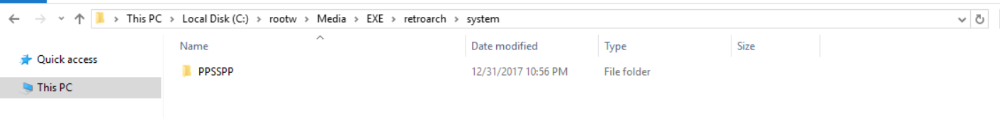
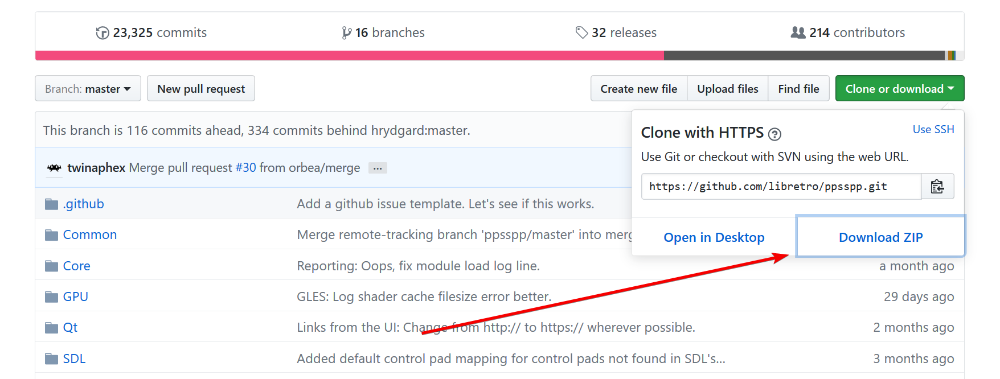
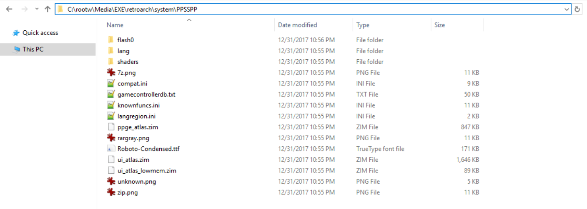
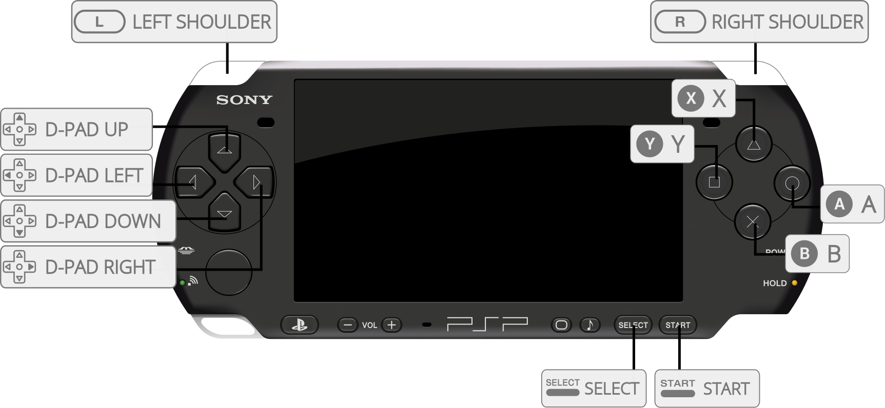

# Sony - PlayStation Portable (PPSSPP)

<iframe width="560" height="315" src="https://www.youtube-nocookie.com/embed/KYt6oXA1Bws" frameborder="0" allow="accelerometer; autoplay; clipboard-write; encrypted-media; gyroscope; picture-in-picture" allowfullscreen></iframe>

## Background

A PSP emulator for Android, Windows, Mac and Linux, written in C++.

The PPSSPP core supports [OpenGL](#opengl), [Vulkan](#vulkan), and [Direct3D 11](#d3d11) rendering.

The PPSSPP core has been authored by

- Henrik Hrydgard

The PPSSPP core is licensed under

- [GPLv2](https://github.com/hrydgard/ppsspp/blob/master/LICENSE.TXT)

A summary of the licenses behind RetroArch and its cores can be found [here](../development/licenses.md).

## Requirements

- OpenGL/Open GL ES 2.0 or higher for the OpenGL renderer.
- Vulkan for the Vulkan renderer.
- Direct3D 11 for the Direct3D 11 renderer.

## BIOS

The PPSSPP core requires assets files to be fully functional.

Assets such as fonts and backgrounds that are required for memory card screens.

In order to acquire PPSSPP's assets files and install them succcessfully, follow these steps.

!!! info
	Lakka users do not need to follow these steps. Lakka image ships with the assets already included. Those assets are compatible with the version of the core provided in the Lakka image. Using not compatible assets may lead to unexpected results.

### Installing from the 'Core System Files Downloader'

If your frontend version has `Main Menu > Online Updater > Core System Files Downloader` then that's the easiest solution, just download 'PPSSPP.zip' from that menu and you're all done!

### Installing from the GitHub repo

1 . Create a directory named PPSSPP in RetroArch's System directory.

```
RetroArch/
         └── system/
		           └── PPSSPP/
```

Here's an example of what it should look like.



2 . Visit [https://github.com/hrydgard/ppsspp](https://github.com/hrydgard/ppsspp) and download the repository.



3 . Extract ppsspp-master.zip

4 . Copy the contents of `ppsspp-master/assets` into 'system/PPSSPP'

The end result should look like this.



!!! attention
	Don't like PPSSPP's replacement fonts? You can place the original PSP fonts in 'system/PPSSPP/flash0/font'

## Extensions

Content that can be loaded by the PPSSPP core have the following file extensions:

- .elf
- .iso
- .cso
- .prx
- .pbp

RetroArch database(s) that are associated with the PPSSPP core:

- [Sony - PlayStation Portable](https://github.com/libretro/libretro-database/blob/master/rdb/Sony%20-%20PlayStation%20Portable.rdb)

## Features

Frontend-level settings or features that the PPSSPP core respects.

| Feature           | Supported |
|-------------------|:---------:|
| Restart           | ✔         |
| Saves             | ✔         |
| States            | ✔         |
| Rewind            | ✕         |
| Netplay           | ✕         |
| Core Options      | ✔         |
| RetroAchievements | ✔         |
| RetroArch Cheats  | ✕         |
| Native Cheats     | ✔         |
| Controls          | ✔         |
| Remapping         | ✔         |
| Multi-Mouse       | ✕         |
| Rumble            | ✕         |
| Sensors           | ✕         |
| Camera            | ✕         |
| Location          | ✕         |
| Subsystem         | ✕         |
| [Softpatching](../guides/softpatching.md) | ✕         |
| Disk Control      | ✕         |
| Username          | ✔         |
| Language          | ✔         |
| Crop Overscan     | ✕         |
| LEDs              | ✕         |

## Directories

The PPSSPP core's library name is 'PPSSPP'

The PPSSPP core saves/loads to/from these directories.

**Frontend's Save directory**

```
.
└── PSP/
       ├── PPSSPP_STATE/ (Used to be the state directory, no longer used)
       ├── SAVEDATA/ (In-game saves)
       ├── flash0/ (Font override for real fonts dumped from PSP system)
       ├── Cheats/ (Internal Cheats directory, disabled by default)
       ├── GAME/ (DLC directory)
       └── SYSTEM/
                 └── CACHE/ (Shader cache)
```

**Frontend's State directory**

| File     | Description |
|:--------:|:-----------:|
| *.state# | State       |

## Geometry and timing

- The PPSSPP core's core provided FPS is 60
- The PPSSPP core's core provided sample rate is 44100 Hz
- The PPSSPP core's base width is dependent on the 'Internal Resolution' core option
- The PPSSPP core's base height is dependent on the 'Internal Resolution' core option
- The PPSSPP core's max width is dependent on the 'Internal Resolution' core option
- The PPSSPP core's max height is dependent on the 'Internal Resolution' core option
- The PPSSPP core's core provided aspect ratio is 16/9

## Language

When the 'Language' core option is set to automatic, the default PPSSPP language setting will be pulled from RetroArch's Language setting.

## Nickname

PPSSPP's default nickname setting is pulled from RetroArch's nickname setting.

## Internal Cheats

Disabled by default.

**To enable and allow the use of ini cheat files in save\PSP\Cheats, set the 'Internal Cheats Support' core option to enabled.**

Cheats can be used to unlock 60fps in several 30fps games.

Each code can be activated or disabled in the ini directly with _C1 in place of _C0 on the title line.

[PPSSPP forums thread](http://forums.ppsspp.org/showthread.php?tid=3590)

## DLC

DLCs need to be installed in the GAME directory. Create the GAME directory in the PSP directory and it should look like this.

RetroArch\saves\PPSSPP\PSP\GAME\

## OpenGL

PPSSPP's OpenGL renderer can be used by setting RetroArch's video driver to gl.

The common option for all operating systems is OpenGL, requiring hardware that supports OpenGL/Open GL ES 2.0 or higher. It is an older, pre-Vulkan API, slower than Vulkan but with better compatibility. If you encounter problems with other APIs, try this one.

## Vulkan

PPSSPP's Vulkan renderer can be used by setting RetroArch's video driver to vulkan.

This is the latest and fastest API currently. It is most recommended for demanding less of your CPU, thus being the fastest.

## D3D11

PPSSPP's Direct3D 11 renderer can be used by setting RetroArch's video driver to d3d11.

In some cases Direct3D 11 may offer better performance than OpenGL, especially on integrated Intel graphics.

## Core options

The PPSSPP core has the following option(s) that can be tweaked from the core options menu. The default setting is bolded.

Settings with (Restart) means that core has to be closed for the new setting to be applied on next launch.

- **CPU Core** [ppsspp_cpu_core] (**jit**|IR jit|interpreter)

    The jit setting enables the Dynamic Recomplier (Dynarec) for CPU emulation. The Dynarec is much faster than the interpreter setting and is the default, recommended mode for supported architectures.

    The interpreter setting enables the Interpreter for CPU emulation. The Interpreter is a very slow type of emulation and mostly useful for debug, but should work anywhere.

	The IR jit setting might be worth trying against games which are broken in the other two settings.

- **Locked CPU Speed** [ppsspp_locked_cpu_speed] (**off**|222MHz|266MHz|333MHz)

	Allows you to lock the internal CPU clock of the emulator (of the emulated CPU).

	Larger clocks can ensure a more stable performance in certain games that present problems even on a real PSP, but it requires more powerful hardware.

	Lower clocks can help weak hardware have more comfortable gameplay, limiting FPS to a lower rate.

	Changing this option opens the door to several bugs that may compromise some games.

	In case of doubt, keep this on off.

- **Language** [ppsspp_language] (**automatic**|english|japanese|french|spanish|german|italian|dutch|portuguese|russian|korean|chinese_traditional|chinese_simplified)

    Configure the PPSSPP's system language.

	When set to automatic, the default PPSSPP language setting will be pulled from RetroArch's Language setting.

- **Rendering Mode** [ppsspp_rendering_mode] (**buffered**|nonbuffered)

	Buffered mode renders graphics close to what is in the actual PSP, with all the effects and with the least possible bugs.

	Nonbuffered mode skips most heavier graphics effects like blur, bloom, reflections, shadows, and more. It can be used as a speed hack if it is underperforming because of a weak GPU.

- **True Color Depth** [ppsspp_true_color] (**enabled**|disabled)

	Enhance the colors compared to the older models of PSPs which have lower quality screens.

	It's best to keep this enabled.

- **Auto Frameskip** [ppsspp_auto_frameskip] (**disabled**|enabled)

	This option only selects the optimal number of frames to skip to not to compromise both gameplay. The max frames to be skipped can be limited in the Frameskip option.

- **Frameskip** [ppsspp_frameskip] (**0**|1|2|3|4|5|6|7|8|9)

	This option skips image frames to increase the emulation speed. They can be skipped between 1 and 8 frames every second. Using this option can give the impression of the game running faster but with stuttering, and this increases the amount of frames to be skipped you select. This option is only effective when your processor is powerful enough.

- **Force Max FPS** [ppsspp_force_max_fps] (**disabled**|enabled)

	Prevents FPS form exceeding 60.

	This option was created in order to help God of War games that used to have a performance problem because the FPS were higher than normal. This option locks the FPS to 60 to avoid this problem.

- **Audio latency** [ppsspp_audio_latency] (**low**|medium|high)

	Configure the audio latency.

- **Internal Resolution** [ppsspp_internal_resolution] (**480x272**|960x544|1440x816|1920x1088|2400x1360|2880x1632|3360x1904|3840x2176|4320x2448|4800x2720)

	**The 'Rendering Mode' core option must be set to buffered for this to have any effect.**

	Controls the internal resolution of the graphics, significant performance impact if your GPU is not powerful enough for certain resolutions.

- **Confirmation Button** [ppsspp_button_preference] (**cross**|circle)

	Select whether the cross input or the circle input is the confirmation button.

- **Fast Memory (Speedhack)** [ppsspp_fast_memory] (**enabled**|disabled)

	This option avoids some memory accesses by caching information, however a few games may have problems when this option is enabled, most run with no problem.

- **Block Transfer GPU** [ppsspp_block_transfer_gpu] (**enabled**|disabled)

	This option simulates support for rendering effects not supported by current hardware, but supported by PSP hardware. Fixes multiple graphics problems in a number of games, but decreases performance on weaker GPUs (on smartphones). Disabling can greatly impact performance, and can be a great help in games that do not need this option enabled.

- **Texture Scaling Level** [ppsspp_texture_scaling_level] (**1**|2|3|4|5|0)

	With this option, you can make modifications to the texture scale level, which improves the visual at high resolutions.

	All the scaling is made by CPU and results in a great performance impact. Use carefully.

- **Texture Scaling Type** [ppsspp_texture_scaling_type] (**xbrz**|hybrid|bicubic|hybrid_bicubic)

	Choose the Texture Upscale Type.

	xBRZ is overall the best option while Hybrid is a slower version of xBRZ and doesn't offers much difference, Hybrid + Bicubic is the slowest one using two effects.

- **Texture Filtering** [ppsspp_texture_filtering] (**auto**|nearest|linear|linear(FMV))

	Apply texture filtering.

	Stick to auto in case of doubt.

- **Anisotropic Filtering** [ppsspp_texture_anisotropic_filtering] (**off**|1x|2x|4x|8x|16x)

	Modify the Anisotropic Filtering, which fixes the textures on the horizon that are drawn at angles resulting in a better look.

- **Texture Deposterize** [ppsspp_texture_deposterize] (**disabled**|enabled)

	Deposterize fixes small in-texture glitches that may happen when the texture is upscaled.

- **GPU Hardware T&L** [ppsspp_gpu_hardware_transform] (**enabled**|disabled)

	Uses the hardware to generate lighting and shading effects. With this option disabled performance may drop a lot on weak GPUs. Bugs are rare, but if found, can be disabled for testing.

- **Vertex Cache (Speedhack)** [ppsspp_vertex_cache] (**enabled**|disabled)

	Uses vertex cache to improve performance in few games, in rare cases can cause glitches in geometry. Some games have reduced performance with this option enabled. This option mostly benefits OpenGL API, doesn't need to be enabled to other backends.

- **IO Threading** [ppsspp_separate_io_thread] (**disabled**|enabled)

	Uses separate CPU thread for input/output of files (read data).

- **Unsafe FuncReplacements** [ppsspp_unsafe_func_replacements] (**enabled**|disabled)

	Enable unsafe CPU function replacements.

	May make games playable.

- **Sound Speedhack** [ppsspp_sound_speedhack] (**disabled**|enabled)

	It helps in some games, like Dead or Alive, with problems in sound speed.

- **Internal Cheats Support** [ppsspp_cheats] (**disabled**|enabled)

	Enables internal cheats. Look at the [Internal Cheats section](#internal-cheats) for more information.

## Joypad



| RetroPad Inputs                                | User 1 input descriptors |
|------------------------------------------------|--------------------------|
|              | Cross                    |
|              | Square                   |
|         | Select                   |
|          | Start                    |
|        | D-Pad Up                 |
|      | D-Pad Down               |
|      | D-Pad Left               |
|     | D-Pad Right              |
|              | Circle                   |
|              | Triangle                 |
|             | L                        |
|             | R                        |
|  X  | Analog X                 |
|  Y  | Analog Y                 |

## Compatibility

- [PPSSPP Compatibility List](http://report.ppsspp.org/games)

## External Links

- [Official PPSSPP Website](http://www.ppsspp.org/)
- [Official PPSSPP Github Repository](https://github.com/hrydgard/ppsspp)
- [Libretro PPSSPP Core info file](https://github.com/libretro/libretro-super/blob/master/dist/info/ppsspp_libretro.info)
- [Report Libretro PPSSPP Core Issues Here](https://github.com/libretro/ppsspp/issues)
- [Gameplay Videos](https://www.youtube.com/playlist?list=PLRbgg4gk_0IcjmP26m8-3JWNzYUXRjqWT)
