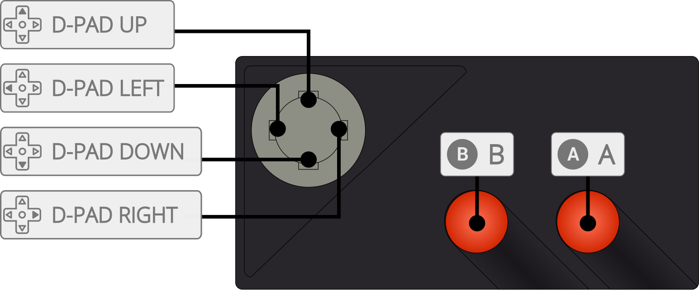

# Atari - 7800 (ProSystem)

## Background

ProSystem is an Atari 7800 emulator.

### Author/License

The ProSystem core has been authored by

- Greg Stanton
- Brian Berlin
- Leonis
- Greg DeMent

The ProSystem core is licensed under

- [GPLv2](https://github.com/libretro/prosystem-libretro/blob/master/License.txt)

A summary of the licenses behind RetroArch and its cores can be found [here](../development/licenses.md).

## Extensions

Content that can be loaded by the ProSystem core have the following file extensions:

- .a78
- .bin

## Databases

RetroArch database(s) that are associated with the ProSystem core:

- [Atari - 7800](https://github.com/libretro/libretro-database/blob/master/rdb/Atari%20-%207800.rdb)

## BIOS

Required or optional firmware files go in the frontend's system directory.

| Filename          | Description          | md5sum                           |
|:-----------------:|:--------------------:|:--------------------------------:|
| 7800 BIOS (U).rom | 7800 BIOS - Optional | 0763f1ffb006ddbe32e52d497ee848ae |

## Features

Frontend-level settings or features that the ProSystem core respects.

| Feature           | Supported |
|-------------------|:---------:|
| Restart           | ✔         |
| Screenshots       | ✔         |
| Saves             | ✕         |
| States            | ✔         |
| Rewind            | ✔         |
| Netplay           | ✕         |
| Core Options      | ✕         |
| [Memory Monitoring (achievements)](../guides/memorymonitoring.md) | ✔         |
| RetroArch Cheats  | ✕         |
| Native Cheats     | ✕         |
| Controls          | ✔         |
| Remapping         | ✔         |
| Multi-Mouse       | ✕         |
| Rumble            | ✕         |
| Sensors           | ✕         |
| Camera            | ✕         |
| Location          | ✕         |
| Subsystem         | ✕         |
| [Softpatching](../guides/softpatching.md) | ✕         |
| Disk Control      | ✕         |
| Username          | ✕         |
| Language          | ✕         |
| Crop Overscan     | ✕         |
| LEDs              | ✕         |

### Directories

The ProSystem core's internal core name is 'ProSystem'

The ProSystem core saves/loads to/from these directories.

**Frontend's State directory**

- 'content-name'.state# (State)

### Geometry and timing

- The ProSystem core's core provided FPS is 60 for NTSC games and 50 for PAL games.
- The ProSystem core's core provided sample rate is 32640 Hz for NTSC games and 31200 Hz for PAL games
- The ProSystem core's core provided base width is 320
- The ProSystem core's core provided base height is 223 for NTSC games and 272 for PAL games
- The ProSystem core's core provided max width is 320
- The ProSystem core's core provided max height is 292
- The ProSystem core's core provided aspect ratio is 4/3

## Core options

The ProSystem core has the following option(s) that can be tweaked from the core options menu. The default setting is bolded.

#### Video

- **Color Depth (Restart)** [prosystem_color_depth] (**Thousands (16-bit)**|Millions (24-bit))

	Specifies number of colors to display on-screen. 24-bit may increase performance overheads on some platforms.

#### Audio

- **Audio Filter** [prosystem_low_pass_filter] (**OFF**|ON)

	Enables a low pass audio filter to soften the 'harsh' sound produced by the Atari 7800's TIA chip.

- **Audio Filter Level** [prosystem_low_pass_range] (5%|10%|15%|20%|25%|30%|35%|40%|45%|50%|55%|**60%**|65%|70%|75%|80%|85%|90%|95%)

	Specifies the cut-off frequency of the low pass audio filter. A higher value increases the perceived 'strength' of the filter, since a wider range of the high frequency spectrum is attenuated.

#### Input

- **Dual Stick Controller** [prosystem_gamepad_dual_stick_hack] (**OFF**|ON)

	Maps Player 2's joystick to the right analog stick of Player 1's RetroPad. Enables dual stick control in supported games (e.g. Robotron: 2084, T:ME Salvo).

## Controllers

The ProSystem core supports the following device type(s) in the controls menu, bolded device types are the default for the specified user(s):

### User 1 - 2 device types

- None - Doesn't disable input. There's no reason to switch to this.
- **RetroPad** - Joypad - Stay on this.
- RetroPad w/Analog - Joypad - Same as RetroPad. There's no reaosn to switch to this.

### Controller tables

#### Joypad

| User 1 Remap descriptors | RetroPad Inputs                             |
|--------------------------|---------------------------------------------|
| B                        |           |
| Console Select           |      |
| Console Pause            |       |
| Up                       |     |
| Down                     |   |
| Left                     |   |
| Right                    |  |
| 2                        |           |
| Console Reset            |           |
| Left Difficulty          |          |
| Right Difficulty         |          |

| User 2 Remap descriptors | RetroPad Inputs                             |
|--------------------------|---------------------------------------------|
| 1                        |           |
| Up                       |     |
| Down                     |   |
| Left                     |   |
| Right                    |  |
| 2                        |           |

## External Links

- [Official ProSystem Website](https://gstanton.github.io/ProSystem1_3/)
- [Official ProSystem Github Repository](https://github.com/gstanton/ProSystem1_3)
- [Libretro ProSystem Core info file](https://github.com/libretro/libretro-super/blob/master/dist/info/prosystem_libretro.info)
- [Libretro ProSystem Github Repository](https://github.com/libretro/prosystem-libretro)
- [Report Libretro ProSystem Core Issues Here](https://github.com/libretro/prosystem-libretro/issues)
