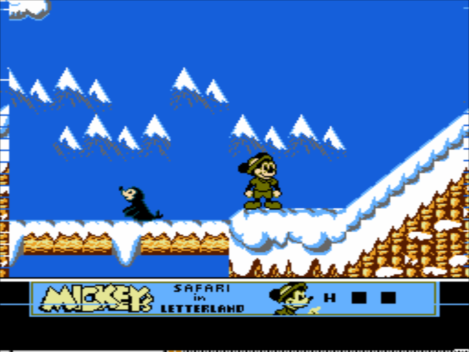

# Nintendo - NES / Famicom (QuickNES)

## Background

Nes_Emu, the core NES emulator library used by QuickNES, began as a very simple NES emulator sometime in 2004. It was based on the 6502 CPU core and APU sound core used in the Game_Music_Emu sound engine.

### Author/License

The QuickNES core has been authored by

- blargg
- kode54

The QuickNES core is licensed under

- [LGPLv2.1+](https://github.com/kode54/QuickNES/blob/master/COPYING)

A summary of the licenses behind RetroArch and its cores have found [here](https://docs.libretro.com/tech/licenses/).

## Extensions

Content that can be loaded by the QuickNES core have the following file extensions:

- .nes

## Databases

RetroArch database(s) that are associated with the QuickNES core:

- [Nintendo - Nintendo Entertainment System](https://github.com/libretro/libretro-database/blob/master/rdb/Nintendo%20-%20Nintendo%20Entertainment%20System.rdb)

## Features

Frontend-level settings or features that the QuickNES core respects.

| Feature           | Supported |
|-------------------|:---------:|
| Restart           | ✔         |
| Screenshots       | ✔         |
| Saves             | ✔         |
| States            | ✔         |
| Rewind            | ✔         |
| Netplay           | ✔         |
| Core Options      | ✕         |
| RetroAchievements | ✔         |
| RetroArch Cheats  | ✕         |
| Native Cheats     | ✕         |
| Controls          | ✔         |
| Remapping         | ✔         |
| Multi-Mouse       | ✕         |
| Rumble            | ✕         |
| Sensors           | ✕         |
| Camera            | ✕         |
| Location          | ✕         |
| Subsystem         | ✕         |
| [Softpatching](https://docs.libretro.com/guides/softpatching/) | ✔         |
| Disk Control      | ✕         |
| Username          | ✕         |
| Language          | ✕         |
| Crop Overscan     | ✔         |
| LEDs              | ✕         |

### Directories

The QuickNES core's directory name is 'QuickNES'

The QuickNES core saves/loads to/from these directories.

**Frontend's Save directory**

- 'content-name'.srm (Cartridge battery save)

**Frontend's State directory**

- 'content-name'.state# (State)

### Geometry and timing

- The QuickNES core's core provided FPS is 60
- The QuickNES core's core provided sample rate is 44100 Hz
- The QuickNES core's core provided aspect ratio is 4/3

## Controllers

The QuickNES core supports the following device type(s) in the controls menu, bolded device types are the default for the specified user(s):

### User 1 - 2 device types

- None - Doesn't disable input.
- **RetroPad** - Joypad
- RetroPad w/ Analog - Joypad - There's no reason to switch to this.**

### Controller tables

#### Joypad

| User 1 - 2 Remap descriptors | RetroPad Inputs                              |
|------------------------------|----------------------------------------------|
| B                            |        |
| Select                       |         |
| Start                        |          |
| D-Pad Up                     |        |
| D-Pad Down                   |      |
| D-Pad Left                   |      |
| D-Pad Right                  |     |
| A                            |        |

## Compatibility

| Game                          | Issue                                                                    |
|-------------------------------|--------------------------------------------------------------------------|
| Burai Fighter                 | Softlocks when entering a level.                                         |
| Crisis Force                  | Crashes on start.                                                        |
| Family Circuit '91            | Crashes on start.                                                        |
| Gradius II                    | Crashes on start.                                                        |
| Huge Insect                   | No enemies spawn.                                                        |
| Lagrange Point                | Crashes on start.                                                        |
| Mickey's Safari in Letterland | Graphical glitches on the sides of the screen and on the status bar. (1) |
| Ms. Pac-Man (Tengen version)  | Graphical glitches on the sides of the screen.                           |
| Skull & Crossbones            | Crashes on start.                                                        |

??? note "(1)"
    

## External Links

- [Official QuickNES Github Repository](https://github.com/kode54/QuickNES)
- [Libretro QuickNES Core info file](https://github.com/libretro/libretro-super/blob/master/dist/info/quicknes_libretro.info)
- [Libretro QuickNES Github Repository](https://github.com/libretro/QuickNES_Core)
- [Report Libretro QuickNES Core Issues Here](https://github.com/libretro/QuickNES_Core/issues)

### See also

#### Nintendo - Nintendo Entertainment System

- [Nintendo - NES / Famicom (bnes)](https://docs.libretro.com/library/bnes/)
- [Nintendo - NES / Famicom (Emux NES)](https://docs.libretro.com/library/emux_nes/)
- [Nintendo - NES / Famicom (FCEUmm)](https://docs.libretro.com/library/fceumm/)
- [Nintendo - NES / Famicom (Mesen)](https://docs.libretro.com/library/mesen/)
- [Nintendo - NES / Famicom (Nestopia UE)](https://docs.libretro.com/library/nestopia_ue/)