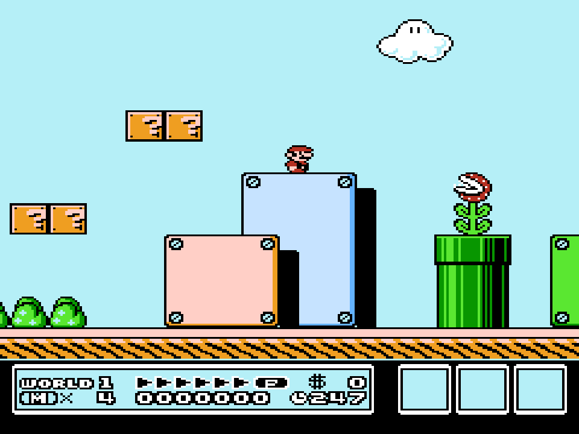
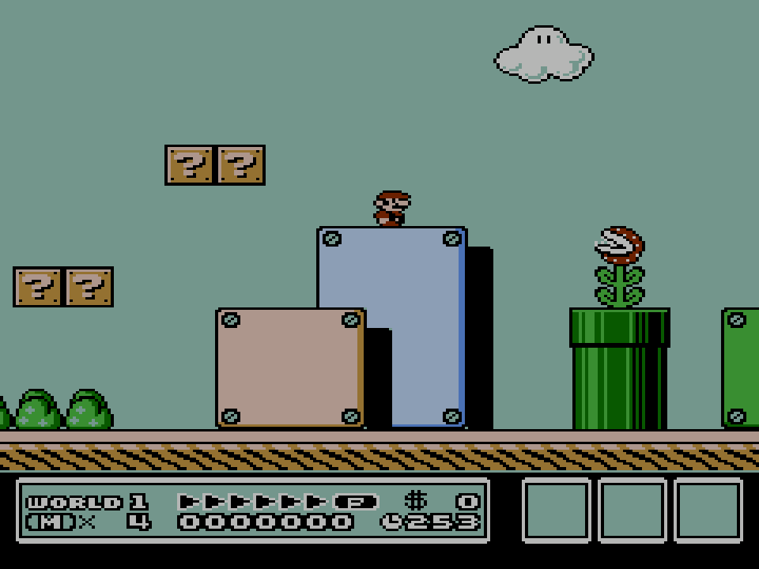
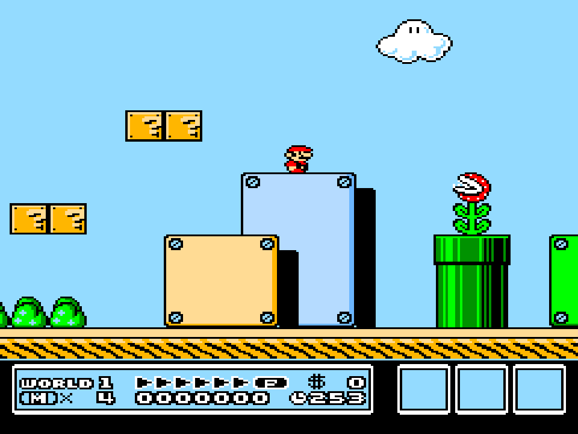
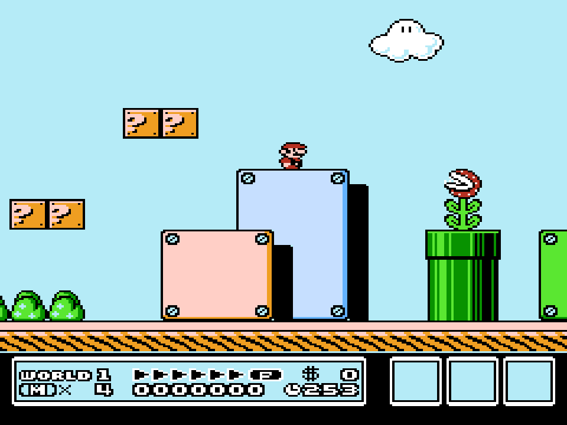
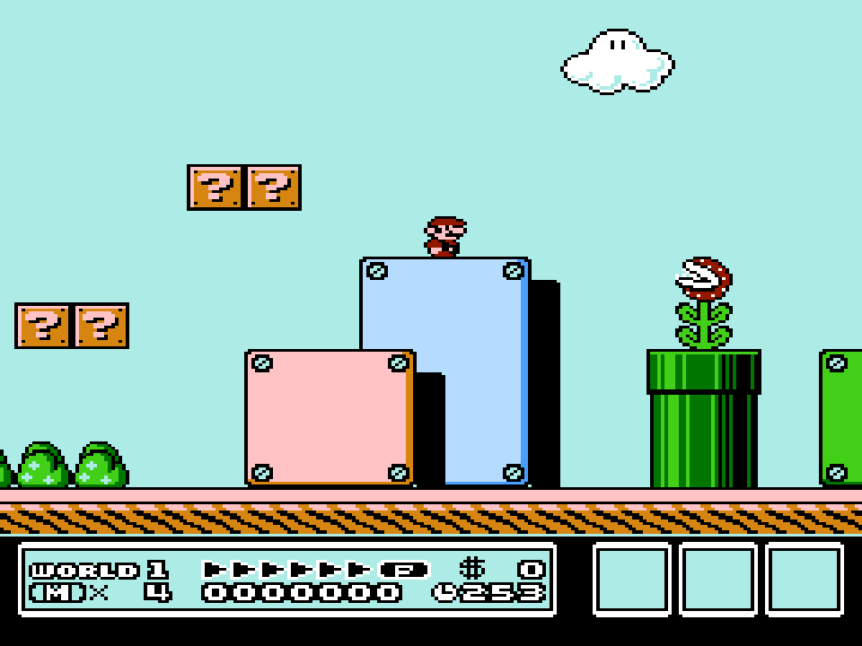
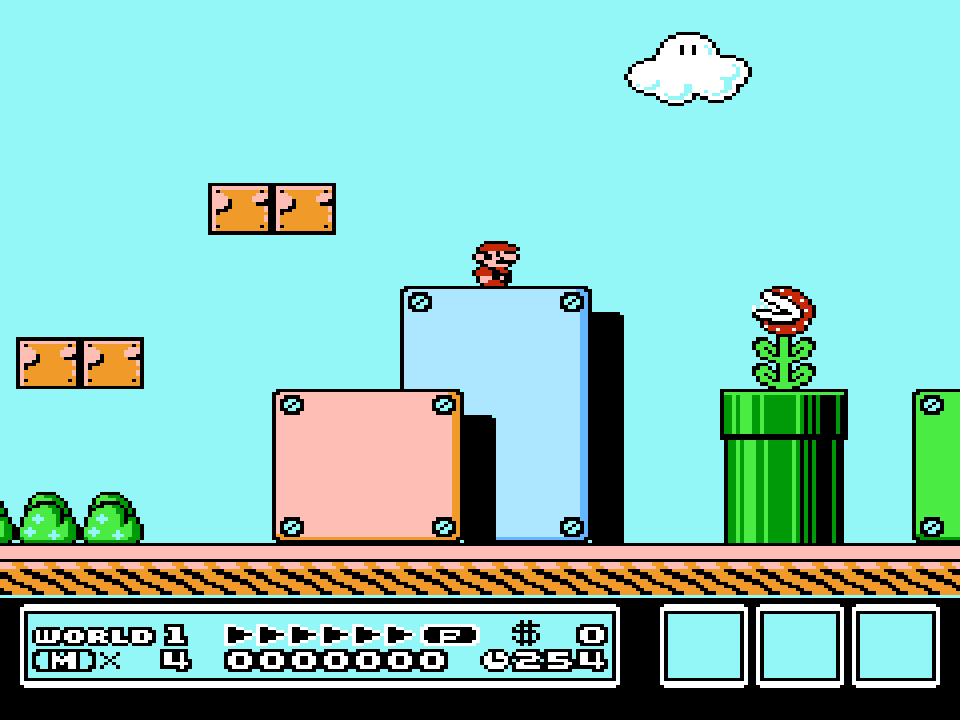
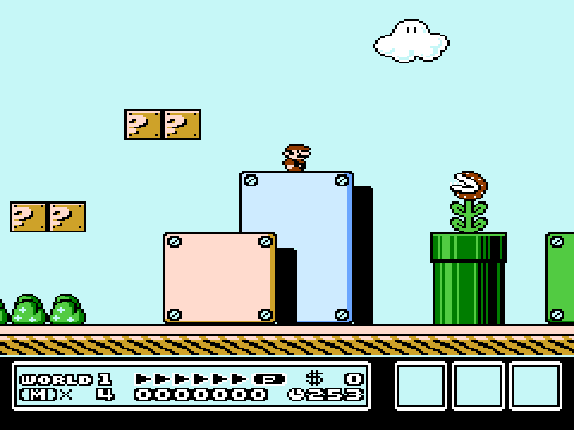
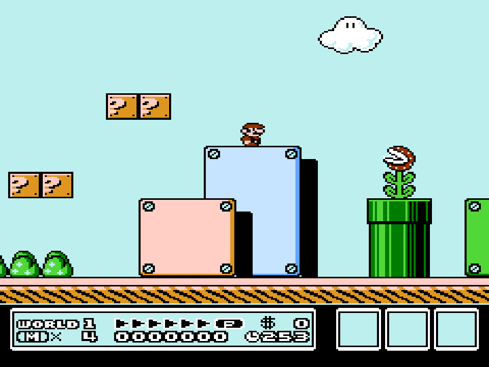

# Nintendo - NES / Famicom (QuickNES)

## Background

Nes_Emu, the core NES emulator library used by QuickNES, began as a very simple NES emulator sometime in 2004. It was based on the 6502 CPU core and APU sound core used in the Game_Music_Emu sound engine.

The QuickNES core has been authored by

- blargg
- kode54

The QuickNES core is licensed under

- [GPLv2](https://github.com/kode54/QuickNES/blob/master/COPYING)

A summary of the licenses behind RetroArch and its cores can be found [here](../development/licenses.md).

## Compatibility

| Game               | Issue                                                                         |
|--------------------|-------------------------------------------------------------------------------|
| Burai Fighter      | Softlocks when entering a level. Confirmed issue. MMC3 incompatible.          |
| Family Circuit '91 | Crashes on start. Unsupported Mapper 210.                                     |
| Huge Insect        | No enemies spawn. Mapper 3 confirmed issue. Unemulated bus conflict handling. |
| Skull & Crossbones | Crashes on start. Unsupported Mapper.                                         |

## Extensions

Content that can be loaded by the QuickNES core have the following file extensions:

- .nes

RetroArch database(s) that are associated with the QuickNES core:

- [Nintendo - Nintendo Entertainment System](https://github.com/libretro/libretro-database/blob/master/rdb/Nintendo%20-%20Nintendo%20Entertainment%20System.rdb)

## Features

Frontend-level settings or features that the QuickNES core respects.

| Feature           | Supported |
|-------------------|:---------:|
| Restart           | ✔         |
| Screenshots       | ✔         |
| Saves             | ✔         |
| States            | ✔         |
| Rewind            | ✔         |
| Netplay           | ✔         |
| Core Options      | ✔         |
| RetroAchievements | ✔         |
| RetroArch Cheats  | ✕         |
| Native Cheats     | ✕         |
| Controls          | ✔         |
| Remapping         | ✔         |
| Multi-Mouse       | ✕         |
| Rumble            | ✕         |
| Sensors           | ✕         |
| Camera            | ✕         |
| Location          | ✕         |
| Subsystem         | ✕         |
| [Softpatching](../guides/softpatching.md) | ✔         |
| Disk Control      | ✕         |
| Username          | ✕         |
| Language          | ✕         |
| Crop Overscan     | ✕         |
| LEDs              | ✕         |

### Directories

The QuickNES core's library name is 'QuickNES'

The QuickNES core saves/loads to/from these directories.

**Frontend's Save directory**

| File  | Description            |
|:-----:|:----------------------:|
| *.srm | Cartridge battery save |

**Frontend's State directory**

| File     | Description |
|:--------:|:-----------:|
| *.state# | State       |

### Geometry and timing

- The QuickNES core's core provided FPS is 60
- The QuickNES core's core provided sample rate is 44100 Hz
- The QuickNES core's base width is 256
- The QuickNES core's base height is 240
- The QuickNES core's max width is 256
- The QuickNES core's max height is 240
- The QuickNES core's core provided aspect ratio is 4/3 when the 'Aspect Ratio' core option is set to 4/3
- The QuickNES core's core provided aspect ratio is 8/7 when the 'Aspect Ratio' core option is set to 8/7

## Core options

The QuickNES core has the following option(s) that can be tweaked from the core options menu. The default setting is bolded.

Settings with (Restart) means that core has to be closed for the new setting to be applied on next launch.

- **Allow Opposing Directions** [quicknes_up_down_allowed] (**disabled**|enabled)

	Enabling this will allow pressing / quickly alternating / holding both left and right (or up and down in some games) directions at the same time.

	This may cause movement based glitches to occur in certain games.

	It's best to keep this core option disabled.

- **Aspect ratio** [quicknes_aspect_ratio_par] (**PAR**|4:3)

	Configure QuickNES's core provided aspect ratio.

- **Show horizontal overscan** [quicknes_use_overscan_h] (**enabled**|disabled)

	Set this to disabled to crop out (horizontally) the potentially random glitchy video output that would have been hidden by the bezel around the edge of a standard-definition television screen.

- **Show vertical overscan** [quicknes_use_overscan_v] (**disabled**|enabled)

	Set this to disabled to crop out (vertically) the potentially random glitchy video output that would have been hidden by the bezel around the edge of a standard-definition television screen.

- **No sprite limit** [quicknes_no_sprite_limit] (**enabled**|disabled)

        Removes the 8-per-scanline hardware limit. This reduces sprite flickering but can cause some games to glitch since some use this for effects.

- **Audio mode** [quicknes_audio_nonlinear] (**nonlinear**|linear|stereo panning)

	Configure audio mode.

	Stereo panning simulates stereo by using a panning method and some reverb effects to add some depth.

- **Audio equalizer preset** [quicknes_audio_eq] (**default**|famicom|tv|flat|crisp|tinny)

	Applies a preset to the audio equalizer.

- **Color Palette** [quicknes_palette] (**default**|asqrealc|nintendo-vc|rgb|yuv-v3|unsaturated-final|sony-cxa2025as-us|pal|bmf-final2|bmf-final3|smooth-fbx|composite-direct-fbx|pvm-style-d93-fbx|ntsc-hardware-fbx|nes-classic-fbx-fs|nescap|wavebeam)

	Specifies which color palette to use when decoding the NTSC video signal output by the NES.

??? note "Color Palette: default"
    

??? note "Color Palette: asqrealc"
    

??? note "Color Palette: nintendo-vc"
    

??? note "Color Palette: rgb"
    

??? note "Color Palette: yuv-v3"
    

??? note "Color Palette: unsaturated-final"
    

??? note "Color Palette: sony-cxa2025as-us"
    

??? note "Color Palette: pal"
    

??? note "Color Palette: bmf-final2"
    

??? note "Color Palette: bmf-final3"
    

??? note "Color Palette: smooth-fbx"
    

??? note "Color Palette: composite-direct-fbx"
    

??? note "Color Palette: pvm-style-d93-fbx"
    

??? note "Color Palette: ntsc-hardware-fbx"
    

??? note "Color Palette: nes-classic-fbx-fs"
    

??? note "Color Palette: nescap"
    

??? note "Color Palette: wavebeam"
    

- **Turbo enable** [quicknes_turbo_enable] (**none**|player 1|player 2|both)

	Enables the use of the [Turbo A and Turbo B buttons](#joypad).

- **Turbo pulse width (in frames)** [quicknes_turbo_pulse_width] (**3**|5|10|15|30|60|1|2)

	Specifies both the width and spacing (in frames) of input 'pulses' when the [Turbo A and Turbo B buttons](#joypad) are held down. For example, the default setting of '3' corresponds to a (60/(3+3)) = 10 Hz turbo frequency (10 presses per second).

## Joypad

| User 1 - 2 input descriptors | RetroPad Inputs                             |
|------------------------------|---------------------------------------------|
| B                            |             |
| Turbo B                      |             |
| Select                       |        |
| Start                        |         |
| D-Pad Up                     |       |
| D-Pad Down                   |     |
| D-Pad Left                   |     |
| D-Pad Right                  |    |
| A                            |             |
| Turbo A                      |             |

## External Links

- [Official QuickNES Github Repository](https://github.com/kode54/QuickNES)
- [Libretro QuickNES Core info file](https://github.com/libretro/libretro-super/blob/master/dist/info/quicknes_libretro.info)
- [Libretro QuickNES Github Repository](https://github.com/libretro/QuickNES_Core)
- [Report Libretro QuickNES Core Issues Here](https://github.com/libretro/QuickNES_Core/issues)

## Nintendo - Nintendo Entertainment System

- [Nintendo - NES / Famicom (bnes)](bnes.md)
- [Nintendo - NES / Famicom (Emux NES)](emux_nes.md)
- [Nintendo - NES / Famicom (FCEUmm)](fceumm.md)
- [Nintendo - NES / Famicom (Mesen)](mesen.md)
- [Nintendo - NES / Famicom (Nestopia)](nestopia.md)
