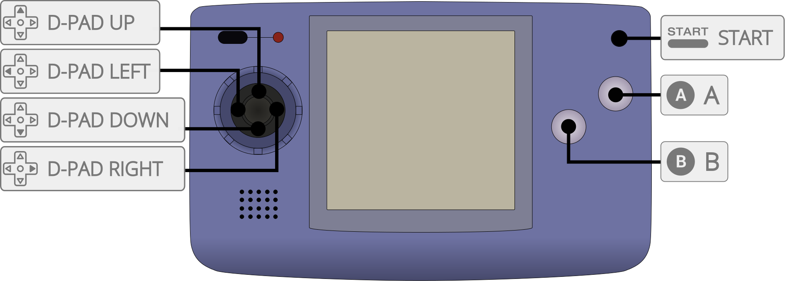

# SNK - Neo Geo Pocket / Color (RACE)

## Background

RACE is a Neo Geo Pocket (NGP) and Neo Geo Pocket Color (NGPC) emulator for
multiple platforms.

### Author/License

The RACE core has been authored by

- Judge_
- Flavor
- Akop Karapetyan
- theelf
- frangarcj
- negativeExponent

The RACE core is licensed under

- [GPLv2](https://github.com/libretro/RACE/blob/master/license.txt)

A summary of the licenses behind RetroArch and its cores can be found [here](../development/licenses.md).

## Extensions

Content that can be loaded by the RACE core have the following file extensions:

- .ngp
- .ngc

## Databases

RetroArch database(s) that are associated with the RACE core:

- [SNK - Neo Geo Pocket](https://github.com/libretro/libretro-database/blob/master/rdb/SNK%20-%20Neo%20Geo%20Pocket.rdb)
- [SNK - Neo Geo Pocket Color](https://github.com/libretro/libretro-database/blob/master/rdb/SNK%20-%20Neo%20Geo%20Pocket%20Color.rdb)

## Features

Frontend-level settings or features that the RACE! core respects.

| Feature           | Supported |
|-------------------|:---------:|
| Restart           | ✔         |
| Screenshots       | ✔         |
| Saves             | ✔         |
| States            | ✔         |
| Rewind            | ✔         |
| Netplay           | ✔ (not link-cable emulation)         |
| Core Options      | ✔         |
| RetroAchievements | ✔         |
| RetroArch Cheats  | ✕         |
| Native Cheats     | ✕         |
| Controls          | ✔         |
| Remapping         | ✔         |
| Multi-Mouse       | ✕         |
| Rumble            | ✕         |
| Sensors           | ✕         |
| Camera            | ✕         |
| Location          | ✕         |
| Subsystem         | ✕         |
| [Softpatching](../guides/softpatching.md) | ✕         |
| Disk Control      | ✕         |
| Username          | ✕         |
| Language          | ✕         |
| Crop Overscan     | ✕         |
| LEDs              | ✕         |

### Directories

The RACE core's internal core name is 'RACE'

The RACE core saves/loads to/from these directories.

**Frontend's Save directory**

- 'content-name'.ngf (Cartrtidge battery save)

**Frontend's State directory**

- 'content-name'.state# (State)

### Geometry and timing

- The RACE core's core provided FPS is 60
- The RACE core's core provided sample rate is 44100 Hz
- The RACE core's core provided aspect ratio is 20/19

## Core options

The RACE core has the following option(s) that can be tweaked from the core options menu. The default setting is bolded.

Settings with (Restart) means that core has to be closed for the new setting to be applied on next launch.

- **Language (restart)** [race_language] (**english**/japanese)

	Choose the system language of the BIOS.

## Controllers

The RACE core supports the following device type(s) in the controls menu, bolded device types are the default for the specified user(s):

### User 1 device types

- None - Doesn't disable input.
- **RetroPad** - Joypad
- RetroPad w/Analog - Joypad - There's no reason to switch to this.

### Controller tables

#### Joypad

| User 1 Remap descriptors | RetroPad Inputs                                |
|--------------------------|------------------------------------------------|
| A                        |              |
| Option                   |          |
| D-Pad Up                 |        |
| D-Pad Down               |      |
| D-Pad Left               |      |
| D-Pad Right              |     |
| B                        |              |

## External Links

- [Libretro RACE Core info file](https://github.com/libretro/libretro-super/blob/master/dist/info/race_libretro.info)
- [Libretro RACE Github Repository](https://github.com/libretro/RACE)
- [Report Libretro RACE Core Issues Here](https://github.com/libretro/RACE/issues)
