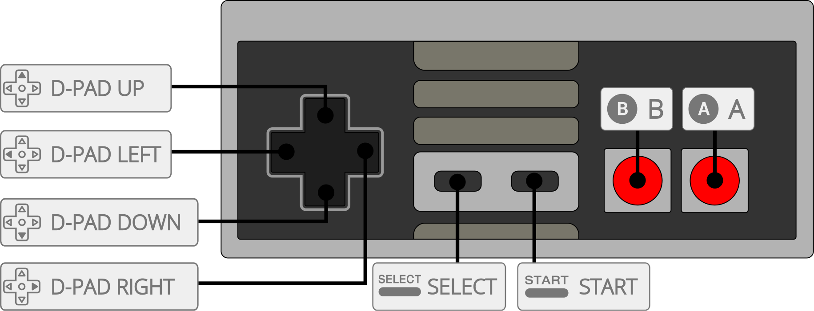

# Nintendo - NES / Famicom (RustyNES)

## Background

RustyNES is a cycle-accurate Nintendo Entertainment System (NES) and Famicom emulator written entirely in pure Rust. It targets the highest accuracy bar (comparable to Mesen and higan) through strict lockstep timing at PPU-dot resolution, without relying on threading or standard library timing.

It is extremely portable and deterministic, making it a reliable choice for netplay, TAS, and accurate emulation enthusiasts.

### Author/License

The RustyNES core has been authored by

- DoubleGate

The RustyNES core is licensed under

- MIT OR Apache-2.0

A summary of the licenses behind RetroArch and its cores can be found [here](../development/licenses.md).

## Extensions

Content that can be loaded by the RustyNES core have the following file extensions:

- .nes

## Databases

RetroArch database(s) that are associated with the RustyNES core:

- [Nintendo - Nintendo Entertainment System](https://github.com/libretro/libretro-database/blob/master/rdb/Nintendo%20-%20Nintendo%20Entertainment%20System.rdb)

## Features

Frontend-level settings or features that the RustyNES core respects.

| Feature           | Supported |
|-------------------|:---------:|
| Restart           | ✔         |
| Screenshots       | ✔         |
| Saves             | ✔         |
| States            | ✔         |
| Rewind            | ✔         |
| Netplay           | ✔         |
| Core Options      | ✕         |
| [Memory Monitoring (achievements)](../guides/memorymonitoring.md) | ✔         |
| RetroArch Cheats  | ✕         |
| Native Cheats     | ✕         |
| Controls          | ✔         |
| Remapping         | ✔         |
| Multi-Mouse       | ✕         |
| Rumble            | ✕         |
| Sensors           | ✕         |
| Camera            | ✕         |
| Location          | ✕         |
| Subsystem         | ✕         |
| [Softpatching](../guides/softpatching.md) | ✔         |
| Disk Control      | ✕         |
| Username          | ✕         |
| Language          | ✕         |
| Crop Overscan     | ✕         |
| Active Touchpad   | ✕         |

## Directories

The RustyNES core's directory name is 'RustyNES'.

### BIOS

No BIOS files are strictly required to use the RustyNES core.

## Joypad

| User 1 - 2 input descriptors | RetroPad Inputs                           |
|------------------------------|-------------------------------------------|
| B                            |         |
| A                            |         |
| Select                       |    |
| Start                        |     |
| D-Pad Up                     |   |
| D-Pad Down                   | |
| D-Pad Left                   | |
| D-Pad Right                  | |
