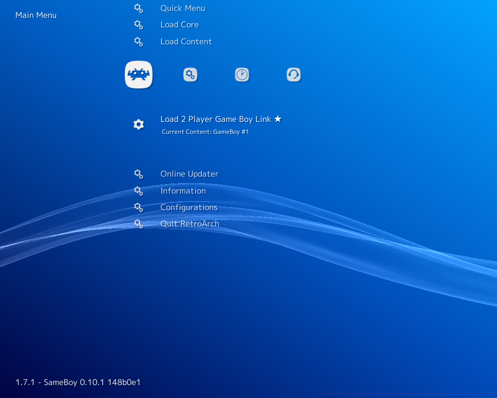
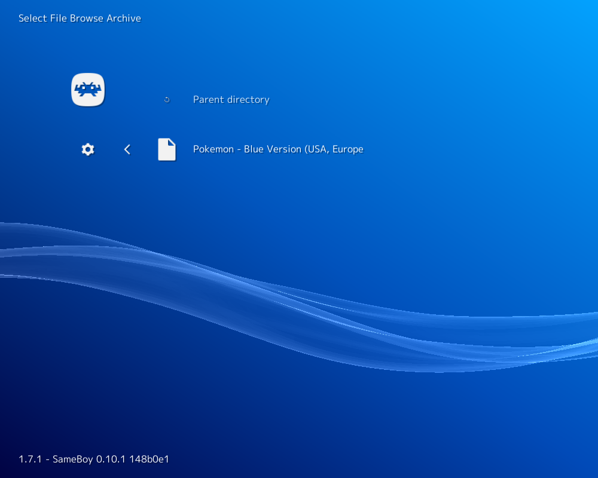
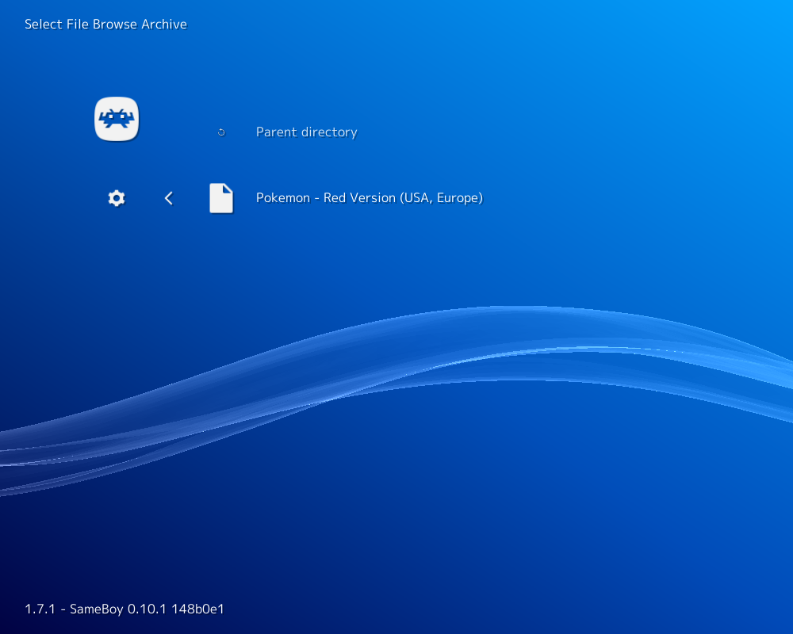
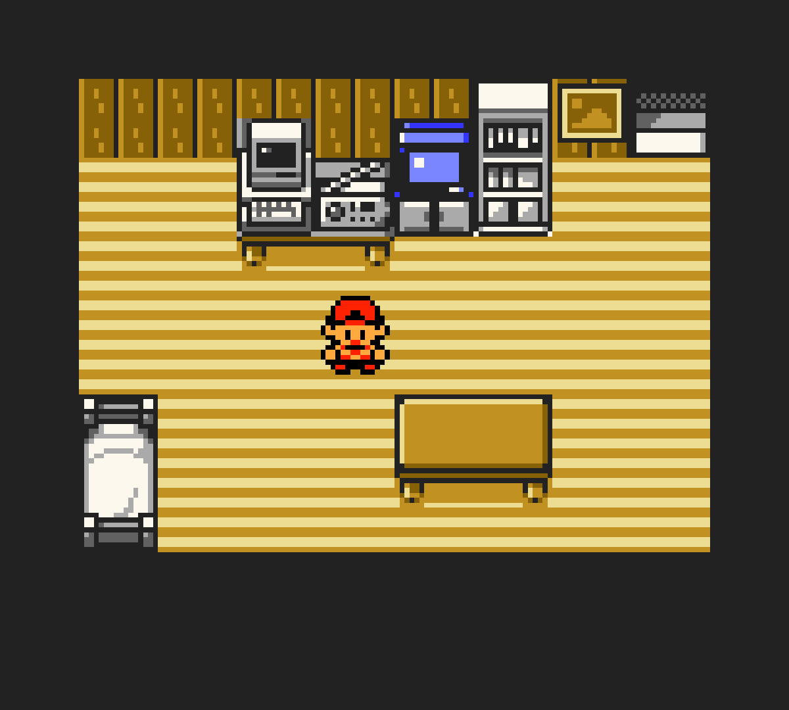

# Nintendo - Game Boy / Color (SameBoy)

## Background

SameBoy is an extremely accurate open source Gameboy (DMG) and Gameboy Color (CGB) emulator, written in portable C.

- Supports GameBoy (DMG) and GameBoy Color (CGB) emulation
- Battery save support
- Save states
- Includes open source DMG and CGB boot ROMs
- Real time clock emulation
- Extremely high accuracy
- Link-cable emulation

### Author/License

The SameBoy core has been authored by

- LIJI32

The SameBoy core is licensed under

- [MIT](https://github.com/libretro/SameBoy/blob/master/LICENSE)

A summary of the licenses behind RetroArch and its cores can be found [here](../development/licenses.md).

## Extensions

Content that can be loaded by the SameBoy core have the following file extensions:

- .gb
- .gbc

## Databases

RetroArch database(s) that are associated with the SameBoy core:

- [Nintendo - Game Boy](https://github.com/libretro/libretro-database/blob/master/rdb/Nintendo%20-%20Game%20Boy.rdb)
- [Nintendo - Game Boy Color](https://github.com/libretro/libretro-database/blob/master/rdb/Nintendo%20-%20Game%20Boy%20Color.rdb)

## BIOS

Required or optional firmware files go in the frontend's system directory.

!!! attention
	The SameBoy core has reverse engineered Game Boy/Game Boy Color boot ROMs baked into the core itself so real BIOS files aren't required. If you’d like to override this, you can place the following BIOS files in RetroArch's system directory.

| Filename     | Description                        | md5sum                           |
|:------------:|:----------------------------------:|:--------------------------------:|
| dmg_boot.bin | Game Boy boot ROM - Optional       | 32fbbd84168d3482956eb3c5051637f5 |
| cgb_boot.bin | Game Boy Color boot ROM - Optional | dbfce9db9deaa2567f6a84fde55f9680 |

## Features

Frontend-level settings or features that the SameBoy core respects.

| Feature           | Supported |
|-------------------|:---------:|
| Restart           | ✔         |
| Screenshots       | ✔         |
| Saves             | ✔         |
| States            | ✔         |
| Rewind            | ✔         |
| Netplay           | ✔         |
| Core Options      | ✔         |
| RetroAchievements | ✔         |
| RetroArch Cheats  | ✕         |
| Native Cheats     | ✕         |
| Controls          | ✔         |
| Remapping         | ✔         |
| Multi-Mouse       | ✕         |
| Rumble            | ✔         |
| Sensors           | ✕         |
| Camera            | ✕         |
| Location          | ✕         |
| Subsystem         | ✔         |
| [Softpatching](../guides/softpatching.md) | ✕         |
| Disk Control      | ✕         |
| Username          | ✕         |
| Language          | ✕         |
| Crop Overscan     | ✕         |
| LEDs              | ✕         |

### Directories

The SameBoy core's internal core name is 'SameBoy'

The SameBoy core saves/loads to/from these directories.

**Frontend's Save directory**

- 'content-name'.srm (Cartridge backup save)
- 'content-name'.rtc (Real time clock save)

**Frontend's State directory**

- 'content-name'.state# (State)

### Geometry and timing

- The SameBoy core's core provided FPS is 59.7275 FPS
- The SameBoy core's core provided sample rate is 48000 Hz
- The SameBoy core's core provided aspect ratio is 10:9 in single mode, varies in dual mode

## Link

Link cable emulation is supported in single-cart mode and in dual-cart mode.
To use it in single-cart mode enable the **Single cart dual mode** option under options and reload the content

!!! note
The savefile for the second slot in this mode will be named 'gamename.srm.2'

To use it in dual-cart mode you have to load content via the Subsystem API which you can achieve via the GUI or via CLI

**Load content via Subsystem API from GUI**

First, we load the first GameBoy ROM through '2 Player Game Boy Link' in RetroArch's Main Menu.





Next, we load our Super GameBoy ROM through 'Load Super GameBoy' in RetroArch's Menu Menu.




Then, we start the content by selecting 'Start GameBoy' In RetroArch's Menu Menu.

!!! warning
You have to load any game in the core for the '2 Player Game Boy Link' entries to show up, this is a RetroArch limitation, not a core limitation

!!! warning While loading the same game in this mode should work some users reported issues while linking them, you should use single cart mode for that scenario

**Load Content via Subsystem API from CLI**

```
retroarch -L {path to sameboy core} {path to first GameBoy ROM} --subsystem gb_link_2p {path to second GameBoy ROM}
```

## Core options

The SameBoy core has the following option(s) that can be tweaked from the core options menu. The default setting is bolded.

Settings with (Restart) means that core has to be closed for the new setting to be applied on next launch.

### Regular Options

- **Single cart dual mode (reload)** [sameboy_dual] (**disabled**|enabled)

	Emulate two Game Boy games at the same time.

- **Color correction** [sameboy_color_correction_mode] (**off**|correct curves|emulate hardware|preserve brightness)

	Only for Gameboy Color games.

	Select color correction.

??? note "Color Correction - off"
	

??? note "Color Correction - correct curves"
	

??? note "Color Correction - emulate hardware"
	

??? note "Color Correction - preserve brightness"
	

- **High-pass filter** [sameboy_high_pass_filter_mode] (**off**|accurate|remove dc offset)

	Awaiting description.

- **Emulated model** [sameboy_model] (**Game Boy Color**|Game Boy Advance|Auto|Game Boy)

	Select what console/model the content is being ran on. May activate special in-game content.

### Dual Mode Options

- **Single cart dual mode (reload)** [sameboy_dual] (**disabled**|enabled)

	Emulate two Game Boy games at the same time.

	This core option is enabled by default and is hidden from view when the 2 Player Game Boy Link Subsystem API is used.

- **Link cable emulation** [sameboy_link] (**enabled**|disabled)

	Enable in-game Game Boy link cable functions.

- **Screen layout** [sameboy_screen_layout] (**top-down**|left-right)

	Configure the layout of the two emulated Game Boys.

- **Audio output** [sameboy_audio_output] (**Game Boy #1**|Game Boy #2)

	Select which Game Boy will output audio.

- **Emulated model for Game Boy #1** [sameboy_model_1] (**Game Boy Color**|Game Boy Advance|Auto|Game Boy)

	Select what console/model the content is being ran on for Game Boy #1.

	May activate special in-game content.

- **Emulated model for Game Boy #2** [sameboy_model_2] (**Game Boy Color**|Game Boy Advance|Auto|Game Boy)

	Select what console/model the content is being ran on for Game Boy #2.

	May activate special in-game content.

- **Color correction for Game Boy #1** [sameboy_color_correction_mode_1] (**off**|correct curves|emulate hardware|preserve brightness)

	Only for Gameboy Color games.

	Select color correction for Game Boy #1.

- **Color correction for Game Boy #2** [sameboy_color_correction_mode_2] (**off**|correct curves|emulate hardware|preserve brightness)

	Only for Gameboy Color games.

	Select color correction for Game Boy #2.

- **High-pass filter for Game Boy #1** [sameboy_high_pass_filter_mode_1] (**off**|accurate|remove dc offset)

	Awaiting description.

- **High-pass filter for Game Boy #2** [sameboy_high_pass_filter_mode_2] (**off**|accurate|remove dc offset)

	Awaiting description.

## Controllers

The SameBoy core supports the following device type(s) in the controls menu, bolded device types are the default for the specified user(s):

### User 1 - 2 device types

- None - Doesn't disable input. There's no reason to switch to this.
- **RetroPad** - Joypad - Stay on this.
- Nintendo Game Boy - Joypad - Same as RetroPad. There's no reason to switch to this.

### Rumble support

Rumble only works in the SameBoy core when

- The content being ran has rumble support.
- The frontend being used has rumble support.
- The joypad device being used has rumble support.

### Controller tables

#### Joypad


| User 1 - 2 Remap descriptors | RetroPad Inputs                           |
|------------------------------|-------------------------------------------|
| B                            |     |
| Select                       |      |
| Start                        |       |
| Up                           |     |
| Down                         |   |
| Left                         |   |
| Right                        |  |
| A                            |     |

## Compatibility

[SameBoy automation results](https://sameboy.github.io/automation/)

## External Links

- [Official SameBoy Website](https://sameboy.github.io/)
- [Official SameBoy Github Repository](https://github.com/LIJI32/SameBoy)
- [Libretro SameBoy Core info file](https://github.com/libretro/libretro-super/blob/master/dist/info/sameboy_libretro.info)
- [Libretro SameBoy Github Repository](https://github.com/libretro/SameBoy)
- [Report Libretro SameBoy Core Issues Here](https://github.com/libretro/libretro-meta/issues)

### See also

#### Nintendo - Game Boy (+ Color)

- [Nintendo - Game Boy / Color (Emux GB)](emux_gb.md)
- [Nintendo - Game Boy / Color (Gambatte)](gambatte.md)
- [Nintendo - Game Boy / Color (Gearboy)](gearboy.md)
- [Nintendo - Game Boy / Color (TGB Dual)](tgb_dual.md)
- [Nintendo - Game Boy Advance (mGBA)](mgba.md)
- [Nintendo - Game Boy Advance (VBA-M)](vba_m.md)
- [Nintendo - SNES / Famicom (higan Accuracy)](higan_accuracy.md)
- [Nintendo - SNES / Famicom (nSide Balanced)](nside_balanced.md)
- [Nintendo - SNES / Famicom (Mesen-S)](mesen-s.md)
