# ScummVM

## Background

ScummVM is an interpreter program which allows you to run certain classic graphical point-and-click adventure games, provided you already have their data files. The clever part about this: ScummVM just replaces the executables shipped with the games, allowing you to play them on systems for which they were never designed.

The ScummVM core has been authored by

- [ScummVM Team](http://www.scummvm.org/credits/)

The ScummVM core is licensed under

- [GPLv2](https://github.com/libretro/scummvm/blob/master/COPYING)

A summary of the licenses behind RetroArch and its cores can be found [here](../development/licenses.md).

## Extensions

Content that can be loaded by the ScummVM core have the following file extensions:

- .scummvm

RetroArch database(s) that are associated with the ScummVM core:

- [ScummVM](https://github.com/libretro/libretro-database/blob/master/rdb/ScummVM.rdb)

## Features

Frontend-level settings or features that the ScummVM core respects.

| Feature           | Supported |
|-------------------|:---------:|
| Restart           | ✔         |
| Saves             | ✔         |
| States            | ✕         |
| Rewind            | ✕         |
| Netplay           | ✕         |
| Core Options      | ✔         |
| RetroAchievements | ✕         |
| RetroArch Cheats  | ✕         |
| Native Cheats     | ✕         |
| Controls          | ✔         |
| Remapping         | ✔         |
| Multi-Mouse       | ✕         |
| Rumble            | ✕         |
| Sensors           | ✕         |
| Camera            | ✕         |
| Location          | ✕         |
| Subsystem         | ✕         |
| [Softpatching](../guides/softpatching.md) | ✕         |
| Disk Control      | ✕         |
| Username          | ✕         |
| Language          | ✕         |
| Crop Overscan     | ✕         |
| LEDs              | ✕         |

## Directories

The ScummVM core's library name is 'scummvm'

The ScummVM core saves/loads to/from these directories.

**Frontend's Save directory**

- Game saves

**Frontend's System directory**

| File        | Description         |
|:-----------:|:-------------------:|
| scummvm.ini | ScummVM Config File |

## Geometry and timing

- The ScummVM core's core provided FPS is 60
- The ScummVM core's core provided sample rate is 44100 Hz
- The ScummVM core's base width is 640
- The ScummVM core's base height is 480
- The ScummVM core's max width is 640
- The ScummVM core's max height is 480.
- The ScummVM core's core provided aspect ratio is 4/3

## Usage

### Initial Configuration

Before attempting to run a game with the ScummVM core, certain preparations are required to ensure correct operation:

- Donwload from the Online Updater > Core System Files Downloader > Scummvm.zip or download and extract the file from [ScummVM.zip](https://buildbot.libretro.com/assets/system/ScummVM.zip).

- Place the resultant `scummvm` folder inside the RetroArch `system` directory.

- Run the ScummVM core without content:

    - Go to RetroArch's main menu screen.

    - Select 'Load Core', then 'ScummVM'.

    - Select 'Start Core'.

    - The main ScummVM user interface will open:

<center>  </center>

- Press the 'Options...' button, then select the 'Paths' tab.

- Press the 'Theme Path:' button and navigate to the RetroArch `system` directory. Enter the `scummvm/theme/` folder and press the 'Choose' button.

- Press the 'Extra Path:' button and navigate to the RetroArch `system` directory. Enter the `scummvm/extra/` folder and press the 'Choose' button.

- Press the 'Apply' button.

<center> 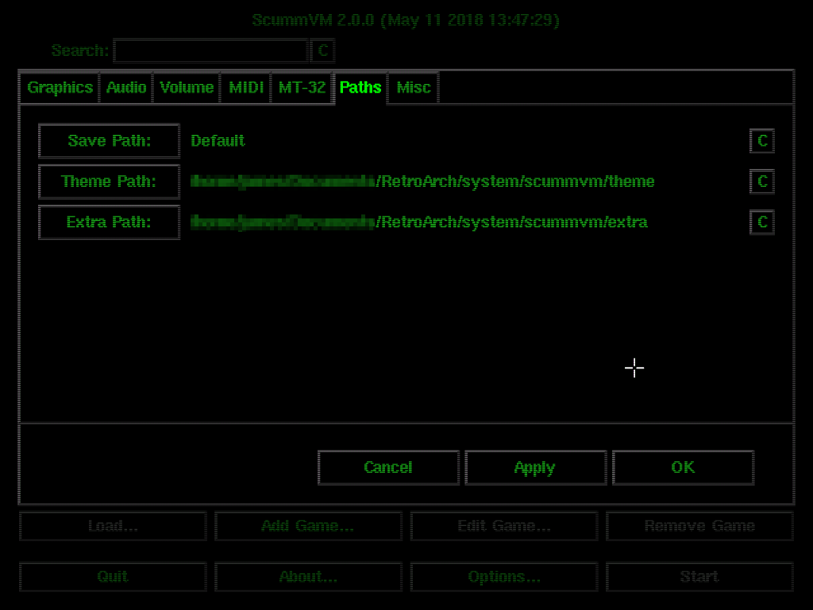 </center>

- Select the 'Misc' tab, then press the 'Theme:' button.

- Select 'ScummVM Modern Theme' and press the 'Choose' button.

- Press the 'Apply' button, then continue to the 'Enable Enhanced MIDI Emulation' section below.

<center> 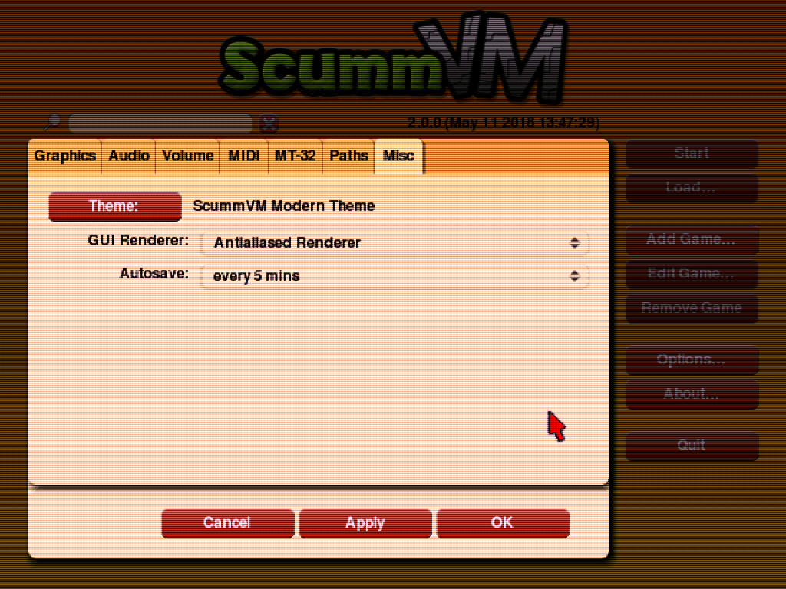 </center>

#### Enable Enhanced MIDI Emulation

Some games only contain music in the form of MIDI data. By default, ScummVM will emulate MIDI mode using AdLib. Higher quality audio may be achieved for MIDI-enabled games by using FluidSynth MIDI emulation with an appropriate soundfont. This is the recommended mode of operation under RetroArch.

- Select the 'MIDI' tab, then under 'GM Device:' select 'FluidSynth'.

- Press the 'SoundFont:' button and navigate to the RetroArch `system` directory. Enter the `scummvm/extra/` folder. (NB: If the steps of this guide have been followed in order, the `scummvm/extra/` folder will be selected automatically upon pressing the 'SoundFont:' button)

- Select the file `Roland_SC-55.sf2` and press the 'Choose' button. Another good soundfont is the [FatBoy SoundFont](https://fatboy.site/), you can download that and place it in the same folder (`scummvm/extra/`) to be able to select it.

- Tick the 'Mixed AdLib/MIDI mode' checkbox.

- Press the 'Apply' button, then continue to the 'Enable MT-32 Emulation' section below.

<center> 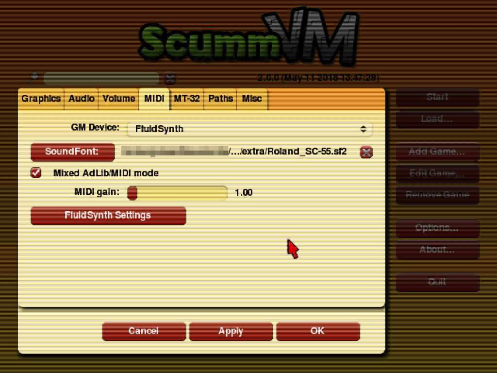 </center>

Many games benefit greatly from FluidSynth MIDI emulation. Some particularly notable examples are:

- Sam & Max Hit the Road

- Day of the Tentacle

- Discworld

!!! attention
	FluidSynth MIDI emulation slightly increases the CPU requirements of the ScummVM core. On the vast majority of platforms this should not be an issue. If crackling sound is observed on very low power devices, FluidSynth MIDI emulation should be disabled by setting 'GM Device:' to the default "Don't use General MIDI music" option.

#### Enable MT-32 Emulation (Optional)

Some games which contain MIDI music data also have improved tracks designed for the MT-32 sound module. ScummVM can emulate this device, vastly increasing the audio quality of these games. Enabling MT-32 emulation is therefore highly recommended, but should be considered optional since it requires original MT-32 ROMs which must be provided by the user.

The names and checksums of the two required ROM files are:

|   Filename       |              md5sum              |
|:----------------:|:--------------------------------:|
| MT32_PCM.ROM     | 89e42e386e82e0cacb4a2704a03706ca |
| MT32_CONTROL.ROM | 5626206284b22c2734f3e9efefcd2675 |

These files must be placed inside the `scummvm/extra/` folder within the RetroArch `system` directory. MT-32 emulation may then be enabled via the main ScummVM user interface as follows:

- Select the 'MT-32' tab.

- Under 'MT-32 Device:' select 'MT-32 Emulator'.

- Press the 'Apply' button, then the 'OK' button to close the options menu.

<center> 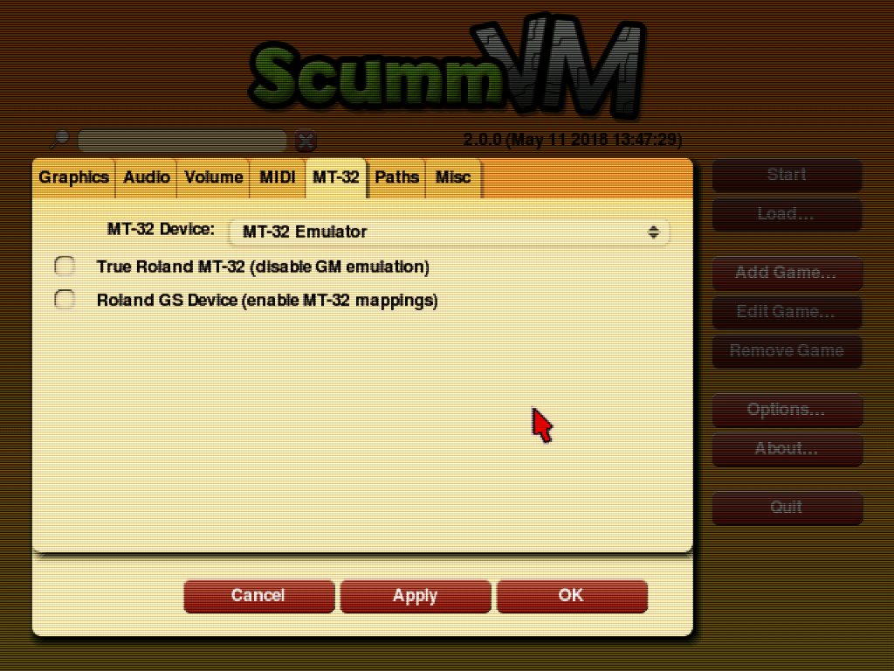 </center>

Some notable examples of games that sound exquisite with MT-32 emulation are:

- Monkey Island 2: LeChuck's Revenge

- Indiana Jones and the Fate of Atlantis

- Simon the Sorcerer

Experiencing Monkey Island 2 without MT-32 emulation is like listening to Beethoven played on a kazoo.

!!! attention
	MT-32 emulation substantially increases the CPU requirements of the ScummVM core, and this can vary on a per-game basis. On most desktop systems this should not be an issue, but some devices may struggle to maintain full speed with all games. For example, 'Monkey Island 2' and 'Indiana Jones and the Fate of Atlantis' will run on very low power Android chipsets, but 'Simon the Sorcerer' will overwhelm mid-to-high-end mobile CPUs. If crackling sound is observed, the user should either (a) disable MT-32 emulation by setting 'MT-32 Device:' to the default "Don't use Roland MT-32 music" or (b) force the use of the 'FluidSynth' audio device via an internal ScummVM game settings override (this is described in a following section).

This concludes 'Initial Configuration'. The core may be shut down either by pressing the 'Quit' button, or via 'Close Content' from the Quick Menu.

### Game Management

Before a game can be run via the ScummVM core, it should first be added to the internal launcher. Failure to do so will prevent game-specific configuration options from being saved (e.g. volume levels, subtitle speed, internal game settings overrides).

#### Adding a Game to the ScummVM Launcher

The data files for each game must be copied to a uniquely-named directory on local storage (i.e. one directory per game). A list of the specific files required for any particular game may be found on the ScummVM [Datafiles](http://wiki.scummvm.org/index.php/Datafiles) page.

A suggested directory layout for 'Flight of the Amazon Queen' is presented as the simplest possible example:

```
└── ROMs/
    └── ScummVM/
        └── Flight of the Amazon Queen (CD DOS)/
            └── queen.1
```

Once all files are in place, each game may be added as follows:

- Run the ScummVM core without content:

    - Go to RetroArch's main menu screen.

    - Select 'Load Core', then 'ScummVM'.

    - Select 'Start Core'.

- In the main ScummVM user interface, press the 'Add Game...' button.

- Navigate to the game directory. Double click the game directory itself to enter it, then press the 'Choose' button.

<center> 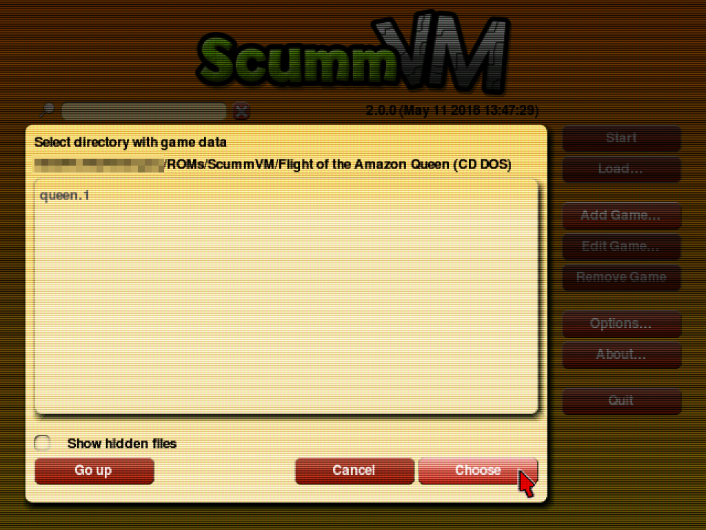 </center>

- If the game is detected correctly (i.e. if the data files are correct), a settings dialog box will open.

<center>  </center>

- In general, the automatically generated configuration settings can be accepted...

- **However:** For simplicity, and compatibility with existing `.scummvm` files (discussed in the following section), the 'ID:' entry should be set to the so-called 'short name' of the game. All 'short names' are listed on the [ScummVM Compatibility Page](http://scummvm.org/compatibility).

    - In most cases, the automatically generated 'ID:' is equal to the 'short name'.

    - In some cases, the automatically generated 'ID:' will be the 'short name' with an additional identifying suffix. This suffix should be deleted. If using a gamepad, this may be achieved by clicking at the end of the 'ID:' entry line and using the 'L2' button/trigger to delete unwanted characters.

- Once the 'ID:' has been adjusted (if required), press the 'OK' button to 'register' the game.

<center> 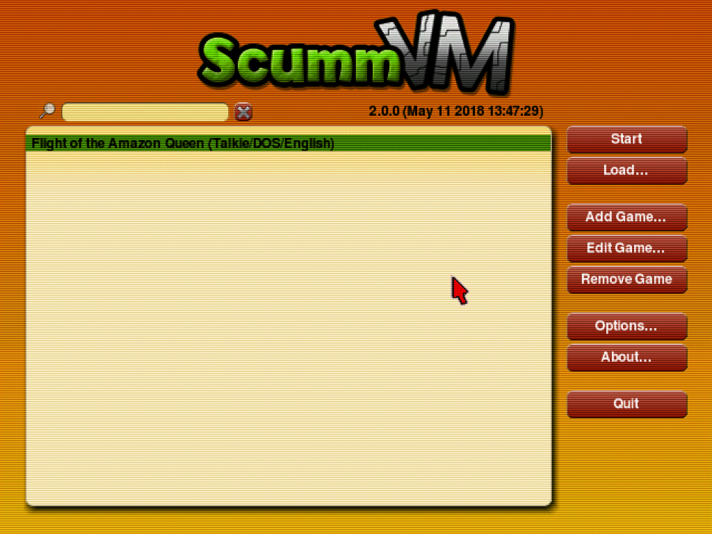 </center>

!!! attention
	Once a game has been registered, it may be run by selecting it in the ScummVM Launcher game list and pressing the 'Start' button. **However:** Employing the ScummVM Launcher in this manner is not recommended, since it prevents the use of RetroArch per-game configuration overrides, input remaps and shader overrides. The ScummVM Launcher should only be used to add games and change settings.

#### Running a Game

Running a ScummVM game via the RetroArch frontend can be done using the appropriate `.scummvm` file to the game directory. For each game listed in the ScummVM Launcher, the following procedure should be followed:

- Note the specific game 'ID:' that was submitted when adding the game to the ScummVM Launcher. If this guide has been followed, the game ID will be equal to the 'short name' found on the [ScummVM Compatibility Page](http://scummvm.org/compatibility).

- Enter the directory containing the game data.

- Create a new text file named after the game, with a `.scummvm` extension.

	(The name of the `.scummvm` file will be used to select which RetroArch configuration/remap override should be loaded when a game is launched. The chosen name does not have to be the same as the game directory name or the ScummVM 'short name', although either would be appropriate. The only requirement is that each `.scummvm` file should have a *unique* name.)

- Open the `.scummvm` file in a text editor and enter the game ID on a single line. Save and close the file.

Again, 'Flight of the Amazon Queen' is presented as a simple example:

```
└── ROMs/
    └── ScummVM/
        └── Flight of the Amazon Queen (CD DOS)/
            ├── Flight of the Amazon Queen.scummvm
            └── queen.1
```

...where `Flight of the Amazon Queen.scummvm` has the following content:

    queen

Games can then be launched as follows:

- Go to RetroArch's main menu screen.

- Select 'Load Content'.

- Navigate to the game directory.

- Select the `.scummvm` file.

- The game will load.

<center> 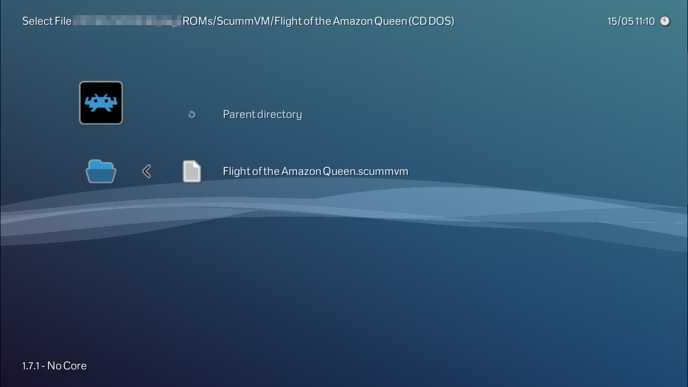 </center>

For users who do not wish to create their own `.scummvm` files, a pre-prepared collection is available in the [libretro-database-scummvm](https://github.com/RobLoach/libretro-database-scummvm/tree/ffbf0a0b3550b74ba39ec3a25d321d85d529e1f8/games) repository. Simply download the appropriate file for a particular game and copy it to the game directory.

!!! attention
	When using third-party `.scummvm` files, it is important to verify that the file contents matches the specific game ID that was submitted when adding the game to the ScummVM Launcher. Do not assume that third-party `.scummvm` files are automagically 'correct'.

#### Playlist/Scanning Support

To launch games efficiently via the RetroArch frontend, it is recommended to add them to a playlist. RetroArch supports automated scanning/playlist generation for ScummVM content:

- From RetroArch's main menu screen, navigate to the 'Import content' tab.

- Select 'Scan Directory'.

- Navigate to the folder containing the ScummVM game directories.

- Select `<Scan This Directory>`.

All recognised games will be added to a `ScummVM.lpl` file in the RetroArch `playlist` directory, and be made available via a new 'ScummVM' tab in the frontend menu.

(Alternatively, each game directory may be scanned in turn - useful if game directories are present in multiple locations)

An example playlist entry for 'Flight of the Amazon Queen' is as follows:

```
/storage/ROMs/ScummVM/Flight of the Amazon Queen (CD DOS)/Flight of the Amazon Queen.scummvm
Flight of the Amazon Queen
DETECT
DETECT
19C1B1B5|crc
ScummVM.lpl
```

!!! attention
	Not all games/configurations are present in the current database. If a particular game is not detected, an entry in the `ScummVM.lpl` playlist file can be added by hand. It should have the format:

	```
	/path/to/game_directory/game_name.scummvm
	game_name
	DETECT
	DETECT
	0|crc
	ScummVM.lpl
	```

### Additional Configuration Notes

Both ScummVM and RetroArch itself allow a vast number of options to be configured on a per-game basis. Here we present three additional configuration topics that will likely be of relevance for typical users:

#### Volume Levels

ScummVM games exhibit a spectacular variance in audio volume levels. For comfort, it is almost mandatory to adjust specific volumes on a per-game basis. Fortunately this is trivial:

- While a game is running, press the RetroPad 'start' button to open the ScummVM GUI.

- Using the cursor, press the 'Options' button.

- Adjust the 'Music volume:', 'SFX volume:' and 'Speech volume:' sliders to the desired levels.

<center>  </center>

- Press the 'OK' button, then the 'Resume' button.

Provided that the game has been correctly added to the ScummVM Launcher, the adjusted levels will be preserved between play sessions.

!!! attention
	If the game has *not* been added to the ScummVM Launcher, or if the game ID in the `.scummvm` file *does not* match the ScummVM Launcher ID, all settings will be lost when the game is closed.

#### Manual Music Device Selection

By default, ScummVM will automatically select the most appropriate music playback option for each game (i.e. MT-32 emulation, FluidSynth MIDI emulation or AdLib emulation). In the majority of cases this will yield the best possible sound quality, and no user intervention is required. There are, however, circumstances and games where a manual override is beneficial. This is something that should be determined by the user on a per-game basis, but here are some practical examples:

- Simon the Sorcerer sounds best with the default selection of MT-32 emulation, but this is too CPU-intensive for most Android devices. An acceptable compromise between performance and sound quality can be achieved by forcing the game to use FluidSynth MIDI emulation.

- Simon the Sorcerer 2 will use FluidSynth MIDI emulation by default. Far better quality music can be achieved by forcing the game to use MT-32 emulation. (And since this game has even higher CPU requirements than the first in the series, smooth playback on Android devices generally requires the use of AdLib emulation)

- Beneath a Steel Sky defaults to MT-32 emulation, which should be best... but forcing the use of FluidSynth MIDI emulation tends to produce 'richer' sounding music, which some users may prefer.

- Flight of the Amazon Queen is another game that defaults to MT-32 emulation but which (arguably) sounds far better with FluidSynth MIDI emulation.

A per-game music device override may be set as follows:

- Run the ScummVM core without content:

    - Go to RetroArch's main menu screen.

    - Select 'Load Core', then 'ScummVM'.

    - Select 'Start Core'.

- In the main ScummVM user interface, select the appropriate entry in the Launcher game list and press the 'Edit Game...' button.

<center> 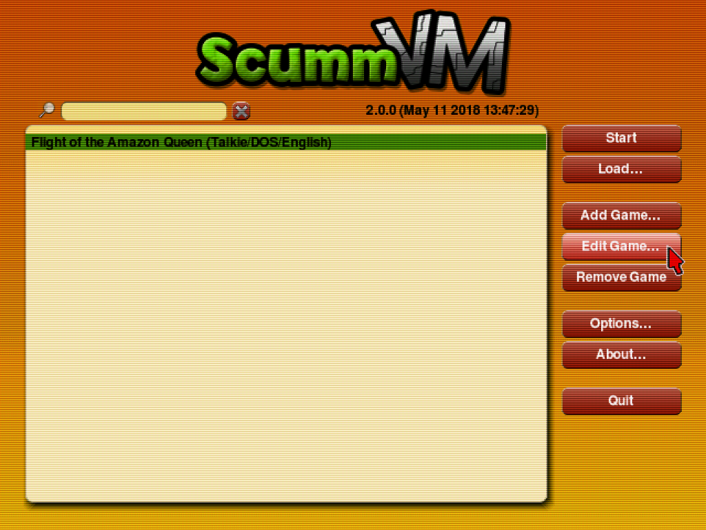 </center>

- In the dialog that opens, select the 'Audio' tab.

- Tick the 'Override global audio settings' checkbox.

- Under 'Music Device:', select the desired option (i.e. 'FluidSynth', 'MT-32 Emulator' or 'AdLib Emulator').

- Press the 'OK' button.

<center> 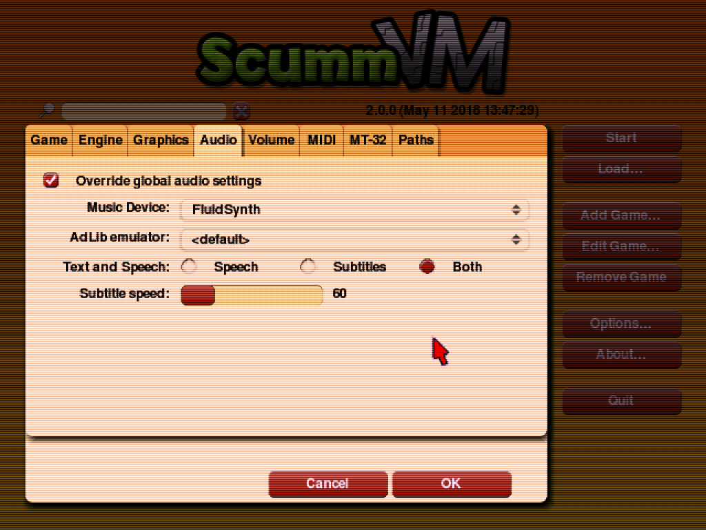 </center>

#### Aspect Ratio Correction

ScummVM's core provided aspect ratio is 4:3. For most games this is correct, particularly for newer games, and those that targeted the PC as their primary platform. It is widely known that DOS games typically ran at 320x200, with non-square pixels stretched to fill a 4:3 display.

It is not so widely known that a number of popular games targeted the European Amiga market, where (due to various PAL/NTSC considerations) 320x200 content was often shown in a letterboxed rectangle at a display resolution of 320x256. It is sometimes difficult to determine the original intent of the artists, but many of these games were actually made in a quasi-widescreen format. Some notable examples are:

- Beneath a Steel Sky

- Flight of the Amazon Queen

- Simon the Sorcerer 1 + 2

(The full list of affected games should be determined at the user's discretion)

The actual 'correct' aspect ratio in these cases is somewhat fuzzy, but good results are achieved by using the pixel aspect ratio of 16:10.

To demonstrate the issue, here is an example screenshot from Beneath a Steel Sky at the default 4:3 ratio:

<center> 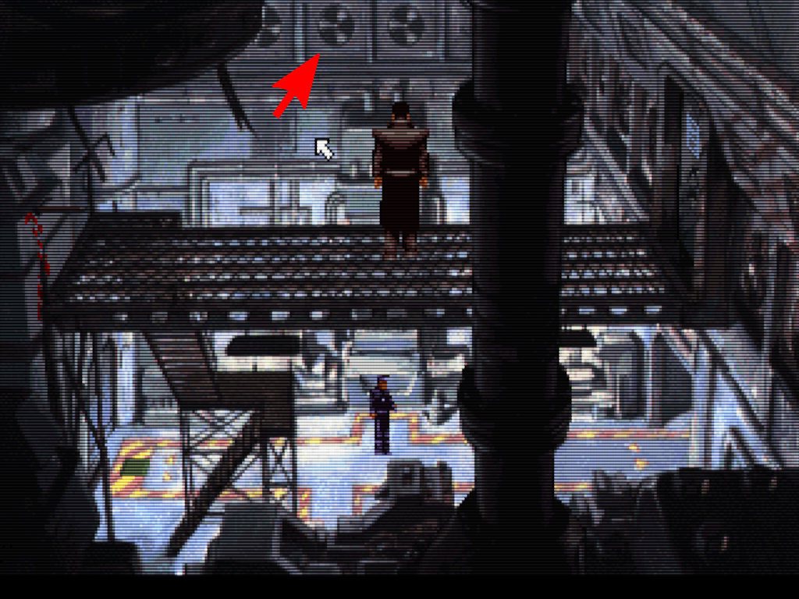 </center>

Note the distorted fan vents. Here is the same image at a 16:10 ratio:

<center> 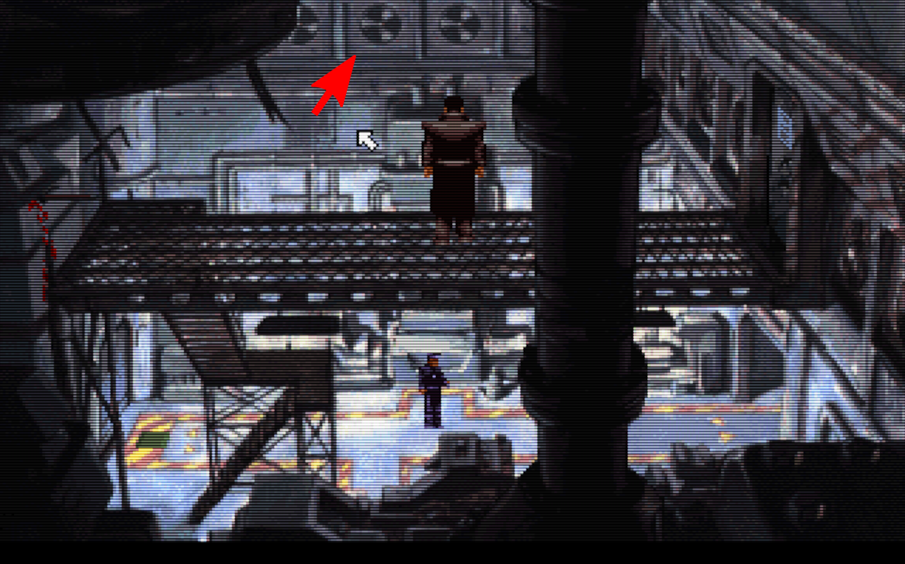 </center>

The fan vents are the correct shape, and the character proportions are more natural.

To automate correct aspect ratio selection for games such as these, a RetroArch configuration override should be used. This can be set up as follows:

- Enter the RetroArch `config` directory.

- Create a new directory called `scummvm` (if it does not already exist).

- Create a new text file with the exact same name as the `.scummvm` file for the game to be overridden, but with a `.cfg` extension.

	An example layout for 'Flight of the Amazon Queen' is shown:

```
└── config/
    └── scummvm/
        └── Flight of the Amazon Queen.cfg
```

- Open the `.cfg` file in a text editor and paste the following on a single line:

```
aspect_ratio_index = "2"
```

- Save and close the file.

Now whenever the game is launched, it will be displayed at the 'correct' 16:10 ratio. This will not affect any other game.

## Core options

The ScummVM core has the following option(s) that can be tweaked from the core options menu. The default setting is bolded.

Settings with (Restart) means that core has to be closed for the new setting to be applied on next launch.

- **Gamepad Cursor Speed** [scummvm_gamepad_cursor_speed] (**1.0**|1.5|2.0|2.5|3.0|0.25|0.5|0.75)

	Sets the mouse cursor speed multiplier when moving the cursor with the RetroPad left analog stick or D-Pad.

!!! attention
	The default value of '1.0' is optimised for games that have a native resolution of '320x200' or '320x240'. When running 'high definition' games with a native resolution of '640x400' or '640x480', it is recommended to set the Gamepad Cursor Speed to '2.0'.

- **Analog Cursor Response** [scummvm_analog_response] (**linear**|cubic)

	Determines how the speed of the cursor varies when tilting the RetroPad left analog stick.

	'linear': Cursor speed increases linearly with analog stick movement. This is standard behaviour with which most users will be familiar.

	'cubic': Cursor speed increases quadratically with analog stick movement. This allows for greater precision when making small movements with the analog stick, without sacrificing maximum speed at full analog stick range. This mode may require practice for effective use.

- **Analog Deadzone (percent)** [scummvm_analog_deadzone] (**15**|20|25|30|0|5|10)

	Sets the deadzone of the RetroPad analog sticks. Used to eliminate cursor drift/unwanted input.

!!! attention
	The deadzone setting can have a significant effect on the 'feel' of analog cursor movement. The value should be set as low as possible for best results - i.e. reduce the value until cursor drift is evident, then increment to the next highest setting. Xbox gamepads typically require a deadzone of 15-20%. Many Android-compatible bluetooth gamepads have an internal 'hardware' deadzone, allowing the deadzone value here to be set to 0%.

- **Mouse Speed** [scummvm_mouse_speed] (**1.0**|1.25|1.5|1.75|2.0|2.5|3.0|0.05|0.1|0.15|0.2|0.25|0.3|0.35|0.4|0.45|0.5|0.6|0.7|0.8|0.9)

	Sets the mouse cursor speed multiplier when moving the cursor with the RetroMouse.

- **Speed Hack (Restart)** [scummvm_speed_hack] (**disabled**|enabled)

	Enables an optional speed hack that significantly reduces the CPU requirements of the core by allowing subtle timing inaccuracies.

!!! attention
	This hack is considered 'safe' - games should run correctly when it is enabled, and most inaccuracies are imperceptible other than in a few edge cases. It remains a hack, though, and it is strongly recommended that users of desktop class machines keep it disabled.

	**However:** For users of low power hardware (Android devices, single board computers), this hack is essentially **mandatory** for full speed operation of the core. For Android users in particular, the guides in the 'Usage' section of this document assume that the speed hack is enabled.

## Joypad

| RetroPad Inputs                                | User 1 input descriptors | ScummVM Inputs          |
|------------------------------------------------|--------------------------|-------------------------|
|              | Right Mouse Button       | Right Mouse Button      |
|              | .                        | . (period)              |
|         | F1                       | F1                      |
|          | ScummVM GUI              | ScummVM GUI             |
|        | Mouse Cursor Up          | Mouse Cursor Up         |
|      | Mouse Cursor Down        | Mouse Cursor Down       |
|      | Mouse Cursor Left        | Mouse Cursor Left       |
|     | Mouse Cursor Right       | Mouse Cursor Right      |
|              | Left Mouse Button        | Left Mouse Button       |
|              | Esc                      | Esc                     |
|             | Enter                    | Enter                   |
|             | Numpad 5                 | Numpad 5                |
|             | Backspace                | Backspace               |
|             | Cursor Fine Control      | Cursor Fine Control     |
|             | F10                      | F10                     |
|             | Numpad 0                 | Numpad 0                |
|  X  |                          | Mouse Cursor Left/Right |
|  Y  |                          | Mouse Cursor Up/Down    |
|    |                          | Virtual Numpad          |

**Additional Notes:**

- Depressing the 'Cursor Fine Control' button reduces cursor speed to 1/3 of the value set by the 'Gamepad Cursor Speed' core option.

- The RetroPad right analog stick is mapped to an 8-way 'Virtual Numpad' with the following layout:

```
[7][8][9]
[4]   [6]
[1][2][3]
```

**Additional 'ScummVM Input' Descriptions:**

- Esc:

    - Skips cutscenes.

    - Opens/closes menus in some games.

- Virtual Numpad + Numpad 5 + Numpad 0:

    - Enables control during fight sequences in the 'Indiana Jones' series of games.

    - Enables bypass of Monkey Island 2 copy protection.

    - Enables saving in games that require text entry when naming a save slot.

    - Enables menu navigation in some games (Numpad 8 == up, Numpad 2 == down).

- Enter + Backspace:

    - Enables saving in games that require text entry when naming a save slot.

    - 'Enter' may be used to attack in 'Full Throttle' fight sequences.

    - 'Enter' enables menu item selection in some games.

- . (period): Skips lines of dialogue in SCUMM engine games.

- F1:

    - Shows in-game menu in some games.

    - Enables saving in some games.

- F10: Shows hotspots in Simon the Sorcerer 1 + 2.

## Mouse

| RetroMouse Inputs                                     | ScummVM Inputs     |
|-------------------------------------------------------|--------------------|
|  Mouse Cursor | Mouse Cursor       |
|  Mouse 1       | Left Mouse Button  |
|  Mouse 2      | Right Mouse Button |

!!! attention
	To ensure correct operation when using a RetroMouse, it is recommended that the RetroArch 'Grab Mouse' option be enabled while running content with the ScummVM core. By default, 'Grab Mouse' may be toggled on/off by pressing F11 on the keyboard.

	The 'Grab Mouse' option is not required when using a RetroPad to move the cursor.

## Pointer

- The Wii U build of the ScummVM core uses the libretro pointer API for mouse emulation.

| RetroPointer Inputs                                                                                                      | ScummVM Inputs |
|--------------------------------------------------------------------------------------------------------------------------|----------------|
|  or  Pointer Position | Mouse Cursor   |
|  or  Pointer Pressed            | Left Mouse Button   |

## Compatibility

Compatibility listings for the standalone version of ScummVM may be found on the official [ScummVM Compatibility Page](http://scummvm.org/compatibility).

The Libretro ScummVM core currently has issues with a handful of games that function correctly when using the standalone version. An evolving RetroArch-specific compatibility list is being maintained in this [Google Spreadsheet](https://docs.google.com/spreadsheets/d/1a87BnQJc7_fTD5zF55JXcm79d5_l_d1ghDxtiubTnDE).

### Legend of Kyrandia, Lands of Lore, Eye of the Beholder

To run these Westwood games, you need a special file called, `kyra.dat`. To obtain this file, note the ScummVM version you are using, which is displayed in the bottom left corner of RetroArch while you have the core running. Then:

- Navigate to ScummVM's [GitHub page for kyra.dat](https://github.com/scummvm/scummvm/blob/master/dists/engine-data/kyra.dat)
- On the button that says "master" at the top left, select the branch that matches your version number:

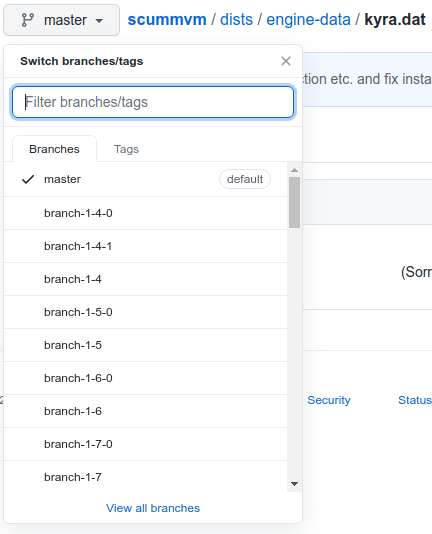

- Download that kyra.dat file and place it in the `scummvm/extra/` folder.

## External Links

- [Official ScummVM Website](http://scummvm.org/)
- [Official ScummVM Github Repository](https://github.com/scummvm/scummvm)
- [Libretro ScummVM Core info file](https://github.com/libretro/libretro-super/blob/master/dist/info/scummvm_libretro.info)
- [Libretro ScummVM Github Repository](https://github.com/libretro/scummvm)
- [ScummVM wiki entry about kyra.dat](https://wiki.scummvm.org/index.php/Kyra)
- [Report Libretro ScummVM Core Issues Here](https://github.com/libretro/scummvm/issues)
