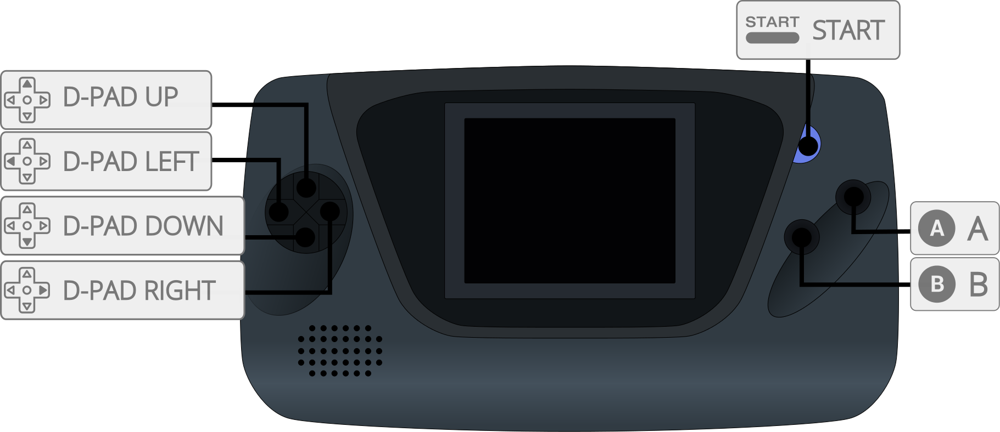

# Sega - MS/GG (SMS Plus GX)

## Background

SMS Plus is an open-source Sega Master System and Game Gear emulator written by Charles MacDonald.
SMS Plus GX is an enhanced version which includes improved accuracy, bug fixes with most games and others.

## Added support for coleco system (experimental).

### Author/License

The SMS Plus GX core has been authored by

- Charles Mcdonald
- Eke-Eke (GX)

The SMS Plus GX core is licensed under

- [GPLv2](https://github.com/libretro/smsplus-gx/blob/master/docs/license)

A summary of the licenses behind RetroArch and its cores can be found [here](../development/licenses.md).

## Extensions

Content that can be loaded by the SMS Plus GX core have the following file extensions:

- .sms
- .bin
- .rom
- .gg
- .col

## Databases

RetroArch database(s) that are associated with the SMS Plus GX core:

- [Sega - Game Gear](https://github.com/libretro/libretro-database/blob/master/rdb/Sega%20-%20Game%20Gear.rdb)
- [Sega - Master System - Mark III](https://github.com/libretro/libretro-database/blob/master/rdb/Sega%20-%20Master%20System%20-%20Mark%20III.rdb)
- [Coleco - ColecoVision](https://github.com/libretro/libretro-database/blob/master/rdb/Coleco%20-%20ColecoVision.rdb)

## BIOS

Required or optional firmware files go in the frontend's system directory.

| Filename | Description                   | md5sum                           |
|:--------:|:-----------------------------:|:--------------------------------:|
| bios.sms | Master System BIOS - Optional | 840481177270d5642a14ca71ee72844c |
| BIOS.col | Coleco BIOS - Required        | 2c66f5911e5b42b8ebe113403548eee7 |

## Features

Frontend-level settings or features that the SMS Plus GX core respects.

| Feature           | Supported |
|-------------------|:---------:|
| Restart           | ✔         |
| Screenshots       | ✔         |
| Saves             | ✔         |
| States            | ✔         |
| Rewind            | ✔         |
| Netplay           | ✕         |
| Core Options      | ✔         |
| RetroAchievements | ✔         |
| RetroArch Cheats  | ✔         |
| Native Cheats     | ✕         |
| Controls          | ✔         |
| Remapping         | ✔         |
| Multi-Mouse       | ✕         |
| Rumble            | ✕         |
| Sensors           | ✕         |
| Camera            | ✕         |
| Location          | ✕         |
| Subsystem         | ✕         |
| [Softpatching](../guides/softpatching.md) | ✔         |
| Disk Control      | ✕         |
| Username          | ✕         |
| Language          | ✕         |
| Crop Overscan     | ✕         |
| LEDs              | ✕         |

### Directories

The SMS Plus GX core's internal core name is 'SMS Plus GX'

**Frontend's Save directory**

| File  | Description            |
|:-----:|:----------------------:|
| *.srm | Cartridge battery save |

**Frontend's State directory**

| File     | Description |
|:--------:|:-----------:|
| *.state# | State       |

### Geometry and timing

- The SMS Plus GX core's core provided FPS is 60 for NTSC games and 50 for PAL games
- The SMS Plus GX core's core provided sample rate is 44100 Hz
- The SMS Plus GX core's base width is dependent on loaded content and when using ntsc filter
- The SMS Plus GX core's base height can be 192/224/240 for Master System/Coleco and 144 for Game Gear games
- The SMS Plus GX core's max width is 602
- The SMS Plus GX core's max height is 240
- The SMS Plus GX core's core provided aspect ratio is 4:3

## Core options

The SMS Plus GX core has the following option(s) that can be tweaked from the core options menu. The default setting is bolded.

Settings with (Restart) means that core has to be closed for the new setting to be applied on next launch.

- **Hardware (Restart)** [smsplus_hardware] (**auto**/master system/master system II/game gear/game gear (sms compatibility)/coleco)

	Emulates which system hardware to use.

- **Region (Restart)** [smsplus_region] (**auto**/ntsc-u/pal/ntsc-j)

	Runs console at a specific video timing based on region

- **Remove Border** [smsplus_remove_left_border] (**disabled**/enabled)

	Removes the black border on the left of some games. (SMS Only)

- **Blargg NTSC Filter** [smsplus_ntsc_filter] (**disabled**/monochrome/composite/svideo/rgb)

	Replicates the analog signal effects such as color bleeding and pixel artifacts to match the images a TV would show.

## Controllers

The SMS Plus GX core supports the following device type(s) in the controls menu, bolded device types are the default for the specified user(s):

### User 1 device types

- None - Doesn't diable input. There's no reason to switch to this.
- **RetroPad** - Joypad - Stay on this.
- RetroPad w/Analog - Joypad - There's no reason to switch to this.

### Controller tables

#### Joypad

| RetroPad Inputs                           | SMS Plus GX core Inputs |
|-------------------------------------------|----------------------|
|     | 1                    |
|       | Pause                |
|     | D-Pad Up             |
|   | D-Pad Down           |
|   | D-Pad Left           |
|  | D-Pad Right          |
|     | 2                    |

#### Keyboard

| RetroKeyboard Inputs         | RetroKeyboard         |
|------------------------------|-----------------------|
| Keyboard 1                   | 1                     |
| Keyboard 2                   | 2                     |
| Keyboard 3                   | 3                     |
| Keyboard 4                   | 4                     |
| Keyboard 5                   | 5                     |
| Keyboard 6                   | 6                     |
| Keyboard 7                   | 7                     |
| Keyboard 8                   | 8                     |
| Keyboard 9                   | 9                     |
| Keyboard Dollar              | $                     |
| Keyboard Asterisk            | *                     |

## External Links

- [Libretro SMS Plus GX Github Repository](https://github.com/libretro/smsplus-gx)
- [Libretro SMS Plus GX Core info file](https://github.com/libretro/libretro-super/blob/master/dist/info/smsplus_libretro.info)
- [Report Libretro SMS Plus GX Core Issues Here](https://github.com/libretro/smsplus-gx/issues)
- [Gameplay Videos](https://www.youtube.com/playlist?list=PLRbgg4gk_0IeQQFDtJZI8xpOvbY-yqJhA)

### See also

- [Sega - Master System (Emux SMS)](emux_sms.md)
- [Sega - MS/GG/MD/CD (Genesis Plus GX)](genesis_plus_gx.md)
- [Sega - MS/MD/CD/32X (PicoDrive)](picodrive.md)
- [Sega - MS/GG/SG-1000 (Gearsystem)](gearsystem.md)
- [MSX/SVI/ColecoVision/SG-1000 (blueMSX)](bluemsx.md)
- [Coleco - ColecoVision (Gearcoleco)](gearcoleco.md)
