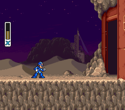
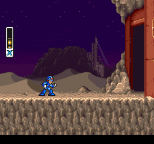

# Nintendo - SNES / Famicom (Snes9x)

## Background

Port of upstream mainline **up-to-date** Snes9x, a portable Super Nintendo Entertainment System emulator to libretro.

The Snes9x core has been authored by

- Snes9x Team

The Snes9x core is licensed under

- [Non-commercial](https://github.com/snes9xgit/snes9x/blob/master/LICENSE)

A summary of the licenses behind RetroArch and its cores can be found [here](../development/licenses.md).

## Features

- **Most up-to-date libretro Snes9x core available.**
- Highly accurate SNES emulation.
- Simplified and easily accessible MSU-1 expansion chip support.
- Recommended for netplay

## BIOS

Required or optional firmware files go in the frontend's system directory.

| Filename   | Description                                                                      | md5sum                           |
|:----------:|:--------------------------------------------------------------------------------:|:--------------------------------:|
| BS-X.bin   | BS-X - Sore wa Namae o Nusumareta Machi no Monogatari (Japan) (Rev 1) - Optional | fed4d8242cfbed61343d53d48432aced |
| STBIOS.bin | Sufami Turbo (Japan) - Optional                                                  | d3a44ba7d42a74d3ac58cb9c14c6a5ca |

## Extensions

Content that can be loaded by the Snes9x core have the following file extensions:

- .smc
- .sfc
- .swc
- .fig
- .bs
- .st

RetroArch database(s) that are associated with the Snes9x core:

- [Nintendo - Super Nintendo Entertainment System](https://github.com/libretro/libretro-database/blob/master/rdb/Nintendo%20-%20Super%20Nintendo%20Entertainment%20System.rdb)
- [Nintendo - Sufami Turbo](https://github.com/libretro/libretro-database/blob/master/rdb/Nintendo%20-%20Sufami%20Turbo.rdb)
- [Nintendo - Satellaview](https://github.com/libretro/libretro-database/blob/master/rdb/Nintendo%20-%20Satellaview.rdb)

## Features

Frontend-level settings or features that the Snes9x core respects.

| Feature           | Supported |
|-------------------|:---------:|
| Restart           | ✔         |
| Saves             | ✔         |
| States            | ✔         |
| Rewind            | ✔         |
| Netplay           | ✔         |
| Core Options      | ✔         |
| RetroAchievements | ✔         |
| RetroArch Cheats  | ✔         |
| Native Cheats     | ✕         |
| Controls          | ✔         |
| Remapping         | ✔         |
| Multi-Mouse       | ✔         |
| Rumble            | ✕         |
| Sensors           | ✕         |
| Camera            | ✕         |
| Location          | ✕         |
| Subsystem         | ✔         |
| [Softpatching](../guides/softpatching.md) | ✔         |
| Disk Control      | ✕         |
| Username          | ✕         |
| Language          | ✕         |
| Crop Overscan     | ✕         |
| LEDs              | ✕         |

## Directories

The Snes9x core's library name is 'Snes9x'

The Snes9x core saves/loads to/from these directories.

**Frontend's Save directory**

| File  | Description            |
|:-----:|:----------------------:|
| *.srm | Cartridge battery save |

**Frontend's State directory**

| File     | Description |
|:--------:|:-----------:|
| *.state# | State       |

## Geometry and timing

- The Snes9x core's core provided FPS is 60.0988118623 for NTSC games and 50.0069789082 for PAL games.
- The Snes9x core's core provided sample rate is 32040 Hz
- The Snes9x core's base width is 256
- The Snes9x core's base height is 224 when the Crop Overscan core option is set to enabled. 239 when it's set to disabled.
- The Snes9x core's max width is 512
- The Snes9x core's max height is 478
- The Snes9x core's core provided aspect ratio is dependent on the ['Preferred aspect ratio' core option](#core-options).

## MSU-1 support

MSU-1 support in the Snes9x core follows the SD2SNES.mdSnes9x naming format, i.e.

```
gamename.sfc
gamename.msu
gamename-#.pcm
```

Loading a manifest.bml file or having a xml file isn't necessary. **Just load gamename.sfc.**

Here's an example of a working MSU-1 setup done with [Secret of Mana MSU-1](https://www.romhacking.net/hacks/2467/). Please note that som_msu1.sfc is being [softpatched](../guides/softpatching.md) in this example.


## BS-X and Sufami Turbo

In order to load BS-X and Sufami Turbo games, you'll need BS-X.bin and STBIOS.bin in the frontend's system directory.

To load multi-cart games specifically, a more complex procedure needs to be followed.

- First, load the base game first by using the "Load Content" option in RetroArch's Main Menu.
- Second, go back to RetroArch's Main Menu and select the "Load Multi-Cart Link" option.
- Third, load the base game while in the "Load Multi-Cart Link" screen.
- Fourth, go back to RetroArch's Main Menu and select the "Load Multi-Cart Link" option.
- Fifth, load the add-on game while in the "Load Multi-Cart Link" screen.
- Sixth, go back to RetroArch's Main Menu for the final time and select the "Start Multi-Cart Link" option.

Please note that for multi-cart Sufami Turbo games, you must first run each game individually to create sram files for them. Then the multi-link will function correctly.

## Core options

The Snes9x core has the following option(s) that can be tweaked from the core options menu. The default setting is bolded.

Settings with (Restart) means that core has to be closed for the new setting to be applied on next launch.

- **Allow Opposing Directions** [snes9x_up_down_allowed] (**disabled**|enabled)

	Enabling this will allow pressing / quickly alternating / holding both left and right (or up and down in some games) directions at the same time.

	This may cause movement based glitches to occur in certain games.

	It's best to keep this core option disabled.

- **SuperFX Frequency** [snes9x_overclock] (50% to 500%. **100% is default.**)

	Overclock the [SuperFX chip](https://en.wikipedia.org/wiki/Super_FX).

	[Example video here](https://www.youtube.com/watch?v=3gVg8vDhfQk)

- **Reduce Slowdown (Hack, Unsafe)** [snes9x_overclock_cycles] (**disabled**|light|compatible|max)

	Many games for the SNES suffered from slowdown due to the weak main CPU. This option helps allievate that at the cost of possible bugs.

	[Example video here](https://www.youtube.com/watch?v=8xA9fosum4Q)

	light: Slightly reduces slowdown, more compatible than the "compatible" option.

	compatible: Reduce slowdown but keep as much game compatibility as much as possible.

	max: Reduce slowdown as much as possible but will break more games.

- **Reduce Flickering (Hack, Unsafe)** [snes9x_reduce_sprite_flicker] (**disabled**|enabled)

	Raises sprite limit to reduce flickering in games.

- **Randomize Memory (Unsafe)** [snes9x_randomize_memory] (**disabled**|enabled)

	Randomizes the system RAM upon startup.

	Some games such as Super Off Road use system RAM as a random number generator for item placement and AI behavior to make gameplay more unpredictable.

	It's best to keep this core option disabled.

- **Hires Blending** [snes9x_hires_blend] (**disabled**|merge|blur)

	Awaiting description.

- **Audio Interpolation** [snes9x_audio_interpolation] (**gaussian**|cubic|sinc|none|linear)

	Awaiting description.

- **Blargg NTSC filter** [snes9x_blargg] (**disabled**|monochrome|rf|composite|s-video|rgb)

	Self-explanatory.

- **Show layer 1** [snes9x_layer_1] (**enabled**|disabled)

	Show graphical layer 1.

	It's best to keep this core option enabled.

- **Show layer 2** [snes9x_layer_2] (**enabled**|disabled)

	Show graphical layer 2.

	It's best to keep this core option enabled.

- **Show layer 3** [snes9x_layer_3] (**enabled**|disabled)

	Show graphical layer 3.

	It's best to keep this core option enabled.

- **Show layer 4** [snes9x_layer_4] (**enabled**|disabled)

	Show graphical layer 4.

	It's best to keep this core option enabled.

- **Show sprite layer** [snes9x_layer_5] (**enabled**|disabled)

	Show sprite layer.

	It's best to keep this core option enabled.

- **Enable graphic clip windows** [snes9x_gfx_clip] (**enabled**|disabled)

	Show graphic clip windows.

	It's best to keep this core option enabled.

- **Enable transparency effects** [snes9x_gfx_transp] (**enabled**|disabled)

	Show transparency effects.

	It's best to keep this core option enabled.

- **Enable hires mode** [snes9x_gfx_hires] (**enabled**|disabled)

	Enable hires mode.

	It's best to keep this core option enabled.

- **Enable sound channel 1** [snes9x_sndchan_1] (**enabled**|disabled)

	Enabled sound channel 1.

	It's best to keep this core option enabled.

- **Enable sound channel 2** [snes9x_sndchan_2] (**enabled**|disabled)

	Enabled sound channel 2.

	It's best to keep this core option enabled.

- **Enable sound channel 3** [snes9x_sndchan_3] (**enabled**|disabled)

	Enabled sound channel 3.

	It's best to keep this core option enabled.

- **Enable sound channel 4** [snes9x_sndchan_4] (**enabled**|disabled)

	Enabled sound channel 4.

	It's best to keep this core option enabled.

- **Enable sound channel 5** [snes9x_sndchan_5] (**enabled**|disabled)

	Enabled sound channel 5.

	It's best to keep this core option enabled.

- **Enable sound channel 6** [snes9x_sndchan_6] (**enabled**|disabled)

	Enabled sound channel 6.

	It's best to keep this core option enabled.

- **Enable sound channel 7** [snes9x_sndchan_7] (**enabled**|disabled)

	Enabled sound channel 7.

	It's best to keep this core option enabled.

- **Enable sound channel 8** [snes9x_sndchan_8] (**enabled**|disabled)

	Enabled sound channel 8.

	It's best to keep this core option enabled.

- **Crop overscan** [snes9x_overscan] (**enabled**|disabled|auto)

	Crop out the potentially random glitchy video output that would have been hidden by the bezel around the edge of a standard-definition television screen.

??? note "Crop overscan - On"
	

??? note "Crop overscan - Off"
	

- **Preferred aspect ratio** [snes9x_aspect] (**4:3**|uncorrected|auto|ntsc|pal)

	Choose the preferred aspect ratio. RetroArch's aspect ratio must be set to Core provided in the Video settings.

??? note "Preferred aspect ratio - ntsc"
	

??? note "Preferred aspect ratio - pal"
	

??? note "Preferred aspect ratio - 4:3"
	

- **Console region (Reload core)** [snes9x_region] (**auto**|ntsc|pal)

	Select what region the system is from.

- **Super Scope crosshair** [snes9x_superscope_crosshair] (0 to 16 in increments of 1. **2 is default**.)

	Configure the crosshair size for the "SuperScope" device type.

- **Super Scope color** [snes9x_superscope_color] (**White**|White (blend)|Red|Red (blend)|Orange|Orange (blend)|Yellow|Yellow (blend)|Green|Green (blend)|Cyan|Cyan (blend)|Sky|Sky (blend)|Blue|Blue (blend)|Violet|Violet (blend)|Pink|Pink (blend)|Purple|Purple (blend)|Black|Black (blend)|25% Grey|25% Grey (blend)|50% Grey|50% Grey (blend)|75% Grey|75% Grey (blend))

	Configure the crosshair color for the "SuperScope" device type.

- **Justifier 1 crosshair** [snes9x_justifier1_crosshair] (0 to 16 in increments of 1. **4 is default**.)

	Configure the crosshair size for the "Justifier" device type.

- **Justifier 1 color** [snes9x_justifier1_color] (**Blue**|Blue (blend)|Violet|Violet (blend)|Pink|Pink (blend)|Purple|Purple (blend)|Black|Black (blend)|25% Grey|25% Grey (blend)|50% Grey|50% Grey (blend)|75% Grey|75% Grey (blend)|White|White (blend)|Red|Red (blend)|Orange|Orange (blend)|Yellow|Yellow (blend)|Green|Green (blend)|Cyan|Cyan (blend)|Sky|Sky (blend))

	Configure the crosshair color for the "Justifier" device type.

- **Justifier 2 crosshair** [snes9x_justifier2_crosshair] (0 to 16 in increments of 1. **4 is default**.)

	Configure the crosshair size for the "Justifier (2P)" device type.

- **Justifier 2 color** [snes9x_justifier2_color] (**Pink**|Pink (blend)|Purple|Purple (blend)|Black|Black (blend)|25% Grey|25% Grey (blend)|50% Grey|50% Grey (blend)|75% Grey|75% Grey (blend)|White|White (blend)|Red|Red (blend)|Orange|Orange (blend)|Yellow|Yellow (blend)|Green|Green (blend)|Cyan|Cyan (blend)|Sky|Sky (blend)|Blue|Blue (blend)|Violet|Violet (blend))

	Configure the crosshair color for the "Justifier (2P)" device type.

- **M.A.C.S. rifle crosshair** [snes9x_rifle_crosshair] (0 to 16 in increments of 1. **2 is default**.)

	Configure the crosshair size for the "M.A.C.S. Rifle" device type.

- **M.A.C.S. rifle color** [snes9x_rifle_color] (**White**|White (blend)|Red|Red (blend)|Orange|Orange (blend)|Yellow|Yellow (blend)|Green|Green (blend)|Cyan|Cyan (blend)|Sky|Sky (blend)|Blue|Blue (blend)|Violet|Violet (blend)|Pink|Pink (blend)|Purple|Purple (blend)|Black|Black (blend)|25% Grey|25% Grey (blend)|50% Grey|50% Grey (blend)|75% Grey|75% Grey (blend))

	Configure the crosshair color for the "M.A.C.S. Rifle" device type.

- **Block Invalid VRAM Access** [snes9x_block_invalid_vram_access] (**enabled**|disabled)

	Awaiting description.

- **Echo Buffer Hack (Unsafe, only enable for old addmusic hacks)** [snes9x_echo_buffer_hack] (**disabled**|enabled)

	Awaiting description.

## User 1 device types

The Snes9x core supports the following device type(s) in the controls menu, bolded device types are the default for the specified user(s):

- None - Doesn't disable input.
- **[SNES Joypad](https://nintendo.fandom.com/wiki/Super_Nintendo_Entertainment_System_controller)** - Joypad
- [SNES Mouse](https://en.wikipedia.org/wiki/Super_NES_Mouse) - Mouse
- [Multitap](https://nintendo.fandom.com/wiki/Super_Multitap) - Joypad - Allows for up to five players to play together in multitap games.

## User 2 device types

- None - Doesn't disable input.
- **[SNES Joypad](https://nintendo.fandom.com/wiki/Super_Nintendo_Entertainment_System_controller)** - Joypad
- [SNES Mouse](https://en.wikipedia.org/wiki/Super_NES_Mouse) - Mouse
- [Multitap](https://nintendo.fandom.com/wiki/Super_Multitap) - Joypad - Allows for up to five players to play together in mulitap games.
- [SuperScope](https://en.wikipedia.org/wiki/Super_Scope) - Lightgun
- [Justifier](https://en.wikipedia.org/wiki/Konami_Justifier) - Lightgun
- [M.A.C.S. Rifle](https://snescentral.com/article.php?id=0901) - Lightgun

## User 3 device types

- None - Doesn't disable input.
- **[SNES Joypad](https://nintendo.fandom.com/wiki/Super_Nintendo_Entertainment_System_controller)** - Joypad
- [Justifier (2P)](https://en.wikipedia.org/wiki/Konami_Justifier) - Lightgun

## User 4 - 8 device types

- None - Doesn't disable input.
- **[SNES Joypad](https://nintendo.fandom.com/wiki/Super_Nintendo_Entertainment_System_controller)** - Joypad

## Multitap

Activating multitap support in compatible games can be configured by switching to the 'Multitap' device type for the corresponding users.

## Joypad


| RetroPad Inputs                                | User 1 - 5 input descriptors |
|------------------------------------------------|------------------------------|
|              | B                            |
|              | Y                            |
|         | Select                       |
|          | Start                        |
|        | D-Pad Up                     |
|      | D-Pad Down                   |
|      | D-Pad Left                   |
|     | D-Pad Right                  |
|              | A                            |
|              | X                            |
|             | L                            |
|             | R                            |

## Mouse

| RetroMouse Inputs                                     | SNES Mouse              |
|-------------------------------------------------------|-------------------------|
|  Mouse Cursor | SNES Mouse Cursor       |
|  Mouse 1       | SNES Mouse Left Button  |
|  Mouse 2      | SNES Mouse Right Button |

## Lightgun

| RetroLightgun Inputs                                   | SuperScope           | Justifier           | M.A.C.S. Rifle           |
|--------------------------------------------------------|----------------------|---------------------|--------------------------|
|  Gun Crosshair | SuperScope Crosshair | Justifier Crosshair | M.A.C.S. Rifle Crosshair |
| Gun Trigger                                            | SuperScope Trigger   | Justifier Trigger   | M.A.C.S. Rifle Trigger   |
| Gun Aux A                                              | SuperScope Cursor    |                     |                          |
| Gun Aux B                                              | SuperScope Turbo     | Justifier Offscreen |                          |
| Gun Start                                              | SuperScope Pause     | Justifier Start     |                          |

## Compatibility

| Game                                             | Issue                                                                                |
|--------------------------------------------------|--------------------------------------------------------------------------------------|
| A.S.P. Air Strike Patrol                         | The shadow below the aircraft is missing. Glitched graphics on the briefing screens. |
| BS-Zelda MottZilla Patch                         | Only shows a black screen.                                                           |
| Doom                                             | Colored dots appear during gameplay.                                                 |
| Funaki Masakatsu Hybrid Wrestler – Tougi Denshou | Corrupted graphics on the Pancrase logo screen.                                      |
| Hayazashi Nidan Morita Shougi 2                  | Matches won’t start.                                                                 |
| Mecarobot Golf                                   | The ground "wobbles" during gameplay.                                                |
| Secret of Evermore (PAL versions)                | Randomly freezes when the background music changes.                                  |

## External Links

- [Official Snes9x Website (no longer updated)](http://www.snes9x.com/)
- [Official Snes9x Github Repository](https://github.com/snes9xgit/snes9x)
- [Official Upstream Snes9x Downloads](http://www.s9x-w32.de/dl/)
- [Alternate Official Upstream Snes9x Downloads](https://sites.google.com/site/bearoso/)
- [Libretro Snes9x Core info file](https://github.com/libretro/libretro-super/blob/master/dist/info/snes9x_libretro.info)
- [Libretro Snes9x Github Repository](https://github.com/libretro/snes9x)
- [Report Libretro Snes9x Core Issues Here](https://github.com/libretro/snes9x/issues)

## SNES

- [Nintendo - SNES / Famicom (Beetle bsnes)](beetle_bsnes.md)
- [Nintendo - SNES / Famicom (bsnes-jg)](bsnes-jg.md)
- [Nintendo - SNES / Famicom (bsnes-mercury Accuracy)](bsnes_mercury_accuracy.md)
- [Nintendo - SNES / Famicom (bsnes-mercury Balanced)](bsnes_mercury_balanced.md)
- [Nintendo - SNES / Famicom (bsnes-mercury Performance)](bsnes_mercury_performance.md)
- [Nintendo - SNES / Famicom (bsnes Accuracy)](bsnes_accuracy.md)
- [Nintendo - SNES / Famicom (bsnes Balanced)](bsnes_balanced.md)
- [Nintendo - SNES / Famicom (bsnes C++98 (v085))](bsnes_cplusplus98.md)
- [Nintendo - SNES / Famicom (bsnes Performance)](bsnes_performance.md)
- [Nintendo - SNES / Famicom (higan Accuracy)](higan_accuracy.md)
- [Nintendo - SNES / Famicom (nSide Balanced)](nside_balanced.md)
- [Nintendo - SNES / Famicom (Mesen-S)](mesen-s.md)
- [Nintendo - SNES / Famicom (Snes9x 2002)](snes9x_2002.md)
- [Nintendo - SNES / Famicom (Snes9x 2005 Plus)](snes9x_2005_plus.md)
- [Nintendo - SNES / Famicom (Snes9x 2005)](snes9x_2005.md)
- [Nintendo - SNES / Famicom (Snes9x 2010)](snes9x_2010.md)
