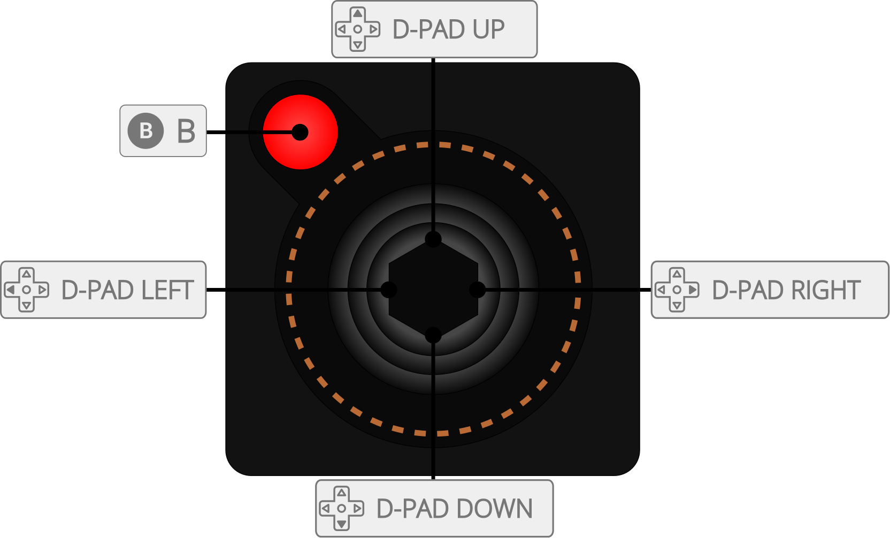

# Atari - 2600 (Stella)

<iframe width="560" height="315" src="https://www.youtube-nocookie.com/embed/wQdrwJbxIgk" title="YouTube video player" frameborder="0" allow="accelerometer; autoplay; clipboard-write; encrypted-media; gyroscope; picture-in-picture" allowfullscreen></iframe>

## Background

Stella is a multi-platform Atari 2600 VCS emulator.

### Author/License

The Stella core has been authored by

- Stephen Anthony
- Bradford Mott
- Thomas Jentzsch
- Christian Speckner

The Stella core is licensed under

- [GPLv2](https://github.com/stella-emu/stella/blob/master/License.txt)

A summary of the licenses behind RetroArch and its cores can be found [here](../development/licenses.md).

## Extensions

Content that can be loaded by the Stella core have the following file extensions:

- .a26
- .bin
- .zip

## Databases

RetroArch database(s) that are associated with the Stella core:

- [Atari - 2600](https://github.com/libretro/libretro-database/blob/master/rdb/Atari%20-%202600.rdb)

## Features

Frontend-level settings or features that the Stella core respects.

| Feature           | Supported |
|-------------------|:---------:|
| Restart           | ✔         |
| Screenshots       | ✔         |
| Saves             | ✕         |
| States            | ✔         |
| Rewind            | ✔         |
| Netplay           | ✔         |
| Core Options      | ✔         |
| [Memory Monitoring (achievements)](../guides/memorymonitoring.md) | ✔         |
| RetroArch Cheats  | ✕         |
| Native Cheats     | ✕         |
| Controls          | ✔         |
| Remapping         | ✔         |
| Multi-Mouse       | ✕         |
| Rumble            | ✕         |
| Sensors           | ✕         |
| Camera            | ✕         |
| Location          | ✕         |
| Subsystem         | ✕         |
| [Softpatching](../guides/softpatching.md) | ✕         |
| Disk Control      | ✕         |
| Username          | ✕         |
| Language          | ✕         |
| Crop Overscan     | ✕         |
| LEDs              | ✕         |

### Directories

The Stella core's internal core name is 'Stella'

The Stella core saves/loads to/from these directories.

**Frontend's State directory**

- 'content-name'.state# (State)

### Geometry and timing

- The Stella core's core provided FPS is (FPS)
- The Stella core's core provided sample rate is 31400 Hz
- The Stella core's core provided aspect ratio is 4/3

## Core options

The Stella core has the following option(s) that can be tweaked from the core options menu. The default setting is bolded.

- **Console display** [stella_console] (**auto**|ntsc|pal|secam|ntsc50|pal60|secam60)
- **Palette colors** [stella_palette] (**standard**|z26|user|custom)
- **TV effects** [stella_filter] (**OFF**|composite|s-video|rgb|badly adjusted)
- **Crop horizontal overscan** [stella_crop_hoverscan] (**OFF**|ON)
- **Crop vertical overscan** [stella_crop_voverscan] (**0**|1|2|3|4|5|6|7|8|9|10|11|12|13|14|15|16|17|18|19|20|21|22|23|24)
- **NTSC aspect %** [stella_ntsc_aspect] (**par**|100|101|102|103|104|105|106|107|108|109|110|111|112|113|114|115|116|117|118|119|120|121|122|123|124|125|75|76|77|78|79|80|81|82|83|84|85|86|87|88|89|90|91|92|93|94|95|96|97|98|99)
- **PAL aspect %** [stella_pal_aspect] (**par**|100|101|102|103|104|105|106|107|108|109|110|111|112|113|114|115|116|117|118|119|120|121|122|123|124|125|75|76|77|78|79|80|81|82|83|84|85|86|87|88|89|90|91|92|93|94|95|96|97|98|99)
- **Stereo sound** [stella_stereo] (**auto**|off|on)
- **Phosphor mode** [stella_phosphor] (**auto**|off|on)
- **Phosphor blend %** [stella_phosphor_blend] (**60**|65|70|75|80|85|90|95|100|0|5|10|15|20|25|30|35|40|45|50|55)
- **Paddle mouse sensitivity** [stella_paddle_mouse_sensitivity] (**10**|11|12|13|14|15|16|17|18|19|20|21|22|23|24|25|26|27|28|29|30|1|2|3|4|5|6|7|8|9)
- **Paddle joypad sensitivity** [stella_paddle_joypad_sensitivity] (**3**|4|5|6|7|8|9|10|11|12|13|14|15|16|17|18|19|20|1|2)
- **Paddle analog sensitivity** [stella_paddle_analog_sensitivity] (**20**|21|22|23|24|25|26|27|28|29|30|0|1|2|3|4|5|6|7|8|9|10|11|12|13|14|15|16|17|18|19)
- **Paddle analog deadzone** [stella_paddle_analog_deadzone] (**15**|16|17|18|19|20|21|22|23|24|25|26|27|28|29|30|0|1|2|3|4|5|6|7|8|9|10|11|12|13|14)
- **Paddle analog absolute** [stella_paddle_analog_absolute] (**OFF**|ON)
- **Lightgun crosshair** [stella_lightgun_crosshair] (**OFF**|ON)
- **Enable reload/next game** [stella_reload] (**off**|on)
- **Auto-detect PAL-60** [stella_detect_pal60] (**OFF**|ON)
- **Auto-detect NTSC-50** [stella_detect_ntsc50] (**OFF**|ON)
- **Palette contrast** [stella_pal_contrast] (**0**|-1|-2|-3|-4|-5|-6|-7|-8|-9|-10|1|2|3|4|5|6|7|8|9|10)
- **Palette brightness** [stella_pal_brightness] (**0**|-1|-2|-3|-4|-5|-6|-7|-8|-9|-10|1|2|3|4|5|6|7|8|9|10)
- **Palette hue** [stella_pal_hue] (**0**|-1|-2|-3|-4|-5|-6|-7|-8|-9|-10|1|2|3|4|5|6|7|8|9|10)
- **Palette saturation** [stella_pal_saturation] (**0**|-1|-2|-3|-4|-5|-6|-7|-8|-9|-10|1|2|3|4|5|6|7|8|9|10)
- **Palette gamma** [stella_pal_gamma] (**0**|-1|-2|-3|-4|-5|-6|-7|-8|-9|-10|1|2|3|4|5|6|7|8|9|10)
- **Pitfall II music pitch** [stella_dpc_pitch] (**20000**|10000|11000|12000|13000|14000|15000|16000|17000|18000|19000|21000|22000|23000|24000|25000|26000|27000|28000|29000|30000)
- **Info messages** [stella_messages] (**OFF**|ON)

## Controllers

The Stella core supports the following device type(s) in the controls menu, bolded device types are the default for the specified user(s):

### User 1 - 2 device types

- **Automatic (from ROM database)** - picks the controller the game needs from Stella's ROM database
- Joystick
- BoosterGrip
- Genesis
- Joy 2B+
- Paddles
- Driving
- Keyboard
- TrakBall
- Amiga Mouse
- Atari Mouse
- Lightgun
- QuadTari
- MindLink
- AtariVox
- SaveKey

### Controller tables

#### Joypad

| User 1 Remap descriptors | RetroPad Inputs                             |
|--------------------------|---------------------------------------------|
| Fire                     |           |
| Select                   |      |
| Reset                    |       |
| Up                       |     |
| Down                     |   |
| Left                     |   |
| Right                    |  |
| Left Difficulty A        |          |
| Right Difficulty A       |          |
| Left Difficulty B        |          |
| Right Difficulty B       |          |
| Color                    |          |
| Black/White              |          |

| User 2 Remap descriptors | RetroPad Inputs                             |
|--------------------------|---------------------------------------------|
| Fire                     |           |
| Up                       |     |
| Down                     |   |
| Left                     |   |
| Right                    |  |

## External Links

- [Official Stella Website](https://stella-emu.github.io/)
- [Official Stella Github Repository](https://github.com/stella-emu/stella)
- [Libretro Stella Core info file](https://github.com/libretro/libretro-super/blob/master/dist/info/stella_libretro.info)
- [Libretro Stella Github Repository](https://github.com/libretro/stella-libretro)
- [Report Libretro Stella Core Issues Here](https://github.com/libretro/stella-libretro/issues)

## Other Atari 2600 cores

- [Atari - 2600 (Stella 2014)](stella2014.md)
- [Atari - 2600 (Stella 2023)](stella2023.md)
- [Atari - 2600 (Tia)](tia.md)
