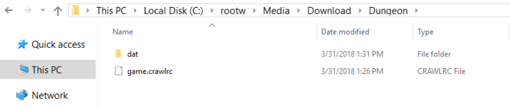

# Dungeon Crawl Stone Soup

## Background
Dungeon Crawl Stone Soup is a free roguelike game of exploration and treasure-hunting in dungeons filled with dangerous and unfriendly monsters in a quest for the mystifyingly fabulous Orb of Zot.

The Dungeon Crawl Stone Soup core has been authored by

- DCSS Team

The Dungeon Crawl Stone Soup core is licensed under

- [GPLv2+](https://github.com/libretro/crawl-ref/blob/master/crawl-ref/licence.txt)

A summary of the licenses behind RetroArch and its cores can be found [here](../development/licenses.md).

#### How to start the Dungeon Crawl Stone Soup core:

1. Create an empty directory to hold game data.
2. Copy [https://github.com/libretro/crawl-ref/tree/master/crawl-ref/source/dat](https://github.com/libretro/crawl-ref/tree/master/crawl-ref/source/dat) into the root of game directory.
3. Create a file named game.crawlrc in the root of the game directory.
4. Load game.crawlrc with the Dungeon Crawl Stone Soup core.

## Extensions

Content that can be loaded by the Dungeon Crawl Stone Soup core have the following file extensions:

- .crawlrc

## Features

Frontend-level settings or features that the Dungeon Crawl Stone Soup core respects.

| Feature           | Supported |
|-------------------|:---------:|
| Restart           | ✕         |
| Screenshots       | ✕         |
| Saves             | ✔         |
| States            | ✕         |
| Rewind            | ✕         |
| Netplay           | ✕         |
| Core Options      | ✕         |
| RetroAchievements | ✕         |
| RetroArch Cheats  | ✕         |
| Native Cheats     | ✕         |
| Controls          | ✔         |
| Remapping         | ✔         |
| Multi-Mouse       | ✕         |
| Rumble            | ✕         |
| Sensors           | ✕         |
| Camera            | ✕         |
| Location          | ✕         |
| Subsystem         | ✕         |
| [Softpatching](../guides/softpatching.md) | ✕         |
| Disk Control      | ✕         |
| Username          | ✕         |
| Language          | ✕         |
| Crop Overscan     | ✕         |
| LEDs              | ✕         |

### Directories

The Dungeon Crawl Stone Soup core's library name is 'Dungeon Crawl: Stone Soup'

The Dungeon Crawl Stone Soup core saves/loads to/from these directories.

**Loaded content's directory**

| File   | Description                              |
|:-------|:----------------------------------------:|
| saves/ | Dungeon Crawl Stone Soup saves directory |

### Geometry and timing

- The Dungeon Crawl Stone Soup core's core provided FPS is 60
- The Dungeon Crawl Stone Soup core's core provided sample rate is 44100 Hz
- The Dungeon Crawl Stone Soup core's base width is 1024
- The Dungeon Crawl Stone Soup core's base height is 768
- The Dungeon Crawl Stone Soup core's max width is 1024
- The Dungeon Crawl Stone Soup core's max height is 768
- The Dungeon Crawl Stone Soup core's core provided aspect ratio is 0.0

## Devices

- Joypad
- Pointer
- Keyboard (Keyboard callback)

## Joypad

| User 1 input descriptors | RetroPad Inputs                             |
|--------------------------|---------------------------------------------|
| Enter                    |           |
| Up                       |     |
| Down                     |   |
| Left                     |   |
| Right                    |  |

## Pointer

| RetroPointer Inputs                                                                                                      | Dungeon Crawl Stone Soup inputs |
|--------------------------------------------------------------------------------------------------------------------------|---------------------------------|
|  or  Pointer Position | Cursor                          |
|  or  Pointer Pressed            | Click                           |

## External Links

- [Official Dungeon Crawl Stone Soup Website](https://crawl.develz.org/)
- [Official Dungeon Crawl Stone Soup Github Repository](https://github.com/crawl/crawl)
- [Libretro Dungeon Crawl Stone Soup Core info file](https://github.com/libretro/libretro-super/blob/master/dist/info/stonesoup_libretro.info)
- [Libretro Dungeon Crawl Stone Soup Github Repository](https://github.com/libretro/crawl-ref)
- [Report Libretro Dungeon Crawl Stone Soup Core Issues Here](https://github.com/libretro/libretro-meta/issues)