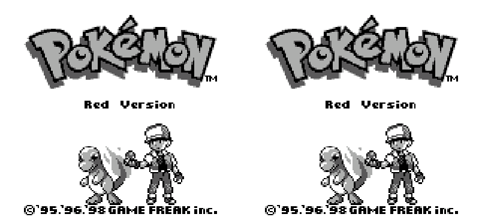
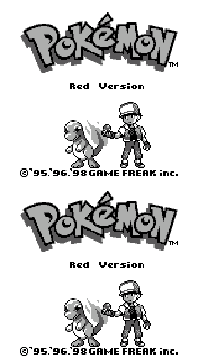

# Nintendo - Game Boy / Color (TGB Dual)

## Background

TGB Dual is an open source (GPLv2) GB/GBC emulator with game link cable support.

### Author/License

The TGB Dual core has been authored by

- GIGO
- Hii

The TGB Dual core is licensed under

- [GPLv2](https://github.com/libretro/tgbdual-libretro/blob/master/docs/COPYING-2.0.txt)

A summary of the licenses behind RetroArch and its cores can be found [here](../development/licenses.md).

## Extensions

Content that can be loaded by the TGB Dual core have the following file extensions:

- .gb
- .gbc
- .sgb

## Databases

RetroArch database(s) that are associated with the TGB Dual core:

- [Nintendo - Game Boy](https://github.com/libretro/libretro-database/blob/master/rdb/Nintendo%20-%20Game%20Boy.rdb)
- [Nintendo - Game Boy Color](https://github.com/libretro/libretro-database/blob/master/rdb/Nintendo%20-%20Game%20Boy%20Color.rdb)

## Features

Frontend-level settings or features that the TGB Dual core respects.

| Feature           | Supported |
|-------------------|:---------:|
| Restart           | ✔         |
| Screenshots       | ✔         |
| Saves             | ✔         |
| States            | ✔         |
| Rewind            | ✔         |
| Netplay           | ✔         |
| Core Options      | ✔         |
| RetroAchievements | ✕         |
| RetroArch Cheats  | ✕         |
| Native Cheats     | ✕         |
| Controls          | ✔         |
| Remapping         | ✔         |
| Multi-Mouse       | ✕         |
| Rumble            | ✕         |
| Sensors           | ✕         |
| Camera            | ✕         |
| Location          | ✕         |
| Subsystem         | ✕         |
| [Softpatching](../guides/softpatching.md) | ✔         |
| Disk Control      | ✕         |
| Username          | ✕         |
| Language          | ✕         |
| Crop Overscan     | ✕         |
| LEDs              | ✕         |

### Directories

The TGB Dual core's internal core name is 'TGB Dual'

The TGB Dual core saves/loads to/from these directories.

**Frontend's Save directory**

- 'content-name'.srm (Cartridge battery save)
- 'content-name'.rtc (Real time clock save)

**Frontend's State directory**

- 'content-name'.state# (State)

### Geometry and timing

- The TGB Dual core's core provided FPS is 59.7275005696
- The TGB Dual core's core provided sample rate is 44100 Hz
- The TGB dual core's core provided aspect ratio is (Ratio)

## Core options

The TGB Dual core has the following option(s) that can be tweaked from the core options menu. The default setting is bolded.

Settings with (Restart) means that core has to be closed for the new setting to be applied on next launch.

- **GB Link Enable (restart)** [tgbdual_gblink_enable] (**disabled**|enabled)

	Emulates two Game Boy units side by side for multiplayer support.

??? note "*GB Link Enable - Enabled*"
    

- **Screen placement** [tgbdual_screen_placement] (**horizontal**|vertical)

	Switches the screen layout for multiplayer support.

??? note "*Horizontal*"
    

??? note "*Vertical*"
    

- **Switch player screens** [tgbdual_switch_screens] (**normal**|switched)

	Switches the player screens for multiplayer support.

- **Show player screens** [tgbdual_single_screen_mp] (**both players**|player 1 only|player 2 only)

	Displays the selected player screens for multiplayer support.

## Controllers

The TGB Dual core supports the following device type(s) in the controls menu, bolded device types are the default for the specified user(s):

### User 1 - 2 device types

- None - Doesn't disable input. There's no reason to switch to this.
- **RetroPad** - Joypad - Stay on this.
- RetroPad - Joypad - Same as RetroPad. There's no reason to switch to this.

### Controller tables

#### Joypad

| User 1 - 2 Remap descriptors | RetroPad Inputs                           |
|------------------------------|-------------------------------------------|
| B                            |     |
| Select                       |      |
| Start                        |       |
| D-Pad Up                     |     |
| D-Pad Down                   |   |
| D-Pad Left                   |   |
| D-Pad Right                  |  |
| A                            |     |
| Next Audio Mode              |          |
| Prev Audio Mode              |          |

## Compatibility

Awaiting description.

## External Links

- [Official TGB Dual Website](http://gigo.retrogames.com/download.html#tgb-dual)
- [Official TGB Dual SDL port Website](http://shinh.skr.jp/tgbdualsdl/)
- [Libretro TGB Dual Core info file](https://github.com/libretro/libretro-super/blob/master/dist/info/tgbdual_libretro.info)
- [Libretro TGB Dual Github Repository](https://github.com/libretro/tgbdual-libretro)
- [Report Libretro TGB Dual Core Issues Here](https://github.com/libretro/tgbdual-libretro/issues)

### See also

#### Nintendo - Game Boy (+ Color)

- [Nintendo - Game Boy / Color (Emux GB)](emux_gb.md)
- [Nintendo - Game Boy / Color (Gambatte)](gambatte.md)
- [Nintendo - Game Boy / Color (Gearboy)](gearboy.md)
- [Nintendo - Game Boy / Color (SameBoy)](sameboy.md)
- [Nintendo - Game Boy Advance (mGBA)](mgba.md)
- [Nintendo - Game Boy Advance (VBA-M)](vba_m.md)
- [Nintendo - SNES / Famicom (higan Accuracy)](higan_accuracy.md)
- [Nintendo - SNES / Famicom (nSide Balanced)](nside_balanced.md)
- [Nintendo - SNES / Famicom (Mesen-S)](mesen-s.md)
