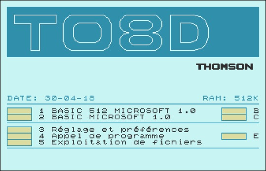
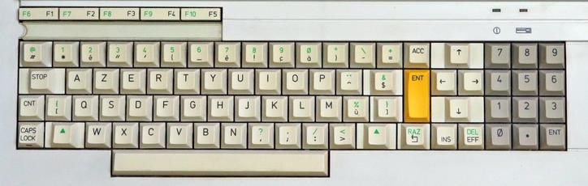

# Thomson - MO/TO (Theodore)

## Background

Theodore is a Thomson MO/TO system emulator based on Daniel Coulom's DCTO8D/DCTO9P/DCMO5 emulators. [Thomson MO/TO](https://en.wikipedia.org/wiki/Thomson_computers) is a family of 8-bit home computers produced by French company Thomson SA between 1982 and 1989.
Theodore emulates all the main models of the MO/TO family: TO7, TO7/70, TO8, TO8D, TO9, TO9+, MO5 and MO6.
It also emulates the [Olivetti Prodest PC128](https://it.wikipedia.org/wiki/Olivetti_Prodest_PC_128), a rebranded MO6 for the Italian market.

The Theodore core has been authored by

- Thomas Lorblanchès

The Theodore core is licensed under

- [GPLv3](https://github.com/Zlika/theodore/blob/master/LICENSE)

A summary of the licenses behind RetroArch and its cores can be found [here](../development/licenses.md).

## BIOS

The Theodore core does not feature BIOS use.

## Extensions

Content that can be loaded by the Theodore core have the following file extensions:

- .fd (floppy disk)
- .sap (floppy disk)
- .k7 (tape)
- .rom (cartridge)
- .m7 (cartridge)
- .m5 (cartridge)

RetroArch database(s) that are associated with the Theodore core:

- [Thomson - MOTO](https://github.com/libretro/libretro-database/blob/master/rdb/Thomson%20-%20MOTO.rdb)

## Features

Frontend-level settings or features that the Theodore core respects.

| Feature           | Supported |
|-------------------|:---------:|
| Restart           | ✔         |
| Saves             | ✔         |
| States            | ✔         |
| Rewind            | ✔         |
| Netplay           | ✔         |
| Core Options      | ✔         |
| RetroAchievements | ✕         |
| RetroArch Cheats  | ✔         |
| Native Cheats     | ✕         |
| Controls          | -         |
| Remapping         | -         |
| Multi-Mouse       | -         |
| Rumble            | ✕         |
| Sensors           | ✕         |
| Camera            | ✕         |
| Location          | ✕         |
| Subsystem         | ✕         |
| [Softpatching](../guides/softpatching.md) | ✕         |
| Disk Control      | ✕         |
| Username          | ✕         |
| Language          | ✕         |
| Crop Overscan     | ✕         |
| LEDs              | ✕         |

### Directories

The Theodore core's internal core name is 'theodore'.

**Frontend's System directory**

| File         | Description |
|:------------:|:-----------:|
| theodore.cfg | Config file |

### Geometry and timing

- The Theodore core's base width is 672 pixels.
- The Theodore core's base height is 432 pixels.

## Usage

Once the content and core are loaded the start screen is displayed as
shown below.

When the "Thomson model" core option is set to "Auto" (default value), the core tries to autodetect the Thomson model to emulate based on the name of the content file, and fallback to TO8 mode if it cannot.
The "Start" button of the controller can be used to start the game. The core will then make an "educated guess" to start the game (cf. [Theodore's README file](https://github.com/Zlika/theodore/blob/master/README.md#video_game-gamepad-mapping-of-the-buttons) for more info about it).

## Core options

The Theodore core has the following option(s) that can be tweaked from the core options menu. The default setting is bolded.

- **Thomson model** [theodore_rom]  (**Auto**|TO8|TO8D|TO9|TO9+|MO5|MO6|PC128|TO7|TO7/70)

- **Auto run game** [theodore_autorun] (**disabled**|enabled)

- **Virtual keyboard transparency** [theodore_vkb_transparency] (**0%**|10%|20%|30%|40%|50%|60%|70%|80%|90%)

- **Floppy write protection** [theodore_floppy_write_protect]  (disabled|**enabled**)

- **Tape write protection** [theodore_tape_write_protect]  (disabled|**enabled**)

- **Dump printer data to file** [theodore_printer_emulation] (**disabled**|enabled)

## User 1 device types

The Theodore core supports the following device type(s) in the controls menu, bolded device types are the default for the specified user(s):

- None - Input disabled
- **RetroPad** - Joypad
- RetroPad w/ Analog - Joypad

## Other devices

- Light pen - The computer's light pen inputs are mapped to the mouse.

## Joypad

| RetroPad Inputs                      | User 1 input descriptors       |
|--------------------------------------|--------------------------------|
|      | "Fire" button / Press key when the virtual keyboard is displayed |
|      | Virtual keyboard: move up/down |
| | Virtual keyboard: show/hide    |
|  | Start program (See: [Usage](#usage)) |

When the virtual keyboard is displayed, the D-pad is used to move the selected key and the B button is used to press the selected key.
Long press the B button for a sticky key.
The virtual keyboard can also be used with a touch screen.
The transparency of the virtual keyboard can be set using the core's "Virtual keyboard transparency" option.

## Keyboard

| RetroKeyboard Inputs         | Theodore Inputs           |
|------------------------------|---------------------------|
| Keyboard Tab                 | STOP                      |
| Keyboard Left Control        | CNT                       |
| Keyboard Caps Lock           | CAPSLOCK                  |
| Keyboard Backspace           | ACC                       |
| Keyboard Home                | HOME                      |
| Keyboard Up                  | UP                        |
| Keyboard Down                | DOWN                      |
| Keyboard Right               | RIGHT                     |
| Keyboard Left                | LEFT                      |
| Keyboard Insert              | INS                       |
| Keyboard Delete              | DEL                       |
| Keyboard Alt                 | RAZ                       |
| Keyboard F1                  | F1                        |
| Keyboard F2                  | F2                        |
| Keyboard F3                  | F3                        |
| Keyboard F4                  | F4                        |
| Keyboard F5                  | F5                        |
| Keyboard Shift + F1          | F6                        |
| Keyboard Shift + F2          | F7                        |
| Keyboard Shift + F3          | F8                        |
| Keyboard Shift + F4          | F9                        |
| Keyboard Shift + F5          | F10                       |
| Keyboard Left Shift          | Shift or Yellow key (MO5) |
| Keyboard Right Shift         | Shift or BASIC key (MO5)  |

## Mouse

| RetroMouse Inputs                                   | Theodore Inputs      |
|-----------------------------------------------------|----------------------|
|  Mouse Cursor | Light pen cursor     |
|  Mouse 1       | Selection            |

## External Links

- [Libretro Theodore Github Repository](https://github.com/Zlika/theodore)
- [Report Libretro Theodore Core Issues Here](https://github.com/Zlika/theodore/issues)
- [Libretro Theodore Core info file](https://github.com/libretro/libretro-super/blob/master/dist/info/theodore_libretro.info)
- [Libretro Thomson Database](https://github.com/libretro/libretro-database/blob/master/rdb/Thomson%20-%20MOTO.rdb)
- [Libretro Thomson Thumbnails](https://github.com/libretro-thumbnails/Thomson_-_MOTO)
- [Official DCTO8D/DCTO9P/DCMO5 Website](http://dcmoto.free.fr/)
