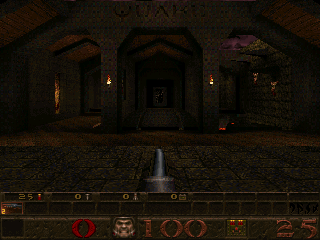

# Quake 1 (TyrQuake)

## Background

Libretro port of Tyrquake (Quake 1 engine).

Features

- Runs at fixed frametimes
- Software bilinear filtering
- Software Half-Life/Quake 2-style colored lighting RGBA
- Chasecam / thirdperson view mode
- Interpolated animation applied on the keyframe animation for smooth animation

The TyrQuake core has been authored by

- Kevin Shanahan (Tyrann)

The TyrQuake core is licensed under

- [GPLv2](https://github.com/libretro/tyrquake/blob/master/gnu.txt)

A summary of the licenses behind RetroArch and its cores can be found [here](../development/licenses.md).

## Extensions

Content that can be loaded by the TyrQuake core have the following file extensions:

- .pak

RetroArch database(s) that are associated with the TyrQuake core:

- [Quake1](https://github.com/libretro/libretro-database/blob/master/rdb/Quake1.rdb)

## Features

Frontend-level settings or features that the TyrQuake core respects.

| Feature           | Supported |
|-------------------|:---------:|
| Restart           | ✔         |
| Screenshots       | ✔         |
| Saves             | ✔         |
| States            | ✕         |
| Rewind            | ✕         |
| Netplay           | ✕         |
| Core Options      | ✔         |
| RetroAchievements | ✕         |
| RetroArch Cheats  | ✔         |
| Native Cheats     | ✔         |
| Controls          | ✔         |
| Remapping         | ✔         |
| Multi-Mouse       | ✕         |
| Rumble            | ✔         |
| Sensors           | ✕         |
| Camera            | ✕         |
| Location          | ✕         |
| Subsystem         | ✕         |
| [Softpatching](../guides/softpatching.md) | ✕         |
| Disk Control      | ✕         |
| Username          | ✔         |
| Language          | ✕         |
| Crop Overscan     | ✕         |
| LEDs              | ✕         |

### Directories

The TyrQuake core's library name is 'TyrQuake'

The TyrQuake core saves/loads to/from these directories.

**Frontend's Save directory**

| File                          | Description |
|:-----------------------------:|:-----------:|
| (game directory)/config.cfg   | Config      |
| (game directory)/*.sav        | Save        |

### Geometry and timing

- The TyrQuake core's core provided FPS is 60
- The TyrQuake core's core provided sample rate is 44100 Hz
- The TyrQuake core's base width is dependent on the Resolution core option.
- The TyrQuake core's base height is dependent on the Resolution core option.
- The TyrQuake core's max width is dependent on the Resolution core option.
- The TyrQuake core's max height is dependent on the Resolution core option.
- The TyrQuake core's core provided aspect ratio is 4/3

## Loading Quake and Expansion Paks

Follow this directory structure

- 'id1' for the main game
- 'hipnotic' for the 1st mission pack
- 'rogue' for the 2nd mission pack
- 'dopa' for the official "Episode 5: Dimension of the Past" expansion
- Put BGM into a subfolder named music in each of them.

```
id1/
├── pak0.pak ## shareware data
├── pak1.pak ## registered data
├── music/
│   ├── track02.ogg
│   ├── ...
│   └── track11.ogg
│
hipnotic/
├── pak0.pak
├── music/
│   ├── track02.ogg
│   ├── ...
│   └── track09.ogg
│
rogue/
├── pak0.pak
├── music/
│   ├── track02.ogg
│   ├── ...
│   └── track09.ogg
│
dopa/
└──  pak0.pak
```

Game saves and internal configuration files will be created in the frontend-defined save directory with a folder layout that mirrors the game data structure:

```
id1/
├── config.cfg
├── s0.sav
├── s1.sav
│
hipnotic/
├── config.cfg
├── s0.sav
├── s1.sav
│
rogue/
├── config.cfg
├── s0.sav
├── s1.sav
│
dopa/
├── config.cfg
├── s0.sav
└── s1.sav
```

Game saves are numbered from 's0.sav' to 's11.sav'.

## Soundtrack files

TyrQuake supports playback of the original soundtrack from the base game and official mission packs' CDs.

CD audio should be ripped into OGG format files, and placed into a subfolder named music of the appropriate folder (id1, hipnotic or rogue). The ripped CD tracks must be named trackXX.ogg, corresponding to the original CD track index for each audio track. Considering that the first CD track in all cases is the data track, the first audio track will always begin with track 02, which should be reflected in the filename of the ripped audio files.

## Username

The TyrQuake core uses RetroArch's username setting for the in-game player name.

## Config

TyrQuake's internal game settings can be found in the 'config.cfg' file inside each game's save directory.

Many of these settings may be changed from the in-game menu. Notable options are as follows:

- VIDEO → SCREEN SIZE

	With the slider at the 3rd position from the right, all HUD information is shown.

	With the slider at the 2nd position from the right, the gameplay area is increased while the HUD size is reduced such that only armour, health and current ammo are shown.

	With the slider at the far right position, the gameplay area fills the screen and no HUD is shown.

- VIDEO → GAMMA

	Sets display brightness

- VIDEO → DITHER FILTERING (**OFF**|ON)

	Enables texture smoothing.

- VIDEO → SMOOTH ANIMATION (**OFF**|ON)

	Enables linear interpolation of character animation.

- VIDEO → SMOOTH MOVEMENT (**OFF**|ON)

	Enables linear interpolation of character movement.

- GAME → CROSSHAIR (**OFF**|ON)

	Enables display of targeting reticule.

## Core options

The TyrQuake core has the following option(s) that can be tweaked from the core options menu. The default setting is bolded.

Settings with (Restart) means that core has to be closed for the new setting to be applied on next launch.

- **Colored lighting (restart)** [tyrquake_colored_lighting] (**disabled**|enabled)

	Enables colored lightning when the loaded content supports it. Requires a restart.

- **Resolution (restart)** [tyrquake_resolution] (**320x200**|640x400|960x600|1280x800|1600x1000|1920x1200|320x240|320x480|360x200|360x240|360x400|360x480|400x224|480x272|512x224|512x240|512x384|512x512|640x224|640x240|640x448|640x480|720x576|800x480|800x600|960x720|1024x768|1280x720|1600x900|1920x1080)

	Configure the resolution. Requires a restart.

??? note "Resolution - 320x240"
	

??? note "Resolution - 1920x1080"
	

- **Rumble** [tyrquake_rumble] (**disabled**|enabled)

	Enables joypad rumble.

- **Invert Y Axis** [tyrquake_invert_y_axis] (**disabled**|enabled)

	Invert the gamepad right analog stick's Y axis.

- **Analog Deadzone (percent)** [tyrquake_analog_deadzone] (**15**|20|25|30|0|5|10)

	Sets the deadzone of the Gamepad analog sticks when the input device type is set to 'Gamepad Classic' or 'Gamepad Modern'.

## User 1 device types

The TyrQuake core supports the following device type(s) in the controls menu, bolded device types are the default for the specified user(s):

- None - Input disabled.
- **Gamepad Classic** - Joypad
- **Gamepad Classic Alt** - Joypad
- **Gamepad Modern** - Joypad
- **Keyboard + Mouse** - Keyboard and Mouse - Switch to this for keyboard and mouse input. Has keymapper support.

## Rumble support

Rumble only works in the TyrQuake core when

- The content being ran has rumble support.
- The frontend being used has rumble support.
- The joypad device being used has rumble support.
- The ['Rumble' core option](#core-options) is set to enabled.

## Joypad

| User 1 Remap descriptors for 'Gamepad Classic' device type | RetroPad Inputs                              | TyrQuake inputs   |
|------------------------------------------------------------|----------------------------------------------|-------------------|
| Jump                                                       |              | Jump              |
| Fire                                                       |              | Fire              |
| Toggle Run Mode                                            |         | Toggle Run Mode   |
| Menu                                                       |          | Menu              |
| D-Pad Up                                                   |        | D-Pad Up          |
| D-Pad Down                                                 |      | D-Pad Down        |
| D-Pad Left                                                 |      | D-Pad Left        |
| D-Pad Right                                                |     | D-Pad Right       |
| Cycle Weapon                                               |              | Cycle Weapon      |
| Freelook                                                   |              | Freelook          |
| Strafe Left                                                |             | Strafe Left       |
| Strafe Right                                               |             | Strafe Right      |
| Look Up                                                    |             | Look Up           |
| Look Down                                                  |             | Look Down         |
| Move Down                                                  |             | Move Down         |
| Swim Up                                                    |             | Swim Up           |
|                                                            |  X  | Strafe Left/Right |
|                                                            |  Y  | D-Pad Up/Down     |
|                                                            |  X | D-Pad Left/Right  |
|                                                            |  Y | Look Up/Down      |

| User 1 Remap descriptors for 'Gamepad Classic Alt' device type | RetroPad Inputs                              | TyrQuake inputs   |
|----------------------------------------------------------------|----------------------------------------------|-------------------|
| Look Down                                                      |              | Look Down         |
| Look Left                                                      |              | Look Left         |
| Toggle Run Mode                                                |         | Toggle Run Mode   |
| Menu                                                           |          | Menu              |
| D-Pad Up                                                       |        | D-Pad Up          |
| D-Pad Down                                                     |      | D-Pad Down        |
| D-Pad Left                                                     |      | D-Pad Left        |
| D-Pad Right                                                    |     | D-Pad Right       |
| Look Right                                                     |              | Look Right        |
| Look Up                                                        |              | Look Up           |
| Jump                                                           |             | Jump              |
| Fire                                                           |             | Fire              |
| Run                                                            |             | Run               |
| Next Weapon                                                    |             | Next Weapon       |
| Swim Down                                                      |             | Swim Down         |
| Previous Weapon                                                |             | Previous Weapon   |
|                                                                |  X  | Strafe Left/Right |
|                                                                |  Y  | D-Pad Up/Down     |
|                                                                |  X | D-Pad Left/Right  |
|                                                                |  Y | Look Up/Down      |

| User 1 Remap descriptors for 'Gamepad Modern' device type | RetroPad Inputs                              | TyrQuake inputs   |
|-----------------------------------------------------------|----------------------------------------------|-------------------|
| Swim Down                                                 |              | Swim Down         |
| Swim Up                                                   |              | Swim Up           |
| Show Scores                                               |         | Show Scores       |
| Menu                                                      |          | Menu              |
| D-Pad Up                                                  |        | D-Pad Up          |
| D-Pad Down                                                |      | D-Pad Down        |
| D-Pad Left                                                |      | D-Pad Left        |
| D-Pad Right                                               |     | D-Pad Right       |
| Strafe Right                                              |              | Strafe Right      |
| Strafe Left                                               |              | Strafe Left       |
| Previous weapon                                           |             | Previous weapon   |
| Next weapon                                               |             | Next weapon       |
| Jump                                                      |             | Jump              |
| Fire                                                      |             | Fire              |
|                                                           |             | Move Down         |
|                                                           |             | Swim Up           |
|                                                           |  X  | Strafe Left/Right |
|                                                           |  Y  | D-Pad Up/Down     |
|                                                           |  X | Look Left/Right   |
|                                                           |  Y | Look Up/Down      |

In-game menu controls:

| Menu Function                        | RetroPad Inputs                                |
|--------------------------------------|------------------------------------------------|
| Navigate Up                          |        |
| Navigate Down                        |      |
| Adjust Value                         |      |
| Adjust Value                         |     |
| Select Current Option                |              |
| Return To Previous Level/Close Menu  |              |

## Keyboard

- Keyboard binds are in config.cfg

## Mouse

- Mouse binds are in config.cfg

## External Links

- [Official TyrQuake Website](http://disenchant.net/tyrquake/)
- [Official TyrQuake Git Repository](http://disenchant.net/git/?p=tyrquake)
- [Libretro TyrQuake Core info file](https://github.com/libretro/libretro-super/blob/master/dist/info/tyrquake_libretro.info)
- [Libretro TyrQuake Github Repository](https://github.com/libretro/tyrquake)
- [Report Libretro TyrQuake Core Issues Here](https://github.com/libretro/tyrquake/issues)

## id Software

- [Doom (PrBoom)](prboom.md)
