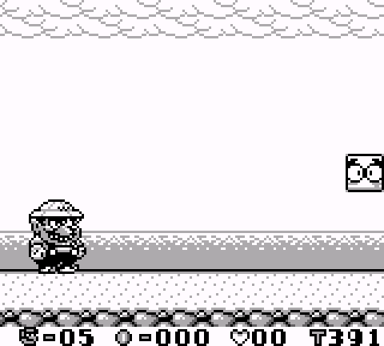
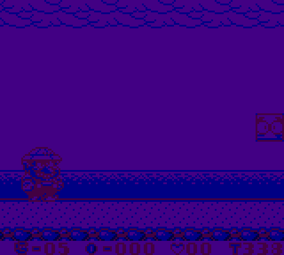
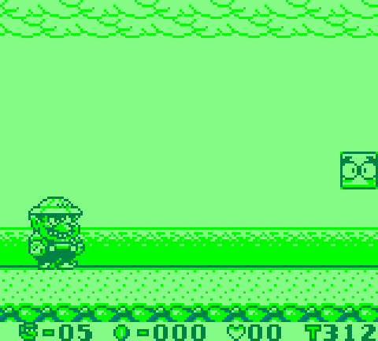
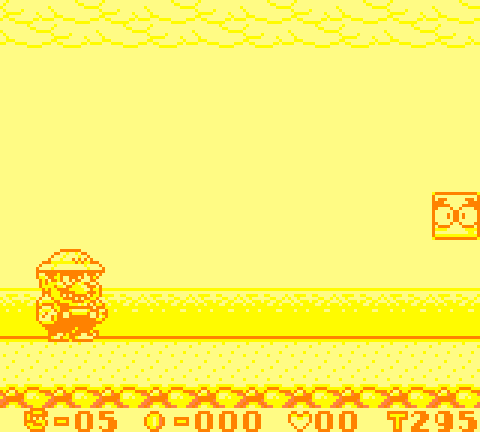
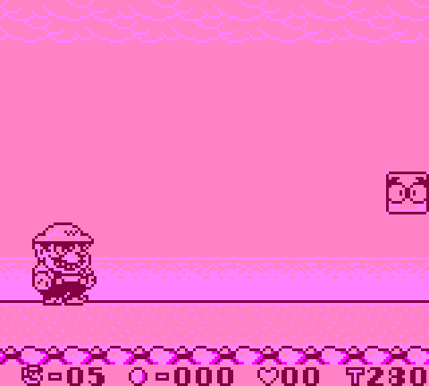
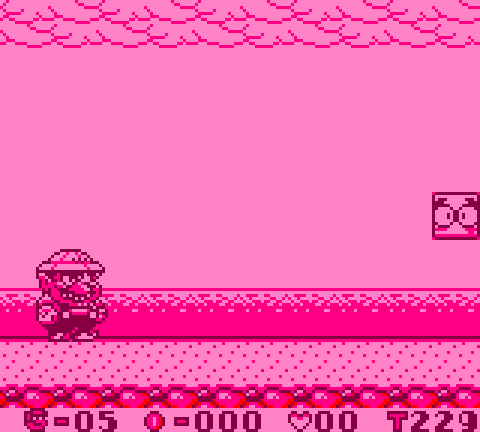
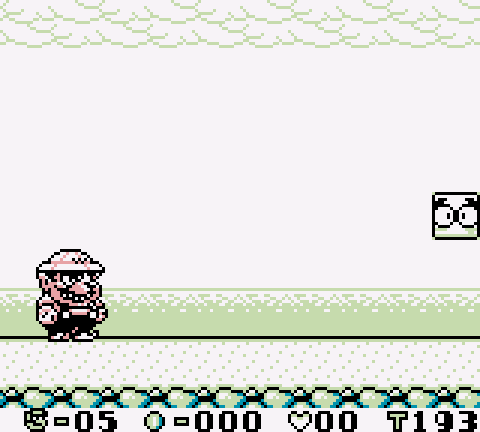
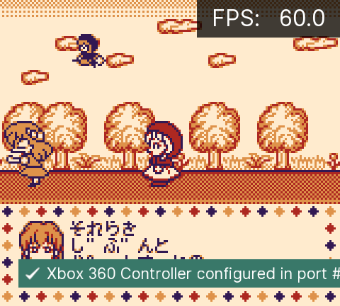
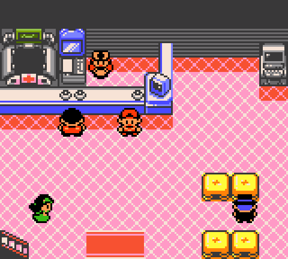
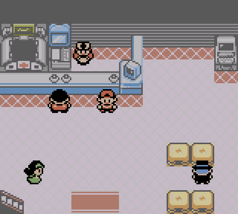

# Nintendo - Game Boy Advance (VBA-M)

## Background

VBA-M is a Game Boy Advance emulator with the goal to improve upon VisualBoyAdvance by integrating the best features from the various builds floating around. It also supports Game Boy, Game Boy Color and Super Game Boy (borders, palette).

### Author/License

The VBA-M core has been authored by

- Forgotten
- VBA-M Team

The VBA-M core is licensed under

- [GPLv2](https://github.com/libretro/vbam-libretro/blob/master/doc/gpl.txt)

A summary of the licenses behind RetroArch and its cores can be found [here](../development/licenses.md).

## BIOS

Required or optional firmware files go in the frontend's system directory.

!!! warning
	In order for the BIOS to be used, the 'Use BIOS file if found' core option must be set to On.

|   Filename   |    Description                   |              md5sum              |
|:------------:|:--------------------------------:|:--------------------------------:|
| gba_bios.bin | Game Boy Advance BIOS - Optional | a860e8c0b6d573d191e4ec7db1b1e4f6 |
| gb_bios.bin  | Game Boy BIOS - Optional         | 32fbbd84168d3482956eb3c5051637f5 |
| gbc_bios.bin | Game Boy Color BIOS - Optional   | dbfce9db9deaa2567f6a84fde55f9680 |

## Extensions

Content that can be loaded by the VBA-M core have the following file extensions:

- .gb
- .gbc
- .gba

## Databases

RetroArch database(s) that are associated with the VBA-M core:

- [Nintendo - Game Boy](https://github.com/libretro/libretro-database/blob/master/rdb/Nintendo%20-%20Game%20Boy.rdb)
- [Nintendo - Game Boy Color](https://github.com/libretro/libretro-database/blob/master/rdb/Nintendo%20-%20Game%20Boy%20Color.rdb)
- [Nintendo - Game Boy Advance](https://github.com/libretro/libretro-database/blob/master/rdb/Nintendo%20-%20Game%20Boy%20Advance.rdb)

## Features

Frontend-level settings or features that the VBA-M core respects.

| Feature           | Supported |
|-------------------|:---------:|
| Restart           | ✔         |
| Screenshots       | ✔         |
| Saves             | ✔         |
| States            | ✔         |
| Rewind            | ✔         |
| Netplay           | ✕         |
| Core Options      | ✔         |
| RetroAchievements | ✔         |
| RetroArch Cheats  | ✔         |
| [RetroArch SaveRAM Autosave Interval support](https://github.com/libretro/RetroArch/issues/16323#issuecomment-1977792161) | ✔ |
| Native Cheats     | ✔         |
| Controls          | ✔         |
| Remapping         | ✔         |
| Multi-Mouse       | ✕         |
| Rumble            | ✔         |
| Sensors           | ✔         |
| Camera            | ✕         |
| Location          | ✕         |
| Subsystem         | ✕         |
| [Softpatching](../guides/softpatching.md) | ✔         |
| Disk Control      | ✕         |
| Username          | ✕         |
| Language          | ✕         |
| Crop Overscan     | ✕         |
| LEDs              | ✕         |

### Directories

The VBA-M core's directory name is 'VBA-M'

The VBA-M core saves/loads to/from these directories.

**Frontend's Save directory**

| File  | Description            |
|:-----:|:----------------------:|
| *.srm | Cartridge battery save |

**Frontend's State directory**

| File     | Description |
|:--------:|:-----------:|
| *.state# | State       |

### Geometry and timing

- The VBA-M core's core provided FPS is 59.72
- The VBA-M core's core provided sample rate is 32768 Hz
- The VBA-M core's base width is GBA: 240, GB: 160 (256 with border/SGB mode)
- The VBA-M core's base height is GBA: 160, GB: 144 (224 with border/SGB mode)
- The VBA-M core's max width is 256
- The VBA-M core's max height is 224
- The VBA-M core's core provided aspect ratio is GBA: 3:2, GB: 10:9 (8:7 with border/SGB)

## Core options

The VBA-M core has the following option(s) that can be tweaked from the core options menu. The default setting is bolded.

Settings with (Restart) means that core has to be closed for the new setting to be applied on next launch.

- **Solar sensor level** [vbam_solarsensor] (**0**|1|2|3|4|5|6|7|8|9|10)

	For use with Boktai games (solar cartridge games). Manually adjust ingame's solar sensor meter.

- **Use BIOS file if found** [vbam_usebios] (Off/**On**)

	Uses BIOS present in RetroArch's system directory.

- **Force enable RTC** [vbam_forceRTCenable] (**Off**/On)

	Forces the internal real-time clock to be enabled regardless of rom. Usuable for rom patches that requires clock to be enabled (aka Pokemon).

- **Sound Interpolation** [vbam_soundinterpolation] (Off/**On**)

	Enable or disable sound filtering.

- **Sound Filtering** [vbam_soundfiltering] (0|1|2|3|4|**5**|6|7|8|9|10)

	Sets the cutoff-frequency for the interpolation filter. Higher value reduces more high frequencies.

- **(GB) Color Palette** [vbam_palettes] (**black and white**|blue sea|dark knight|green forest|hot desert|pink dreams|weird colors|original gameboy|gba sp)

	Set Game Boy palettes to use.

??? note "(GB) Color Palette - black and white"
	

??? note "(GB) Color Palette - blue sea"
	

??? note "(GB) Color Palette - dark knight"
	

??? note "(GB) Color Palette - green forest"
	

??? note "(GB) Color Palette - hot desert"
	

??? note "(GB) Color Palette - pink dreams"
	

??? note "(GB) Color Palette - weird colors"
	

??? note "(GB) Color Palette - original gameboy"
	

??? note "(GB) Color Palette - gba sp"
	

- **(GB) Emulated Hardware (Requires Restart)** [vbam_gbHardware] (Automatic|**Game Boy Color**|Super Game Boy|Game Boy|Game Boy Advance|Super Game Boy)

	Selects the type of game boy handheld to emulate. Automatic will select the most appropriate model for the current game.

- **(GB) Enable Colorizer Hack (Needs Restart)** [vbam_allowcolorizerhack] (**Off**/On)

	Allows some Colorizer/DX patched gb roms to run correctly. NOT RECOMMENDED for non-colorized patched games since this hack relies on inaccurate vram and palette access.

	See: https://github.com/libretro/vbam-libretro/issues/58

- **(GB) Show Borders** [vbam_showborders] (auto|**Off**|On)

	Shows a solid-colored border around the normal window. If current game is SGB capable, an appropriate border from the cartridge will be loaded and shown instead.

??? note "Show Borders - Off"
	

??? note "Show Borders - On"
	

- **(GB) Color Correction** [vbam_gbcoloroption] (**Off**/On)

	Applies color correction to palette.

??? note "(GB) Color Correction - Off"
	

??? note "(GB) Color Correction - On"
	

- **Enable Turbo Buttons** [vbam_turboenable] (**Off**/On)

	Enable or disable gamepad turbo buttons.

- **Turbo Delay (in frames)** [vbam_turbodelay] (1|2|**3**|4|5|6|7...|15)

	Repeat rate of turbo triggers in frames. Lower value triggers more buttons per second.

- **Analog Deadzone (%)** [vbam_astick_deadzone] (5|10|**15**|20|25|30)

	The minimum absolute value of the analog joystick axis to move the gyro/tilt controller axis value.

- **Sensor Sensitivity (Gyroscope) (%)** [vbam_gyro_sensitivity] (10|15|20|25|30|35|40|45|50|55|60|65|70|75|80|85|90|95|**100**|105|110|115|120)

	Used to adjust sensitivity level for gyro-enabled games. Default bind is left analog.

- **Sensor Sensitivity (Tilt) (%)** [vbam_tilt_sensitivity] (10|15|20|25|30|35|40|45|50|55|60|65|70|75|80|85|90|95|**100**|105|110|115|120)

	Used to adjust sensitivity level for gyro-enabled games. Default bind is right analog.

- **Swap Left/Right Analog** [vbam_swap_astick] (**Off**/On)

	Swaps left and right analog stick function for gyro and tilt

- **Sound channel 1** [vbam_sound_1] (Off/**On**)

	Self-explanatory.

- **Sound channel 2** [vbam_sound_2] (Off/**On**)

	Self-explanatory.

- **Sound channel 3** [vbam_sound_3] (Off/**On**)

	Self-explanatory.

- **Sound channel 4** [vbam_sound_4] (Off/**On**)

	Self-explanatory.

- **Sound DMA channel A** [vbam_sound_5] (Off/**On**)

	Self-explanatory.

- **Sound DMA channel B** [vbam_sound_6] (Off/**On**)

	Self-explanatory.

- **Show layer 1** [vbam_layer_1] (Off/**On**)

	Self-explanatory.

- **Show layer 2** [vbam_layer_2] (Off/**On**)

	Self-explanatory.

- **Show layer 3** [vbam_layer_3] (Off/**On**)

	Self-explanatory.

- **Show layer 4** [vbam_layer_4] (Off/**On**)

	Self-explanatory.

- **Show sprite layer** [vbam_layer_5] (Off/**On**)

	Self-explanatory.

- **Show window layer 1** [vbam_layer_6] (Off/**On**)

	Self-explanatory.

- **Show window layer 2** [vbam_layer_7] (Off/**On**)

	Self-explanatory.

- **Show sprite window layer** [vbam_layer_8] (Off/**On**)

	Self-explanatory.

## Controllers

The VBA-M core supports the following device type(s) in the controls menu, bolded device types are the default for the specified user(s):

### User 1 device types

- None - Input disabled.
- **GBA Joypad** - Joypad

### Controller tables

#### Joypad

| User 1 Remap descriptors | RetroPad Inputs                              |
|--------------------------|----------------------------------------------|
| B                        |              |
| Turbo B                  |              |
| Select                   |         |
| Start                    |          |
| D-Pad Up                 |        |
| D-Pad Down               |      |
| D-Pad Left               |      |
| D-Pad Right              |     |
| A                        |              |
| Turbo A                  |              |
| L                        |             |
| R                        |             |
| Solar Sensor (Darker)    |             |
| Solar Sensor (Lighter)   |             |
| Tilt X-Axis              |     |
| Tilt X-Yxis              |     |
| Gyro                     |    |

## Compatibility

| Game                            | Issue                            |
|---------------------------------|----------------------------------|

## External Links

- [Official VBA-M Website](http://vba-m.com/)
- [Official VBA-M Github Repository](https://github.com/visualboyadvance-m/visualboyadvance-m)
- [Libretro VBA-M Core info file](https://github.com/libretro/libretro-super/blob/master/dist/info/vbam_libretro.info)
- [Libretro VBA-M Github Repository](https://github.com/libretro/vbam-libretro)
- [Report Libretro VBA-M Core Issues Here](https://github.com/libretro/vbam-libretro/issues)

### See also

#### Nintendo - Game Boy Advance

- [Nintendo - Game Boy Advance (Beetle GBA)](beetle_gba.md)
- [Nintendo - Game Boy Advance (gpSP)](gpsp.md)
- [Nintendo - Game Boy Advance (Meteor)](meteor.md)
- [Nintendo - Game Boy Advance (mGBA)](mgba.md)
- [Nintendo - Game Boy Advance (TempGBA)](tempgba.md)
- [Nintendo - Game Boy Advance (VBA Next)](vba_next.md)

#### Nintendo - Game Boy (+ Color)

- [Nintendo - Game Boy / Color (Emux GB)](emux_gb.md)
- [Nintendo - Game Boy / Color (Gambatte)](gambatte.md)
- [Nintendo - Game Boy / Color (Gearboy)](gearboy.md)
- [Nintendo - Game Boy / Color (SameBoy)](sameboy.md)
- [Nintendo - Game Boy / Color (TGB Dual)](tgb_dual.md)
- [Nintendo - SNES / Famicom (higan Accuracy)](higan_accuracy.md)
- [Nintendo - SNES / Famicom (nSide Balanced)](nside_balanced.md)
- [Nintendo - SNES / Famicom (Mesen-S)](mesen-s.md)
