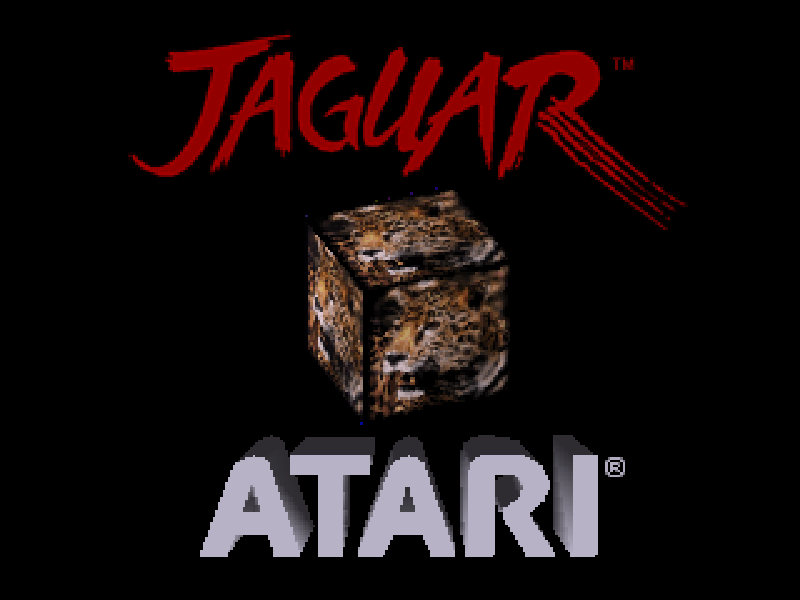
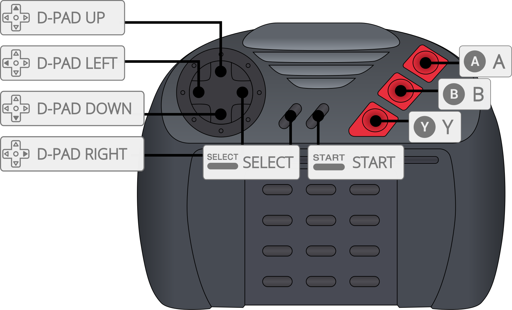

# Atari - Jaguar (Virtual Jaguar)

## Background

Virtual Jaguar is the actively maintained Atari Jaguar and Jaguar CD emulator for libretro, continuing the Virtual Jaguar project (originally by David Raingeard of Potato Emulation).

No BIOS files are required: the Jaguar boot ROM and CD BIOS images are embedded in the core. The core supports Jaguar CD (CUE/BIN, CDI) with Memory Track saves, JagLink/CatBox network play over TCP or RetroArch netplay, a high-level BIOS that lets most commercial titles boot without a real BIOS image, save states, SRAM, cheat codes and RetroAchievements. The accurate blitter is SIMD-accelerated (SSE2 on x86, NEON on ARM); the Blitter core option can be set to 'Fast' to trade some accuracy for additional speed on lower-end hardware.

### Author/License

The Virtual Jaguar core has been authored by

- Joseph Mattiello
- David Raingeard
- Shamus

The Virtual Jaguar core is licensed under

- [GPLv3](https://github.com/libretro/virtualjaguar-libretro/blob/master/docs/GPLv3)

A summary of the licenses behind RetroArch and its cores can be found [here](../development/licenses.md).

## Extensions

Content that can be loaded by the Virtual Jaguar core have the following file extensions:

- .j64
- .jag
- .rom
- .abs
- .cof
- .bin
- .prg
- .cue (Jaguar CD)
- .cdi (Jaguar CD)

!!! attention
	Bare `.iso` images are refused at load time. A 2048-byte-sector ISO cannot represent a Jaguar CD's multi-session layout (session 1 audio warning track, session 2 data recorded as byte-swapped 2352-byte audio-type sectors, track lead-in offsets), so no retail disc can boot from one. Use CUE/BIN or CDI instead.

## Databases

RetroArch database(s) that are associated with the Virtual Jaguar core:

- [Atari - Jaguar](https://github.com/libretro/libretro-database/blob/master/rdb/Atari%20-%20Jaguar.rdb)

## BIOS

**No BIOS files are required.** The Jaguar console boot ROM and both Jaguar CD BIOS images are compiled into the core.

The files below are **optional overrides** for the Jaguar CD real-BIOS boot path only. If present in the frontend's system directory they are preferred over the embedded copies, and the ['CD BIOS Type' core option](#cd-rom) picks which one wins when both are present.

|   Filename                                       |    Description                                |              md5sum              |
|:------------------------------------------------:|:---------------------------------------------:|:--------------------------------:|
| `[BIOS] Atari Jaguar CD (World).j64`              | Jaguar CD BIOS, retail - optional override    | 77cd95c7ad06a39f4c59995094aa10f9 |
| `[BIOS] Atari Jaguar Developer CD (World).j64`    | Jaguar CD BIOS, developer - optional override | 578de34498cb9a40c5368b6f5ca80484 |

The CD BIOS is also searched for under several other common filenames, and inside `Atari - Jaguar`, `Atari - Jaguar CD`, `jaguar` and `jaguarcd` sub-folders of the system directory.

!!! attention
	The Jaguar **console** boot ROM is never loaded from the system directory — the ['BIOS (Cartridges)' core option](#bios-boot) selects between the core's HLE BIOS and the embedded boot ROM. There is no cartridge BIOS file to supply.

## Features

Frontend-level settings or features that the Virtual Jaguar core respects.

| Feature           | Supported |
|-------------------|:---------:|
| Restart           | ✔         |
| Screenshots       | ✔         |
| Saves             | ✔         |
| States            | ✔         |
| Rewind            | ✔         |
| Netplay           | ✔         |
| Core Options      | ✔         |
| [Memory Monitoring (achievements)](../guides/memorymonitoring.md) | ✔         |
| RetroArch Cheats  | ✔         |
| Native Cheats     | ✔         |
| Controls          | ✔         |
| Remapping         | ✔         |
| Multi-Mouse       | ✕         |
| Rumble            | ✕         |
| Sensors           | ✕         |
| Camera            | ✕         |
| Location          | ✕         |
| Subsystem         | ✕         |
| [Softpatching](../guides/softpatching.md) | ✕         |
| Disk Control      | ✕         |
| Username          | ✕         |
| Language          | ✕         |
| Crop Overscan     | ✕         |
| LEDs              | ✕         |

!!! attention
	The core reports its save states with no serialization quirks, which is what enables rewind and netplay.

### Directories

The Virtual Jaguar core's internal core name is 'Virtual Jaguar'

The Virtual Jaguar core saves/loads to/from these directories.

**Frontend's Save directory**

| File  | Description                                                    |
|:-----:|:--------------------------------------------------------------:|
| *.srm | Cartridge EEPROM, CD EEPROM and Memory Track NVRAM save data    |

**Note:** All non-volatile save data goes into a single frontend-managed `.srm`. Cartridge content stores the cartridge and CD EEPROM banks (128 bytes each); CD content additionally stores the 128 KB Memory Track NVRAM after them.

**Frontend's System directory**

| File                  | Description                                |
|:---------------------:|:------------------------------------------:|
| Jaguar CD BIOS images | Optional - see [BIOS](#bios)               |
| vj_netlink.txt        | Optional - network link host address on the first line, used when the 'Network Link Host' core option is set to 'From file' |

### Geometry and timing

- The Virtual Jaguar core's core provided FPS is 50 for PAL games and 60 for NTSC games.
- The Virtual Jaguar core's core provided sample rate is 48000 Hz
- The Virtual Jaguar core's core provided aspect ratio is 4/3

## Core options

The Virtual Jaguar core has the following option(s) that can be tweaked from the core options menu. The default setting is bolded.

Settings with (Restart) means that core has to be closed for the new setting to be applied on next launch.

Options are grouped into categories, and options that do not apply to the loaded content type are hidden — the CD-ROM options do not appear when a cartridge is loaded, and vice versa.

### Video

- **Blitter** [virtualjaguar_usefastblitter] (**Accurate**|Fast)

	Choose which blitter implementation to use. 'Accurate' is SIMD-accelerated (SSE2 on x86, NEON on ARM) and is the most compatible. 'Fast' is the older blitter; it trades accuracy for extra speed on low-end hardware and breaks some games.

- **PAL (Restart)** [virtualjaguar_pal] (**disabled**|enabled)

	Emulate a PAL Jaguar instead of NTSC.

### BIOS & Boot

- **BIOS (Cartridges)** [virtualjaguar_bios] (**HLE**|Real)

	Which BIOS a CARTRIDGE boots with. 'HLE' has the core emulate the BIOS setup and services itself, which lets most commercial titles boot faster and skips the boot animation. 'Real' runs the actual Jaguar boot ROM, which some titles require. The boot ROM is built into the core, so neither setting needs a file — unlike the CD BIOS, the console boot ROM is never loaded from the system directory. Ignored for CD content: there, 'CD Boot Mode' decides and turns the boot ROM on or off to match.

??? note "*BIOS (Cartridges) - Real*"
    

### CD-ROM

These options only apply to Jaguar CD content.

- **CD Boot Mode (Restart)** [virtualjaguar_cd_boot_mode] (**HLE (Recommended)**|Auto (Real BIOS)|Real BIOS (Included, Experimental))

	How Jaguar CD discs boot. This OVERRIDES the 'BIOS (Cartridges)' setting for CD content. 'HLE' emulates the CD BIOS services directly and runs with the console boot ROM off — fastest and the most broadly compatible. 'Real BIOS' runs an actual CD BIOS and forces the boot ROM on: more faithful, still experimental. It prefers a CD BIOS ROM file from the system directory and otherwise uses the embedded image chosen by 'CD BIOS Type', so no files are required. 'Auto' is currently identical to 'Real BIOS'. If a real-BIOS mode is chosen but no CD BIOS can be staged at all, the core falls back to HLE rather than failing.

- **CD BIOS Type (Restart)** [virtualjaguar_cd_bios_type] (**Retail**|Developer)

	Which CD BIOS the real-BIOS boot path uses. 'Retail' is the standard consumer BIOS; 'Developer' is the dev-kit BIOS, which applies less strict disc checks and can boot images the retail BIOS refuses. Both are built into the core, so no files are required. CD BIOS ROM files in the system directory are preferred over the embedded images, and this selection picks which file wins when both types are present. Only has an effect when 'CD Boot Mode' is 'Real BIOS' or 'Auto' — the HLE boot path never runs a CD BIOS.

- **CD Read Speed (HLE Boot Mode Only)** [virtualjaguar_cd_read_speed] (1x (150 KB/s)|**2x (Accurate)**|4x|8x|Instant)

	Data-transfer rate for Jaguar CD reads in HLE boot mode. '2x' matches the real drive (300 KB/s) and is hardware-accurate. Higher speeds shorten load times but may break timing-sensitive titles (some games rely on the drive rate for code overlays, music cues, and load handshakes); 'Instant' completes each read in one tick and is the most likely to cause hangs. BIOS boot mode always uses the accurate rate. Applied per-read: a transfer already in flight keeps the speed it started with.

- **Memory Track (Restart)** [virtualjaguar_memory_track] (**enabled**|disabled)

	Emulate the Memory Track save cartridge alongside the CD unit, as on real hardware. CD games detect it and save settings, progress and high scores to its 128 KB NVRAM (stored in the save file). Disable to emulate a console without the cartridge — games will warn that game information cannot be saved.

### Network Link

- **Network Link (JagLink / CatBox)** [virtualjaguar_netlink] (**disabled**|Loopback (echo to self)|TCP Host (listen)|TCP Client (connect))

	Emulates JERRY's serial link port used by networked games (BattleSphere, AirCars, Doom deathmatch). 'Loopback' echoes transmitted bytes back to this console, for testing link-detect menus without a partner. TCP Host listens for a second emulator instance; TCP Client connects to the address in 'Network Link Host'. Localhost/LAN latency recommended.

	The core also implements the libretro netpacket interface, so RetroArch's own netplay carries the link with this option left disabled — which needs no address configuration at all.

- **Network Link Host (TCP Client)** [virtualjaguar_netlink_host] (**127.0.0.1 (localhost)**|jaghub.local (host machine named 'jaghub' on the LAN)|From file (vj_netlink.txt in system dir))

	Address the TCP client connects to — an IP, a DNS name, or a Bonjour/mDNS name. Easiest LAN setup with no typing at all: name the host machine 'jaghub' (its local hostname), then pick the 'jaghub.local' preset here on each client. Frontends with free-text option entry accept any address directly; in stock RetroArch the alternative is 'From file' with the address on the first line of vj_netlink.txt in the system directory. The VJ_NETLINK_HOST environment variable overrides this option.

- **Network Link Port** [virtualjaguar_netlink_port] (**42171**|42172|42173|42174)

	TCP port for the network link (both sides must match). Overridable with the VJ_NETLINK_PORT environment variable.

- **Network Link Latency Hiding** [virtualjaguar_netlink_wait] (**enabled**|disabled)

	Briefly holds each frame until the link partner's reply arrives, so network latency doesn't round every link exchange up to whole video frames. The wait adapts automatically to the measured connection (a few ms on localhost, more on Wi-Fi) and is capped so audio/video pacing survives. Disable only for troubleshooting or benchmarking.

### Input

- **Enable Core Options Remapping** [virtualjaguar_alt_inputs] (**disabled**|enabled)

	Enabling this option will let you rebind controllers from the core options, removing the 'Controls' menu limitation that makes Numpad 7, 8, 9, * and # impossible to remap.
	NOTE: the 'Controls' menu can still conflict with the core options remapping, if you're using a remap file it is recommended to delete/reset it.

### Input Port 1

- **Port 1 > Numpad Buttons to Keyboard Keys** [virtualjaguar_p1_numpad_to_kb] (**disabled**|Number Row Keys|Keypad Keys)

	Map Jaguar numpad 0-9, \* and # to keyboard keys. 'Number Row Keys' will use 1234567890-= keys, 'Keypad Keys' will use 0123456789/\* keypad keys.

- **Port 1 > RetroPad (button)** [`virtualjaguar_p1_retropad_*`]

	One option per RetroPad input (Up, Down, Left, Right, A, B, X, Y, Select, Start, L1, R1, L2, R2, L3, R3, and the eight analog stick directions) — for example `virtualjaguar_p1_retropad_a` and `virtualjaguar_p1_retropad_l1`. Each can be assigned to any Jaguar control: Up, Down, Left, Right, A, B, C, Pause, Option, Numpad 0-9, Numpad *, Numpad #, or `---` (unbound). Requires 'Enable Core Options Remapping' to take effect. Defaults match the [controller table below](#joypad).

### Input Port 2

- **Port 2 > Numpad Buttons to Keyboard Keys** [virtualjaguar_p2_numpad_to_kb] (**disabled**|Number Row Keys|Keypad Keys)

	As Port 1, for the second controller.

- **Port 2 > RetroPad (button)** [`virtualjaguar_p2_retropad_*`]

	As Port 1, for the second controller — for example `virtualjaguar_p2_retropad_a`.

### Diagnostics

- **Crash Detect** [virtualjaguar_crash_detect] (**Enabled**|Disabled|Enabled (verbose / heartbeat))

	Lightweight runtime watchdog that logs GPU/DSP PC escape, GPU/DSP wedge, and video stall events to the RetroArch log. Helpful when filing bug reports about games that hang or go to a black screen mid-play. Verbose mode also dumps a state heartbeat every 10 seconds.

- **CD Trace (Diagnostic)** [virtualjaguar_cd_trace] (**disabled**|enabled)

	Records DSA command/response traffic and seek/FIFO transitions to a bounded ring buffer, dumped to the RetroArch log when the cd_seek_wedge watchdog fires. Diagnostic only — intended for troubleshooting Jaguar CD boot/data-transfer bugs, not for normal play.

### Timing

- **DRAM Timing (Experimental)** [virtualjaguar_dram_timing] (**disabled**|enabled)

	Charge the GPU and 68000 realistic DRAM access time for memory accesses that leave their local buses, pacing games that rely on hardware timing (Doom-class) closer to real hardware. Symmetric: each processor pays only its own access costs, so relative CPU/GPU timing is preserved. Experimental: the cost model is still being calibrated; leave disabled unless a game visibly runs too fast.

## Controllers

The Virtual Jaguar core supports the following device type(s) in the controls menu, bolded device types are the default for the specified user(s):

### User 1 - 2 device types

- None - Doesn't disable input. There's no reason to switch to this.
- **RetroPad** - Joypad - Stay on this.
- RetroPad w/Analog - Joypad - Same as RetroPad. There's no reason to switch to this.

### Controller tables

#### Joypad

| User 1 - 2 Remap descriptors | RetroPad Inputs                             |
|------------------------------|---------------------------------------------|
| B                            |           |
| C                            |           |
| Pause                        |      |
| Option                       |       |
| D-Pad Up                     |     |
| D-Pad Down                   |   |
| D-Pad Left                   |   |
| D-Pad Right                  |  |
| A                            |           |
| Numpad 0                     |           |
| Numpad 1                     |          |
| Numpad 2                     |          |
| Numpad 3                     |          |
| Numpad 4                     |          |
| Numpad 5                     |          |
| Numpad 6                     |          |

**Note:** Numpad 7, 8, 9, * and # cannot be reached from the 'Controls' menu. Enable the 'Enable Core Options Remapping' core option to bind them.

#### Keyboard
| User 1 Joypad Descriptors    | Keyboard Inputs                             |
|------------------------------|---------------------------------------------|
| Numpad 0                     | 0
| Numpad 1                     | 1
| Numpad 2                     | 2
| Numpad 3                     | 3
| Numpad 4                     | 4
| Numpad 5                     | 5
| Numpad 6                     | 6
| Numpad 7                     | 7
| Numpad 8                     | 8
| Numpad 9                     | 9
| Numpad *                     | -
| Numpad #                     | =

## Compatibility

The full commercial cartridge library and every Jaguar CD title boot and run. Per-game issues are tracked on the core's [issue tracker](https://github.com/libretro/virtualjaguar-libretro/issues) rather than duplicated here, so that a single list stays current — please file a report there if a game misbehaves.

Jaguar CD discs boot in both HLE and real-BIOS mode; the per-title boot matrix lives in the core repository as [`docs/cd-boot-matrix.md`](https://github.com/libretro/virtualjaguar-libretro/blob/master/docs/cd-boot-matrix.md).

## External Links

- [Libretro Virtual Jaguar Github Repository](https://github.com/libretro/virtualjaguar-libretro)
- [Report Libretro Virtual Jaguar Core Issues Here](https://github.com/libretro/virtualjaguar-libretro/issues)
- [Libretro Virtual Jaguar Core info file](https://github.com/libretro/libretro-super/blob/master/dist/info/virtualjaguar_libretro.info)
- [Original Virtual Jaguar Website](https://icculus.org/virtualjaguar/)
- [Original Virtual Jaguar Git Repository](http://shamusworld.gotdns.org/git/virtualjaguar)
