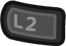

# Sega Saturn (Yabause)

## Background

Yabause is an active Sega Saturn emulator that is both open-source and written with portability in mind. The libretro port only supports the software renderer at the moment, which is more accurate but also slower than the GL renderer.

Author(s): Guillaume Duhammel|Theo Berkau|Anders Montonen

## Contribute to this documentation

In order to propose improvements to this document, [visit it's corresponding source page on github](https://github.com/libretro/docs/tree/master/docs/library/Yabause.md). Changes are proposed using "Pull Requests."

## License

GPLv2

## Extensions

bin|cue|iso

!!! note
    Yabause does not support cue files that point to multiple bin files. Convert multi-bin tracks to single-bin tracks for proper operation.

## BIOS

|   Filename      |    Description     |              md5sum             |
|:---------------:|:------------------:|:--------------------------------:|
| saturn_bios.bin |  Sega Saturn BIOS  | af5828fdff51384f99b3c4926be27762 |

## Features

| Feature           | Supported |
|-------------------|:---------:|
| Saves             | ✔         |
| States            | ✕         |
| Rewind            | ✕         |
| Netplay           | ✕         |
| RetroAchievements | ✕         |
| RetroArch Cheats  | ✔         |
| Native Cheats     | ✕         |
| Controllers       | ✔         |
| Rumble            | ✕         |
| Sensors           | ✕         |
| Camera            | ✕         |
| Location          | ✕         |
| Subsystem         | ✕         |

## Options

The Yabause core has the following options that can be tweaked from the core options menu. The default setting is bolded. 

- **Frameskip** (**Off**/On): Frames are skipped when the CPU is unable to keep up a stable rate. 
- **Force HLE BIOS (Restart)** (Off/**On**): HLE BIOS will be used even when a real BIOS file is present.
- **Addon Cartridge (Restart)** (**none**/1M_ram/4M_ram): Allows switching between the various RAM cartridges released for the system.

## Controllers

The Yabause core supports four controller setting(s):

* Saturn Pad

* Saturn 3D Pad

* Multitap + Pad

* Multitap + 3D Pad

| Yabause     | Saturn Pad                                                     | Saturn 3D Pad |
|-------------|----------------------------------------------------------------|---------------|
| A           |                | -             |
| X           |                | -             |
|             |            | -             |
| Start       |              | -             |
| D-pad       |                | -             |
| B           |                | -             |
| Y           |                | -             |
| C           |                    | -             |
| Z           |                    | -             |
| L           |               | -             |
| R           |                    | -             |
|             |                    | -             |
|             |                    | -             |
| Left Analog |    | -             |
|             |  | -             |

## Compatibility

[Yabause Core Compatibility List](https://wiki.yabause.org/index.php5?title=Compatibility_list)

## External Links

* [Libretro Repository](https://github.com/libretro/yabause)
* [Report Core Issues Here](https://github.com/libretro/libretro-meta/issues)
* [Official Website](https://yabause.org/)
* [Official GitHub Repository](https://github.com/Guillaumito/yabause)
