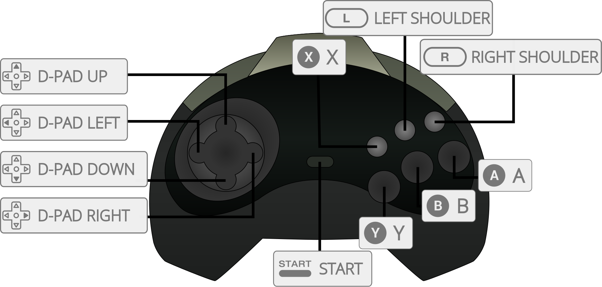

# Sega - Saturn (Yabause)

## Background

Yabause is an active Sega Saturn emulator that is both open-source and written with portability in mind. The libretro port only supports the software renderer at the moment, which is more accurate but also slower than the GL renderer.

### Author/License

The Yabause core has been authored by

- Guillaume Duhammel
- Theo Berkau
- Anders Montonen

The Yabause core is licensed under

- [GPLv2](https://github.com/libretro/yabause/blob/master/yabause/COPYING)

A summary of the licenses behind RetroArch and its cores have found [here](https://docs.libretro.com/tech/licenses/).

## Extensions

Content that can be loaded by the Yabause core have the following file extensions:

- .bin
- .cue
- .iso

## Databases

RetroArch database(s) that are associated with the Yabause core:

- [Sega - Saturn](https://github.com/libretro/libretro-database/blob/master/rdb/Sega%20-%20Saturn.rdb)

## BIOS

Required or optional firmware files go in the frontend's system directory.

| Filename          | Description                     | md5sum                           |
|:-----------------:|:-------------------------------:|:--------------------------------:|
| saturn_bios.bin   | Saturn BIOS - Optional          | af5828fdff51384f99b3c4926be27762 |

## Features

Frontend-level settings or features that the Yabause core respects.

| Feature           | Supported |
|-------------------|:---------:|
| Restart           | ✔         |
| Screenshots       | ✔         |
| Saves             | ✔         |
| States            | ✕         |
| Rewind            | ✕         |
| Netplay           | ✕         |
| Core Options      | ✔         |
| RetroAchievements | ✕         |
| RetroArch Cheats  | ✔         |
| Native Cheats     | ✕         |
| Controls          | ✔         |
| Remapping         | ✔         |
| Multi-Mouse       | ✕         |
| Rumble            | ✕         |
| Sensors           | ✕         |
| Camera            | ✕         |
| Location          | ✕         |
| Subsystem         | ✕         |
| [Softpatching](https://docs.libretro.com/guides/softpatching/) | ✕         |
| Disk Control      | ✕         |
| Username          | ✕         |
| Language          | ✕         |
| Crop Overscan     | ✕         |
| LEDs              | ✕         |

### Directories

The Yabause core's library name is 'Yabause'

The Yabause core saves/loads to/from these directories.

**Frontend's Save directory**

- 'content-name'.srm (Save)

**Frontend's State directory**

- 'content-name'.state# (State)

### Geometry and timing

- The Yabause core's core provided FPS is 60 for NTSC games and 50 for PAL games
- The Yabause core's core provided sample rate is 44100 Hz
- The Yabause core's core provided aspect ratio is 4/3

## Loading Sega Saturn content

!!! warning
    Yabause does not support cue files that point to multiple bin files. Convert multi-bin tracks to single-bin tracks for proper operation.

Yabause needs a cue-sheet that points to an image file. A cue sheet, or cue file, is a metadata file which describes how the tracks of a CD or DVD are laid out.

If you have e.g. `foo.bin`, you should create a text file and save it as `foo.cue`. If you're playing a single-track Saturn game, then the cue file contents should look like this:

`foobin.cue`
```
 FILE "foo.bin" BINARY
  TRACK 01 MODE1/2352
   INDEX 01 00:00:00
```

After that, you can load the `foo.cue` file in RetroArch with the Yabause core.

## Core options

The Yabause core has the following option(s) that can be tweaked from the core options menu. The default setting is bolded. 

Settings with (Restart) means that core has to be closed for the new setting to be applied on next launch.

- **Frameskip** [yabause_frameskip] (**disabled**|enabled)

	Frames are skipped when the CPU is unable to keep up a stable rate.
	
- **Force HLE BIOS (restart)** [yabause_force_hle_bios] (**disabled**|enabled)

	HLE BIOS will be used even when a real BIOS file is present.
	
- **Addon Cartridge (restart)** [yabause_addon_cart] (**none**|1M_ram|4M_ram)

	Allows switching between the various RAM cartridges released for the system.
	
	A list of games that require a cartridge can be found [here](https://www.satakore.com/cartridge.php).
	
- **Number of Threads (restart)** [yabause_numthreads] (**1**|2|4|8|16|32)

	Adjust the number of threads to an appropriate level for your CPU.
	
## Controllers

The Yabause core supports the following device type(s) in the controls menu, bolded device types are the default for the specified user(s):

### User 1 - 2 device types

- None - Doesn't disable input. There's no reason to switch to this.
- **Saturn Pad** - Joypad
- Saturn 3D Pad - Analog
- Multitap + Pad - Joypad - Allows for up to twelve players to play together in multitap games.
- Multitap + 3D Pad - Analog - Allows for up to twelve players to play together in multitap games.

### User 3 - 12 device types

- None - Doesn't disable input. There's no reason to switch to this.
- Saturn Pad - Joypad
- Saturn 3D Pad - Analog

### Multitap support

Activating multitap support in compatible games can be configured by switching to the 'Mulitap + Pad' or 'Multitap + 3D Pad' device types for Users 1 and 2.

### Controller tables

#### Joypad



| User 1 - 12 Remap descriptors | RetroPad Inputs                              |
|-------------------------------|----------------------------------------------|
| A                             |        |
| X                             |        |
| Start                         |          |
| D-Pad Up                      |        |
| D-Pad Down                    |      |
| D-Pad Left                    |      |
| D-Pad Right                   |     |
| B                             |        |
| Y                             |        |
| C                             |             |
| Z                             |             |
| L                             |             |
| R                             |             |
| Analog X                      |  X  |
| Analog Y                      |  Y  |

## Compatibility

- [Official Yabause Compatibility List](https://wiki.yabause.org/index.php5?title=Compatibility_list)

## External Links

- [Official Yabause Website](https://yabause.org/)
- [Official Yabause Documentation](https://wiki.yabause.org/index.php5?title=Documentations)
- [Official Yabause Repository](https://github.com/Yabause/yabause)
- [Libretro Yabause Core info file](https://github.com/libretro/libretro-super/blob/master/dist/info/yabause_libretro.info)
- [Libretro Yabause Github Repository](https://github.com/libretro/yabause)
- [Report Libretro Yabause Core Issues Here](https://github.com/libretro/yabause/issues)

### See also

#### Sega - Saturn

- [Sega - Saturn (Beetle Saturn)](https://docs.libretro.com/library/beetle_saturn/)