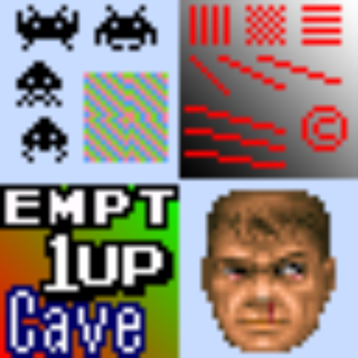

# antialiasing

## Background

## Preview Image
* aa-shader-4.0

* advanced-aa

* fxaa

* smaa

## Comments

## External Links

* [Slang Shaders](https://github.com/libretro/slang-shaders)
* [GLSL Shaders](https://github.com/libretro/glsl-shaders)
* [CG Shaders](https://github.com/libretro/common-shaders)
