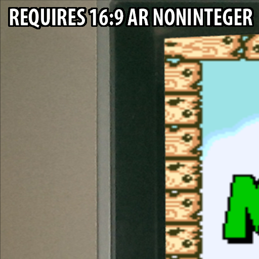

# border

## Description
Shaders that include a border to fill the empty space left when rendering a non widescreen viewport on a widescreen display.

## Preview Image
* bigblur-crt

* bigblur

* hexagons

* imgborder

## Comments

## External Links

* [Slang Shaders](https://github.com/libretro/slang-shaders)
* [GLSL Shaders](https://github.com/libretro/glsl-shaders)  
* [CG Shaders](https://github.com/libretro/common-shaders)
