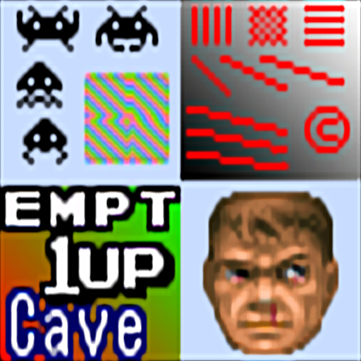
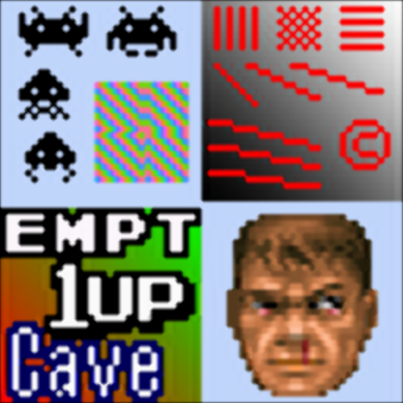

# cgp

## Background

## Preview Image
* 2x2xscalehq

* 2xbr-crt-hyllian

* 2xbr-hybrid-crt-hyllian

* 2xbr-jinc2-sharper-hybrid

* 2xbr-reverse-aa

* crt-reverse-aa-ddt

* crt-royale-kurozumi

* gameboy-colors

* gameboy-scree-n-grid

* gameboy-screen-grid+motionblur

* lowquality-lcd

* lowquality-lcd+motionblur

* xbr-dilation-smart-blur-4xsoft

* xbr-dtt-dilation-soft2-aa-gamma

* xbr-hybrid-bicubic

* xbr-hybrid-ddt

* xbr-hybrid-lanczos

* xbr-hybrid-sharp-lanczos

* xbr-smart-blur

## Comments

## External Links

* [Slang Shaders](https://github.com/libretro/slang-shaders)
* [GLSL Shaders](https://github.com/libretro/glsl-shaders)  
* [CG Shaders](https://github.com/libretro/common-shaders)

 
