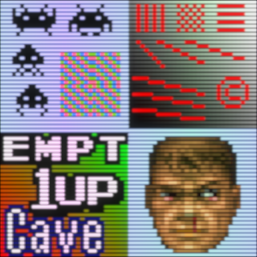
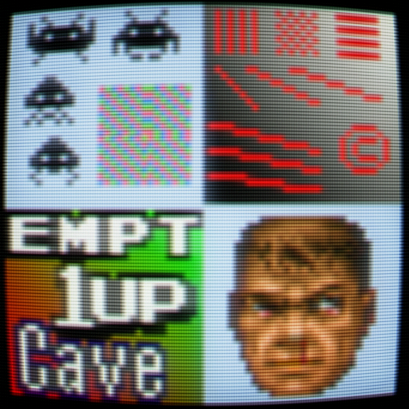
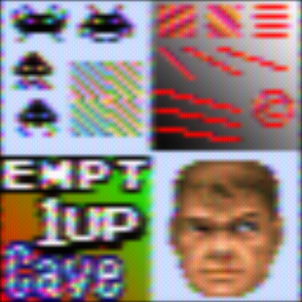
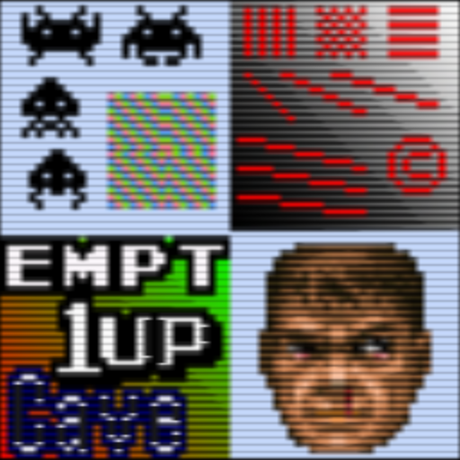
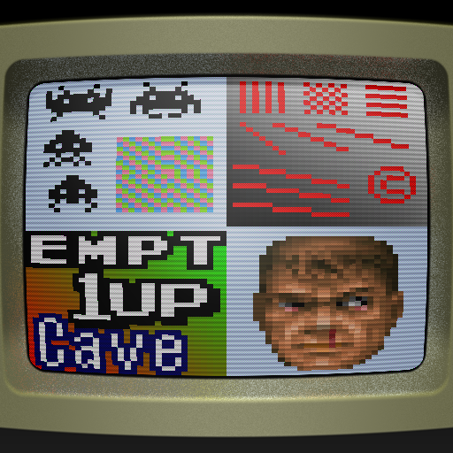

# CRT Shaders
These shaders attempt to reproduce aspects and characteristics of cathode ray tube (CRT) displays with modern hardware. Most include some sort of scanline effect and often a phosphor mask effect, and they typically do some amount of blurring/blending. Some also include interlacing effects and/or faux barrel distortion (a.k.a., "curvature"). Variations with "glow" or "halation" include a bloom effect that mimics the glow and/or internal reflections of a CRT. As is the case with any repeating, scanline-type effects, these shaders will all look better with integer scaling, but some can handle non-integer scales better than others.

## crt-aperture
  * A shader designed to reproduce the look of a high-quality aperture grille CRT TV, such as a Sony PVM or Wega TV. It still looks fairly good at non-integer scales.
    + 

## crt-blurpi
  * A lightweight shader designed to run full speed on Raspberry Pi hardware (hence, the name) and on low-res screens (640x480 or less). Comes in **sharp** and **soft** flavors.

## crt-caligari
  * A shader that produces a scanline/mask effect by controlling the height and width of each simulated pixel "spot".
    + 

## crt-easymode
  * A popular shader with good performance, many features (including curvature and masks) and looks quite nice even at non-integer scales. Also comes in a **-Halation** variant.
    + 

## crt-frutbunn
  * A port of the ["Another CRT Shader" shadertoy](https://www.shadertoy.com/view/XdyGzR) to RetroArch's shader format. It includes scanlines, curvature and vignetting in a nice, simple package.
    + 

## crt-geom
  * The original CRT shader, which still looks great (even at non-integer scales) and includes [many options for customization](http://filthypants.blogspot.com/2012/07/customizing-cgwgs-crt-pixel-shader.html). Thanks to improvements in GPUs since its release, it now runs well even on very modest hardware. The **CRT-cgwg-Fast** variety runs even faster, while the **CRT-Geom-Deluxe** version is slower but includes many, many more options. The **CRT-Interlaced-Halation** shader is another variant.
    + 

## crtglow
  * A bold CRT effect that accentuates the rounded edges of scanlines. Comes in **CRTGlow_Gauss** and **CRTGlow_Lanczos** flavors, named for the scaling algorithm used, and another **CRTGlow_Gauss_NTSC** variant that includes NTSC composite signal/connection simulation.
    + 

## crt-guest
  * A family of very attractive shaders with tons of features and options to play with, these shaders are an excellent option for users with powerful GPUs who like to tweak options. The **CRT-Guest-Dr-Venom** and **-2** versions are similar but have slightly different settings available, while the **-Fast** version lowers the requirements quite a bit. The **-SM** variant uses a different method of generating scanlines.
    + 

## crt-hyllian
  * A family of attractive and advanced CRT shaders which have relatively few options, making it a good fit for users who don't want to spend a lot of time twiddling settings. The **-3D** variant includes a downsampling option that works with high-res content (such as cores with increased internal resolution), the **-Sinc** version uses a different scaling algorithm that looks a bit different. The **-Multipass** version runs well on even very modest GPUs, while the **-Glow** and **-Curvature** variants add those effects on top.
    + 

## crt-lottes
  * Ported from Timothy Lottes' ["FixingPixelArt" shadertoy](https://www.shadertoy.com/view/XsjSzR), this shader is intended to look like "a really good CGA arcade monitor with RGB inputs instead of NTSC." It doesn't have many options and looks good at default settings, making it a good general-purpose choice. The **-Fast** version is actually an updated version ported from [a separate shadertoy](https://www.shadertoy.com/view/MtSfRK), while the **-Multipass** versions are faster versions of the base Lottes effect. The **Fakelottes** shader pairs the excellent mask simulation code from **CRT-Lottes** with basic fast scanlines for use with even weaker devices.
    + 

## crt-mattias
  * A port of [Mattias' CRT Emulation shadertoy](https://www.shadertoy.com/view/lsB3DV), which is characterized by "crawling" (i.e., scrolling) scanlines. **NewPixie-CRT** is an updated and extended shader from the same author that expands on many of the same ideas used in the original shadertoy.
    + 

## crt-nes-mini
  * A clone of the NES Mini's TV-style shader, which is really just some light scanlines.
    + 

## crt-pi
  * A nice-looking shader designed to run full speed on all Raspberry Pi models at 4:3 aspect and 1080p, though RPi1 and Zero models may need overclocking to achieve this, and some settings may be too demanding on some models. Aside from RPi hardware, this is just an all-around good shader for weak/mobile GPUs.
    + 

## crt-potato
  * An attempt to reproduce the very demanding effects of the popular Kurozumi variation of CRT-Royale through a simple lookup texture. It does not capture much of the nuances of the demanding shader it tries to copy, but it runs very fast and comes with **-Warm** and **-Cool** flavors, which describe their warmer and cooler white points, respectively.
    + 

## crt-royale
  * The first of the modern mega-shaders with dozens of options to tweak, this shader looks good at 1080p but doesn't really shine until at least 1440p and looks better the more pixels you can throw at it. However, it's also quite demanding, and this increases with higher resolution, as well. The **-Intel** and **-Fake-Bloom** varieties sacrifice some fidelity to lower the requirements, while the **-NTSC** and **-PAL** varieties add the characteristics of those broadcast signal standards to the image. The popular Kurozumi preset among others are located in the "Presets" shader directory.
    + 

## crtsim
  * An interesting shader that doesn't try to be realistic but rather just tries to look nostalgic. This shader is most notable for its fast faux-NTSC effect.
    + 

## crt-slangtest
  * A distant cousin to the CRTGlow shaders (though with a more subtle effect), it comes in **-Cubic** and **-Lanczos** flavors, named for the scaling algorithm used.
    + 

## crt-torridgristle
  * A very fast, high-contrast CRT effect with a prominent phosphor mask.
    + 

## crt-yo6-kv-m14208b
  * One of the few shaders based directly on a specific model (and size) of CRT display, this shader was created using [a unique, data-driven methodology](https://forums.libretro.com/t/sony-tv-trinitron-kv-m1420b/22901/14) resulting in a very realistic image. It also comes in a **-Sharp** variant.
    + 

## dotmask
  * A basic shader that collects just the isolated dotmask code from several different shaders.
    + 

## GritsScanlines
  * Another fast, LUT-based CRT shader that tries to mimic the dynamic beam width of more demanding CRT shaders.
    + 

## gtu
  * A useful and versatile scaling shader, GTU stands for **Gaussian-kernel TV Upscaler**. This shader eschews the normal scanline-heavy, mask-prominent CRT characteristics and instead focuses on getting the blurring/smoothing effects down convincingly. With parameters to simulate different vertical (TVL) and horizontal resolutions, GTU can go from sharp, anti-aliased pixels (like a CRT monitor) all the way down to blurry enough to smear Genesis/Mega Drive jailbar dithering. It does include a basic, subtle scanline effect, as well as the ability to simulate composite color-shifting and chroma smearing. Its cousin, **TVOut-Tweaks**, isolates just the resolution/scaling functionality to simulate low-res displays on higher-res ones, such as simulating a consumer TV on a high-res PC CRT monitor.
    + 

## mame-hlsl
  * A port of MAME's built-in HLSL shader, which exposes a variety of nice options.
    + 

## meta-crt
  * A port of [P_Malin's Meta Meta CRT shadertoy](https://www.shadertoy.com/view/4dlyWX#), this shader models a 3D environment with a little CRT monitor sitting on a table via a raytracing-like technique called "raymarching". It includes a parameter to change the camera location to a number of different pre-set locations, including some that are not really practical for playing games but zoom in to show the meta-CRT's phosphor mask and other details. This shader is a really cool technical feat that's fun to explore. WARNING: this shader is very, very demanding and can make weak hardware move so slowly that it's difficult to navigate the menus to turn it off.
    + 

## vector-glow
  * A shader designed to mimic the glow and phosphor trails of a CRT vector display (like those used in the Vectrex console and a number of arcade cabinets, most famously Asteroids and Star Wars), which lacks many of the characteristics of a typical CRT (e.g., no scanlines). The **-Alt-Render** variant works better with the high-res "alternate render" option found in some of the MAME cores or other high-res vector emulation.

## vt220
  * Another shadertoy port, this time for [sprash3's vt220 shadertoy](https://www.shadertoy.com/view/XdtfzX), which generates a CRT monitor bezel and then casts dynamic reflections onto it based on the content that's being displayed. This shader works very nicely with classic computer and DOS emulation.
    + 

## yeetron
  * Along with its close relative, **Yee64**, this shader is a clone of the CRT effects found in the Sonic Mania PC game. They both run quite fast and are compatible with relatively weak hardware, while also looking pretty good.
    + 

## zfast-crt
  * An excellent lightweight CRT shader that looks far better than it has any right to, considering how fast it is! This shader should be the first stop for weak/mobile devices that cannot handle even moderately demanding shaders, like CRT-Geom.
    + 

## Comments

## External Links

* [Slang Shaders](https://github.com/libretro/slang-shaders)
* [GLSL Shaders](https://github.com/libretro/glsl-shaders)
* [CG Shaders](https://github.com/libretro/common-shaders)
