# crt

## Background

## Preview Image

* crt-aperture

* crt-caligari

* crt-cgwg-fast

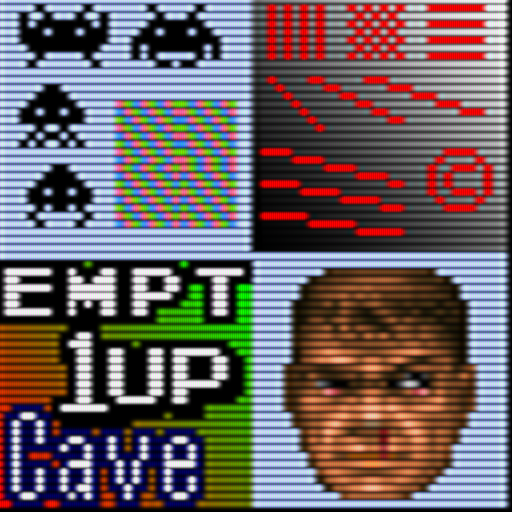

* crt-easymode-halation

* crt-easymode

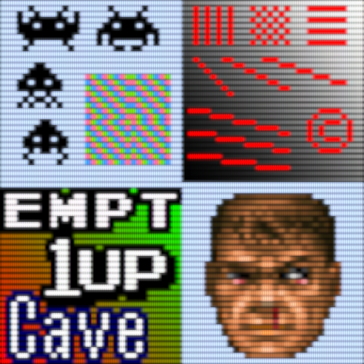

* crt-geom

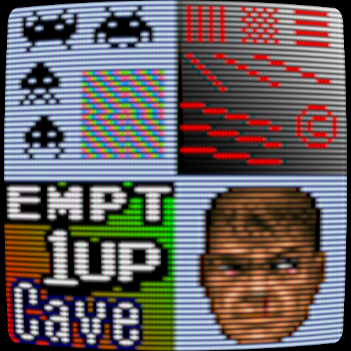

* crt-hyllian-multipass

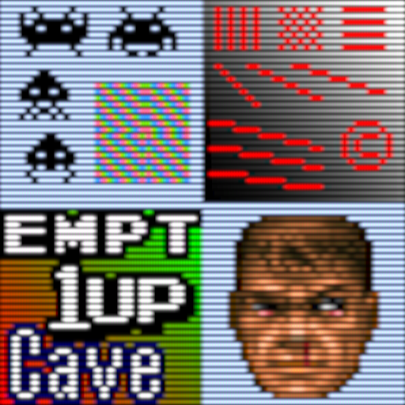

* crt-hyllian

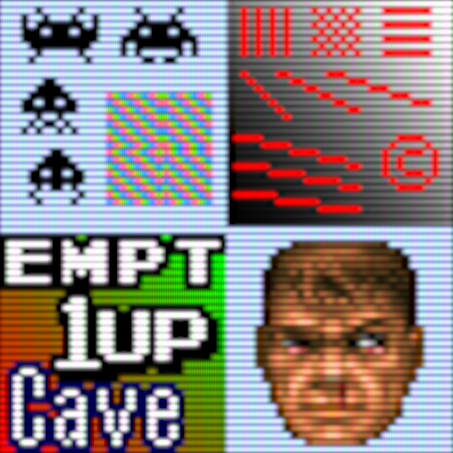

* crt-interlaced-halation

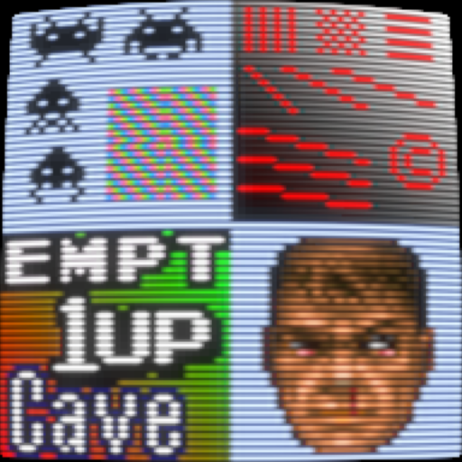

* crt-lottes-fast

* crt-lottes-multipass-interlace-glow

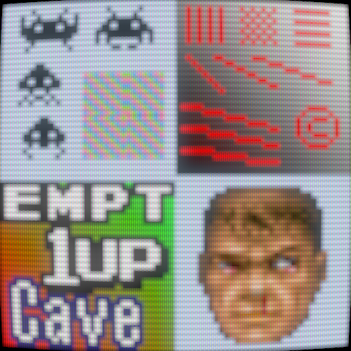

* crt-lottes-multipass

* crt-lottes

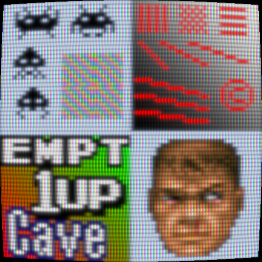

* crt-nes-mini

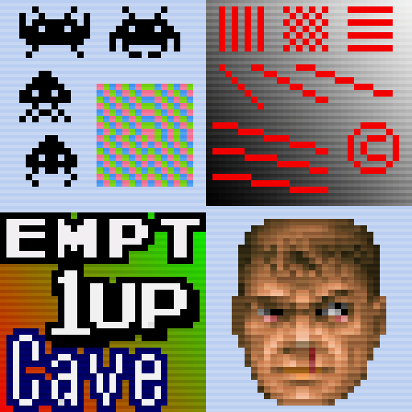

* crt-potato-cool

* crt-potato-warm

* crt-royale

* crt-slangtest-cubic

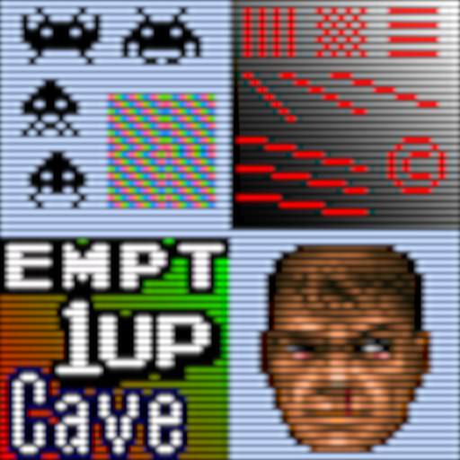

* crt-slangtest-lanczos

* crtglow_gauss_ntsc_3phase

* crtglow_gauss

* crtglow_lanczos

* dotmask

* gtu-famicom

* gtu-v050

* gtuv50-radeon

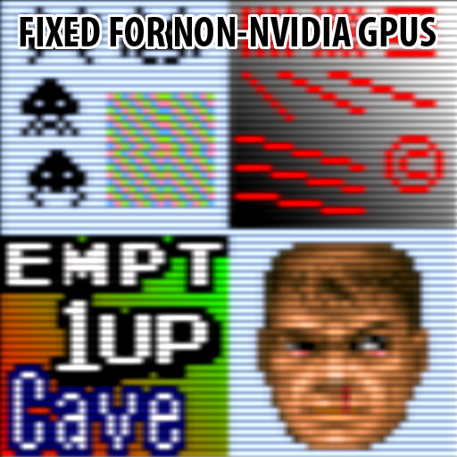

* gtuv50

* meta-crt

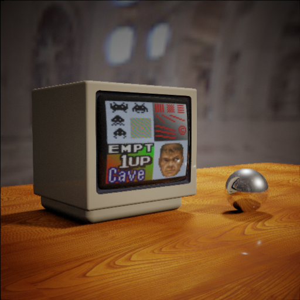

* ntsc-shadowmask-interlacing

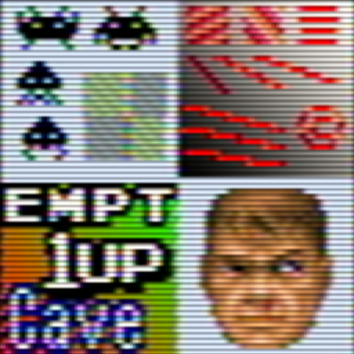

* ntsc-shadowmask-noblend

* ntsc-shadowmask

* phosphorlut-4k

* phosphorlut-shadowmask

* phosphorlut

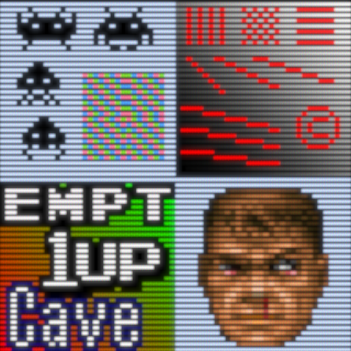

* zfast-crt

## Comments

## External Links

* [Slang Shaders](https://github.com/libretro/slang-shaders)
* [GLSL Shaders](https://github.com/libretro/glsl-shaders)  
* [CG Shaders](https://github.com/libretro/common-shaders)
