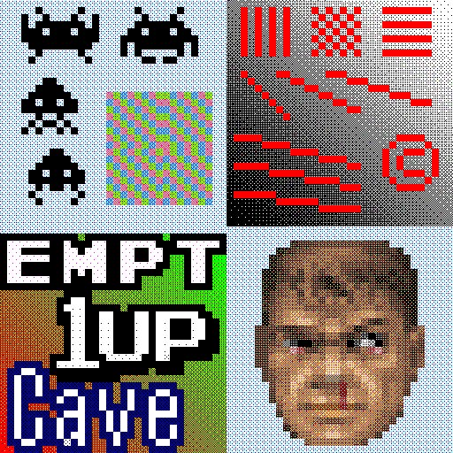
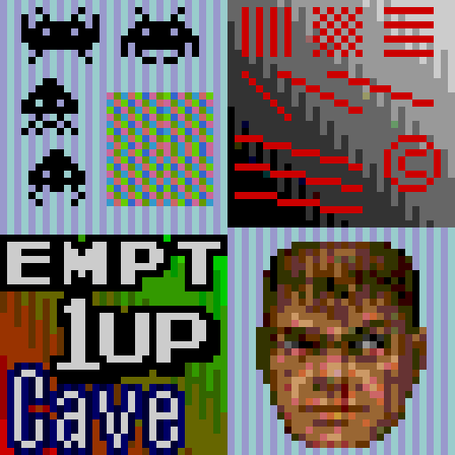

# dithering

## Background

## Preview Image

* bayer-matrix-dithering

* cbod-v1

* gdapt

* gdapt+xbr-hybrid+aa

* gdapt+xbr-hybrid+ddt

* gendither

* mdapt

* mdapt+xbr-hybrid+aa

* mdapt+xbr-hybrid+ddt

## Comments

## External Links

* [Slang Shaders](https://github.com/libretro/slang-shaders)
* [GLSL Shaders](https://github.com/libretro/glsl-shaders)
* [CG Shaders](https://github.com/libretro/common-shaders)
