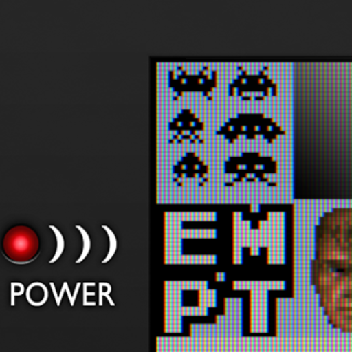
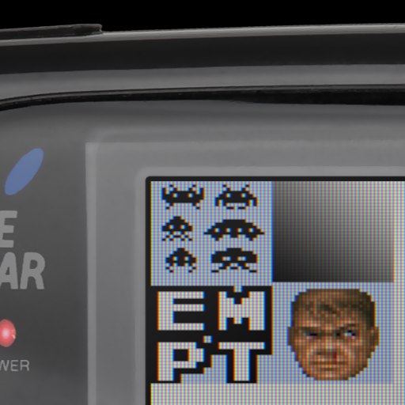

# handheld console borders

## Description
Shaders that apply a handheld console border image, at different scale factors,
for various handheld consoles.

## Preview Image
* dmg-2x

* dmg-3x

* dmg-4x

* dmg-5x

* dmg-5x

* gb-pocket-2x

* gb-pocket-3x

* gb-pocket-4x

* gb-pocket-5x

* gb-pocket-6x

* gb-pocket-6x

* gba-3x

* gba-4x

* gba-5x

* gba-6x

* gbc-2x

* gbc-3x

* gbc-4x

* gb-pocket-5x

* gb-pocket-6x

* gba-2x

* gba-3x

* gba-4x

* gba-5x

* gba-6x

* gbc-2x

* gbc-3x

* gbc-4x

* gbc-5x

* gbc-6x

* gg-2x

* gg-3x

* gg-4x

* gg-5x

* gg-6x

* ngp-2x

* ngp-3x

* ngp-4x

* ngp-5x

* ngp-6x

## Comments

## External Links

* [Slang Shaders](https://github.com/libretro/slang-shaders)
* [GLSL Shaders](https://github.com/libretro/glsl-shaders)  
* [CG Shaders](https://github.com/libretro/common-shaders)
