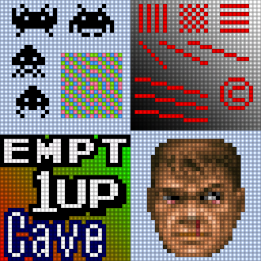
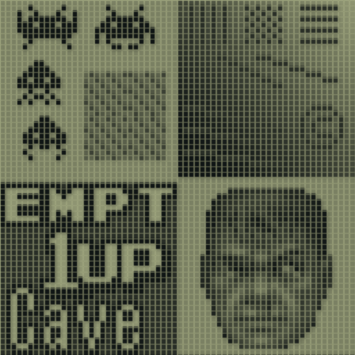
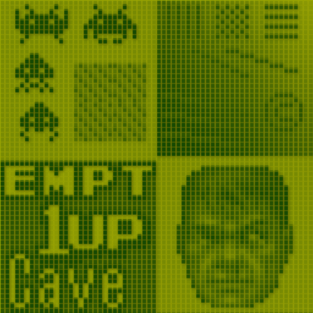
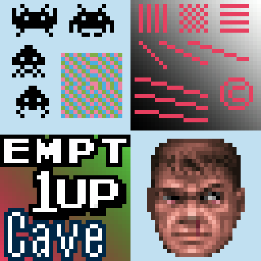
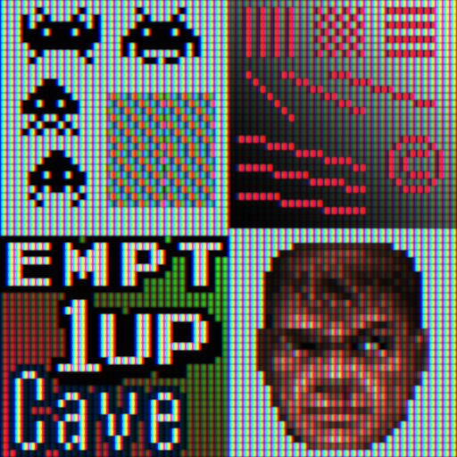
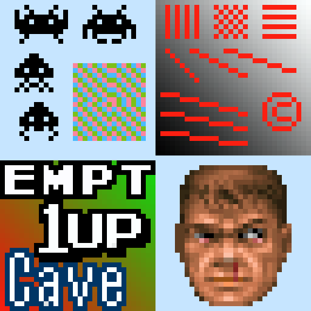

# handheld

## Description
Collection of handheld specific shaders.

## Preview Image
* dot

* gameboy-light

* gameboy-pocket

* gameboy

* gba-color

* lcd-3x

* lcd-grid-v2-gba-color-motionblur

* lcd-grid-v2

* lcd-grid-v2

* nds-color

* psp-color

* vba-color

* zfast-lcd

## Comments

## External Links

* [Slang Shaders](https://github.com/libretro/slang-shaders)
* [GLSL Shaders](https://github.com/libretro/glsl-shaders)
* [CG Shaders](https://github.com/libretro/common-shaders)
