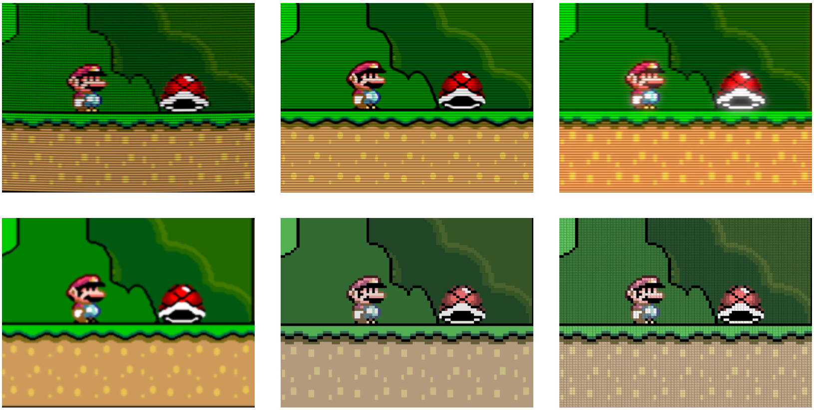
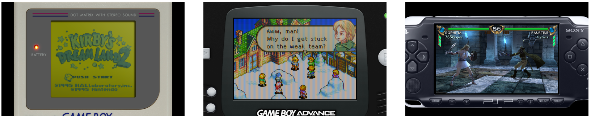

# Shaders

Shaders are efficient graphics filters that can greatly improve the rendering of old games. They can also be used to replicate the look and feel of old CRT monitors. You can even stack them to create your own effect. The possibilities are infinite.

RetroArch is shipped with a lot of shaders. There is an overwhelming array of them and we can't show all of them on this page.

Here are a few common examples:

Shaders can also be used to display the handheld border:

## Shader languages and shader presets

Shaders are small programs, and they are written in specific programming languages. RetroArch supports 3 of these languages:

* CG: Old, deprecated format. Might not be available if RetroArch is built without Cg runtime support.
* GLSL: Shader format available to OpenGL. Wide range of platforms including phones and tablets.
* Slang: New and recommended shader format, when available. Compatible with Vulkan, Direct3D 10/11/12, OpenGL Core, WiiU and Metal renderers.
* Depending on your platform and the way you have configured RetroArch, you need to use one of these shader types.

RetroArch is also able to stack these shaders to create a combined effect. These complex effects are saved with a special extension:

- .cpg for CG
- .glslp for GLSL
- .slangp for Slang

The shader presets can also have parameters. This means that you can tweak them to fit your needs.

## Downloading and upgrading shaders

You can download or upgrade the shader packs for the 3 types in Main Menu -> Online Updater.

### Loading a shader preset

To enable a shader preset, you need to have a game running.

You then trigger the menu and you should see a Shaders entry in the **Quick Menu**.

Go to **Load Shader Preset** and choose a preset file.

For this example, we used shaders_glsl/crt/crt-geom.glslp.

### Configuring a shader

In this example, we have set the Menu Shader pipeline to OFF and the Background Opacity to 0 in the Settings->User Interface->Menu to be able to preview the parameter changes in live.

Load a game and apply a shader preset that supports parameters like shaders_glsl/crt/crt-geom.glslp.

You then trigger the menu and you should see a Shaders entry in the Quick Menu.

Go to Preview Shader Parameters and start playing with the values.

When you are happy with your changes, you can save them under a new preset file.

## Background
A section to display thumbnail previews for RetroArch's many shaders.

Its structured to reflect the common-shaders and slang-shaders repos and it includes previews of the shader presets (i.e., not individual shaders unless they have an accompanying preset).

When possible, preview shots were created by opening the upscale-test image in RetroArch's built-in image-viewer core at 8x scale. Some shaders require additional settings or images to capture their effects and those are handled on a case-by-case basis. When additional settings are required, notes should be added to the preview comments.

## Upscale Test Image

## External Links

* [Slang Shaders](https://github.com/libretro/slang-shaders)
* [GLSL Shaders](https://github.com/libretro/glsl-shaders)
* [CG Shaders](https://github.com/libretro/common-shaders)
