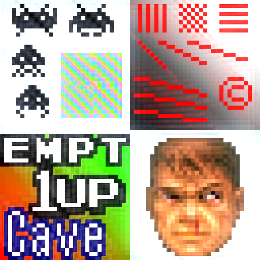
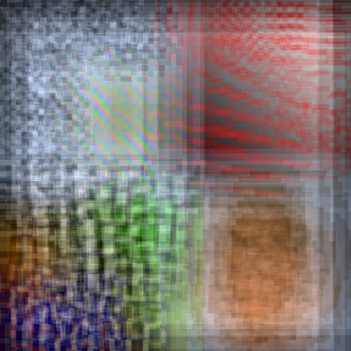
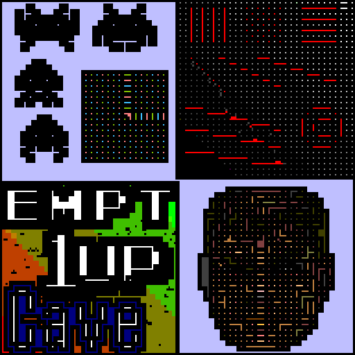

# mudlord

## Description
A collection of shader presets by community member Mudlord.

## Preview Image
* bloom

* blur

* emboss

* oldtv

* toon

* waterpaint-mudlord

## Comments

## External Links

* [Slang Shaders](https://github.com/libretro/slang-shaders)
* [GLSL Shaders](https://github.com/libretro/glsl-shaders)
* [CG Shaders](https://github.com/libretro/common-shaders)
