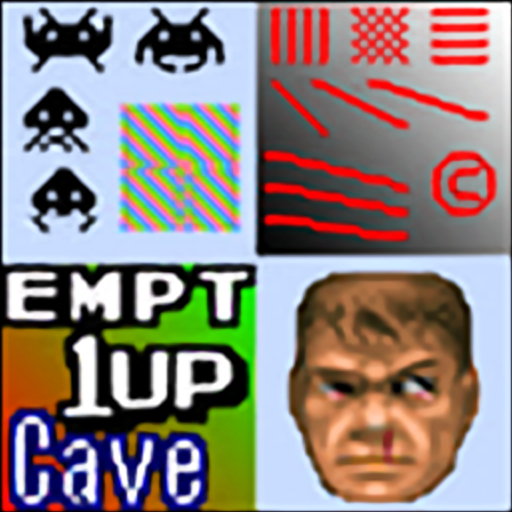

# nnedi3

## Background

## Preview Image

* nnedi3-nns16-2x-luma

* nnedi3-nns16-2x-rgb

* nnedi3-nns16-4x-luma

* nnedi3-nns32-2x-rgb-nns32-4x-luma

* nnedi3-nns32-4x-rgb

* nnedi3-nns64-2x-nns32-4x-nns16-8x-rgb

* nnedi3-nns64-2x-nns32-4x-rgb

## Comments

## External Links

* [Slang Shaders](https://github.com/libretro/slang-shaders)
* [GLSL Shaders](https://github.com/libretro/glsl-shaders)  
* [CG Shaders](https://github.com/libretro/common-shaders)
