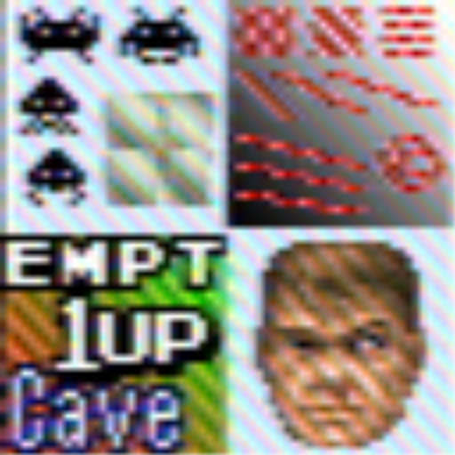
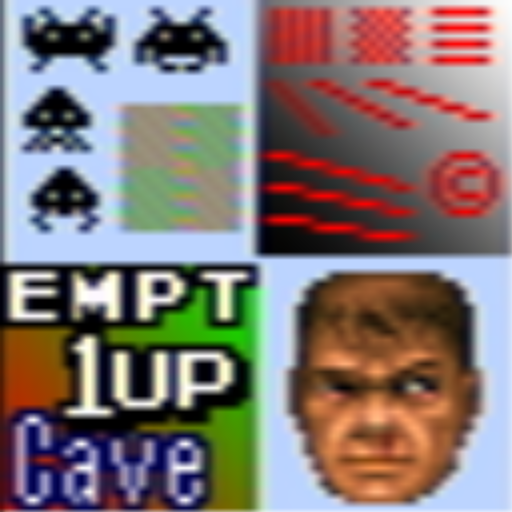
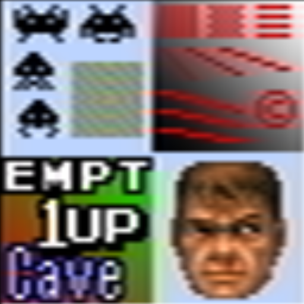
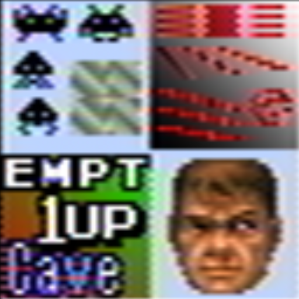
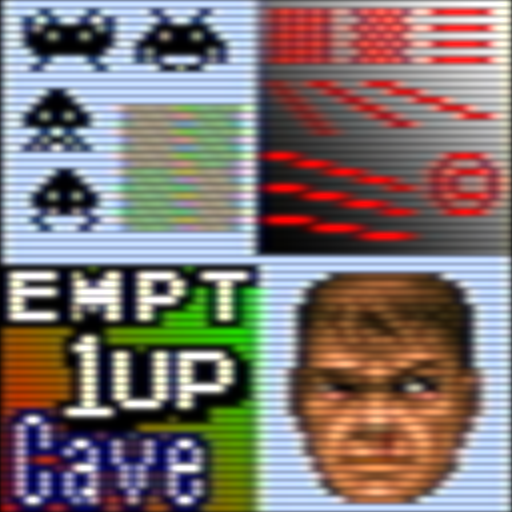

# ntsc

## Background

## Preview Image

* ntsc

* mame-ntsc

* ntsc-256px-gauss-scanline

* ntsc-256px-svideo-gauss-scanline

* ntsc-256px-svideo

* ntsc-256px

* ntsc-320px-gauss-scanline

* ntsc-320px-svideo-gauss-scanline

* ntsc-320px-svideo

* ntsc-320px

* ntsc-svideo

* ntsc-vcr

## Comments

## External Links

* [Slang Shaders](https://github.com/libretro/slang-shaders)
* [GLSL Shaders](https://github.com/libretro/glsl-shaders)  
* [CG Shaders](https://github.com/libretro/common-shaders)
