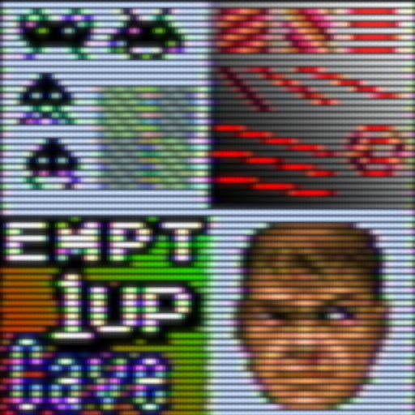
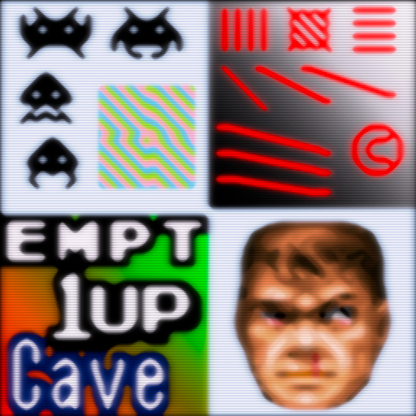

# presets

## Background

## Preview Image

* crt-royale-kurozumi

* ntsc-phosphorlut

* scalefx9-aa-blur-hazy-ntsc-sh1nra358

* scalefx9-aa-blur-hazy-vibrance-sh1nra358

## Comments

## External Links

* [Slang Shaders](https://github.com/libretro/slang-shaders)
* [GLSL Shaders](https://github.com/libretro/glsl-shaders)
* [CG Shaders](https://github.com/libretro/common-shaders)
