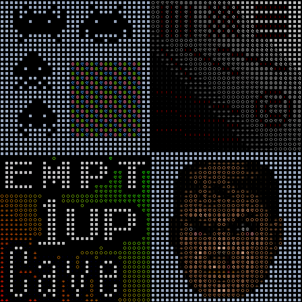
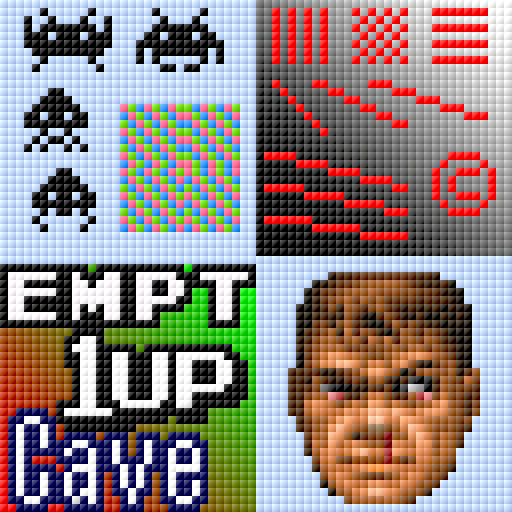
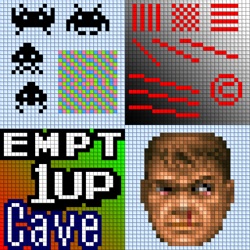

# retro

## Background

## Preview Image

* aann

* ascii

* bead

* bevel

* pixellate

* retro-v2

* sharp-bilinear

* smootheststep

## Comments

## External Links

* [Slang Shaders](https://github.com/libretro/slang-shaders)
* [GLSL Shaders](https://github.com/libretro/glsl-shaders)  
* [CG Shaders](https://github.com/libretro/common-shaders)
