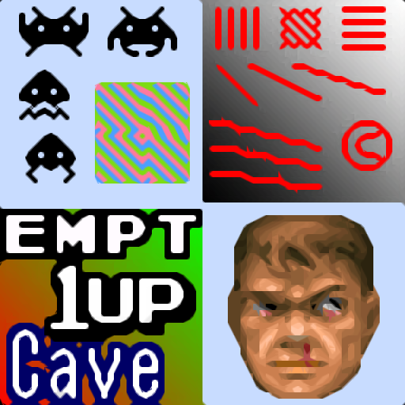

# sabr

## Background

## Preview Image

* sabr-hybrid-deposterize

* sabr-v1.1

* sabr-v3.0

* sabr

## Comments

## External Links

* [Slang Shaders](https://github.com/libretro/slang-shaders)
* [GLSL Shaders](https://github.com/libretro/glsl-shaders)  
* [CG Shaders](https://github.com/libretro/common-shaders)
