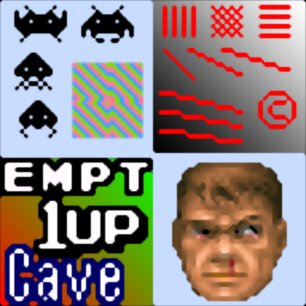

# scalehq

## Background

## Preview Image

* 2x-scalehq

* 2xScaleHQ

* 4x-scalehq

* 4xScaleHQ

## Comments

## External Links

* [Slang Shaders](https://github.com/libretro/slang-shaders)
* [GLSL Shaders](https://github.com/libretro/glsl-shaders)  
* [CG Shaders](https://github.com/libretro/common-shaders)
